# Transformer Intuition

> **TL;DR**: A transformer is a committee of experts that each reads the full text and votes on what each word means in context. "Bank" means something different in "river bank" vs "bank account" — attention lets each word look at all other words and update its meaning based on them. You don't need to understand the math to build production systems; you need to understand what breaks and why.

**Prerequisites**: None (this is the starting point)
**Related**: [Tokenization](02-tokenization.md), [Attention Mechanisms](03-attention-mechanisms.md), [Context Windows](04-context-windows.md)

---

## The Core Insight: Context Changes Meaning

Language is fundamentally ambiguous without context. The word "lead" means something completely different in:
- "The lead pipe broke" (metal)
- "She'll lead the team" (to guide)
- "Lead by example" (same as above, different usage)

Before transformers, language models processed text sequentially (RNNs, LSTMs) — left to right, like reading. By the time the model got to "lead," it had half-forgotten the context from earlier in the sentence. Long-range dependencies were hard.

Transformers solved this by letting every word look at every other word simultaneously. That's the key insight.

---

## The Committee Meeting Analogy

Imagine processing a sentence is like running a committee meeting.

**The sentence:** "The bank on the river was steep."

Each word ("The", "bank", "on", "the", "river", "was", "steep") sends a representative to the meeting.

Each representative can **ask questions** ("Hey 'bank', are you the financial kind or the geographical kind?") and **receive answers** from everyone else ("'river' here, I'm next door — geological meaning confirmed").

By the end of the meeting, each word has updated its understanding based on what it learned from the group. "Bank" now knows it's a riverbank, not a financial institution.

In transformer terms:
- **Query (Q):** What question is this word asking?
- **Key (K):** What information is this word offering to others?
- **Value (V):** What information gets transmitted when the query matches the key?

This Q/K/V mechanism is the heart of attention.

---

## Token Flow Through a Transformer

```mermaid
graph LR
    A[Input Text\n'The cat sat'] --> B[Tokenizer\nText → token IDs]
    B --> C[Embedding Layer\nIDs → vectors]
    C --> D[Positional Encoding\nAdd position info]
    D --> E[Transformer Block 1\nAttention + FFN]
    E --> F[Transformer Block 2\nAttention + FFN]
    F --> G[... N blocks ...]
    G --> H[Final Layer\nVectors → logit scores]
    H --> I[Softmax\nScores → probabilities]
    I --> J[Next Token\nSample from distribution]
```



A modern large model has 96-128 transformer blocks stacked. Each block runs attention (words look at each other) and then a feed-forward network (each word processes what it learned independently). This stack gets deep enough that abstract reasoning emerges.

---

## What Each Layer Learns

The layers aren't all doing the same thing. Research ([Tenney et al. 2019](https://arxiv.org/abs/1905.05950)) showed that lower layers capture syntax, higher layers capture semantics:

```
Layer 1-4:   "The cat sat" → identifies that 'cat' is a noun
Layer 5-8:   "The cat sat" → identifies that 'sat' is the main verb, 'cat' is subject
Layer 9-16:  "The cat sat on the mat" → 'mat' is the location of the sitting
Layer 17-24: Begins encoding higher-level meaning, relationships, world knowledge
Layer 24+:   Abstract reasoning, factual recall, complex relationships
```

This is why fine-tuning on a task can work with a small number of examples — the base model already has rich linguistic representations, and you're just teaching the top layers how to apply them.

---

## Multi-Head Attention: Multiple Perspectives

A single attention operation looks at context from one perspective. Multi-head attention runs several attention operations in parallel ("heads"), each learning a different type of relationship.

**What different heads might learn:**
- Head 1: syntactic dependencies (subject-verb relationships)
- Head 2: coreference (connecting "she" to "Maria" mentioned earlier)
- Head 3: proximity (words close together are often related)
- Head 4: semantic similarity (synonyms, related concepts)

Each head produces a different view of the relationships in the text. The final representation is a combination of all heads' outputs.

You can visualize this with tools like [BertViz](https://github.com/jessevig/bertviz) if you want to see what different heads are attending to in practice.

---

## What the Feed-Forward Network Does

After attention, each position goes through a feed-forward network (two linear layers with a nonlinearity in between). It's applied identically to each position independently.

A useful mental model: attention is the "lookup" step (gather relevant information from context), and the FFN is the "compute" step (process what you just looked up). Research by [Geva et al. 2021](https://arxiv.org/abs/2012.14913) suggests the FFN layers store factual knowledge — they function somewhat like key-value memories.

This is relevant for understanding why RAG works: the model has factual knowledge in its FFN layers (parametric knowledge), but this knowledge is frozen at training time. RAG injects updated facts via the context, bypassing the need to retrain.

---

## Generative vs. Encoder-Only Models

Not all transformers work the same way:

| Architecture | Examples | Training | Use Case |
|---|---|---|---|
| Encoder-only | BERT, RoBERTa | Masked language modeling (fill in blanks) | Classification, embeddings, NER |
| Decoder-only (autoregressive) | GPT-4, Claude, Llama | Next token prediction | Text generation, conversation |
| Encoder-decoder | T5, BART | Seq-to-seq | Translation, summarization |

Modern LLMs are decoder-only. They're trained to predict the next token, nothing else. That simple training task, at sufficient scale, produces remarkable capabilities.

**Causal masking:** Decoder-only models can't look at future tokens during training (that would be cheating — you're predicting the next token). Attention is masked so each position can only attend to previous positions. This is what makes them autoregressive — they generate one token at a time, left to right.

---

## Scale Changes Things Qualitatively

Small models and large models don't just differ in accuracy — they differ qualitatively. Research by [Wei et al. 2022](https://arxiv.org/abs/2206.07682) documented "emergent abilities": capabilities that appear suddenly as model scale crosses a threshold.

**Emergent abilities include:**
- 3-shot learning (below ~7B parameters: near-random; above: works)
- Multi-step arithmetic (appears around 10B parameters)
- Code generation (appears around 13B)
- Complex reasoning (continues improving well past 100B)

This is why "small model fine-tuned on your data" doesn't always beat "large model with few-shot prompting." The large model has capabilities the small model simply doesn't have, regardless of fine-tuning.

---

## What You Don't Need to Know for Production

For building production AI systems, you don't need to understand:
- The specific matrix mathematics of attention
- Positional encoding implementations (RoPE, ALiBi, etc.)
- The exact architecture differences between model families

You do need to understand:
- Context windows and why they're finite (next file)
- Tokenization and why it affects cost (next file)
- The general capability profile of small vs. large models
- Why the model "knows" things (parametric memory in FFN) vs. "sees" things (context window)

---

## Gotchas

**"The model understands language" is a misnomer.** The model predicts the next token. The representations it builds to do this prediction well are remarkably powerful, and we observe things that look like understanding. But the underlying mechanism is statistical pattern matching, not symbolic reasoning. This matters when you hit edge cases where the patterns break.

**Longer context is not always better.** The transformer's attention mechanism scales quadratically with context length. Modern techniques (FlashAttention, sliding window attention) mitigate this, but fundamentally, the model's ability to use information at distant positions degrades. The lost-in-middle problem is a direct consequence.

**Temperature does not make the model more creative.** Temperature affects how the model samples from the probability distribution over next tokens. At temperature 0, it always picks the highest-probability token (deterministic but potentially repetitive). At higher temperatures, it samples more broadly (more diverse but potentially incoherent). "Creativity" is in the distribution, not just the sampling.

---

> **Key Takeaways:**
> 1. Attention lets every word look at every other word simultaneously, resolving ambiguity through context. This is fundamentally different from sequential processing (RNNs).
> 2. Lower layers learn syntax; higher layers learn semantics and world knowledge. This layered representation is why fine-tuning works with few examples.
> 3. At sufficient scale, new capabilities emerge that smaller models don't have regardless of fine-tuning. Scale changes model behavior qualitatively, not just quantitatively.
>
> *"You don't need to understand the attention math to build production systems. You need to understand what context length limits, what the model 'knows' vs. 'sees,' and when scale matters."*

---

## Interview Questions

**Q: Explain how a transformer processes a sentence to a senior engineer who hasn't worked with ML.**

The transformer runs every word through a form of mutual consultation. Each word asks the others: "Hey, given what you know about yourself, should I update my meaning?" The word "bank" asks "river" and "account" and "steep" — whichever of them are present will shift its interpretation. After this mutual consultation, every word has updated its representation based on context.

Then each word independently processes what it learned (the feed-forward step), and this process repeats through many layers. By the end of the stack, the model has built rich, context-aware representations.

Generating text is just predicting what word comes next given this representation. But because the representations are so rich, the prediction can be quite sophisticated.

---

**Quick-fire Questions**

| Question | Answer |
|---|---|
| What does attention allow? | Every token to look at every other token and update its representation based on context |
| What is Q/K/V? | Query (what am I looking for?), Key (what do I offer?), Value (what information I send when matched) |
| What is multi-head attention? | Running multiple attention operations in parallel, each learning different relationship types |
| Why are decoder-only models autoregressive? | They generate one token at a time, each conditioned on all previous tokens |
| What do FFN layers store? | Factual knowledge (acts like key-value memory), applied independently per position |
| What is an emergent ability? | A capability that appears suddenly above a scale threshold; not present in smaller models |
