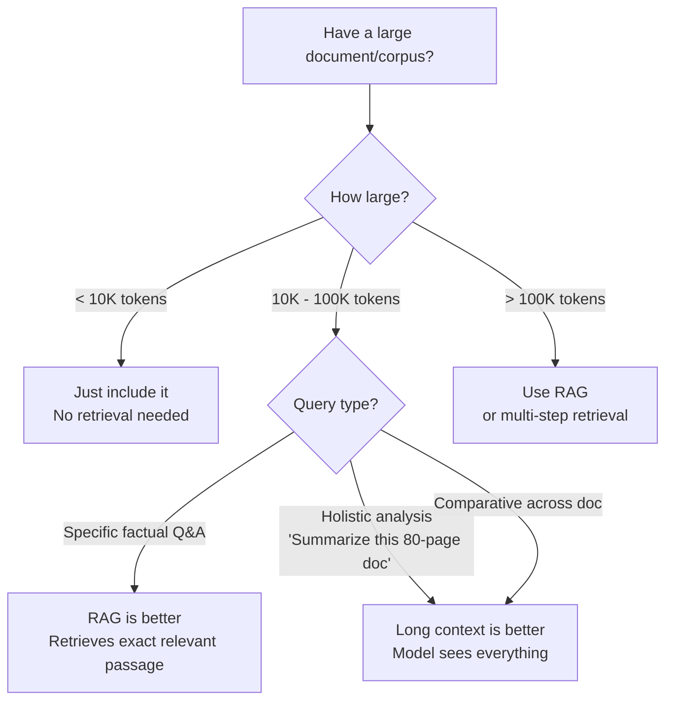

# Context Windows

> **TL;DR**: The context window is the maximum text a model can process at once. Bigger windows are not always better — information quality matters more than window size. "Should I just dump 200K tokens in?" — usually no. The lost-in-middle problem is real; position affects recall. The practical limit for high-quality use is 50-100K tokens; beyond that, measure quality rather than assuming it's fine.

**Prerequisites**: [Attention Mechanisms](03-attention-mechanisms.md), [Tokenization](02-tokenization.md)
**Related**: [Context Engineering](../02-prompt-engineering/02-context-engineering.md), [Caching Strategies](../06-production-and-ops/03-caching-strategies.md)

---

## Context Window Sizes in 2025

| Model | Context Window | Practical High-Quality Limit |
|---|---|---|
| Claude Opus 4.6 / Sonnet 4.6 | 200K tokens | ~100K |
| Claude Haiku 4.5 | 200K tokens | ~80K |
| GPT-4o | 128K tokens | ~80K |
| Gemini 1.5 Pro | 1M tokens | ~500K |
| Gemini 1.5 Flash | 1M tokens | ~300K |
| Llama 3.1 70B | 128K tokens | ~80K |
| Llama 3.1 405B | 128K tokens | ~80K |

"Practical high-quality limit" is where I've observed reliable performance on retrieval and reasoning tasks in production. The full window works; quality degrades gradually as you push toward the maximum.

---

## The Lost-in-the-Middle Problem

[Liu et al. 2023](https://arxiv.org/abs/2307.03172) ran extensive experiments on LLM ability to use information at different positions in the context. The results:

```
Information Recall by Position (rough approximation):
Beginning of context: ~90%+ recall
25% through:          ~75% recall
50% through (middle): ~68% recall  ← worst
75% through:          ~72% recall
End of context:       ~85%+ recall
```

The U-shaped curve means models are better at using information at the beginning and end than the middle. For a 100K token context, critical information buried at position 50K is retrieved less reliably than the same information at position 1K or 99K.

**Practical implications:**
- Put the most important context at the start or end
- For RAG: inject retrieved chunks before the user's question (not after)
- For long documents: consider summarizing and putting the summary at the start
- Never rely on the model "finding" a critical fact buried in the middle of a 100K-token context

---

## When to Use Long Context vs RAG

The question I get asked constantly: "Our document is 50K tokens, should I just pass it all to the model?"



**Use long context when:**
- The task genuinely requires synthesizing across the full document
- You need the model to notice patterns or inconsistencies across many sections
- The document is a single cohesive piece (not many independent documents)

**Use RAG when:**
- You're answering specific factual questions (RAG retrieves the precise section)
- You have many documents (100+) that won't all fit in one context
- You need citations (RAG can attribute to specific source chunks)
- Freshness matters (easy to update the index without re-sending everything)

---

## Context Window vs Effective Context

The context window limit is technical. The effective context is practical — how much context the model reliably uses.

**Needle-in-a-haystack test:** Hide a fact ("The sky color is green") at various positions in a long context and test whether the model can retrieve it when asked. This measures effective context quality:

```python
from anthropic import Anthropic

client = Anthropic()

def needle_in_haystack_test(haystack_tokens: int, needle_position_pct: float) -> bool:
    """Test if model can find a fact at a specific position."""
    needle = "The secret number is 42."

    # Build haystack of N tokens
    filler = "Lorem ipsum dolor sit amet, consectetur adipiscing elit. " * (haystack_tokens // 10)
    position = int(len(filler.split()) * needle_position_pct)
    words = filler.split()
    words.insert(position, needle)
    full_text = " ".join(words)

    response = client.messages.create(
        model="claude-opus-4-6",
        max_tokens=20,
        messages=[{
            "role": "user",
            "content": f"What is the secret number mentioned in this text?\n\n{full_text}"
        }]
    )

    return "42" in response.content[0].text
```

Run this test before deploying any system that relies on information at specific positions in a long context.

---

## Context Window Economics

Longer context = more tokens = higher cost. At Claude Opus pricing:

| Context Size | Input Cost | Typical Use |
|---|---|---|
| 1K tokens | $0.015 | Simple Q&A |
| 10K tokens | $0.15 | Document Q&A |
| 50K tokens | $0.75 | Long document analysis |
| 100K tokens | $1.50 | Full codebase review |
| 200K tokens | $3.00 | Maximum context use |

For an application running 10K queries/day at 10K token context: $1,500/day. At 100K token context: $15,000/day. Context size directly determines API costs.

**This is why prompt caching matters so much at long context.** A 50K-token system prompt sent on every request costs $0.75 per request. With prompt caching (10% price for cache reads), it's $0.075 per request. At 10K queries/day, that's $6,750 savings per day.

---

## Context Window Length vs Attention Quality

Not all context window positions are equal, and not all models handle long contexts equally well.

**Testing your model at length:**

```python
def test_context_quality_by_length(contexts: list[str], questions: list[tuple]) -> dict:
    """Evaluate model accuracy as context length increases."""
    results = {}

    for length_k in [1, 5, 10, 25, 50, 100]:  # Context sizes in K tokens
        context = contexts[0][:length_k * 750]  # ~750 words per K tokens
        correct = 0

        for question, expected_answer in questions:
            response = client.messages.create(
                model="claude-opus-4-6",
                max_tokens=50,
                messages=[{
                    "role": "user",
                    "content": f"Based on this text, answer briefly:\n\n{context}\n\nQ: {question}"
                }]
            )
            if expected_answer.lower() in response.content[0].text.lower():
                correct += 1

        results[f"{length_k}K"] = correct / len(questions)

    return results
```

Run this on your actual use case before committing to a long-context strategy. The degradation pattern varies by task type and model.

---

## Extending Context: Techniques

Models are trained with a specific context window. What happens if you need more?

**RoPE scaling:** The positional embeddings can be scaled to handle longer sequences than the model was trained on. Llama models with 8K training context can be extended to 32K or 128K with RoPE scaling (YaRN, Dynamic NTK). Quality degrades beyond the training context but remains usable.

**Chunked processing:** For very long tasks (1M+ token documents), process in overlapping chunks and aggregate results:

```python
def process_long_document(document: str, chunk_size: int = 50_000,
                          overlap: int = 5_000) -> list[str]:
    """Process a long document in overlapping chunks."""
    chunks = []
    start = 0
    while start < len(document):
        end = start + chunk_size
        chunk = document[start:end]
        summary = summarize_chunk(chunk)
        chunks.append(summary)
        start += chunk_size - overlap  # Overlap prevents boundary issues

    # Final synthesis
    return synthesize_summaries(chunks)
```

This is the approach for analyzing very long documents (entire codebase, full novel, large legal document).

---

## Gotchas

**"200K context window" doesn't mean "200K tokens of retrieved RAG context."** The context window includes everything: system prompt, conversation history, retrieved documents, and the user's message. A 2000-token system prompt + 10 turns of history + 100K retrieved docs + the user's message might exceed the limit.

**Context window limits and response length interact.** If you have 190K tokens of context, you only have 10K tokens left for the response. For complex tasks requiring long responses, you need to leave substantial headroom.

**Cache invalidation at long context is expensive.** If you cache a 100K-token prefix and then add any dynamic content to it, the cache is invalidated and you pay for recomputation. Separate static (cacheable) content from dynamic content carefully.

**Gemini's 1M context window is real but slow.** Processing 1M tokens takes multiple seconds even with efficient implementations. For interactive applications, the latency of a full 1M context query is measured in 10s of seconds.

---

> **Key Takeaways:**
> 1. Bigger context isn't always better. The lost-in-middle problem means information at position 50% in a long context is recalled less reliably than at the start or end.
> 2. Long context and RAG are not competitors — they're complements. Use long context for holistic analysis of a single document; use RAG for specific factual retrieval across many documents.
> 3. Context window size directly determines inference cost. Prompt caching for large stable prefixes (10% of normal price for cache hits) is the highest-ROI optimization for long-context applications.
>
> *"The question is not 'how big is the context window?' but 'how well does the model use information at each position?' Test this on your actual use case."*

---

## Interview Questions

**Q: A customer wants to send their entire 200-page legal document to Claude and ask questions about it. Should you? How would you approach this?**

200 pages is roughly 50-75K tokens, which fits within the 200K context window. The direct approach works technically. The question is whether it works well.

For holistic questions like "summarize this contract's key obligations" or "identify any unusual clauses," long context is genuinely the right approach — the model needs to see the whole document to answer these comprehensively.

For specific factual questions like "what's the termination notice period," RAG would actually perform better. The relevant clause is probably 50-100 tokens; sending the full 75K-token document adds noise and pays 750x more.

My recommendation: use long context for analysis tasks (summarization, clause comparison, risk flagging) and RAG for specific factual lookups (find the specific clause, extract the date, locate the liability cap). Build both pipelines and route based on detected query type.

One thing I'd always do: test with actual documents from this customer. "Lost in middle" is real; a critical clause buried in section 47 of 80 sections might be reliably retrieved or might not, depending on the model and document structure. The only way to know is to test.

---

**Quick-fire Questions**

| Question | Answer |
|---|---|
| What is the lost-in-middle problem? | Information at the middle of long contexts is recalled less reliably than at the start or end |
| When should you use long context vs RAG? | Long context for holistic analysis; RAG for specific factual retrieval across many documents |
| What is RoPE scaling? | A technique to extend a model's effective context window beyond its training context length |
| How does context length affect cost? | Linearly — 2x context = 2x input token cost |
| What is a needle-in-a-haystack test? | Hiding a specific fact at different positions in a long context to test effective context quality |
| What is chunked processing? | Processing very long documents in overlapping chunks and aggregating results |
