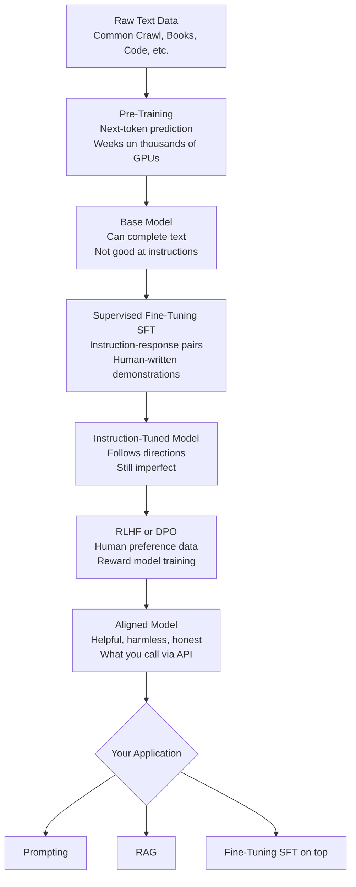
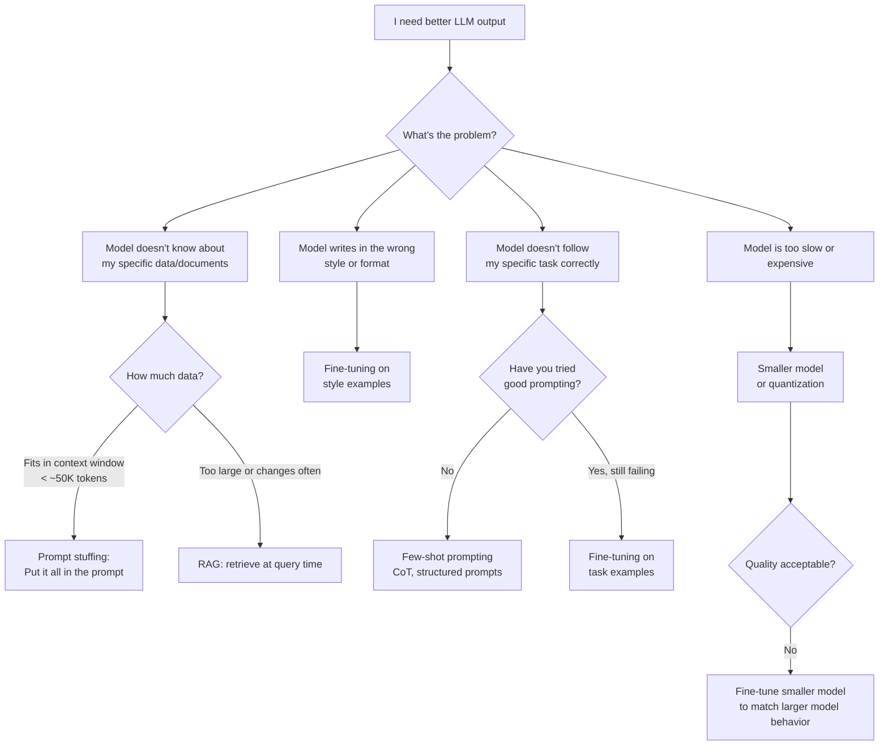
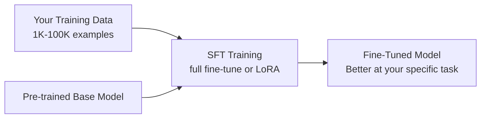

# LLM Training Pipeline and the RAG vs Fine-Tune Decision

> **TL;DR**: LLMs go through pre-training, supervised fine-tuning, and RLHF before you ever touch them. For your application, the decision tree is: try prompting first, then RAG if you need dynamic knowledge, then fine-tuning only if RAG fails and your problem is about style or behavior rather than knowledge. Fine-tuning before exhausting RAG is the most expensive mistake I see teams make.

**Prerequisites**: [Transformer Intuition](01-transformer-intuition.md), [Tokenization](02-tokenization.md)
**Related**: [RAG Fundamentals](../03-retrieval-and-rag/01-rag-fundamentals.md), [Fine-Tuning](09-fine-tuning.md), [Prompting Patterns](../02-prompt-engineering/01-prompting-patterns.md), [Quantization](08-quantization.md)

---

## The Intuition: How an LLM Learns

Think of LLM training in three stages, each building on the last.

**Stage 1: Pre-training** is like reading the entire internet. The model learns language patterns, facts, reasoning, and world knowledge by predicting the next token in trillions of documents. This is the expensive part: GPT-4 scale pre-training costs $50-100M in compute. You never do this.

**Stage 2: Supervised Fine-Tuning (SFT)** is like adding a teacher. After pre-training, the model can complete text but isn't great at following instructions. SFT trains on (instruction, response) pairs where humans have written ideal answers. This teaches the model to be helpful and follow directions.

**Stage 3: RLHF (Reinforcement Learning from Human Feedback)** or its simpler sibling **DPO (Direct Preference Optimization)** is like adding quality control. Human raters compare pairs of model responses and say which is better. The model learns to produce responses humans prefer. This is what makes Claude helpful, harmless, and honest.

The result is the model you call through the API. You're working with the output of all three stages.

---

## The Full Training Pipeline



The base model from pre-training is rarely useful directly. It will complete your prompt in unexpected ways because it's trained to predict text, not answer questions. SFT teaches it to behave like an assistant. RLHF polishes the behavior. By the time you're calling `anthropic.messages.create()`, you're working with the aligned, instruction-tuned version.

---

## The Decision That Matters Most: RAG vs Fine-Tuning vs Prompting

This is the question in almost every AI system design interview. Here's my honest take after building both.



| Approach | Best For | Cost | Time to Ship | When to Avoid |
|---|---|---|---|---|
| Prompting only | Behavior, format, reasoning | Zero | Hours | When knowledge base is too large |
| Prompt stuffing | Small, static knowledge | Minimal | Hours | Data changes frequently; >50K tokens |
| RAG | Large or dynamic knowledge bases | Low-medium | 1-3 days | Implicit knowledge (style, reasoning patterns) |
| Fine-tuning | Style, tone, task-specific behavior, domain vocab | High | 1-2 weeks | When knowledge changes frequently |
| Full pre-training | Novel capabilities you can't get any other way | Enormous | Months | Everyone except AI labs |

The clearest signal I've found: **if your problem is "the model doesn't know X fact," use RAG. If your problem is "the model doesn't behave like Y," use fine-tuning.**

A customer support bot that needs to know your product catalog? RAG. A code completion model that needs to follow your company's coding conventions? Fine-tuning. A model that needs to write in the voice of your brand? Fine-tuning. A model that needs to answer questions about your internal wiki? RAG.

---

## Pre-Training: What It Gives You

Pre-training on massive datasets gives the model capabilities you'd never be able to replicate by fine-tuning:

- Language understanding and generation
- World knowledge (up to training cutoff)
- Reasoning and arithmetic
- Code generation
- Multilingual ability
- Instruction following (after SFT)

The scale of pre-training is what makes this possible. GPT-4 was trained on roughly 13 trillion tokens. Llama 3.1 was trained on 15 trillion tokens. No organization outside of major AI labs can replicate this. When you fine-tune, you're starting from a foundation that has already learned to be a capable language model. Fine-tuning is adaptation, not training from scratch.

---

## Supervised Fine-Tuning: When and How

SFT adapts a pre-trained model to your specific task. You provide (input, output) pairs and the model learns to produce outputs like yours.



**Full fine-tuning** updates all model weights. Expensive, requires significant GPU memory. Best quality but most costly.

**LoRA (Low-Rank Adaptation)** adds small trainable matrices alongside frozen pre-trained weights. 10-100x cheaper than full fine-tuning, usually within 1-3% of full fine-tuning quality. This is what most teams use. The [LoRA paper by Hu et al.](https://arxiv.org/abs/2106.09685) showed this elegantly: you can represent the weight updates as the product of two small matrices.

```python
from peft import LoraConfig, get_peft_model, TaskType
from transformers import AutoModelForCausalLM, AutoTokenizer, TrainingArguments, Trainer

model_id = "meta-llama/Llama-3.2-3B-Instruct"
model = AutoModelForCausalLM.from_pretrained(model_id, device_map="auto")
tokenizer = AutoTokenizer.from_pretrained(model_id)

lora_config = LoraConfig(
    task_type=TaskType.CAUSAL_LM,
    r=16,              # rank: higher = more capacity but more memory
    lora_alpha=32,     # scaling factor
    target_modules=["q_proj", "v_proj"],  # which layers to adapt
    lora_dropout=0.05,
)

model = get_peft_model(model, lora_config)
model.print_trainable_parameters()  # typically ~0.1-1% of total params
```

**QLoRA** (Quantized LoRA) from the [Dettmers et al. paper](https://arxiv.org/abs/2305.14314) takes this further: quantize the base model to 4-bit to reduce memory, then add LoRA adapters in full precision. This lets you fine-tune a 70B model on a single A100 80GB GPU. Before QLoRA, that required 8 GPUs.

---

## RLHF and DPO: The Alignment Layer

After SFT, the model follows instructions but doesn't reliably produce high-quality, preferred outputs. RLHF addresses this.

**RLHF steps:**
1. Collect preference data: show raters pairs of model outputs and ask which is better
2. Train a reward model to predict human preferences
3. Use RL (PPO) to optimize the LLM to produce high-reward outputs

**DPO (Direct Preference Optimization)** simplifies this. Instead of training a separate reward model and doing RL, DPO directly optimizes on the preference pairs. The [DPO paper by Rafailov et al.](https://arxiv.org/abs/2305.18290) showed this achieves comparable results with significantly less complexity. Most open-source fine-tuning workflows now use DPO.

In practice, as an application engineer, you won't run RLHF. This is pre-applied to the models you access via API. The reason it matters for interviews: understanding the alignment layer explains why models behave the way they do, refuse certain requests, and exhibit certain failure modes.

---

## Cost Reality Check

Here's what fine-tuning actually costs as of early 2025. These numbers help you explain the "build vs buy" decision.

| Approach | Model Size | GPU | Time | Cost |
|---|---|---|---|---|
| LoRA fine-tuning | 7B params | A10G (24GB) | 2-8 hours | $10-40 on Lambda/Vast |
| LoRA fine-tuning | 13B params | A100 40GB | 4-12 hours | $40-120 |
| QLoRA fine-tuning | 70B params | A100 80GB | 8-24 hours | $80-240 |
| Full fine-tuning | 7B params | 4x A100 80GB | 4-24 hours | $160-960 |
| OpenAI fine-tuning | gpt-4o-mini | Managed | ~1 hour | $3-15 per 1M tokens |
| Runway fine-tuning | Various | Managed | Minutes | $3-25 per job |

**Data requirements:** LoRA typically needs 1K-50K examples. More is better up to a point, but data quality matters more than quantity. I've seen 500 high-quality examples outperform 10K mediocre ones.

**The hidden cost:** Creating the training dataset. If you need 5K (instruction, response) pairs and each takes 5 minutes to write and review, that's 400 person-hours. That often dominates the compute cost.

---

## When NOT to Fine-Tune

I've seen teams reach for fine-tuning prematurely more times than I can count. Here's when to hold back:

**Don't fine-tune to inject factual knowledge that changes.** Product catalogs, policy documents, pricing, current events. This is what RAG is for. Fine-tuning bakes knowledge into weights. When the knowledge changes, you pay the fine-tuning cost again.

**Don't fine-tune before optimizing your prompts.** A well-crafted system prompt with few-shot examples often closes 80% of the quality gap that motivates fine-tuning. It costs nothing and takes hours, not weeks.

**Don't fine-tune a large model when a smaller one would do.** If your task is narrow and well-defined (classify support tickets into 5 categories), fine-tuning a 7B model might outperform a prompted 70B model on that specific task, at a fraction of the inference cost.

**Don't fine-tune if you have fewer than a few hundred examples.** With too little data, you get an overfitted model that does well on training examples and poorly on real queries. Few-shot prompting is more robust with limited data.

---

## Gotchas and Real-World Lessons

**Catastrophic forgetting is real.** Full fine-tuning on a narrow task can degrade the model's general capabilities. A customer-service bot fine-tuned heavily on support conversations might lose its ability to reason about edge cases not in the training set. LoRA partially mitigates this by keeping the base weights frozen. Monitor general benchmarks (MMLU, HumanEval) alongside task-specific metrics during fine-tuning.

**Your evaluation set defines what you're optimizing for.** If you evaluate on BLEU score and ship to production, you'll optimize for n-gram overlap rather than actual helpfulness. Define your eval before training, not after. See [../05-evaluation/01-eval-fundamentals.md](../05-evaluation/01-eval-fundamentals.md).

**Data leakage tanks your evaluation.** If any training examples appear in your eval set, your metrics are inflated. Use temporal splits (train on data before date X, eval after) for realistic estimates.

**The distribution shift problem.** Fine-tuning improves performance on the distribution of your training data. If production queries look different from your training data, the fine-tuned model may perform worse than the base model. Sample real production queries before creating training data.

**LoRA rank is a dial you need to tune.** Rank 4-8 is enough for simple style adaptation. Rank 16-64 for complex task adaptation. Higher rank means more parameters and more potential for overfitting. Start low, go up if quality is insufficient.

**Inference cost for fine-tuned models.** API fine-tuning (OpenAI, Anthropic) is 2-4x more expensive per token than the base model. Self-hosted fine-tuned models require you to serve them, which means managing GPU infrastructure. Factor this into the "should we fine-tune?" decision.

**The quality of pre-training determines your ceiling.** Fine-tuning can adapt a model's behavior but can't give it capabilities it doesn't have. If Llama 3.2 7B fails at a task because it lacks the underlying reasoning ability, fine-tuning won't fix that. You need a stronger base model.

---

> **Key Takeaways:**
> 1. LLMs are pre-trained on massive text corpora, then aligned via SFT and RLHF. You work with the aligned output and adapt it for your use case.
> 2. The RAG vs fine-tune decision comes down to this: RAG for knowledge (facts that change), fine-tuning for behavior (style, format, task-specific patterns that are stable).
> 3. Try prompting, then RAG, then fine-tuning in that order. Each step is 10-100x more expensive than the previous one.
>
> *"Fine-tuning teaches a model how to behave. RAG teaches it what to know. Most product problems are about knowledge, not behavior."*

---

## Interview Questions

**Q: When would you choose fine-tuning over RAG for an enterprise AI system?**

My starting position is always RAG first, and I'd explain that to the interviewer. But there are real cases where fine-tuning is the better choice.

The clearest case is style and format consistency. If a company needs their AI system to write in a very specific tone, follow a particular response structure, or consistently use terminology unique to their domain, RAG can't help with that. RAG puts relevant documents in context, but doesn't change how the model structures its output. Fine-tuning on 2,000 examples of "good responses" can solve a style problem that no amount of prompt engineering will fully fix.

Another case is latency. Each RAG pipeline adds retrieval latency (50-200ms for vector search) and token cost (all those retrieved chunks). If you're building a high-throughput application that needs sub-500ms responses, the retrieval step hurts. Fine-tuning bakes the knowledge into the model's weights, so there's no retrieval step. The tradeoff is that the knowledge is static, but if the underlying information is stable (legal templates, standard procedures, product documentation that only changes quarterly), that's acceptable.

A third case is private, secure data where you can't afford retrieval latency or the operational complexity of maintaining a vector database. A fine-tuned model running on-prem has no network calls during inference.

The pattern I look for: if someone says "fine-tuning" for a dynamic knowledge problem, I push back. If they say "fine-tuning" for a behavior problem with stable data, I agree.

*Follow-up: "How would you evaluate whether the fine-tuned model is actually better?"*

I'd build an eval set before training, not after. The eval set should include: (1) examples from the training distribution to confirm the model learned the task, (2) held-out examples from the same distribution to check for overfitting, and (3) adversarial examples outside the training distribution to check for brittleness. I'd measure both the task-specific metric and general capability benchmarks to catch catastrophic forgetting. If the task-specific metric improved but MMLU dropped 10 points, I'd reconsider my LoRA rank and training length.

---

**Q: Explain the difference between pre-training, fine-tuning, and RLHF to someone who hasn't worked with LLMs.**

I'd use a chef analogy. Pre-training is like culinary school where the chef learns all the fundamental techniques over years: knife skills, flavor combinations, heat management, hundreds of cuisines. After culinary school, they can cook almost anything but don't have a specialty.

Supervised fine-tuning is like hiring the chef at a French restaurant and having them train under the head chef for a month. They learn the specific dishes, the plating style, the restaurant's standards. They're still a general chef but now they're specialized for this context.

RLHF is like adding customer feedback. The restaurant tracks which dishes customers rate highest and uses that to refine the menu. The chef adjusts recipes based on what people actually enjoy, not just what's technically correct.

The reason this matters for application engineers: you're almost always working with a chef who's already completed culinary school and done the restaurant training (pre-trained + SFT). Your job is either to give them better briefings before service (prompting), a reference library to consult (RAG), or additional specialization training (fine-tuning).

---

**Quick-fire Questions**

| Question | Answer |
|---|---|
| What is the purpose of RLHF? | To align model outputs with human preferences, making the model more helpful and less harmful |
| What does LoRA stand for? | Low-Rank Adaptation |
| What is the key advantage of LoRA over full fine-tuning? | Only trains a small fraction of parameters (0.1-1%), dramatically reducing compute and memory |
| What is catastrophic forgetting? | When fine-tuning on new tasks causes the model to lose performance on tasks it previously handled well |
| What's the typical data requirement for LoRA? | 1K-50K high-quality examples; quality matters more than quantity |
| When does RAG beat fine-tuning? | When knowledge is dynamic, frequently updated, or factual in nature |
| What is QLoRA? | Quantized LoRA: fine-tune with the base model in 4-bit, adapters in full precision; enables fine-tuning large models on limited hardware |
| What is DPO? | Direct Preference Optimization: a simpler alternative to RLHF that directly optimizes on preference pairs without a separate reward model |
