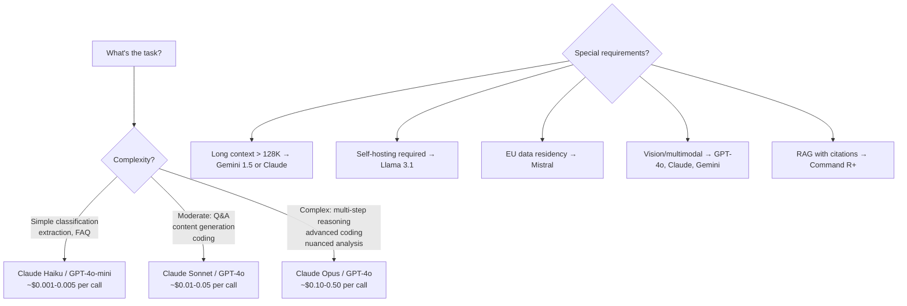

# Model Landscape

> **TL;DR**: The model landscape in 2025 has three tiers: frontier (GPT-4o, Claude Opus, Gemini Ultra — best quality, highest cost), mid-tier (Claude Sonnet, GPT-4o-mini, Gemini Flash — excellent quality, reasonable cost), and fast/cheap (Claude Haiku, Gemini Flash-8B — good for classification and simple tasks). Most production systems use mid-tier as default and route to frontier only for complex tasks.

**Prerequisites**: [Transformer Intuition](01-transformer-intuition.md)
**Related**: [Training Pipeline](05-training-pipeline.md), [Small Language Models](07-small-language-models.md), [Cost Optimization](../06-production-and-ops/07-cost-optimization.md)

---

## The 2025 Model Landscape

This table will date itself; the principles behind it won't. Check [LMSYS Chatbot Arena](https://chat.lmsys.org/) for current rankings.

| Model | Provider | Context | Input $/1M | Output $/1M | Best For |
|---|---|---|---|---|---|
| Claude Opus 4.6 | Anthropic | 200K | $15 | $75 | Complex reasoning, coding, analysis |
| GPT-4o | OpenAI | 128K | $5 | $15 | Versatile, vision, function calling |
| Gemini Ultra 1.5 | Google | 1M | $7 | $21 | Long context, multimodal |
| Claude Sonnet 4.6 | Anthropic | 200K | $3 | $15 | Most tasks, best cost/quality |
| GPT-4o-mini | OpenAI | 128K | $0.15 | $0.60 | Simple tasks, classification |
| Gemini Flash 1.5 | Google | 1M | $0.075 | $0.30 | High volume, latency-sensitive |
| Claude Haiku 4.5 | Anthropic | 200K | $0.25 | $1.25 | Classification, fast responses |
| Llama 3.1 70B | Meta (OSS) | 128K | Self-hosted | Self-hosted | Privacy, self-hosting |
| Llama 3.1 405B | Meta (OSS) | 128K | Self-hosted | Self-hosted | Best OSS quality |
| Mistral Large | Mistral | 128K | $3 | $9 | EU data residency |
| Command R+ | Cohere | 128K | $3 | $15 | RAG-optimized, citations |

*Prices approximate as of early 2025. Verify at provider pricing pages.*

---

## How to Choose

The question is never "what's the best model?" It's "what's the best model for this task at this cost?"

---

## Specialized Model Categories

### Vision Models

All frontier models now support vision (image input):

| Model | Vision Capability | Notes |
|---|---|---|
| GPT-4o | Strong | Best at document understanding, charts |
| Claude Opus/Sonnet | Strong | Excellent at detailed visual analysis |
| Gemini 1.5 Pro | Strong | Best for video understanding |
| LLaVA / Phi-3 Vision | Good | Open-source vision options |

For document AI (PDFs with tables and charts), Claude Vision and GPT-4o are most commonly used in production.

### Reasoning Models

Models explicitly designed for multi-step reasoning:

| Model | Provider | Notes |
|---|---|---|
| o1 / o3 | OpenAI | Extended thinking before responding; much slower |
| Claude extended thinking | Anthropic | Experimental; available in API |

These models trade latency (30-120 seconds per response) for accuracy on complex math, logic, and coding problems. Not suitable for interactive applications; appropriate for offline batch jobs where correctness matters more than speed.

### Embedding Models

For RAG and semantic search — these don't generate text, they generate vectors:

| Model | Dimensions | Best For |
|---|---|---|
| text-embedding-3-large | 3072 | Best quality, OpenAI |
| text-embedding-3-small | 1536 | Good quality, cheaper |
| voyage-large-2-instruct | 1024 | Best for RAG, Anthropic recommended |
| BAAI/bge-large-en-v1.5 | 1024 | Best open-source English |
| E5-mistral-7b-instruct | 4096 | Best open-source, multilingual |
| text-multilingual-embedding-002 | 768 | Good multilingual, Google |

---

## Open-Source vs Proprietary

The gap between open-source and proprietary frontier models has narrowed substantially since 2023.

| Consideration | Proprietary (Anthropic/OpenAI) | Open-Source (Llama/Mistral) |
|---|---|---|
| Quality | Best | Within 10-20% of frontier |
| Cost | API per token | GPU infrastructure + maintenance |
| Data privacy | Data sent to provider | Full control |
| Customization | Fine-tuning via API | Direct weight modification |
| Latency | Managed by provider | Your optimization |
| Operations | Zero (provider manages) | Full responsibility |
| Compliance | SOC2, HIPAA BAAs available | Full control |

For most teams: proprietary APIs until you have a compelling reason not to (cost at scale, data privacy, compliance). For teams with strong data residency requirements or >$50K/month API spend, evaluate self-hosting.

---

## Performance Benchmarks (What They Mean)

You'll see models ranked on MMLU, HumanEval, GSM8K, and similar benchmarks. Understanding what these actually measure:

| Benchmark | Measures | Real-World Relevance |
|---|---|---|
| MMLU | Knowledge across 57 domains | General knowledge, good proxy |
| HumanEval | Code completion accuracy | Code quality, but easy cases |
| GSM8K | Grade school math word problems | Basic reasoning |
| MATH | Competition math | Harder reasoning |
| GPQA | Graduate-level science Q&A | Domain expertise |
| LMSYS Arena | Human preference (blind A/B) | Best real-world proxy |

**My recommendation:** Weight [LMSYS Chatbot Arena](https://chat.lmsys.org/) ELO scores heavily — it's human preference evaluation on real conversational tasks, not structured benchmarks that can be gamed. For task-specific decisions, build your own eval set on your actual use case.

---

## Model Selection for Common Use Cases

| Use Case | Recommended | Why |
|---|---|---|
| Production RAG chatbot | Claude Sonnet / GPT-4o | Best cost/quality for generation |
| Classification pipeline | Claude Haiku / GPT-4o-mini | Fast, cheap, accurate |
| Code generation | Claude Opus / GPT-4o | Both strong at coding |
| Long document analysis | Claude Sonnet (200K) / Gemini | Large context window |
| Multilingual support | GPT-4o / Gemini / Claude | All handle major languages |
| Low-latency (<500ms) | Haiku / GPT-4o-mini | Fastest response times |
| High-volume (>1M calls/day) | Haiku + routing / Gemini Flash | Cost efficiency at scale |

---

## Gotchas

**Model quality changes over time without announcement.** Providers update models behind the same API endpoint. GPT-4's behavior has shifted multiple times while still being called "gpt-4." Pin to specific versions (`gpt-4-0125-preview`) if consistency matters and re-evaluate when upgrading.

**Benchmarks don't predict task-specific performance.** A model that's #1 on MMLU might not be best for your specific task. Build a small eval set from your actual use case and test before committing to a model.

**Cost per token doesn't tell the whole story.** A model that's 2x cheaper per token but requires 2x more tokens to get the same result (verbose responses, requires more back-and-forth) isn't actually cheaper. Measure cost per resolved task, not cost per token.

**Frontier models add new capabilities regularly.** By the time you read this, there will be newer models not in this table. The key principles (evaluate on your task, tier selection based on complexity, routing to cheaper models for simple tasks) remain constant even as specific models change.

---

> **Key Takeaways:**
> 1. Use the cheapest model that reliably handles the task. Route complex reasoning to Opus, routine tasks to Haiku. This is the highest-ROI cost optimization.
> 2. LMSYS Chatbot Arena ELO is the most reliable benchmark because it's human preference on real conversations, not structured test sets.
> 3. The open-source vs proprietary decision isn't about quality anymore — it's about data privacy, compliance, operational burden, and total cost of ownership at scale.
>
> *"The right model is the cheapest one that does the job. Build a simple eval, test all the candidates, pick the winner."*
