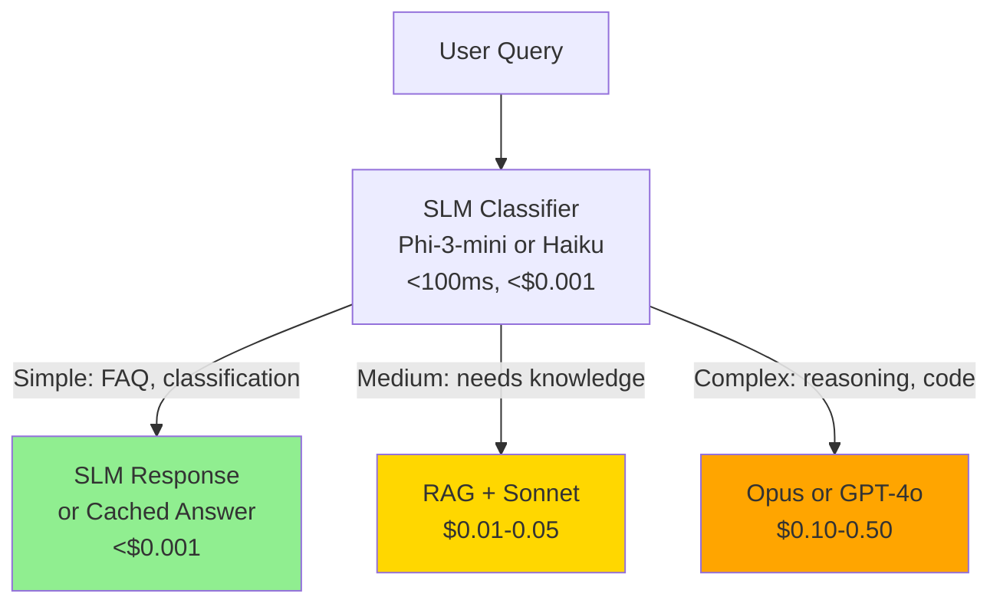

# Small Language Models

> **TL;DR**: Small language models (1B-13B parameters) run on laptops and phones, cost 100x less than frontier APIs, and perform within 10-20% of GPT-4 on many tasks after fine-tuning. The right architecture is often a frontier model for complex queries + a small model for classification, routing, and high-volume simple tasks. "Why not always use GPT-4o?" — latency, cost, and data privacy.

**Prerequisites**: [Model Landscape](06-model-landscape.md), [Training Pipeline](05-training-pipeline.md)
**Related**: [Quantization](08-quantization.md), [Fine-Tuning](09-fine-tuning.md), [Inference Infrastructure](../06-production-and-ops/04-inference-infrastructure.md)

---

## The SLM Case

A 70B parameter model generating 200 tokens takes about 500ms on 2 A100 GPUs at $6/hour. At 1000 queries/day, that's $45/day in GPU costs.

A 7B parameter model doing the same task takes 100ms on a single L4 GPU at $0.80/hour. At 1000 queries/day, that's $3.20/day. 14x cheaper.

If the 7B model handles the task well enough, why pay 14x more?

**The answer is "well enough."** For complex reasoning, code generation, and nuanced generation tasks, smaller models fall short. For classification, intent detection, routing, and simple extraction, they're often indistinguishable from frontier models after task-specific fine-tuning.

---

## The SLM Landscape (2025)

| Model | Parameters | Strong At | Device Fit |
|---|---|---|---|
| Phi-3-mini | 3.8B | Reasoning (surprisingly strong) | Laptop, phone |
| Phi-3-small | 7B | Coding, reasoning | Laptop, edge server |
| Phi-3-medium | 14B | Complex tasks | Desktop GPU |
| Gemma 2B | 2B | Simple tasks, on-device | Phone |
| Gemma 7B | 7B | General tasks | Laptop |
| Gemma 9B | 9B | Best small general | Laptop with GPU |
| Llama 3.2 1B | 1B | Simple classification | Phone |
| Llama 3.2 3B | 3B | General on-device | Phone |
| Llama 3.1 8B | 8B | Best small open-source | Laptop |
| Mistral 7B | 7B | General, good context | Laptop |
| Qwen2 7B | 7B | Multilingual, coding | Laptop |

Microsoft's Phi models ([Phi-3 paper](https://arxiv.org/abs/2404.14219)) are notable for punching above their weight class. Phi-3-mini (3.8B) outperforms Llama 3 8B on many benchmarks, allegedly because the training data was heavily curated for quality.

---

## On-Device Deployment

For edge and mobile deployment, specialized runtimes handle the model-to-device pipeline:

```python
# llama.cpp Python binding (runs on CPU)
from llama_cpp import Llama

# Load a GGUF quantized model
llm = Llama(
    model_path="./phi-3-mini-q4_k_m.gguf",  # 4-bit quantized, ~2GB
    n_ctx=4096,       # Context window
    n_threads=8,      # CPU threads
    n_gpu_layers=0    # 0 = CPU only; set higher to use GPU layers
)

response = llm.create_chat_completion(
    messages=[
        {"role": "user", "content": "Classify this as positive, negative, or neutral: 'Great service!'"}
    ],
    max_tokens=10
)
print(response["choices"][0]["message"]["content"])  # "positive"
```

Typical performance (M3 MacBook Pro):
- Llama 3.2 3B (Q4): ~50 tokens/second
- Phi-3-mini (Q4): ~40 tokens/second
- Llama 3.1 8B (Q4): ~25 tokens/second

For classification tasks that return 1-5 tokens, these speeds feel instant.

**For iOS/Android:** [ONNX Runtime](https://onnxruntime.ai/), [CoreML](https://developer.apple.com/documentation/coreml), and [MediaPipe LLM](https://developers.google.com/mediapipe/solutions/genai/llm_inference) provide native inference. Gemma 2B is specifically designed for mobile deployment.

---

## The SLM + Frontier Hybrid Pattern

The most cost-effective production architecture for many use cases:



The SLM classifier adds ~50ms and ~$0.001 per call. If it correctly routes 50% of queries to the SLM tier and 30% to mid-tier (instead of all to frontier), the cost savings are substantial:

- Before: 100% to Opus at $0.50/call = $0.50 per query
- After: 50% SLM ($0.001) + 30% Sonnet ($0.02) + 20% Opus ($0.50) = $0.111 per query
- **78% cost reduction**

---

## Fine-Tuning SLMs for Specific Tasks

The real power of SLMs is fine-tuning for narrow tasks. A 7B model fine-tuned on 1,000 examples of your specific classification task often outperforms GPT-4 on that task.

```python
from transformers import AutoTokenizer, AutoModelForCausalLM, TrainingArguments, Trainer
from peft import LoraConfig, get_peft_model

# Load base model
model_name = "meta-llama/Llama-3.2-8B-Instruct"
tokenizer = AutoTokenizer.from_pretrained(model_name)
model = AutoModelForCausalLM.from_pretrained(model_name, load_in_4bit=True)

# LoRA config for efficient fine-tuning
lora_config = LoraConfig(
    r=16,              # Rank: higher = more parameters, better quality
    lora_alpha=32,
    target_modules=["q_proj", "v_proj"],
    lora_dropout=0.05,
    task_type="CAUSAL_LM"
)
model = get_peft_model(model, lora_config)

# Training
training_args = TrainingArguments(
    output_dir="./fine-tuned-classifier",
    num_train_epochs=3,
    per_device_train_batch_size=4,
    learning_rate=2e-4,
    fp16=True,
)
```

Full fine-tuning guide: [Fine-Tuning](09-fine-tuning.md).

---

## When SLMs Don't Work

**SLMs fail at:**
- Complex multi-step reasoning (chain-of-thought breaks down at small sizes)
- Long-range coherence in generation (stories, long reports)
- Nuanced instruction following (complex system prompts)
- Low-resource languages
- Tasks requiring world knowledge not in training data

**Signals that you need a larger model:**
- SLM performance on your eval set is >10% below frontier on accuracy
- The task requires >3 reasoning steps
- Users are seeing responses that "miss the point" of their question
- The response length needs to be long and coherent

---

## Gotchas

**Small models fail differently than large ones.** A large model will usually give a plausible-sounding wrong answer. A small model might give a nonsensical answer that's obviously wrong. This is actually easier to handle — you can detect low-confidence outputs and route to a larger model.

**Fine-tuning a small model can outperform prompting a large one.** 1,000 labeled examples + LoRA fine-tuning of a 7B model often outperforms 5-shot prompting of GPT-4 on narrow classification tasks. Don't assume bigger is always better.

**Running inference locally has security benefits.** If you're processing sensitive documents, a local SLM means no data ever leaves your infrastructure. This is often the deciding factor for healthcare and financial applications, regardless of cost.

**Quantized models need testing.** The quality difference between FP16 and Q4 quantization varies by task. For classification, Q4 is usually fine. For complex generation, Q8 or FP16 may be necessary. Measure on your eval set; don't assume.

---

> **Key Takeaways:**
> 1. SLMs (7B-14B parameters) cost 10-100x less than frontier APIs and handle classification, routing, and simple extraction tasks well. Build a hybrid: SLM for simple tasks, frontier for complex.
> 2. Fine-tuning a small model on task-specific data often beats prompting a large model. 1,000 labeled examples + LoRA is cheap and fast.
> 3. On-device SLMs (via llama.cpp, CoreML, ONNX) enable privacy-preserving AI features where data never leaves the user's device.
>
> *"The question isn't 'should I use a small model?' It's 'can I fine-tune a small model to handle this task?' Most of the time, you can."*
