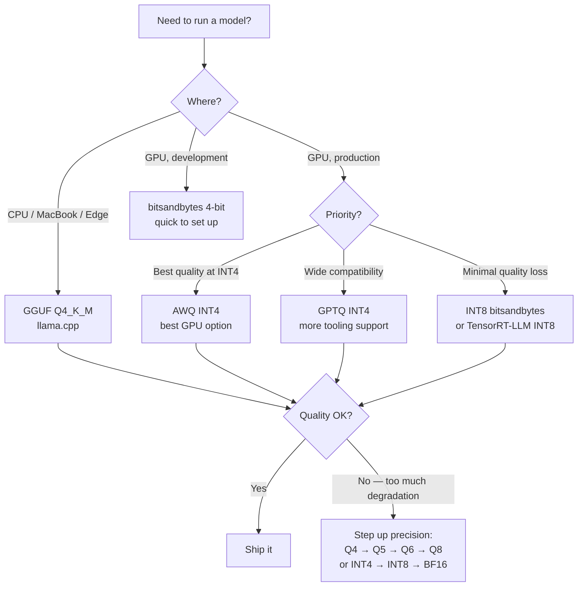

# Quantization

> **TL;DR**: Quantization reduces model weight precision from FP16 (2 bytes/param) to INT8 or INT4 (1 or 0.5 bytes/param), cutting memory by 2-4x with minimal quality loss on most tasks. A 7B model that needs 14GB in FP16 fits in 4GB at INT4. Three formats matter in practice: GGUF (CPU/llama.cpp), GPTQ (GPU, post-training), AWQ (GPU, activation-aware, better quality). For inference at scale, INT8 is safe; INT4 requires testing on your eval set.

**Prerequisites**: [Small Language Models](07-small-language-models.md), [Attention Mechanisms](03-attention-mechanisms.md)
**Related**: [Inference Infrastructure](../06-production-and-ops/04-inference-infrastructure.md), [Fine-Tuning](09-fine-tuning.md)

---

## Why Quantization Matters

A Llama 3.1 70B model in FP16 requires 140GB of VRAM. That means 2 A100 80GB GPUs just to load it, before any inference overhead.

The same model in INT4: ~35GB. Fits on a single A100. Cost: roughly half.

The same model in INT4 with GGUF on CPU: runs on a MacBook Pro. Free inference.

This isn't theoretical — production deployments routinely use 4-bit quantized models for tasks where quality is measured to be acceptable. The question is always "acceptable for what?"

---

## Precision Formats

| Format | Bits/Value | Bytes/Param | Memory (7B) | Memory (70B) |
|---|---|---|---|---|
| FP32 | 32 | 4 | 28 GB | 280 GB |
| BF16 | 16 | 2 | 14 GB | 140 GB |
| FP16 | 16 | 2 | 14 GB | 140 GB |
| INT8 | 8 | 1 | 7 GB | 70 GB |
| INT4 | 4 | 0.5 | 3.5 GB | 35 GB |
| INT3 | 3 | 0.375 | ~2.6 GB | ~26 GB |

**BF16 vs FP16:** Both are 16-bit but BF16 has a wider dynamic range (same exponent bits as FP32), making it more numerically stable for training. Most modern models are released in BF16. For inference, the difference is negligible.

**Why INT8 is usually safe:** The dynamic range of neural network weights is typically small enough that 8-bit representation captures it accurately. Quality drops of less than 1% on standard benchmarks are common.

**Why INT4 needs testing:** 4-bit representation introduces more quantization error. The impact varies significantly by task — classification tasks often show <2% degradation while complex generation and reasoning tasks can show 5-15% degradation.

---

## The Three Formats You'll Actually Use

### GGUF (llama.cpp)

GGUF is the file format for CPU inference with llama.cpp. It supports multiple quantization levels within the same format:

| GGUF Variant | Quality | Size (7B) | Use When |
|---|---|---|---|
| Q2_K | Lowest | ~2.7 GB | Memory-constrained, quality doesn't matter |
| Q4_K_M | Good | ~4.1 GB | Best balance for most CPU tasks |
| Q5_K_M | Better | ~4.8 GB | When you can afford the extra size |
| Q6_K | Near-lossless | ~5.5 GB | When quality matters on CPU |
| Q8_0 | Minimal loss | ~7.2 GB | Maximum quality on CPU |

The `_K` variants use a more sophisticated quantization scheme (k-quants) that's generally better than the basic variants. `_M` is "medium" calibration — the right default.

```python
from llama_cpp import Llama

# Q4_K_M is the standard choice for most applications
llm = Llama(
    model_path="./llama-3.1-8b-instruct-q4_k_m.gguf",
    n_ctx=4096,
    n_threads=8,
    n_gpu_layers=0  # Set to -1 to use all GPU layers if available
)

response = llm.create_chat_completion(
    messages=[{"role": "user", "content": "What is the capital of France?"}],
    max_tokens=50,
    temperature=0.0
)
print(response["choices"][0]["message"]["content"])
```

**Where to get GGUF models:** [TheBloke on Hugging Face](https://huggingface.co/TheBloke) has GGUF versions of most popular models. Increasingly, model authors publish their own GGUF releases.

---

### GPTQ (Post-Training Quantization for GPU)

GPTQ ([Frantar et al. 2022](https://arxiv.org/abs/2210.17323)) quantizes weights layer-by-layer using a small calibration dataset to minimize quantization error. The calibration step takes a few hours on a GPU.

```python
from transformers import AutoTokenizer, AutoModelForCausalLM
from optimum.gptq import GPTQQuantizer, load_quantized_model
import torch

# Load a pre-quantized GPTQ model (most common use case)
model_name = "TheBloke/Llama-2-7B-GPTQ"

tokenizer = AutoTokenizer.from_pretrained(model_name)
model = AutoModelForCausalLM.from_pretrained(
    model_name,
    device_map="auto",      # Automatically places on GPU
    torch_dtype=torch.float16
)

# Standard HuggingFace inference
inputs = tokenizer("The capital of France is", return_tensors="pt").to("cuda")
with torch.no_grad():
    outputs = model.generate(**inputs, max_new_tokens=20)
print(tokenizer.decode(outputs[0], skip_special_tokens=True))
```

GPTQ INT4 models run well on consumer GPUs (RTX 3090, 4090) and are the standard for local GPU inference.

---

### AWQ (Activation-Aware Weight Quantization)

AWQ ([Lin et al. 2023](https://arxiv.org/abs/2306.00978)) is a step up from GPTQ. Instead of treating all weights equally, it identifies which weights are most important (based on activation magnitudes) and protects them from quantization error.

The result: AWQ INT4 is consistently better than GPTQ INT4, often by 1-3% on benchmarks, with comparable inference speed.

```python
from awq import AutoAWQForCausalLM
from transformers import AutoTokenizer

model_path = "TheBloke/Llama-2-7B-AWQ"

tokenizer = AutoTokenizer.from_pretrained(model_path)
model = AutoAWQForCausalLM.from_quantized(
    model_path,
    fuse_layers=True,     # Fuses layers for faster inference
    trust_remote_code=False,
    safetensors=True
)

# Same inference interface as standard transformers
tokens = tokenizer("The capital of France is", return_tensors="pt").input_ids.cuda()
out = model.generate(tokens, max_new_tokens=20)
print(tokenizer.decode(out[0]))
```

**My default recommendation:** AWQ for GPU inference, GGUF Q4_K_M for CPU inference.

---

## Quality Loss: What the Numbers Say

Measured on MMLU (knowledge), HellaSwag (reasoning), HumanEval (code) benchmarks for Llama 3.1 8B:

| Quantization | MMLU | HellaSwag | HumanEval | Notes |
|---|---|---|---|---|
| BF16 (baseline) | 68.4 | 82.1 | 62.2 | Full quality |
| INT8 (bitsandbytes) | 68.1 | 81.9 | 61.8 | ~0.5% drop, generally safe |
| AWQ INT4 | 67.8 | 81.4 | 60.9 | ~1% drop, usually acceptable |
| GPTQ INT4 | 67.2 | 80.8 | 59.6 | ~2% drop, test on your task |
| GGUF Q4_K_M | 67.5 | 81.0 | 60.1 | Between AWQ and GPTQ |
| GGUF Q2_K | 62.1 | 75.3 | 48.2 | ~9% drop, use only if necessary |

*Numbers approximate from published benchmarks; exact values vary by model and task.*

**The benchmark vs real task gap:** These numbers are averages across academic benchmarks. Your specific task may show different patterns:
- Classification tasks: typically <1% drop even at INT4
- Factual Q&A: typically 1-3% drop at INT4
- Complex reasoning/code: can be 5-15% drop at INT4
- Creative generation: hard to measure; subjective degradation

Always measure on your actual eval set, not just benchmark numbers.

---

## bitsandbytes: In-Process Quantization

For development and experimentation, bitsandbytes loads any FP16 model and quantizes it on the fly:

```python
from transformers import AutoTokenizer, AutoModelForCausalLM, BitsAndBytesConfig
import torch

# 4-bit quantization config
bnb_config = BitsAndBytesConfig(
    load_in_4bit=True,
    bnb_4bit_quant_type="nf4",      # NormalFloat4 — better than int4
    bnb_4bit_use_double_quant=True, # Nested quantization for memory savings
    bnb_4bit_compute_dtype=torch.bfloat16  # Compute in BF16 for quality
)

model = AutoModelForCausalLM.from_pretrained(
    "meta-llama/Llama-3.1-8B-Instruct",
    quantization_config=bnb_config,
    device_map="auto"
)
tokenizer = AutoTokenizer.from_pretrained("meta-llama/Llama-3.1-8B-Instruct")
```

bitsandbytes with `nf4` (NormalFloat4) uses a quantization scheme optimized for normally-distributed weights — which neural network weights approximate well. It's the standard for QLoRA fine-tuning.

**Tradeoff:** bitsandbytes is convenient but slower than AWQ/GPTQ at inference time. Use it for development; switch to AWQ/GPTQ for production.

---

## Memory Calculator

Quick reference for model loading requirements:

```python
def estimate_model_memory_gb(param_count_b: float, quantization: str) -> dict:
    """Estimate VRAM/RAM needed to load a model."""
    bytes_per_param = {
        "fp32": 4, "fp16": 2, "bf16": 2,
        "int8": 1, "int4": 0.5, "int3": 0.375
    }
    bpp = bytes_per_param.get(quantization, 2)
    weights_gb = param_count_b * 1e9 * bpp / 1e9

    return {
        "weights_gb": round(weights_gb, 1),
        "with_overhead_gb": round(weights_gb * 1.2, 1),  # 20% for activations
        "recommended_vram_gb": round(weights_gb * 1.35, 1),  # 35% headroom
    }

# Examples
print(estimate_model_memory_gb(7, "bf16"))    # {'weights_gb': 14.0, ...}
print(estimate_model_memory_gb(7, "int4"))    # {'weights_gb': 3.5, ...}
print(estimate_model_memory_gb(70, "int4"))   # {'weights_gb': 35.0, ...}
print(estimate_model_memory_gb(70, "int8"))   # {'weights_gb': 70.0, ...}
```

---

## Choosing a Quantization Strategy



---

## Production Quantization with vLLM

vLLM supports AWQ and GPTQ natively for production serving:

```bash
# Serve an AWQ-quantized model with vLLM
python -m vllm.entrypoints.openai.api_server \
    --model TheBloke/Llama-2-7B-AWQ \
    --quantization awq \
    --dtype float16 \
    --max-model-len 4096 \
    --gpu-memory-utilization 0.90
```

At serving time, AWQ with vLLM typically runs at 1.2-1.5x throughput vs BF16 at the same batch size, while using 2x less VRAM. The VRAM savings matter more than the throughput improvement — they let you batch more requests.

---

## Gotchas

**Quantization is not lossless.** INT8 usually is, practically speaking. INT4 is not. Always measure quality on your actual task before shipping quantized models to production. "The benchmarks look fine" is not sufficient — benchmark tasks don't always correlate with your specific use case.

**Different quantization for different layers.** Some implementations use mixed-precision quantization: quantize most layers at INT4 but keep certain sensitive layers (first/last layers, attention) at INT8 or FP16. This often recovers most of the quality loss at a small memory cost. AWQ does this automatically.

**Quantized models are not interchangeable.** A GPTQ model requires the `auto-gptq` library; an AWQ model requires `autoawq`. A GGUF model requires llama.cpp or a compatible runtime. Make sure your inference stack supports the format you choose before building around it.

**Speed isn't always better with quantization.** INT4 on GPU is not always faster than BF16 for single-token generation. The speedup shows up at batch inference (multiple concurrent requests). For single-stream inference, the quantization/dequantization overhead can offset the memory bandwidth savings. Benchmark your specific hardware and batch size.

**Fine-tuning after quantization is tricky.** If you need to fine-tune, do it before quantizing (or use QLoRA to fine-tune the quantized model). Don't quantize a fine-tuned model if you still need to fine-tune it further.

---

> **Key Takeaways:**
> 1. INT8 quantization is safe for most tasks — <1% quality loss, 2x memory reduction. INT4 requires measuring quality on your specific task; degradation varies from 1% to 15% depending on task complexity.
> 2. AWQ is the best GPU quantization format; GGUF Q4_K_M is the standard for CPU inference. Use bitsandbytes for development convenience.
> 3. Quantization is primarily a memory optimization, not a speed optimization. The main benefit is fitting larger models on available hardware and increasing batch size.
>
> *"Quantization is not free. You're trading precision for capacity. The question is whether the task is sensitive enough to care about the difference."*

---

## Interview Questions

**Q: A customer says they need to run a 70B parameter model on 2 A100 80GB GPUs (160GB VRAM). Currently, the FP16 model takes 140GB plus 30GB KV cache overhead. It barely fits. How would you approach this?**

The immediate fix is INT8 quantization: 70GB for weights instead of 140GB. That frees up 70GB, giving you 90GB for KV cache instead of 20GB. That means substantially longer context windows and larger batch sizes.

If you need more room — larger batch sizes for throughput or longer context windows — AWQ INT4 gets you to 35GB for weights, leaving 125GB for KV cache. The quality hit for INT4 on a 70B model is typically smaller than on 7B models because the larger model has more redundancy to absorb quantization error.

What I'd actually do: start with INT8, benchmark quality on the actual task, then decide if INT4 is worth the quality tradeoff. The memory savings from INT4 over INT8 (35GB vs 70GB) are meaningful at this scale — that's another 35GB for KV cache or an extra 35GB to potentially fit on fewer GPUs.

One thing to watch: with vLLM's PagedAttention, KV cache is managed dynamically, so the 30GB overhead isn't fixed. Profiling actual KV cache usage under realistic load matters more than worst-case calculations.

---

**Quick-fire Questions**

| Question | Answer |
|---|---|
| What does INT4 quantization do? | Stores each weight as a 4-bit integer instead of 16-bit float, reducing model size by 4x |
| What is AWQ? | Activation-Aware Weight Quantization: protects the most important weights from quantization error using activation magnitudes |
| What is GGUF? | File format for quantized models used by llama.cpp; supports CPU inference with multiple quantization levels |
| What is the typical quality loss for INT8? | Less than 1% on most benchmarks — generally safe without testing |
| What is bitsandbytes used for? | In-process quantization for development; slower than AWQ/GPTQ but easier to set up |
| What is NF4 (NormalFloat4)? | A 4-bit quantization scheme optimized for normally-distributed weights; used in QLoRA fine-tuning |
