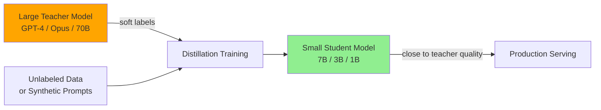
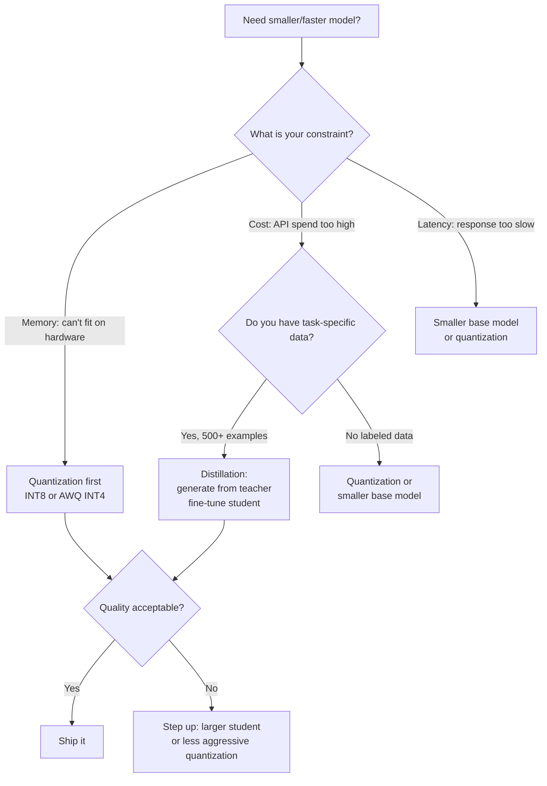

# Distillation and Pruning

> **TL;DR**: Knowledge distillation trains a small "student" model to mimic a large "teacher" model, often achieving 90-95% of the teacher's quality at 10-30% of the compute cost. Pruning removes redundant weights from trained models, recovering some of the quantization-style memory savings with potentially better quality. In practice, distillation is the more commonly useful technique — it's how models like Llama 3.2 1B/3B were built, and how teams productize frontier model behavior at SLM cost.

**Prerequisites**: [Fine-Tuning](09-fine-tuning.md), [Small Language Models](07-small-language-models.md), [Quantization](08-quantization.md)
**Related**: [Training Pipeline](05-training-pipeline.md), [Inference Infrastructure](../06-production-and-ops/04-inference-infrastructure.md)

---

## Knowledge Distillation: The Core Idea

Pre-training a large model costs millions of dollars. Once you have it, you can use it to train a much smaller model that approximates its behavior — at a fraction of the cost.

The insight: a large model's output distribution contains more information than the hard labels it was trained on. When a teacher model says "80% Paris, 10% London, 5% Berlin" for a geography question, the student learns more than if it's just told "Paris." The soft probability distribution encodes the teacher's uncertainty and conceptual relationships.



---

## Three Approaches to Distillation

### Response Distillation (Most Common)

Use the teacher to generate responses, then fine-tune the student on those responses:

```python
from anthropic import Anthropic
from datasets import Dataset
import json

client = Anthropic()

def generate_distillation_dataset(
    prompts: list[str],
    teacher_model: str = "claude-opus-4-6"
) -> list[dict]:
    """Generate teacher responses for student training."""
    examples = []
    for prompt in prompts:
        response = client.messages.create(
            model=teacher_model,
            max_tokens=1024,
            messages=[{"role": "user", "content": prompt}]
        )
        examples.append({
            "input": prompt,
            "output": response.content[0].text
        })
    return examples

# Generate 5,000 examples from teacher
prompts = load_your_prompts()  # Domain-specific prompts
distillation_data = generate_distillation_dataset(prompts)

# Save for fine-tuning
with open("distillation_train.jsonl", "w") as f:
    for example in distillation_data:
        f.write(json.dumps(example) + "\n")
```

Then fine-tune a small model on these teacher-generated responses using standard LoRA fine-tuning (see [Fine-Tuning](09-fine-tuning.md)).

This is how many "distilled" models on Hugging Face were created: generate outputs from Llama 70B or GPT-4, fine-tune Llama 7B on those outputs.

---

### Logit Distillation (Higher Quality, More Complex)

Instead of training on just the teacher's text output, train on the teacher's full probability distribution:

```python
import torch
import torch.nn.functional as F
from transformers import AutoModelForCausalLM, AutoTokenizer

def distillation_loss(
    student_logits: torch.Tensor,
    teacher_logits: torch.Tensor,
    labels: torch.Tensor,
    alpha: float = 0.5,
    temperature: float = 2.0
) -> torch.Tensor:
    """
    Combined distillation + task loss.
    alpha: weight for distillation vs hard label loss
    temperature: softens distributions (higher = softer)
    """
    # Soft targets from teacher
    teacher_probs = F.softmax(teacher_logits / temperature, dim=-1)
    student_log_probs = F.log_softmax(student_logits / temperature, dim=-1)

    # KL divergence loss (distillation)
    kl_loss = F.kl_div(student_log_probs, teacher_probs, reduction="batchmean")
    kl_loss = kl_loss * (temperature ** 2)  # Scale back

    # Standard cross-entropy on hard labels
    ce_loss = F.cross_entropy(student_logits.view(-1, student_logits.size(-1)),
                               labels.view(-1), ignore_index=-100)

    return alpha * kl_loss + (1 - alpha) * ce_loss
```

Logit distillation typically produces better students than response distillation, but requires access to the teacher's logits — which means self-hosting the teacher or using APIs that expose logprobs. Anthropic's API does not expose logits; OpenAI's does for some models.

**Practical implication:** For distilling from Claude, you're limited to response distillation. For distilling from open-source teachers (Llama 70B), logit distillation is available.

---

### Feature/Layer Distillation

The student learns to match intermediate representations (hidden states, attention patterns) from the teacher, not just outputs. This transfers more structural knowledge but requires the student architecture to be similar to the teacher.

Used in models like DistilBERT (reduces BERT layers by half) and TinyBERT. Less commonly applied to modern LLMs because the architecture similarity requirement is harder to satisfy with large parameter ratio differences.

---

## When Distillation Works and When It Doesn't

**Distillation works well when:**
- You have a clear task distribution (customer support, code review, extraction)
- You can generate sufficient synthetic prompts covering the task
- The student is at least 1/4 the size of the teacher (7B student from 70B teacher, not 1B)
- Quality threshold is 90-95% of teacher (not 99%)

**Distillation struggles when:**
- Tasks require world knowledge the student model doesn't have
- The task requires reasoning that genuinely needs the teacher's parameter count
- You can't generate good synthetic prompts (hard to cover the edge cases)

**Real quality comparisons:**

| Task | Teacher (70B) | Student (7B, distilled) | Relative quality |
|---|---|---|---|
| Named entity extraction | 94% F1 | 91% F1 | 97% |
| Customer intent classification | 92% accuracy | 90% accuracy | 98% |
| Code review comments | 4.1/5 human score | 3.7/5 human score | 90% |
| Multi-step math reasoning | 78% accuracy | 61% accuracy | 78% |
| Open-ended creative writing | 4.2/5 human score | 3.5/5 human score | 83% |

The pattern: structured extraction and classification tasks distill well. Open-ended generation and complex reasoning lose more quality.

---

## Mixture of Experts (MoE): Sparse Computation

MoE isn't traditional distillation, but it achieves a similar goal: high-quality outputs at lower inference cost.

In a standard dense transformer, every token activates every FFN layer. In MoE, each FFN layer contains multiple "expert" networks, and a router selects which 2-4 experts to activate per token.

```
Dense 70B model:    every token uses 70B parameters
Mixtral 8×7B MoE:  every token uses ~13B parameters (2 of 8 experts active)
Effective params:   46.7B total weights, 13B active per token
```

Mixtral 8×7B achieves performance close to Llama 70B with ~25% of the per-token compute cost. The catch: you still need to load all 46.7B weights into VRAM. MoE saves compute (and improves throughput) but doesn't save memory compared to a model of similar quality.

**For practitioners:** MoE models (Mixtral, GPT-4 reportedly, Gemini 1.5 reportedly) are good options when you need high quality but can accept the memory footprint of a large model. The per-token cost advantage shows up in throughput at scale.

---

## Pruning

Pruning removes weights from a trained model that contribute little to the output. The goal is a sparser, smaller model.

**Types:**

*Unstructured pruning:* Zero out individual weights below a magnitude threshold. The model is smaller on paper but doesn't accelerate on standard hardware (GPUs don't efficiently skip individual zeros in large matrices).

*Structured pruning:* Remove entire attention heads, FFN neurons, or transformer layers. Hardware-friendly — fewer operations means real speedup.

```python
from transformers import AutoModelForCausalLM
import torch

def prune_attention_heads(model, layer_idx: int, heads_to_prune: list[int]):
    """Prune specific attention heads from a transformer layer."""
    attention = model.model.layers[layer_idx].self_attn

    # Zero out the output projections for pruned heads
    # (simplified — full pruning requires more careful weight manipulation)
    d_head = attention.head_dim
    for head_idx in heads_to_prune:
        start = head_idx * d_head
        end = (head_idx + 1) * d_head
        attention.o_proj.weight.data[:, start:end] = 0

# In practice, use structured pruning libraries:
# - torch.nn.utils.prune for basic pruning
# - SparseGPT (https://github.com/IST-DASLab/sparsegpt) for post-training pruning
# - LLM-Pruner for structured pruning with recovery fine-tuning
```

**The reality of LLM pruning:** It's less commonly used than quantization or distillation because:
1. Unstructured pruning doesn't give real hardware speedups
2. Structured pruning typically requires fine-tuning to recover quality
3. The quality-size tradeoff is usually worse than quantization or distillation

**Where pruning shines:** Removing entire transformer layers from overparameterized models. Some 70B models can have 5-10 layers pruned with minimal quality loss, reducing to an effective ~60B model. This is done in tools like [ShortGPT](https://arxiv.org/abs/2403.03853).

---

## Choosing Between Techniques



**Rule of thumb:** Start with quantization (immediate, no training required). If quality is unacceptable or you need further cost reduction at scale, use distillation to create a task-specialized student model. Pruning is for advanced optimization after the other techniques are exhausted.

---

## Cost Model: Is Distillation Worth It?

```python
def distillation_roi(
    queries_per_day: int,
    teacher_cost_per_query: float,  # e.g., $0.10 for Opus
    student_cost_per_query: float,  # e.g., $0.003 for self-hosted 7B
    distillation_cost: float = 500, # One-time: GPU time + teacher API calls
    quality_acceptable: bool = True
) -> dict:
    daily_savings = (teacher_cost_per_query - student_cost_per_query) * queries_per_day
    payback_days = distillation_cost / daily_savings if daily_savings > 0 else float("inf")
    annual_savings = daily_savings * 365 - distillation_cost

    return {
        "daily_savings": round(daily_savings, 2),
        "payback_days": round(payback_days, 1),
        "annual_savings": round(annual_savings, 2),
        "worth_it": payback_days < 30 and quality_acceptable
    }

# Example: 10K queries/day routed to Opus
print(distillation_roi(10_000, 0.10, 0.003))
# {'daily_savings': 970, 'payback_days': 0.5, 'annual_savings': 353_550, 'worth_it': True}

# Example: 100 queries/day
print(distillation_roi(100, 0.10, 0.003))
# {'daily_savings': 9.7, 'payback_days': 51.5, 'annual_savings': 3_040, 'worth_it': False}
```

Distillation is worth it when you have high query volume and the distillation cost is a small fraction of the ongoing savings. For 100 queries/day, just prompt the frontier model well.

---

## Gotchas

**Distillation amplifies teacher mistakes.** If the teacher model has systematic errors or biases, the student learns those errors. Evaluate the teacher's outputs before using them as training data. A teacher with 95% accuracy produces training data that's 5% wrong — enough to meaningfully hurt the student.

**Distribution mismatch degrades distilled models.** The student learns from the prompts you generated. If production queries look different from your synthetic prompts, the distilled model will underperform. Collect representative production queries for your training set whenever possible.

**MoE memory surprise.** Developers see "Mixtral 8×7B" and think "7B parameters." The model requires loading all ~47B parameters into VRAM. The 7B refers to active parameters per token, not model size. Know the difference before planning your hardware.

**Pruning without fine-tuning is risky.** Pruning beyond 20-30% of weights usually requires recovery fine-tuning to maintain quality. "One-shot" pruning (remove weights, deploy immediately) at high sparsity levels typically produces degraded models.

---

> **Key Takeaways:**
> 1. Response distillation is practical today: generate outputs from a frontier model (Claude Opus, GPT-4), fine-tune a 7B model on those outputs with LoRA. Achieves 90-95% quality on structured tasks at 10-30x lower inference cost.
> 2. MoE models like Mixtral get quality-near-70B at 25% of the per-token compute cost, but still require loading all weights. Memory footprint doesn't shrink.
> 3. Use quantization for immediate memory reduction (no training needed), distillation when you have task-specific data and need to reduce API costs at scale, and pruning only if the other options are insufficient.
>
> *"Distillation lets you buy intelligence once and serve it cheaply forever. The frontier model writes the textbook; the small model memorizes it for your specific domain."*
