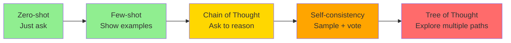
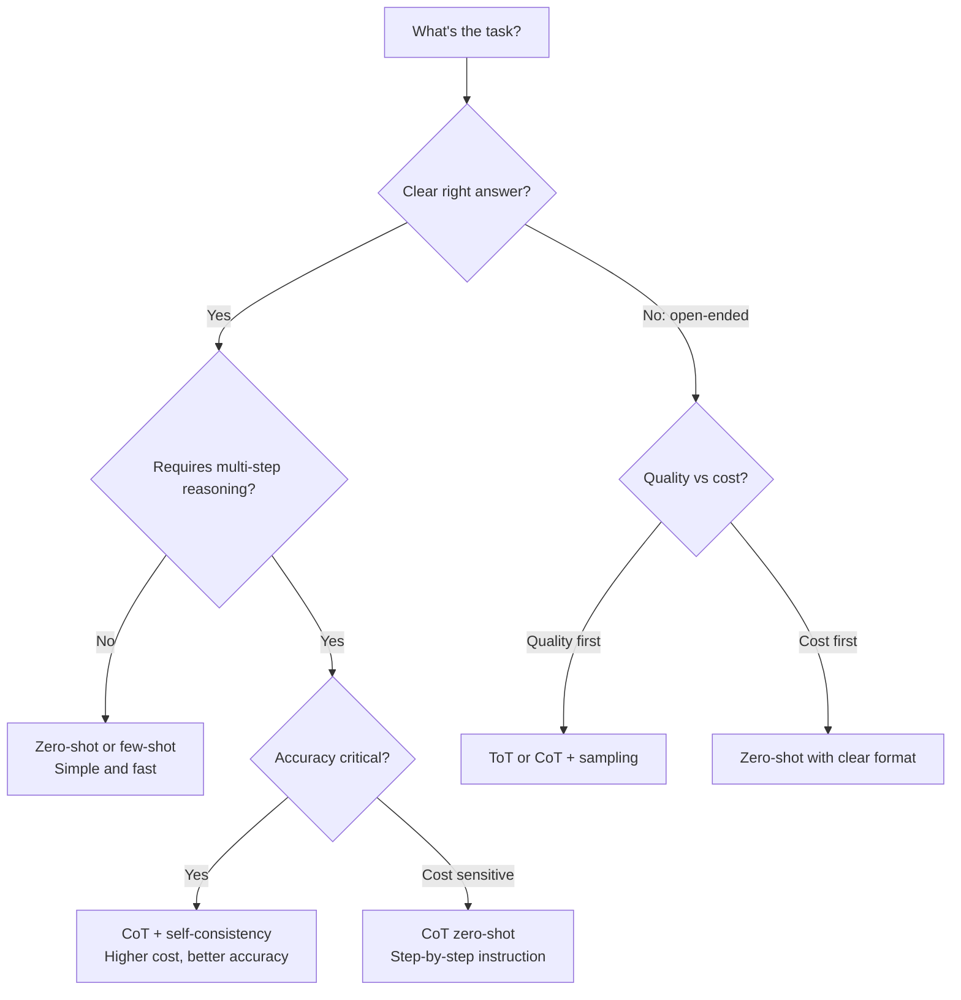

# Prompting Patterns

> **TL;DR**: The prompting progression is: zero-shot (just ask) → few-shot (show examples) → Chain of Thought (ask to reason step-by-step) → self-consistency (sample multiple answers, take majority) → structured prompting (explicit format constraints). Most production prompts need only zero-shot or few-shot. Save CoT for tasks that genuinely require multi-step reasoning.

**Prerequisites**: [LLM Foundations - Training Pipeline](../01-llm-foundations/05-training-pipeline.md)
**Related**: [Context Engineering](02-context-engineering.md), [Structured Generation](03-structured-generation.md), [Prompt Optimization](04-prompt-optimization.md)

---

## The Progression: From Simple to Complex

Each technique adds capability but also complexity. Start simple.



Green = try first. Orange/Red = add only if needed.

---

## Zero-Shot Prompting

Ask the model to perform a task with no examples. Surprisingly effective for well-defined tasks.

```python
# Simple zero-shot
response = client.messages.create(
    model="claude-opus-4-6",
    max_tokens=256,
    messages=[{
        "role": "user",
        "content": "Classify this customer feedback as positive, negative, or neutral:\n\nFeedback: The delivery was fast but the product quality was disappointing."
    }]
)
# Response: "Negative"
```

**Works well for:** Classification, summarization, translation, simple Q&A.

**Fails on:** Tasks requiring domain knowledge the model lacks, ambiguous instructions, complex multi-step reasoning.

**The system prompt matters.** The system prompt is the highest-privilege part of the context. Use it to:
- Define the model's role and expertise
- Set the response format and style
- Establish constraints and guardrails
- Provide persistent context that doesn't change query-to-query

```python
response = client.messages.create(
    model="claude-opus-4-6",
    max_tokens=256,
    system="You are a customer service agent for TechCorp. Respond in a professional but friendly tone. Keep responses under 100 words.",
    messages=[{"role": "user", "content": "My order hasn't arrived after 2 weeks."}]
)
```

---

## Few-Shot Prompting

Show the model examples of what you want before asking. This demonstrates format, tone, and reasoning patterns better than instructions alone.

```python
# Few-shot classification
prompt = """Classify support tickets into: billing, technical, account, general.

Ticket: "My subscription was charged twice this month."
Category: billing

Ticket: "The app crashes when I try to upload a file."
Category: technical

Ticket: "How do I change my email address?"
Category: account

Ticket: "What are your business hours?"
Category: general

Ticket: "I can't log in even after resetting my password."
Category:"""
```

**The quality of examples matters more than the quantity.** 3 diverse, well-chosen examples often beat 10 mediocre ones. Include:
- Typical cases (represent the common distribution)
- Edge cases (where the rule isn't obvious)
- Potential confusers (cases that look like one category but are another)

**Few-shot format consistency.** The model will imitate the format of your examples. Inconsistent formatting in examples produces inconsistent output.

---

## Chain of Thought (CoT)

Ask the model to show its work before giving the final answer. This dramatically improves performance on multi-step reasoning tasks.

```python
# Without CoT
prompt = "If a train travels 120 miles in 2 hours, then stops for 30 minutes, then travels at 80 miles per hour for 1.5 hours, what is the total distance?"
# Model might answer: "200 miles" (wrong)

# With CoT
prompt = """Solve this step by step.
If a train travels 120 miles in 2 hours, then stops for 30 minutes, then travels at 80 miles per hour for 1.5 hours, what is the total distance?

Think through each part:"""
# Model now shows:
# Part 1: Train travels 120 miles (given)
# Stop: 30 minutes (doesn't affect distance)
# Part 2: 80 mph × 1.5 hours = 120 miles
# Total: 120 + 120 = 240 miles
```

The magic phrase "think step by step" or "let's work through this" triggers CoT behavior in modern instruction-tuned models.

**When CoT helps:**
- Math problems (arithmetic, word problems)
- Logic puzzles
- Multi-step reasoning (drawing inferences from multiple facts)
- Code debugging (explain each part before suggesting a fix)

**When CoT doesn't help:**
- Simple classification (forcing reasoning where none is needed)
- Tasks where the "reasoning" is trivial filler
- When you only want a short answer (CoT produces long outputs)

**Zero-shot CoT vs Few-shot CoT:**
- Zero-shot: "Think step by step." Works surprisingly well.
- Few-shot: Provide examples with reasoning chains. Better for complex tasks with specific reasoning patterns.

---

## Self-Consistency

Sample the model multiple times with the same prompt, then take the majority answer. Improves reliability on tasks where the model sometimes makes mistakes.

```python
import collections

def self_consistent_answer(question: str, n_samples: int = 5) -> str:
    answers = []
    for _ in range(n_samples):
        response = client.messages.create(
            model="claude-opus-4-6",
            max_tokens=512,
            temperature=0.7,  # non-zero temp for diversity
            messages=[{"role": "user", "content": f"Think step by step, then give your final answer.\n\n{question}"}]
        )
        # Extract just the final answer from each CoT response
        final_answer = extract_final_answer(response.content[0].text)
        answers.append(final_answer)

    # Return majority vote
    return collections.Counter(answers).most_common(1)[0][0]
```

**Cost:** 5 samples = 5x cost and latency. Only justified for high-stakes, low-volume tasks where a wrong answer is costly.

**Best for:** Math problems, code generation (run tests to verify), fact verification. Not worth it for subjective tasks where there's no clear "right" answer.

---

## Structured Output Prompting

Constrain the output format explicitly in the prompt. Critical for downstream parsing.

```python
# Bad: model might format response any way it wants
prompt = "List the pros and cons of Python vs Go for a microservice."

# Better: explicit format instruction
prompt = """Compare Python and Go for microservices. Return your response as JSON only, no other text:
{
  "python": {"pros": [list of strings], "cons": [list of strings]},
  "go": {"pros": [list of strings], "cons": [list of strings]}
}"""

# Best: use function calling or Instructor for guaranteed structure
# See 03-structured-generation.md
```

**The "JSON only" instruction works most of the time** but not always. Models occasionally add explanatory text before or after the JSON. For reliable structured output in production, use function calling or the Instructor library. See [03-structured-generation.md](03-structured-generation.md).

---

## Prompt Format Best Practices

| Element | Recommendation |
|---|---|
| Role instruction | Put in system prompt, not the user message |
| Task description | Clear, specific action verb ("classify", "summarize", "extract", not "help with") |
| Context | Before the question, not after |
| Output format | Be explicit: "Respond with only X", "Format as Y" |
| Constraints | List explicitly: "in 3 sentences or fewer", "professional tone" |
| Examples | After the instruction, before the actual query |

**The XML tags trick for Claude:** Claude responds especially well to XML-style tags for organizing prompt sections:

```python
prompt = """<task>
Classify the customer's request into one of these categories: billing, technical, account, general.
</task>

<examples>
Input: "I was charged twice"
Output: billing

Input: "App crashes on login"
Output: technical
</examples>

<input>
{customer_message}
</input>

Output category (one word only):"""
```

---

## Tree of Thought (ToT)

Explores multiple reasoning paths simultaneously, evaluating and pruning them like a search tree. Reserved for complex planning and creative tasks.

```python
def tree_of_thought(problem: str, n_branches: int = 3, depth: int = 2) -> str:
    """Simplified ToT: generate multiple approaches, evaluate, select best."""
    # Generate N initial approaches
    approaches_response = client.messages.create(
        model="claude-opus-4-6", max_tokens=800,
        messages=[{"role": "user", "content":
            f"Generate {n_branches} different approaches to solving this problem. Number them.\n\nProblem: {problem}"}]
    )

    # Evaluate each approach
    eval_response = client.messages.create(
        model="claude-opus-4-6", max_tokens=400,
        messages=[{"role": "user", "content":
            f"Problem: {problem}\n\nApproaches:\n{approaches_response.content[0].text}\n\n"
            "Which approach is most promising? Why? Then select one and develop it fully."}]
    )
    return eval_response.content[0].text
```

**When ToT is overkill:** Most production tasks. ToT makes sense for open-ended planning problems where there's no single right answer and exploring alternatives improves quality (e.g., "design an architecture for X", "plan a research study").

---

## Pattern Selection Guide



---

## Gotchas

**"Be concise" doesn't always help.** Asking for concise responses can cause the model to skip reasoning steps it needs. For complex tasks, let the model write as much as it needs; truncate the output in post-processing if needed.

**Few-shot examples bias the output format.** If your examples are all one sentence, the model will return one-sentence answers even when the question deserves more. Match example length to desired output length.

**CoT can produce confidently wrong reasoning.** The model can generate coherent-sounding reasoning chains that lead to wrong answers. CoT improves accuracy on average but doesn't guarantee correctness. For math, execute the arithmetic; for code, run the code.

**Temperature affects CoT quality.** Low temperature (0.0-0.2) for structured tasks. Medium temperature (0.5-0.7) for CoT and self-consistency sampling. High temperature (0.8-1.0) for creative tasks where diversity matters.

**Prompt injection from user input.** If user input is directly inserted into a prompt, a malicious user can inject instructions. See [05-prompt-security.md](05-prompt-security.md).

---

> **Key Takeaways:**
> 1. Start with zero-shot, add few-shot examples if the format or style needs refinement, add CoT only for multi-step reasoning tasks. Skip to self-consistency only for high-stakes decisions.
> 2. The system prompt is your highest-leverage prompt engineering tool: it sets the model's behavior for all queries in a session.
> 3. Structured output requires explicit format instructions or function calling. "JSON only" works most of the time but not always.
>
> *"The best prompt is the shortest one that reliably produces the output you need. Every extra instruction is a potential failure mode."*

---

## Interview Questions

**Q: A customer support system is returning too-long, verbose responses. How do you fix it with prompting?**

I'd add explicit length constraints to the system prompt and few-shot examples. "Keep all responses under 100 words" is a start, but models don't always count words accurately. More effective: "Answer in 2-3 sentences maximum" or "Use bullet points, maximum 3 items."

I'd also add few-shot examples at the right length. If I show the model 3 examples of responses that are exactly the length I want, it mimics that length better than an abstract instruction.

The third lever is the task framing. "Answer this customer question" produces prose. "Give the direct answer in one sentence, then optionally one sentence of context if needed" produces short answers. Specific action verbs constrain output structure.

If prompting alone doesn't work, function calling with an output schema is the reliable alternative: define a schema with `answer: str` and `max_length` validation, force the model to use the tool.

---

**Quick-fire Questions**

| Question | Answer |
|---|---|
| What is few-shot prompting? | Providing examples of input-output pairs before the actual query to demonstrate the desired format/behavior |
| When does Chain of Thought help most? | Multi-step reasoning, math problems, logical inference tasks |
| What is self-consistency? | Sampling the model N times with the same prompt and taking the majority answer |
| What is the "think step by step" trick? | A zero-shot CoT trigger that activates reasoning chains in instruction-tuned models |
| What is Tree of Thought? | Exploring multiple reasoning branches simultaneously; reserved for complex planning tasks |
| What does temperature control in sampling? | 0=deterministic, 0.7=balanced, 1.0+=creative/diverse; higher temp for self-consistency sampling |
