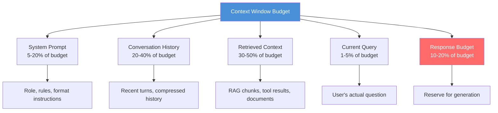

# Context Engineering

> **TL;DR**: Context engineering is the discipline of deciding what goes into the context window, in what order, and at what cost. The context window is finite and expensive. The lost-in-the-middle problem means position matters as much as content. Anthropic prompt caching reduces costs by 90% for stable context. Most teams underinvest here and overspend on tokens.

**Prerequisites**: [Prompting Patterns](01-prompting-patterns.md), [RAG Fundamentals](../03-retrieval-and-rag/01-rag-fundamentals.md)
**Related**: [Structured Generation](03-structured-generation.md), [Memory and State](../04-agents-and-orchestration/10-memory-and-state.md), [Chunking Strategies](../03-retrieval-and-rag/05-chunking-strategies.md)

---

## The Context Window Budget

The context window is a shared resource. Everything you put in it costs tokens; everything you leave out might be needed. The tension is real.



The response budget is the part most teams forget. If your context is 180K tokens and the model's window is 200K, you have 20K tokens for the response. That might be enough for a chat message but not for a long document generation task.

**The budget allocation shifts by use case:**

| Use Case | System | History | Retrieved | Query | Response |
|---|---|---|---|---|---|
| Chat assistant | 10% | 40% | 10% | 5% | 35% |
| RAG Q&A | 15% | 10% | 60% | 5% | 10% |
| Document generation | 10% | 5% | 30% | 5% | 50% |
| Agentic loop | 20% | 20% | 30% | 5% | 25% |

Track your actual token usage by category. Most teams are shocked to discover that conversation history consumes 60%+ of their budget after a few turns.

---

## The Lost-in-the-Middle Problem

Models don't read context uniformly. They're better at using information at the beginning and end of the context window than in the middle.

The original paper ([Liu et al. 2023](https://arxiv.org/abs/2307.03172)) showed that LLMs lose 15-20% accuracy on retrieval tasks when relevant information is buried in the middle of a long context, compared to placing it at the start or end.

```
Position Effect on Information Recall:

Beginning [████████████] 92% recall
25%       [████████░░░░] 74% recall
50%       [██████░░░░░░] 68% recall  ← "lost in middle"
75%       [███████░░░░░] 71% recall
End       [███████████░] 88% recall
```

**Practical rules:**

1. Put the most important context first or last, never in the middle
2. For RAG: put the system prompt, then retrieved context, then conversation history, then the question last
3. For long conversations: compress old turns into a summary, keep recent turns verbatim
4. For multiple documents: put the most relevant document first

```python
def build_rag_context(system_prompt: str, retrieved_chunks: list[str],
                      history: list[dict], query: str) -> list[dict]:
    """Position context for maximum recall."""
    # Most relevant chunks first (not middle)
    context_block = "\n\n".join(f"[Document {i+1}]\n{chunk}"
                                for i, chunk in enumerate(retrieved_chunks))

    # System prompt → retrieved context → history → query (last = remembered well)
    messages = []

    # Inject retrieved context into first user turn
    if retrieved_chunks:
        messages.append({
            "role": "user",
            "content": f"<context>\n{context_block}\n</context>\n\nUse the above context to answer questions."
        })
        messages.append({
            "role": "assistant",
            "content": "Understood. I'll use the provided context to answer your questions."
        })

    # Add conversation history (compressed if long)
    messages.extend(history)

    # Current query goes last
    messages.append({"role": "user", "content": query})

    return messages
```

---

## Managing Conversation History

Conversation history is the silent budget killer. A 20-turn conversation at 500 tokens/turn = 10K tokens before you've said anything new.

**Three strategies, in order of complexity:**

### 1. Sliding Window

Keep only the last N turns. Simple and predictable.

```python
def sliding_window_history(messages: list[dict], max_turns: int = 10) -> list[dict]:
    """Keep only the most recent max_turns pairs."""
    # Each turn is a user + assistant pair = 2 messages
    max_messages = max_turns * 2
    if len(messages) <= max_messages:
        return messages
    return messages[-max_messages:]
```

**Problem:** Loses context about what was established early in the conversation. The user said their name in turn 1; by turn 15, the model has forgotten it.

### 2. Summarization

Compress old turns into a running summary. Keeps the substance without the tokens.

```python
from anthropic import Anthropic

client = Anthropic()

def compress_history(messages: list[dict], keep_recent: int = 4) -> list[dict]:
    """Compress old messages into a summary, keep recent turns verbatim."""
    if len(messages) <= keep_recent * 2:
        return messages

    old_messages = messages[:-keep_recent * 2]
    recent_messages = messages[-keep_recent * 2:]

    # Summarize old messages
    old_text = "\n".join(
        f"{m['role'].upper()}: {m['content']}"
        for m in old_messages
    )

    summary_response = client.messages.create(
        model="claude-haiku-4-5-20251001",
        max_tokens=300,
        messages=[{
            "role": "user",
            "content": f"Summarize this conversation in 2-3 sentences, preserving key facts, decisions, and context established:\n\n{old_text}"
        }]
    )
    summary = summary_response.content[0].text

    # Inject summary as a system-style note at the start
    compressed = [
        {"role": "user", "content": f"[Conversation summary: {summary}]"},
        {"role": "assistant", "content": "Understood, I'll keep this context in mind."}
    ] + recent_messages

    return compressed
```

### 3. Semantic Compression

Extract and store only the facts that matter, discard conversational filler.

```python
def extract_key_facts(messages: list[dict]) -> str:
    """Extract structured facts from conversation history."""
    conversation = "\n".join(
        f"{m['role']}: {m['content']}" for m in messages
    )

    response = client.messages.create(
        model="claude-haiku-4-5-20251001",
        max_tokens=500,
        messages=[{
            "role": "user",
            "content": f"""Extract the key facts from this conversation as a bulleted list.
Include: user preferences, decisions made, constraints mentioned, and any entities/names.
Exclude: pleasantries, acknowledgments, and restated information.

Conversation:
{conversation}

Key facts:"""
        }]
    )
    return response.content[0].text
```

**When to use each:**
- Sliding window: chatbots where recent context is most relevant
- Summarization: task-oriented conversations where early context matters
- Semantic compression: long research sessions, code review sessions

---

## Anthropic Prompt Caching

Prompt caching is the most impactful context engineering optimization most teams haven't implemented. It reduces costs by 90% and latency by 85% for repeated stable prefixes.

**How it works:** Claude caches the KV (key-value attention) states of prompt prefixes. If the prefix matches a cached state, it skips recomputing those tokens. You pay 10% of the normal input price for cache hits.

```python
from anthropic import Anthropic

client = Anthropic()

def rag_with_caching(system_prompt: str, documents: list[str], query: str) -> str:
    """Use prompt caching for stable document context."""

    # Build the stable prefix (system prompt + documents)
    # Mark it for caching with cache_control
    document_context = "\n\n".join(
        f"Document {i+1}:\n{doc}" for i, doc in enumerate(documents)
    )

    response = client.messages.create(
        model="claude-opus-4-6",
        max_tokens=1024,
        system=[
            {
                "type": "text",
                "text": system_prompt
            },
            {
                "type": "text",
                "text": document_context,
                "cache_control": {"type": "ephemeral"}  # Mark for caching
            }
        ],
        messages=[
            {"role": "user", "content": query}
        ]
    )

    # Check cache performance in response headers
    usage = response.usage
    print(f"Input tokens: {usage.input_tokens}")
    print(f"Cache read: {usage.cache_read_input_tokens}")
    print(f"Cache write: {usage.cache_creation_input_tokens}")

    return response.content[0].text
```

**Cache pricing (as of 2025):**

| Token type | Price (vs normal input) |
|---|---|
| Cache write | 1.25x normal input price |
| Cache read | 0.10x normal input price |
| Normal input | 1x baseline |

For a system prompt used 1000 times at 2000 tokens:
- Without caching: 1000 × 2000 × $0.015/1K = $30
- With caching: 1 cache write + 999 cache reads = $0.05 + $3 = $3.05
- **Savings: 90%**

### What to Cache

Not everything benefits from caching. The cache hit requires the prefix to be identical.

```python
# GOOD: Cache static, expensive prefixes
# - Long system prompts with role descriptions and rules
# - Reference documents that don't change per request
# - Few-shot examples that are reused across queries
# - Tool definitions

# Pattern: cache everything before the dynamic part
def build_cached_messages(
    system_instructions: str,    # static
    reference_docs: str,         # static
    few_shot_examples: str,      # static
    current_query: str           # dynamic
) -> dict:
    return {
        "system": [
            {"type": "text", "text": system_instructions},
            {"type": "text", "text": reference_docs,
             "cache_control": {"type": "ephemeral"}},
            {"type": "text", "text": few_shot_examples,
             "cache_control": {"type": "ephemeral"}}
        ],
        "messages": [{"role": "user", "content": current_query}]
    }
```

**Cache TTL:** Claude's cache is ephemeral — it persists for approximately 5 minutes of inactivity. For high-traffic applications, the cache stays warm automatically. For low-traffic applications (< 1 request per 5 min), cache writes may not be recovered before expiry.

### Multi-Turn Caching

For conversations, cache everything up to the latest turn:

```python
def multi_turn_cached_conversation(
    system: str,
    conversation_history: list[dict],
    new_message: str
) -> str:
    """Cache all previous turns, only pay full price for new tokens."""

    # The entire history gets cached — only the new message is not cached
    messages_with_cache = []
    for i, msg in enumerate(conversation_history):
        if i == len(conversation_history) - 1:
            # Mark the last history message for caching
            messages_with_cache.append({
                **msg,
                "content": [
                    {"type": "text", "text": msg["content"],
                     "cache_control": {"type": "ephemeral"}}
                ]
            })
        else:
            messages_with_cache.append(msg)

    messages_with_cache.append({"role": "user", "content": new_message})

    response = client.messages.create(
        model="claude-opus-4-6",
        max_tokens=1024,
        system=system,
        messages=messages_with_cache
    )
    return response.content[0].text
```

---

## Context Stuffing vs Selective Retrieval

A common mistake: adding everything that might be relevant to the context window. This is context stuffing, and it degrades quality.

```
Quality vs Context Size (empirical):

Context Tokens  Answer Quality
1,000           ████████░░  78%
5,000           █████████░  87%  ← sweet spot for most tasks
10,000          █████████░  86%
20,000          ████████░░  82%  ← starts degrading
50,000          ███████░░░  74%  ← lost-in-middle dominates
100,000+        ██████░░░░  68%  ← context overload
```

More context is not always better. There's an empirical sweet spot around 5-10K tokens of retrieved context for most Q&A tasks. Beyond that, noise starts outweighing signal.

**Strategies for controlling context size:**

```python
def budget_aware_rag(query: str, chunks: list[str], max_context_tokens: int = 6000) -> list[str]:
    """Select chunks that fit within budget, prioritized by relevance."""
    from anthropic import Anthropic

    # Rough token estimate: 1 token ≈ 4 chars
    def estimate_tokens(text: str) -> int:
        return len(text) // 4

    selected = []
    used_tokens = 0

    for chunk in chunks:  # chunks already sorted by relevance score
        chunk_tokens = estimate_tokens(chunk)
        if used_tokens + chunk_tokens > max_context_tokens:
            break
        selected.append(chunk)
        used_tokens += chunk_tokens

    return selected
```

---

## Structured Context Injection

How you format context affects how well the model uses it. Unstructured walls of text get used poorly.

```python
# Bad: Dump all context as one block
context = "\n".join(chunks)

# Better: Label each source
context = "\n\n".join(
    f"Source [{i+1}]: {chunk}"
    for i, chunk in enumerate(chunks)
)

# Best for citation-heavy tasks: XML tags with metadata
def format_context_with_metadata(chunks: list[dict]) -> str:
    """Format retrieved chunks with source metadata."""
    formatted = []
    for i, chunk in enumerate(chunks):
        formatted.append(
            f'<document index="{i+1}" source="{chunk["source"]}" '
            f'relevance="{chunk["score"]:.2f}">\n'
            f'{chunk["text"]}\n'
            f'</document>'
        )
    return "\n".join(formatted)

# Prompt that uses the structure
SYSTEM_PROMPT = """You are a research assistant. Answer questions using only the provided documents.
When citing information, reference documents by their index number: [1], [2], etc.
If information is not in the documents, say "I don't have information about this."
"""
```

---

## Context Window Size by Model (2025)

| Model | Context Window | Practical Limit | Notes |
|---|---|---|---|
| Claude Opus 4.6 | 200K | ~150K | Quality degrades at extreme lengths |
| Claude Sonnet 4.6 | 200K | ~150K | Best cost/quality for long context |
| Claude Haiku 4.5 | 200K | ~100K | Use for classification, not long docs |
| GPT-4o | 128K | ~80K | Strong at long context |
| Gemini 1.5 Pro | 1M | ~500K | Designed for large codebases |
| Llama 3.1 70B | 128K | ~80K | Good for self-hosted long context |

The "practical limit" is where empirical quality starts declining for complex tasks. You can use the full window, but measure your specific task first.

---

## The Context Engineering Checklist

Before shipping a prompt:

- [ ] **Measure actual token usage** by category (system/history/retrieved/query/response)
- [ ] **Reserve response budget** — 10-20% of window minimum
- [ ] **Position important context** at beginning or end, not middle
- [ ] **Implement history compression** for multi-turn apps
- [ ] **Enable prompt caching** for any stable prefix > 1024 tokens used repeatedly
- [ ] **Limit retrieved context** to ~5-10K tokens; measure quality at different sizes
- [ ] **Label and structure** injected documents with source attribution
- [ ] **Measure the quality change** when you reduce context — often it improves

---

## Gotchas

**Caching breaks when the prefix changes.** Even one character change in a cached prefix = cache miss and full recomputation. Don't include dynamic content (timestamps, user IDs) in cache-marked blocks.

**Long context ≠ long retrieval.** You can have a 200K context window but retrieve only 5K tokens of documents. The two are independent. A large context window lets you handle long single documents (e.g., a whole codebase file); RAG lets you search across many documents. Often you need both.

**The model doesn't always use all the context.** Give the model a needle-in-a-haystack task and it might miss the needle even when it's there. The lost-in-middle effect is real. Testing with your actual data is the only reliable signal.

**Caching can cause stale context.** If you cache a document set and that set becomes outdated, all requests will use the cached (stale) version until the cache expires. For dynamic content, don't cache or set short TTLs.

**Token counting is approximate.** The ~4 chars/token estimate is rough. Code, JSON, and non-English text tokenize differently. Use `tiktoken` (for OpenAI) or the Anthropic token counting API for accurate budgeting.

```python
# Exact token counting with Anthropic
def count_tokens(messages: list[dict], system: str = "") -> int:
    response = client.messages.count_tokens(
        model="claude-opus-4-6",
        system=system,
        messages=messages
    )
    return response.input_tokens
```

---

> **Key Takeaways:**
> 1. Position matters: place critical information at the beginning or end of context. The lost-in-middle effect causes 15-20% quality loss for centrally positioned content.
> 2. Prompt caching delivers 90% cost reduction and 85% latency reduction for repeated stable prefixes. It's the highest-ROI optimization most teams haven't implemented.
> 3. More context is not always better. There's a quality peak around 5-10K tokens for most retrieval tasks; beyond that, noise degrades responses.
>
> *"The context window is not a dumping ground. Treat every token like it costs money — because it does."*

---

## Interview Questions

**Q: Your multi-turn customer support bot is consuming $50K/month in API costs. How do you reduce costs without degrading quality?**

The first question is where the tokens are going. I'd add logging to measure token usage by category per request: system prompt, history, retrieved context, response. My guess from experience: conversation history is 50%+ of the spend because nobody implemented compression.

Fix 1: Prompt caching. If the system prompt is >1024 tokens and repeated on every request, implement cache_control marking immediately. That alone cuts system prompt costs by 90%.

Fix 2: History compression. After turn 4, start compressing old turns to a summary using a cheap model (Haiku). Keep the last 4 turns verbatim; compress the rest. This typically cuts history tokens by 60-70%.

Fix 3: Measure retrieval context size. Most RAG implementations retrieve top-10 and stuff them all in. Reduce to top-3 to top-5 and measure quality. Often no quality loss, 30-40% token reduction.

Fix 4: Use cheaper models for cheap tasks. Route simple FAQ responses to Haiku, complex reasoning to Opus. Classification-before-routing costs pennies but can save significant money.

The combined impact: 60-80% cost reduction is achievable without meaningful quality loss. I'd implement caching first (zero quality risk), then history compression, then measure retrieval size, then model routing.

---

**Quick-fire Questions**

| Question | Answer |
|---|---|
| What is the lost-in-middle problem? | LLMs recall information better from the beginning and end of context than from the middle; 15-20% accuracy loss for centrally positioned content |
| What is prompt caching? | Storing the KV attention states of a stable prompt prefix to avoid recomputation on repeated requests |
| What is the prompt caching cost structure? | Cache write: 1.25x normal; cache read: 0.10x normal; effective 90% savings for frequently cached prefixes |
| How long does Anthropic's cache last? | ~5 minutes of inactivity (ephemeral); refreshes on each hit |
| What is the sweet spot for RAG context size? | 5-10K tokens of retrieved context; quality often degrades beyond 20K due to noise |
| How do you handle conversation history that's too long? | Sliding window (last N turns), summarization (compress old turns), or semantic compression (extract only key facts) |
