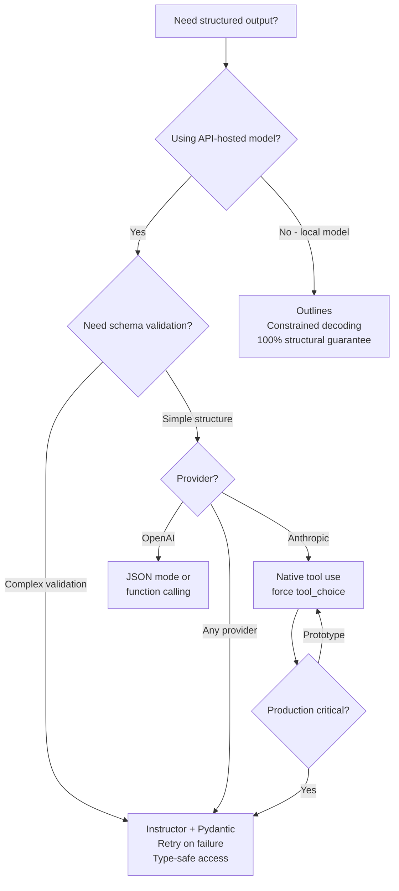

# Structured Generation

> **TL;DR**: For reliable structured output, use Anthropic's native tool use (function calling) over "respond in JSON" prompts. The Instructor library wraps any provider with Pydantic validation and retry logic. For local models, Outlines guarantees valid JSON via constrained decoding. The "JSON only" prompt instruction works 95% of the time but fails when you need 99.9% reliability.

**Prerequisites**: [Prompting Patterns](01-prompting-patterns.md)
**Related**: [Tool Use and Function Calling](../04-agents-and-orchestration/02-tool-use-and-function-calling.md), [Context Engineering](02-context-engineering.md)

---

## The Problem with "Respond in JSON"

Instruction-based structured output is unreliable in production:

```python
# This works most of the time...
prompt = "Extract the name, email, and company. Return JSON only: {\"name\": ..., \"email\": ..., \"company\": ...}"

# But sometimes you get:
# "Sure! Here's the JSON: {\"name\": ...}"  ← extra text breaks json.loads
# {"name": "John", "email": null}  ← missing field
# {"Name": "John", "Email": "john@..."}  ← wrong key capitalization
# {"name": "John", "email": "john@...", "note": "no company mentioned"}  ← extra fields
```

The failure rate is 1-5% per call. For a pipeline making 100 calls, that's 1-5 failures that crash `json.loads`. In production at scale, you need a real solution.

**The reliability spectrum:**

```
Reliability:
"Return JSON"       ████████░░  ~95%  — good for prototypes
+ json repair       █████████░  ~98%  — better, still has logic errors
Function calling    ██████████  ~99.9% — structural guarantee
Instructor          ██████████  ~99.9% + validation
Outlines (local)    ██████████  100% structural — grammar-constrained
```

---

## Approach 1: Function Calling (Native)

The most reliable approach with Anthropic: define a tool, force the model to use it. The model's output is guaranteed to match the schema because the API enforces it.

```python
from anthropic import Anthropic
import json

client = Anthropic()

def extract_contact_info(text: str) -> dict:
    """Extract structured contact info using tool use."""
    response = client.messages.create(
        model="claude-opus-4-6",
        max_tokens=1024,
        tools=[{
            "name": "extract_contact",
            "description": "Extract contact information from text",
            "input_schema": {
                "type": "object",
                "properties": {
                    "name": {"type": "string", "description": "Full name"},
                    "email": {"type": "string", "description": "Email address"},
                    "company": {"type": "string", "description": "Company name"},
                    "phone": {"type": ["string", "null"], "description": "Phone number if present"}
                },
                "required": ["name", "email", "company"]
            }
        }],
        tool_choice={"type": "tool", "name": "extract_contact"},
        messages=[{"role": "user", "content": f"Extract contact info from: {text}"}]
    )

    # The model was forced to call extract_contact
    tool_use = next(b for b in response.content if b.type == "tool_use")
    return tool_use.input  # Already a dict, guaranteed to match schema
```

**Advantages:**
- Structural guarantee from the API
- No JSON parsing needed (returns dict directly)
- Handles optional fields correctly (returns null for missing)
- Works with nested schemas, arrays, enums

**Disadvantages:**
- Only guaranteed to be structurally valid, not semantically correct
- Adds slight latency (the tool-calling overhead is minimal, <50ms)
- Requires the model to support function calling (all modern models do)

---

## Approach 2: Instructor (Recommended for Production)

[Instructor](https://python.useinstructor.com/) wraps function calling with Pydantic validation and automatic retry. Define your schema as a Pydantic model; Instructor handles the rest.

```python
import instructor
from anthropic import Anthropic
from pydantic import BaseModel, EmailStr, field_validator
from typing import Optional

# Define schema as Pydantic model
class ContactInfo(BaseModel):
    name: str
    email: str
    company: str
    phone: Optional[str] = None

    @field_validator("email")
    @classmethod
    def validate_email_format(cls, v: str) -> str:
        if "@" not in v:
            raise ValueError(f"Invalid email: {v}")
        return v.lower()

# Patch the Anthropic client with Instructor
client = instructor.from_anthropic(Anthropic())

def extract_with_instructor(text: str) -> ContactInfo:
    return client.messages.create(
        model="claude-opus-4-6",
        max_tokens=1024,
        response_model=ContactInfo,  # Instructor handles the tool schema
        messages=[{"role": "user", "content": f"Extract contact info from: {text}"}]
    )

contact = extract_with_instructor("John Smith from Acme Corp, reach him at john@acme.com")
print(contact.name)    # "John Smith" (typed attribute, not dict key)
print(contact.email)   # "john@acme.com"
print(contact.company) # "Acme Corp"
```

**Instructor's retry logic:**

```python
# Instructor automatically retries when validation fails
from instructor import patch
from tenacity import Retrying, stop_after_attempt

client = instructor.from_anthropic(Anthropic())

def extract_with_retry(text: str, max_retries: int = 3) -> ContactInfo:
    return client.messages.create(
        model="claude-opus-4-6",
        max_tokens=1024,
        response_model=ContactInfo,
        max_retries=max_retries,  # Retries with error feedback if validation fails
        messages=[{"role": "user", "content": f"Extract: {text}"}]
    )
```

When validation fails (e.g., email is "john-at-company.com"), Instructor sends the Pydantic error back to the model and asks it to fix the output. After 3 retries, it raises an exception.

**Complex nested schemas:**

```python
from typing import List
from pydantic import BaseModel

class LineItem(BaseModel):
    description: str
    quantity: int
    unit_price: float
    total: float

class Invoice(BaseModel):
    invoice_number: str
    vendor: str
    line_items: List[LineItem]
    subtotal: float
    tax_rate: float
    total: float

    @field_validator("total")
    @classmethod
    def validate_total(cls, v: float, values) -> float:
        expected = values.data.get("subtotal", 0) * (1 + values.data.get("tax_rate", 0))
        if abs(v - expected) > 0.01:
            raise ValueError(f"Total {v} doesn't match computed {expected:.2f}")
        return v

invoice = client.messages.create(
    model="claude-opus-4-6",
    max_tokens=2048,
    response_model=Invoice,
    messages=[{"role": "user", "content": f"Extract invoice data:\n{invoice_text}"}]
)
```

---

## Approach 3: JSON Mode (OpenAI / Simple Cases)

For OpenAI, JSON mode is a simpler alternative when you just need valid JSON without a specific schema:

```python
from openai import OpenAI

oai_client = OpenAI()

response = oai_client.chat.completions.create(
    model="gpt-4o",
    response_format={"type": "json_object"},  # Guarantees valid JSON
    messages=[{
        "role": "user",
        "content": "Extract name, email, company from: John Smith, john@acme.com, Acme Corp"
    }]
)
result = json.loads(response.choices[0].message.content)
```

JSON mode guarantees syntactically valid JSON but not schema compliance. You still need to validate the keys and types yourself.

---

## Approach 4: Outlines (Local Models)

[Outlines](https://github.com/outlines-dev/outlines) uses constrained decoding to guarantee the model can only generate tokens that match your schema. For local models, this is the most reliable approach.

```python
import outlines
from pydantic import BaseModel

class Character(BaseModel):
    name: str
    age: int
    occupation: str

# Load a local model
model = outlines.models.transformers("mistralai/Mistral-7B-Instruct-v0.2")

# Create a structured generator — output is GUARANTEED to match the schema
generator = outlines.generate.json(model, Character)

character = generator("Generate a fantasy character")
print(character.name)        # guaranteed to exist as a string
print(character.age)         # guaranteed to exist as an int
print(character.occupation)  # guaranteed to exist as a string
```

Outlines works by masking invalid tokens at each generation step. The model cannot generate a character that's missing the age field because the tokenizer only allows tokens that lead to valid JSON at that position.

**When Outlines makes sense:**
- Self-hosted models where you control the inference server
- When you need 100% structural guarantee (medical, legal, financial parsing)
- Batch processing where API costs matter

**It doesn't work with API-hosted models** — you need access to the logits to apply masks.

---

## Schema Design Patterns

Good schema design makes generation easier and output more reliable.

### Use Enums for Constrained Choices

```python
from enum import Enum
from pydantic import BaseModel

class Sentiment(str, Enum):
    positive = "positive"
    negative = "negative"
    neutral = "neutral"

class SentimentAnalysis(BaseModel):
    sentiment: Sentiment  # Model can only return valid enum values
    confidence: float     # 0.0 to 1.0
    reasoning: str        # Chain-of-thought before the classification

# With Instructor, enum validation happens automatically
result = client.messages.create(
    model="claude-opus-4-6",
    max_tokens=512,
    response_model=SentimentAnalysis,
    messages=[{"role": "user", "content": f"Analyze sentiment: {text}"}]
)
# result.sentiment is always Sentiment.positive/negative/neutral
```

### Include Reasoning Fields

Add a `reasoning` or `thinking` field before the structured output. This improves accuracy because the model reasons before committing to the structured answer.

```python
class ClassificationResult(BaseModel):
    thinking: str    # Free-form reasoning — filled first
    category: str    # Final answer — informed by thinking
    confidence: float

# The model fills "thinking" first, then uses that reasoning to determine category
# This is structured chain-of-thought
```

### Optional vs Required Fields

```python
from typing import Optional
from pydantic import BaseModel

class PersonInfo(BaseModel):
    # Required: model must provide these or fail
    name: str
    role: str

    # Optional: model returns null if not present in source
    email: Optional[str] = None
    phone: Optional[str] = None
    linkedin: Optional[str] = None
```

Mark fields as Optional when the source text might not contain them. Don't use `Optional` for fields that should always be there — use `required` to force extraction.

---

## Streaming Structured Output

For long structured responses, stream the JSON and parse incrementally:

```python
import json

def stream_structured_response(prompt: str, schema_hint: str) -> dict:
    """Stream JSON output and parse when complete."""
    buffer = []

    with client.messages.stream(
        model="claude-opus-4-6",
        max_tokens=2048,
        messages=[{
            "role": "user",
            "content": f"{prompt}\n\nRespond with JSON matching: {schema_hint}"
        }]
    ) as stream:
        for text in stream.text_stream:
            buffer.append(text)
            # Optionally: show progress to user while collecting
            print(".", end="", flush=True)

    full_response = "".join(buffer)

    # Extract JSON from potentially wrapped response
    start = full_response.find("{")
    end = full_response.rfind("}") + 1
    if start >= 0 and end > start:
        return json.loads(full_response[start:end])

    raise ValueError(f"No valid JSON found in response: {full_response[:200]}")
```

---

## JSON Repair for Legacy Systems

If you can't refactor to use function calling (legacy code, third-party integrations), `json-repair` library handles many common LLM JSON failures:

```python
from json_repair import repair_json

def robust_json_parse(model_output: str) -> dict:
    """Parse JSON with automatic repair for common LLM failures."""
    # Strip markdown code blocks
    cleaned = model_output.strip()
    if cleaned.startswith("```json"):
        cleaned = cleaned[7:]
    if cleaned.startswith("```"):
        cleaned = cleaned[3:]
    if cleaned.endswith("```"):
        cleaned = cleaned[:-3]
    cleaned = cleaned.strip()

    # Try direct parse first
    try:
        return json.loads(cleaned)
    except json.JSONDecodeError:
        pass

    # Try repair
    repaired = repair_json(cleaned, return_objects=True)
    if repaired:
        return repaired

    raise ValueError(f"Could not parse JSON: {model_output[:200]}")
```

`json-repair` handles: trailing commas, missing quotes, single quotes, truncated JSON, extra text before/after. It handles ~80% of real-world LLM JSON failures.

---

## Decision Guide



---

## Gotchas

**Function calling doesn't validate semantic correctness.** The API guarantees the response matches your JSON schema structure. It does not guarantee the extracted name is actually a name, or the email is real. Use Pydantic validators for semantic validation.

**Nested schemas increase failure rate.** A flat schema with 5 fields is more reliable than a nested schema with 3 levels of nesting. If you have complex nesting, test failure rates carefully and use Instructor's retry logic.

**Instructor's retry adds latency.** Each retry is a full LLM call. At 3 retries, you could triple your latency for edge cases. Monitor retry rates in production; if they're above 1%, the schema is probably too complex or the prompt isn't clear.

**Streaming and structured output conflict.** You can't parse JSON while streaming because you don't have the complete string yet. For streaming responses, either accept delay (collect full response, then parse) or use incremental JSON parsers like `ijson`.

**The reasoning field can be gamed.** If you add a `reasoning` field to improve accuracy, models sometimes write the desired final answer in the reasoning field, then copy it to the answer field. This is fine for quality but means the reasoning isn't always genuine exploration.

---

> **Key Takeaways:**
> 1. "Return JSON" prompts have 1-5% failure rates. For production reliability, use function calling or Instructor.
> 2. Instructor + Pydantic is the pragmatic choice for API-hosted models: it wraps any provider, validates output, and retries automatically.
> 3. Add a `reasoning` or `thinking` field to structured schemas to improve accuracy via implicit chain-of-thought before the structured answer.
>
> *"Structured output is not about forcing the model to format nicely. It's about making downstream code not crash."*

---

## Interview Questions

**Q: Design a pipeline that extracts structured data from 10,000 customer support emails daily. How do you ensure reliability and handle failures?**

The core problem is extraction reliability at scale. At 10K emails/day, a 1% failure rate is 100 failures/day — too many to manually fix.

I'd build around Instructor + Pydantic. Define the extraction schema as a Pydantic model with validators: email format, enum values for categories, required fields. Instructor wraps the LLM call and automatically retries with error feedback when validation fails.

For the schema, I'd use a flat structure where possible (flat schemas fail less often than deeply nested ones), include a `confidence` field (the model estimates its own extraction confidence), and use enums for constrained fields like `category` and `priority`.

Error handling strategy: Instructor retries up to 3 times. After 3 failures, the email goes to a dead-letter queue for human review. I'd track retry rates by email type — if specific email patterns have high retry rates, the schema or prompt needs refinement.

Monitoring: track extraction success rate, average retries per extraction, fields most often causing validation failures. A dashboard showing these metrics lets me proactively fix the prompt before failures spike.

---

**Quick-fire Questions**

| Question | Answer |
|---|---|
| What is Instructor? | A Python library that wraps LLM providers with Pydantic validation and automatic retry for structured output |
| What does function calling guarantee? | Structural schema compliance (correct keys, types); does not guarantee semantic correctness |
| What is Outlines? | A library that uses constrained decoding to guarantee valid structured output from local models |
| What is JSON mode? | An OpenAI API parameter that guarantees syntactically valid JSON (no schema validation) |
| What is the failure rate of "return JSON" prompts? | 1-5% per call; acceptable for prototypes, unacceptable for production pipelines |
| Why add a reasoning field to structured schemas? | Improves accuracy by giving the model space to reason before committing to the structured answer |
