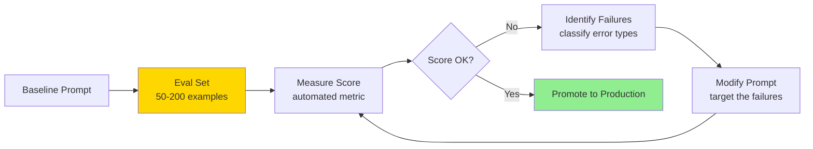

# Prompt Optimization

> **TL;DR**: Prompt optimization is the systematic process of improving prompt quality using data. DSPy automates prompt optimization via algorithms that replace hand-written instructions with learned examples. Meta-prompting uses the model itself to critique and rewrite prompts. But the prerequisite for any optimization is an evaluation set. You can't optimize what you can't measure.

**Prerequisites**: [Prompting Patterns](01-prompting-patterns.md), [Eval Fundamentals](../05-evaluation/01-eval-fundamentals.md)
**Related**: [DSPy Framework](../04-agents-and-orchestration/06-dspy-framework.md), [Context Engineering](02-context-engineering.md)

---

## The Optimization Loop

Manual prompt engineering is guesswork at scale. The optimization loop is how you make it systematic:



The eval set is the foundation. Without it, you're optimizing blind. With it, you know exactly whether a change helped or hurt and by how much.

**What "optimizing" means in practice:**
- Adding examples that cover failure cases
- Rewriting instructions to be more specific
- Adding constraints ("do not include...")
- Changing output format
- Adding chain-of-thought for complex tasks

---

## Building the Eval Set First

Before optimizing anything, build a minimal eval set:

```python
# Minimum viable eval set structure
eval_examples = [
    {
        "input": "Classify this ticket: 'My subscription was charged twice'",
        "expected_output": "billing",
        "metadata": {"difficulty": "easy", "category": "billing"}
    },
    {
        "input": "Classify this ticket: 'I can't access my account'",
        "expected_output": "account",
        "metadata": {"difficulty": "easy", "category": "account"}
    },
    {
        "input": "Classify this ticket: 'The export button does nothing after the recent update'",
        "expected_output": "technical",
        "metadata": {"difficulty": "hard", "could_confuse": "account"}
    },
    # ... add 50-200 more
]

def evaluate_prompt(prompt_template: str, examples: list[dict]) -> float:
    """Evaluate a prompt against all examples. Returns accuracy."""
    correct = 0
    for ex in examples:
        response = client.messages.create(
            model="claude-opus-4-6",
            max_tokens=50,
            messages=[{
                "role": "user",
                "content": prompt_template.format(input=ex["input"])
            }]
        )
        prediction = response.content[0].text.strip().lower()
        if prediction == ex["expected_output"].lower():
            correct += 1

    return correct / len(examples)

# Baseline
baseline_score = evaluate_prompt(baseline_prompt, eval_examples)
print(f"Baseline: {baseline_score:.2%}")
```

**Minimum eval set sizes:**
- Classification (4 classes): 50 examples minimum, 10+ per class
- Extraction: 30-50 examples with known ground truth
- Generation: 20-30 examples with LLM-as-judge scoring
- Complex reasoning: 30-50 manually verified examples

---

## Manual Optimization Techniques

### Error Analysis

The most valuable optimization comes from understanding why you're failing, not random iteration.

```python
def analyze_failures(prompt: str, examples: list[dict]) -> dict:
    """Identify patterns in prompt failures."""
    failures = []
    for ex in examples:
        response = client.messages.create(
            model="claude-opus-4-6",
            max_tokens=50,
            messages=[{"role": "user", "content": prompt.format(input=ex["input"])}]
        )
        prediction = response.content[0].text.strip().lower()
        if prediction != ex["expected_output"].lower():
            failures.append({
                "input": ex["input"],
                "expected": ex["expected_output"],
                "got": prediction,
                "metadata": ex.get("metadata", {})
            })

    # Group failures by type
    from collections import Counter
    failure_categories = Counter(f["expected"] for f in failures)
    print("Failures by expected category:", failure_categories)
    print("\nFirst 5 failures:")
    for f in failures[:5]:
        print(f"  Input: {f['input'][:80]}")
        print(f"  Expected: {f['expected']}, Got: {f['got']}")

    return {"failures": failures, "failure_categories": failure_categories}
```

Common failure patterns:
- **Systematic bias:** Always misclassifies one category → need examples of that category
- **Ambiguous cases:** Fails on inputs that could be multiple categories → need explicit disambiguation rules
- **Format failures:** Returns "Billing" instead of "billing" → add format constraint
- **Overthinking:** Adds explanation when you want one word → add "Return only the category name, nothing else"

### The "One Bug at a Time" Rule

Don't fix multiple failure patterns in one prompt iteration. You can't tell which change helped.

```python
# Iteration 1: Add format constraint
prompt_v2 = """Classify support tickets.
Categories: billing, technical, account, general
Return only the category name, nothing else.

Ticket: {input}
Category:"""

score_v2 = evaluate_prompt(prompt_v2, eval_examples)
print(f"v2 (format fix): {score_v2:.2%}")

# Iteration 2: If v2 improved, add disambiguation rule
prompt_v3 = """Classify support tickets.
Categories: billing, technical, account, general
Note: Login issues are "account", not "technical", unless describing a software bug.
Return only the category name, nothing else.

Ticket: {input}
Category:"""

score_v3 = evaluate_prompt(prompt_v3, eval_examples)
print(f"v3 (disambiguation): {score_v3:.2%}")
```

---

## DSPy: Automated Prompt Optimization

[DSPy](https://dspy.ai/) treats prompts as programs with learnable components. Instead of hand-writing instructions, you define the input/output signature and let an optimizer find the best prompt.

The key insight: DSPy optimizers compile your program by running it against your eval set and automatically selecting the best few-shot examples or prompt instructions.

```python
import dspy

# Configure the LLM
lm = dspy.LM("anthropic/claude-opus-4-6")
dspy.configure(lm=lm)

# Define your task as a Signature
class ClassifyTicket(dspy.Signature):
    """Classify a customer support ticket into one of four categories."""
    ticket: str = dspy.InputField()
    category: str = dspy.OutputField(desc="one of: billing, technical, account, general")

# Create a simple Predict module
classifier = dspy.Predict(ClassifyTicket)

# Test it
result = classifier(ticket="My subscription was charged twice")
print(result.category)  # "billing"
```

### Optimizing with BootstrapFewShot

```python
from dspy.teleprompt import BootstrapFewShot

# Define your eval metric
def classification_metric(example, prediction, trace=None) -> bool:
    return example.category.lower() == prediction.category.lower()

# Build training set (20-50 examples)
trainset = [
    dspy.Example(
        ticket="My subscription was charged twice",
        category="billing"
    ).with_inputs("ticket"),
    dspy.Example(
        ticket="App crashes when uploading files",
        category="technical"
    ).with_inputs("ticket"),
    # ... more examples
]

# Run the optimizer
optimizer = BootstrapFewShot(
    metric=classification_metric,
    max_bootstrapped_demos=4,   # How many examples to include
    max_labeled_demos=8,
)

optimized_classifier = optimizer.compile(
    student=dspy.Predict(ClassifyTicket),
    trainset=trainset
)

# Evaluate the optimized version
from dspy.evaluate import Evaluate

devset = [...]  # held-out evaluation set
evaluate = Evaluate(devset=devset, num_threads=4, metric=classification_metric)
score = evaluate(optimized_classifier)
print(f"Optimized score: {score:.2%}")
```

DSPy automatically found the best 4 examples from your training set to include as few-shot examples in the compiled prompt.

### MIPROv2: Better Optimizer for Complex Tasks

For more complex tasks where few-shot alone isn't enough, MIPROv2 also optimizes the instruction text:

```python
from dspy.teleprompt import MIPROv2

optimizer = MIPROv2(
    metric=classification_metric,
    auto="medium",  # light/medium/heavy — controls optimization budget
)

optimized = optimizer.compile(
    student=dspy.Predict(ClassifyTicket),
    trainset=trainset,
    valset=devset[:20],  # validation set for optimization
)
```

MIPROv2 generates candidate instructions, tests them against your data, and selects the best combination of instruction + examples.

---

## Meta-Prompting

Use the model itself to critique and improve your prompts. Slower than DSPy but works well for complex tasks where DSPy's examples-based optimization isn't enough.

```python
def meta_optimize_prompt(
    current_prompt: str,
    failures: list[dict],
    task_description: str
) -> str:
    """Use Claude to rewrite a prompt based on failures."""
    failure_examples = "\n".join(
        f"Input: {f['input']}\nExpected: {f['expected']}\nGot: {f['got']}"
        for f in failures[:10]
    )

    response = client.messages.create(
        model="claude-opus-4-6",
        max_tokens=1024,
        messages=[{
            "role": "user",
            "content": f"""You are an expert prompt engineer. Here is a prompt that is failing on some examples.

Task description: {task_description}

Current prompt:
<prompt>
{current_prompt}
</prompt>

Failures (input → expected → what the model returned):
<failures>
{failure_examples}
</failures>

Analyze why the prompt is failing on these cases. Then write an improved version of the prompt that would handle these cases correctly.

Output format:
<analysis>Your analysis of why the failures occur</analysis>
<improved_prompt>The improved prompt</improved_prompt>"""
        }]
    )

    text = response.content[0].text
    start = text.find("<improved_prompt>") + len("<improved_prompt>")
    end = text.find("</improved_prompt>")
    return text[start:end].strip()
```

The meta-optimization loop:

```python
def iterative_meta_optimize(
    initial_prompt: str,
    examples: list[dict],
    max_iterations: int = 5
) -> tuple[str, list[float]]:
    """Run meta-optimization loop, return best prompt and score history."""
    current_prompt = initial_prompt
    scores = []

    for iteration in range(max_iterations):
        score = evaluate_prompt(current_prompt, examples)
        scores.append(score)
        print(f"Iteration {iteration}: {score:.2%}")

        if score >= 0.95:  # Good enough
            break

        failures = analyze_failures(current_prompt, examples)["failures"]
        if not failures:
            break

        current_prompt = meta_optimize_prompt(current_prompt, failures, task_description)

    return current_prompt, scores
```

---

## Prompt Versioning

Treat prompts like code: version them, track changes, measure impact.

```python
import hashlib
from datetime import datetime

class PromptVersion:
    def __init__(self, template: str, description: str):
        self.template = template
        self.description = description
        self.hash = hashlib.md5(template.encode()).hexdigest()[:8]
        self.created_at = datetime.now().isoformat()
        self.scores: dict[str, float] = {}

    def evaluate(self, eval_set: list[dict], eval_name: str) -> float:
        score = evaluate_prompt(self.template, eval_set)
        self.scores[eval_name] = score
        return score

# Usage
versions = {
    "v1": PromptVersion(
        template=baseline_prompt,
        description="Initial baseline"
    ),
    "v2": PromptVersion(
        template=improved_prompt,
        description="Added format constraint and disambiguation rule"
    ),
}

for name, version in versions.items():
    score = version.evaluate(eval_examples, "classification_v1")
    print(f"{name} ({version.description}): {score:.2%}")
```

In production, store prompt versions in a database with their eval scores. Before promoting a new prompt to production, it must beat the current production prompt on the eval set.

---

## A/B Testing Prompts in Production

Even with a strong eval set, production behavior can differ. A/B test before full rollout.

```python
import random

class PromptABTest:
    def __init__(self, control_prompt: str, variant_prompt: str, traffic_split: float = 0.1):
        self.control = control_prompt
        self.variant = variant_prompt
        self.split = traffic_split  # 10% to variant
        self.metrics = {"control": [], "variant": []}

    def get_prompt(self) -> tuple[str, str]:
        """Returns (prompt, variant_name)."""
        if random.random() < self.split:
            return self.variant, "variant"
        return self.control, "control"

    def record_outcome(self, variant_name: str, quality_score: float):
        self.metrics[variant_name].append(quality_score)

    def get_results(self) -> dict:
        control_avg = sum(self.metrics["control"]) / len(self.metrics["control"])
        variant_avg = sum(self.metrics["variant"]) / len(self.metrics["variant"])
        return {
            "control_score": control_avg,
            "variant_score": variant_avg,
            "improvement": (variant_avg - control_avg) / control_avg,
            "control_n": len(self.metrics["control"]),
            "variant_n": len(self.metrics["variant"]),
        }
```

Run the test until you have statistical significance (usually 500-1000 samples per variant for 5% effect detection).

---

## Optimization Budget Guide

| Task Complexity | Recommended Approach | Time Investment |
|---|---|---|
| Simple classification | Error analysis + manual iteration | 1-2 hours |
| Multi-class extraction | Few-shot optimization (manual or DSPy) | 2-4 hours |
| Complex reasoning | DSPy MIPROv2 + meta-prompting | 4-8 hours |
| Production at scale | A/B test + automated eval in CI | Ongoing |

The optimization ROI diminishes quickly. Spending 1 hour to go from 80% to 90% accuracy is almost always worth it. Spending 20 hours to go from 95% to 97% rarely is — unless the cost of errors is very high.

---

## Gotchas

**Overfitting the eval set.** If you manually optimize against the same examples repeatedly, you'll eventually craft a prompt that memorizes those examples rather than generalizing. Use a held-out test set that you never optimize against.

**DSPy's optimized prompts aren't readable.** DSPy-compiled prompts are optimized for performance, not human understanding. The few-shot examples it selects may seem random, and the instructions may be oddly specific. That's fine — they work.

**Meta-prompting can make things worse.** If your failure examples are noisy (wrong labels in the eval set), the meta-optimizer will optimize toward the wrong behavior. Garbage in, garbage out.

**Model version changes break prompt performance.** A prompt optimized for claude-opus-4-5 may perform differently on claude-opus-4-6. Prompt optimization is model-version-specific. Rerun evals when you upgrade models.

**The optimization loop reveals eval set problems.** When a prompt that "obviously" should work fails, it's often a labeling error in the eval set. Prompt optimization is a good way to audit your eval set quality.

---

> **Key Takeaways:**
> 1. The prerequisite for optimization is an eval set. Build 50-200 labeled examples first; you can't improve what you can't measure.
> 2. Start with error analysis: identify the specific failure patterns before changing anything. Fix one pattern at a time and measure each change.
> 3. DSPy automates few-shot optimization: it finds the best examples from your training set to include. Use it when manual example selection is tedious or when MIPROv2's instruction optimization is needed.
>
> *"A prompt without an eval set is just a guess. A prompt with an eval set is an engineering decision."*

---

## Interview Questions

**Q: Your prompt engineering team is spending 2 days per feature updating prompts manually. How do you scale this?**

The core problem is that manual prompt iteration is slow and unmeasured. The fix is building the infrastructure that makes iteration fast and data-driven.

First: standardize eval sets per task. Every prompt needs a corresponding eval set before it can be modified. This forces thinking about what "good" means and makes it measurable. Without this, every prompt change is a guess.

Second: implement automated evaluation in CI. When a prompt changes, the eval runs automatically. A prompt change that drops accuracy by >2% fails the check and doesn't ship. This prevents regressions without human review.

Third: introduce DSPy for tasks that need frequent example updates. Instead of manually curating few-shot examples, DSPy's BootstrapFewShot selects them from a training set automatically. Adding a new training example takes minutes; hand-crafting a new few-shot example takes hours.

The result: the team can make prompt changes confidently because the eval set catches regressions, and DSPy handles the tedious example selection. What took 2 days now takes 2 hours.

---

**Quick-fire Questions**

| Question | Answer |
|---|---|
| What is the first step in prompt optimization? | Building an eval set with 50-200 labeled examples; you can't optimize without measuring |
| What does DSPy BootstrapFewShot do? | Automatically selects the best few-shot examples from a training set by testing combinations against your eval metric |
| What is meta-prompting? | Using an LLM to analyze failures and rewrite the prompt; self-improvement loop |
| What is MIPROv2? | A DSPy optimizer that also optimizes the instruction text, not just examples |
| Why treat prompts like code? | Version control lets you track what changed, eval scores show impact, rollback is easy if a change degrades quality |
| What is the optimization ROI rule? | 80%→90% is usually worth the time; 95%→97% is rarely worth it unless error cost is very high |
