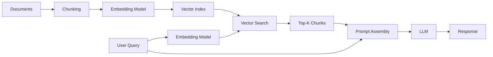
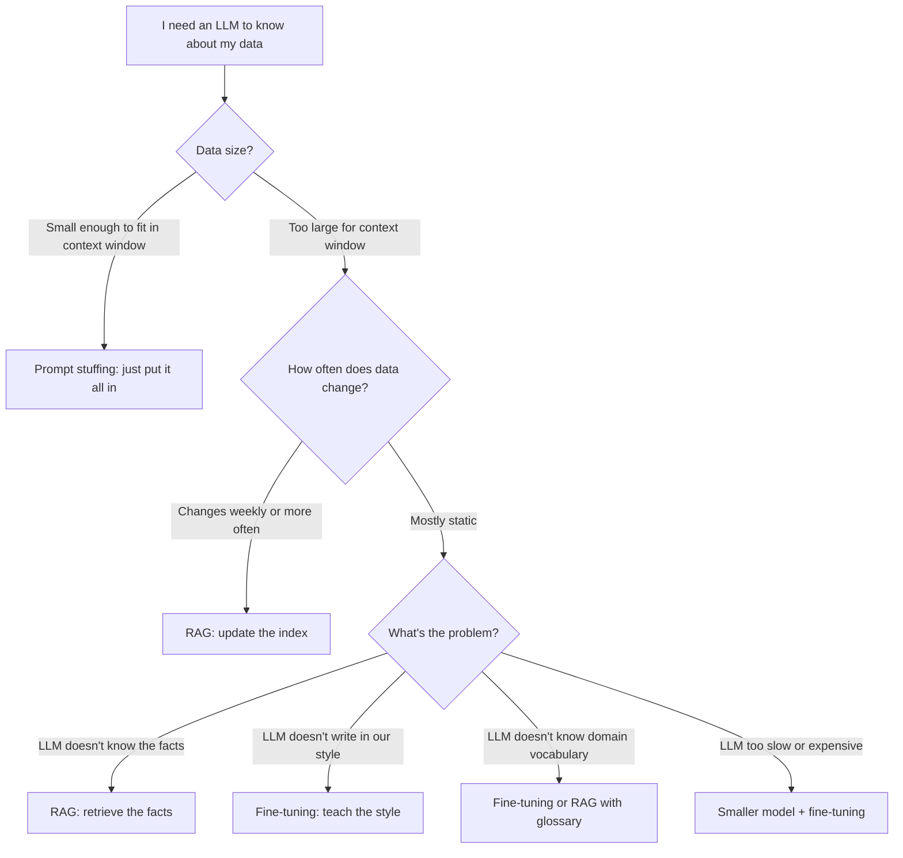

# RAG Fundamentals

> **TL;DR**: RAG (Retrieval-Augmented Generation) solves the "LLM doesn't know your data" problem by retrieving relevant documents at query time and injecting them into the prompt. Use it before fine-tuning. It's faster to build, easier to update, and works better than people expect. The hard part isn't the LLM call, it's the retrieval pipeline.

**Prerequisites**: [LLM Foundations - Training Pipeline](../01-llm-foundations/05-training-pipeline.md), [Embedding Models](02-embedding-models.md)
**Related**: [Chunking Strategies](05-chunking-strategies.md), [Advanced RAG Patterns](09-advanced-rag-patterns.md), [RAG Evaluation](11-rag-evaluation.md), [Vector Databases](04-vector-databases.md)

---

## The Intuition: RAG Is a Database Problem

Here's how I explain RAG to a PM: "We have a search engine that finds relevant documents, and then we hand those documents to the LLM and say 'answer the question using only these.'"

That's it. The LLM is not being asked to remember facts, it's being asked to read and synthesize. Like an open-book exam instead of a closed-book one.

The engineering insight is that this maps directly to what you already know about information retrieval. If you've built a search feature with Elasticsearch, you already understand 80% of the retrieval side. The new part is using embedding similarity instead of keyword matching, and injecting the results into a prompt.

Here's the moment RAG clicks: an LLM trained up to January 2024 has no knowledge of anything after that. But if your RAG system retrieves a document from March 2024, the LLM can answer questions about it accurately. You've effectively extended the LLM's knowledge in real time, without retraining it. That's powerful.

---

## When to Use RAG

The decision isn't always obvious. Here's the framework I use:

| Situation | Use RAG? | Reasoning |
|---|---|---|
| Your data changes frequently | Yes | Retraining is expensive; updating an index is cheap |
| You need citations/sourcing | Yes | RAG can surface the source document |
| You have a large, specific knowledge base | Yes | Fine-tuning doesn't scale to millions of docs |
| The knowledge can be formulated as a lookup | Yes | "What does our policy say about X?" |
| You need different behavior/style | No | Fine-tuning handles tone and format better |
| Knowledge is small enough to fit in context | Maybe | Just stuff it in; no retrieval needed |
| Latency is under 200ms | Probably not | RAG adds retrieval latency |
| Domain vocabulary is the problem | No | Fine-tuning handles vocabulary better |

The shortcut I give everyone: **start with RAG**. Fine-tune only if RAG isn't meeting quality requirements after you've optimized the retrieval pipeline. Most of the time, bad RAG quality is a chunking or retrieval problem, not an LLM problem.

---

## The Naive RAG Pipeline

Before building anything sophisticated, understand the naive pipeline. Most production systems are an optimized version of this.



**Offline (indexing time):**
1. Split documents into chunks
2. Embed each chunk using an embedding model
3. Store vectors in a vector database

**Online (query time):**
1. Embed the user's query
2. Search for the top-K most similar chunks by cosine similarity
3. Insert those chunks into the prompt
4. Call the LLM with the assembled prompt
5. Return the response

The entire pipeline in code:

```python
from anthropic import Anthropic
import chromadb
from sentence_transformers import SentenceTransformer

client = Anthropic()
embed_model = SentenceTransformer("all-MiniLM-L6-v2")
db = chromadb.Client()
collection = db.create_collection("docs")

def index_documents(chunks: list[str]):
    embeddings = embed_model.encode(chunks).tolist()
    collection.add(
        documents=chunks,
        embeddings=embeddings,
        ids=[str(i) for i in range(len(chunks))]
    )

def rag_query(question: str, top_k: int = 3) -> str:
    query_embedding = embed_model.encode([question]).tolist()
    results = collection.query(query_embeddings=query_embedding, n_results=top_k)
    context = "\n\n".join(results["documents"][0])

    response = client.messages.create(
        model="claude-opus-4-6",
        max_tokens=1024,
        messages=[{
            "role": "user",
            "content": f"Answer based on this context:\n\n{context}\n\nQuestion: {question}"
        }]
    )
    return response.content[0].text
```

This works. It's not production-ready, but it demonstrates the core loop. A team I worked with shipped a customer-facing product on essentially this architecture and it handled 10K queries/day fine for 6 months before they needed to optimize.

---

## RAG vs. The Alternatives

This is the question you'll get in every interview. Have a clear answer.



| Approach | Best For | Cost | Time to Ship | Maintenance |
|---|---|---|---|---|
| Prompt stuffing | Small, static knowledge (<50 pages) | Low | Hours | None |
| RAG | Large or dynamic knowledge bases | Medium | Days | Low (reindex on update) |
| Fine-tuning | Style, tone, domain vocab, task-specific behavior | High | Weeks | High (retrain on data changes) |
| Full training | Novel capabilities, proprietary architecture | Very high | Months | Very high |
| **When to avoid** | Don't stuff if data > ~50K tokens | Don't RAG if knowledge is implicit/stylistic | Don't fine-tune if data changes often | Never do this unless you're a lab |

The insight that changes how people think about this: RAG teaches the LLM "what to know," fine-tuning teaches it "how to behave." Most product problems are about knowledge, not behavior.

---

## The Retrieval Pipeline In Depth

### Embedding: Turning Text into Vectors

An embedding model converts text into a dense vector (typically 384-1536 dimensions). Similar texts produce vectors that are close together in vector space. The distance between vectors (usually cosine similarity) is how you find relevant documents.

```python
from sentence_transformers import SentenceTransformer

model = SentenceTransformer("all-MiniLM-L6-v2")  # 384 dimensions, fast
chunks = ["RAG improves LLM accuracy", "Chunking affects retrieval quality"]
embeddings = model.encode(chunks)
print(embeddings.shape)  # (2, 384)
```

The embedding model you pick matters more than most teams realize. [MTEB](https://huggingface.co/spaces/mteb/leaderboard) is the benchmark to reference. `text-embedding-3-large` from OpenAI and `voyage-3` from Voyage AI are strong choices as of early 2025. For open-source, `bge-large-en-v1.5` and `e5-large-v2` are competitive. See [02-embedding-models.md](02-embedding-models.md) for the full comparison.

The critical rule: **use the same embedding model for both indexing and querying**. This sounds obvious but I've seen teams accidentally swap models after an upgrade and wonder why retrieval quality collapsed overnight.

### Vector Search

Given a query embedding, vector search finds the K nearest embeddings in the index. The two main approaches:

**Exact search (flat index):** Compare the query against every vector. O(n) but 100% accurate. Fine for under 100K documents.

**Approximate Nearest Neighbor (ANN):** HNSW, IVF, etc. Trade a small accuracy loss for massive speed gains. Necessary at scale. See [03-vector-indexing.md](03-vector-indexing.md).

### Prompt Assembly

How you structure the prompt with retrieved context matters. I've seen retrieval quality that's objectively good, but response quality that's bad because the prompt assembly was wrong.

```python
def assemble_prompt(query: str, chunks: list[str], max_context_tokens: int = 4000) -> str:
    context_parts = []
    total = 0

    for i, chunk in enumerate(chunks):
        chunk_tokens = len(chunk.split()) * 1.3  # rough estimate
        if total + chunk_tokens > max_context_tokens:
            break
        context_parts.append(f"[Source {i+1}]\n{chunk}")
        total += chunk_tokens

    context = "\n\n---\n\n".join(context_parts)
    return f"""Answer the following question using only the provided context.
If the context doesn't contain the answer, say so.

Context:
{context}

Question: {query}

Answer:"""
```

The "say so if you don't know" instruction is non-negotiable. Without it, LLMs will hallucinate confidently when the retrieved context doesn't contain the answer.

---

## Concrete Numbers

These are production numbers as of early 2025. They'll shift as models and infrastructure evolve.

| Component | Typical Latency | Notes |
|---|---|---|
| Embedding (API, single query) | 50-150ms | text-embedding-3-small, OpenAI |
| Embedding (local, single query) | 5-30ms | all-MiniLM-L6-v2 on CPU |
| Vector search (100K docs, HNSW) | 1-10ms | Pinecone, Weaviate, Chroma |
| Vector search (10M docs, HNSW) | 10-50ms | Managed services |
| LLM generation (Claude Sonnet 4.6) | 500ms-3s | Depends on output length |
| Full RAG pipeline (p50) | 800ms-2s | Embedding + search + LLM |
| Full RAG pipeline (p99) | 3-8s | Especially with long outputs |

**Cost per 1000 queries (approximate, as of March 2025):**
- Embedding (text-embedding-3-small): $0.01
- Vector search (Pinecone Starter): $0.08
- LLM (Claude Sonnet 4.6, 2K tokens in/out): $0.90
- Total: ~$1/1000 queries at this spec

The LLM call dominates cost. Caching is the highest-leverage optimization. See [../06-production-and-ops/03-caching-strategies.md](../06-production-and-ops/03-caching-strategies.md).

---

## Limitations of Naive RAG

Understanding where naive RAG breaks tells you when to reach for advanced patterns.

**It fails on multi-hop questions.** "What is the capital of the country where the author of [book] was born?" requires chaining multiple retrievals. Naive RAG retrieves based on query similarity, not reasoning chains. GraphRAG and agentic RAG solve this.

**It fails when the query and the answer use different vocabulary.** If a user asks about "stock price" and your documents say "equity value," cosine similarity may not surface the right chunks. Hybrid search (dense + BM25) and HyDE partially solve this.

**It fails on very long documents without good chunking.** A 200-page PDF chunked naively loses structure. See [05-chunking-strategies.md](05-chunking-strategies.md).

**It fails when retrieved context is noisy.** Top-K retrieval returns K results regardless of relevance. If only 2 of the 5 retrieved chunks are relevant, the irrelevant ones add noise. Reranking fixes this.

**It fails when the user's question is ambiguous.** Query transformation (HyDE, multi-query expansion) helps. See [08-query-transformation.md](08-query-transformation.md).

For systematic solutions to these failures, see [09-advanced-rag-patterns.md](09-advanced-rag-patterns.md).

---

## Gotchas and Real-World Lessons

**Retrieval quality, not generation quality, is usually the bottleneck.** When your RAG system gives bad answers, engineers instinctively blame the LLM. 80% of the time, the retrieved context is wrong or incomplete. Before tweaking your prompt, add logging to see what's actually being retrieved. The [RAGAS](https://docs.ragas.io/) framework can help you measure retrieval separately from generation.

**The "lost in the middle" problem is real.** LLMs are better at using information at the beginning and end of a long context than in the middle. If you're stuffing 20 chunks into a prompt, the middle chunks contribute less to the answer. Either use fewer chunks or reorder them to put the most relevant at the top and bottom.

**Stale index = silent failures.** If your underlying data updates but your index doesn't, the system returns wrong information confidently. Build index update pipelines from day one. Webhook-triggered reindexing works well for document stores.

**The embedding model asymmetry problem.** Some embedding models are trained with asymmetric objectives: short queries are embedded differently from long passages. If you use a symmetric model for an asymmetric retrieval task, you'll get mediocre results. Models like `bge-large` have specific query/passage encoding modes. Use them correctly.

**Top-K is not enough for precision.** Retrieving K=10 chunks and stuffing them all into the prompt gives you recall but tanks precision. Add a reranker (Cohere Rerank, cross-encoder) to filter down to the truly relevant chunks. See [07-reranking.md](07-reranking.md).

**Chunk boundaries break context.** A chunk that starts mid-sentence or mid-table is confusing to the LLM. Invest time in chunk quality before investing time in retrieval algorithm tuning. Most RAG failures I've debugged traced back to poor chunking.

**Metadata filtering is underutilized.** Vector similarity search finds semantically similar content, but sometimes you need to also filter by date, author, document type, or permission level. All major vector databases support metadata filtering. Use it to scope retrieval to the right document set before running similarity search.

**Token budget math at the prompt level.** Claude Sonnet 4.6 has a 200K token context window but that doesn't mean you should use 150K tokens for context. LLM quality degrades on very long contexts, latency increases linearly, and cost increases with input tokens. Keep your context under 8K tokens for most use cases unless you have a specific reason to go longer.

---

## "Explain RAG to a PM"

I've given this explanation dozens of times. Here's the version that lands:

"Imagine our LLM is a brilliant consultant who reads everything but hasn't read our internal documents. RAG is how we give them a research assistant. When a user asks a question, the research assistant quickly scans our document library, pulls out the 3-5 most relevant pages, and hands them to the consultant before the meeting. The consultant then answers the question based on those pages. They're not memorizing our documents, they're reading them on demand. This means we can update the document library any time, and the consultant's answers stay current."

The follow-up question is always: "Why not just make the consultant read all our documents?" The answer: "A 200-page policy manual fits in context. A 500,000-document knowledge base doesn't. RAG is how we scale."

---

> **Key Takeaways:**
> 1. RAG solves the knowledge-cutoff and private-data problems by retrieving relevant documents at query time, without retraining the model.
> 2. Start with RAG before fine-tuning. Bad RAG quality is almost always a retrieval problem (chunking, embedding, ranking), not an LLM problem.
> 3. The full latency is embedding + search + LLM. At p50, expect 1-2 seconds. Caching the most expensive steps cuts this dramatically.
>
> *"RAG is a database problem wrapped in an AI problem. Solve the retrieval first."*

---

## Interview Questions

**Q: Design a RAG system for a large enterprise knowledge base with 500,000 documents. Walk me through your architecture.**

The first thing I'd do is understand the query patterns. Are users asking factual questions, doing research across multiple documents, or looking for specific procedures? That shapes everything from chunking strategy to retrieval algorithm.

For the indexing pipeline, I'd start with document ingestion: parse PDFs, HTML, and Office documents (I'd use Unstructured.io for the messy extraction that most tutorials gloss over). Then chunk at ~512 tokens with overlap, using sentence boundaries rather than hard character limits. Embed using `text-embedding-3-large` for quality, or `text-embedding-3-small` if cost is a constraint. Store in a vector database, Pinecone or Weaviate depending on whether they need managed infra or self-hosted. Each chunk gets metadata: document ID, section, date, author, access permissions.

For the retrieval pipeline, I'd run hybrid search: dense embedding search plus BM25 keyword search, combined with RRF (Reciprocal Rank Fusion). Hybrid consistently outperforms pure semantic search on enterprise content, which tends to have exact-match terms like product names, error codes, and policy numbers. Then rerank the top-20 results down to the top-5 using Cohere Rerank or a cross-encoder.

For generation, I'd use a prompt that instructs the LLM to cite sources and say "I don't know" when the context is insufficient. I'd also add metadata-based access control at retrieval time so users can only retrieve documents they're authorized to see.

*Follow-up: "How would you handle documents that update frequently?"*

I'd build an event-driven reindexing pipeline. When a document is updated in the source system (SharePoint, Confluence, wherever), a webhook triggers a Lambda that re-chunks and re-embeds the changed document, updates the vector index, and invalidates any cache entries for that document. The key is making this automatic. If re-indexing requires human action, it will fall behind and users will get stale answers, which erodes trust faster than any other failure mode.

---

**Q: Your RAG system is returning inaccurate answers. How do you debug it?**

I'd start by separating the retrieval problem from the generation problem. These fail in different ways and you need to diagnose them independently.

First I'd look at retrieval quality. For a sample of queries where the system gave wrong answers, I'd log exactly what chunks were retrieved. Is the right information in the top-5 results? If not, that's a retrieval problem: the embedding model isn't capturing the right similarity, or the chunks are too coarse, or you're missing hybrid search for keyword-heavy queries. The [RAGAS](https://docs.ragas.io/) framework has a `context_precision` and `context_recall` metric that makes this concrete.

If retrieval quality is fine (the right chunks are there) but the answer is still wrong, that's a generation problem. Is the LLM ignoring parts of the context? Is the prompt structured poorly? Is there a "lost in the middle" issue where the relevant chunk is buried in the middle of a long context window? I'd try reordering chunks (most relevant first and last) and shortening the context window.

A third failure mode is query-document mismatch: the user's question uses different vocabulary than the document. The fix is query transformation: HyDE (generate a hypothetical answer and embed that) or multi-query (rephrase the question 3 ways and merge results).

*Follow-up: "How do you prevent this at scale?"*

Eval in CI. You need a golden dataset: 50-100 question-answer pairs where you know the ground truth. Run RAGAS metrics against this dataset on every deployment. If retrieval recall drops, the deploy fails. This sounds like overhead but it's what separates teams that improve their RAG systems from teams that chase regressions.

---

**Quick-fire Questions**

| Question | Answer |
|---|---|
| What does RAG stand for? | Retrieval-Augmented Generation |
| What problem does RAG solve that fine-tuning doesn't? | Dynamic/large knowledge bases that change frequently; fine-tuning is static |
| What is the typical chunk size for RAG? | 256-512 tokens; 512 is a good starting point for most use cases |
| What is cosine similarity used for in RAG? | Measuring how semantically similar a query embedding is to a chunk embedding |
| Name two failure modes of naive RAG | Multi-hop questions, vocabulary mismatch, noisy retrieval, stale index |
| What is hybrid search in RAG? | Combining dense vector search with sparse keyword search (BM25), merged via RRF |
| How does RAG differ from fine-tuning? | RAG provides knowledge at inference time; fine-tuning bakes knowledge into weights |
| What is top-K retrieval? | Returning the K most similar chunks to a query; typically K=3-10 |
