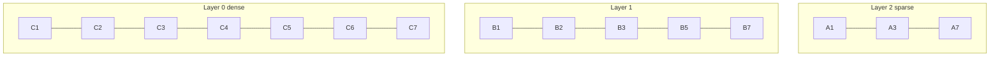
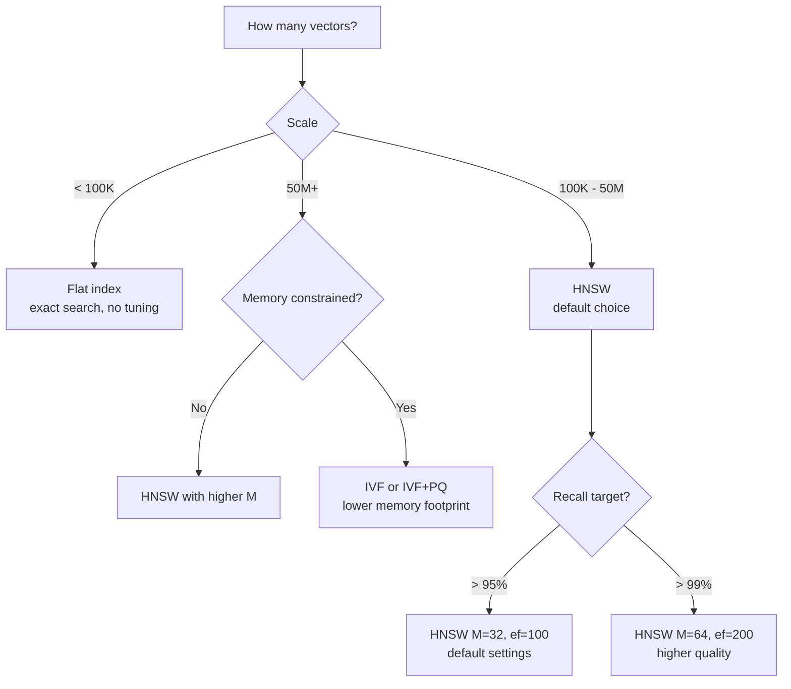

# Vector Indexing

> **TL;DR**: HNSW is the default choice for production vector search: fast (~1-10ms), high recall, handles millions of vectors. Flat (exact) search is fine under 100K vectors. IVF is a middle ground that works well with very large corpora. The HNSW parameters `ef_construction` and `M` trade build time and memory for search quality. Don't over-tune until you have a measured quality problem.

**Prerequisites**: [Embedding Models](02-embedding-models.md), [RAG Fundamentals](01-rag-fundamentals.md)
**Related**: [Vector Databases](04-vector-databases.md), [Hybrid Search](06-hybrid-search.md)

---

## Why Exact Search Doesn't Scale

The naive approach to vector search: compare the query vector against every vector in the index. This is exact, but O(n) per query. For 1M vectors at 1024 dimensions, that's comparing 1 billion float values per query. At 1M vectors this takes ~1 second. At 100M vectors, it takes ~100 seconds. Not viable.

The solution: **Approximate Nearest Neighbor (ANN)** algorithms trade a small amount of accuracy (recall) for massive speed gains. HNSW can search 1M 1024-dimensional vectors in 1-5ms with >95% recall. That's the tradeoff: you might miss 3-5% of the truly most similar vectors, but you get results 1000x faster.

For retrieval systems where we're typically returning top-5 to top-20 results, missing a few in the tail almost never matters. The 80% recall floor that would hurt is rarely hit with properly tuned HNSW.

---

## HNSW: The Default Choice

HNSW (Hierarchical Navigable Small World) builds a multi-layer graph where nodes are vectors and edges connect nearby vectors. Search starts at the top layer (sparse, long-range connections) and drills down to the bottom layer (dense, short-range connections).



Search traverses from sparse to dense layers, using the sparse layers to quickly navigate to the region of interest.

### Key Parameters

| Parameter | What it controls | Typical range | Higher = |
|---|---|---|---|
| `M` | Number of bidirectional connections per node | 8-64 | Better recall, more memory |
| `ef_construction` | Search width during index building | 100-500 | Better index quality, slower build |
| `ef_search` (ef) | Search width during querying | 50-200 | Better recall, slower search |

```python
import faiss
import numpy as np

def build_hnsw_index(embeddings: np.ndarray, M: int = 32, ef_construction: int = 200):
    d = embeddings.shape[1]  # dimension
    index = faiss.IndexHNSWFlat(d, M)
    index.hnsw.efConstruction = ef_construction

    # Add vectors
    index.add(embeddings.astype('float32'))
    return index

def search_hnsw(index, query_embedding: np.ndarray, k: int = 10, ef_search: int = 100):
    index.hnsw.efSearch = ef_search
    distances, indices = index.search(query_embedding.reshape(1, -1).astype('float32'), k)
    return indices[0], distances[0]
```

### Tuning HNSW

For most production use cases, these defaults work well:
- `M = 32`: Good recall vs memory tradeoff
- `ef_construction = 200`: Good index quality
- `ef_search = 100`: Good recall vs latency tradeoff

Only tune if you have a measured quality or latency problem. The [FAISS benchmarks](https://github.com/facebookresearch/faiss/wiki/Benchmarks) provide guidance for different dataset sizes.

---

## IVF: For Very Large Corpora

IVF (Inverted File Index) clusters vectors into `nlist` groups during indexing. At search time, it only searches the `nprobe` closest clusters rather than all of them.

```python
def build_ivf_index(embeddings: np.ndarray, nlist: int = 1024):
    d = embeddings.shape[1]

    # Quantizer for cluster centroids
    quantizer = faiss.IndexFlatL2(d)
    index = faiss.IndexIVFFlat(quantizer, d, nlist)

    # Must train before adding vectors
    index.train(embeddings.astype('float32'))
    index.add(embeddings.astype('float32'))
    return index

# Search: nprobe controls recall vs speed tradeoff
index.nprobe = 64  # search 64/1024 clusters
distances, indices = index.search(query.reshape(1, -1).astype('float32'), k=10)
```

IVF is best when:
- You have 10M+ vectors where HNSW memory usage becomes prohibitive
- You can tolerate slightly lower recall (~90-95%) for significantly less memory
- You need to partition the search space (e.g., search only vectors from specific users)

| Algorithm | 1M vectors | 100M vectors | Memory | Recall | Build time |
|---|---|---|---|---|---|
| Flat (exact) | ~1s | ~100s | ~4GB | 100% | Fast |
| HNSW | 1-10ms | 10-50ms | ~8GB | 95-99% | Medium |
| IVF (nprobe=64) | 5-20ms | 20-100ms | ~4GB | 90-95% | Slow (training) |
| IVF+PQ | 2-10ms | 5-30ms | ~0.5GB | 85-92% | Slow |

*Memory estimates for 1024-dimensional float32 vectors at 1M scale.*

---

## Flat Index: When Exact Search Is Fine

For under 100K vectors, just use exact search. It's simpler, requires no tuning, and gives 100% recall.

```python
def build_flat_index(embeddings: np.ndarray):
    d = embeddings.shape[1]
    index = faiss.IndexFlatIP(d)  # IP = inner product (use for normalized vectors = cosine similarity)
    index.add(embeddings.astype('float32'))
    return index
```

The crossover point where you need ANN depends on your latency requirements:
- Under 50K vectors: flat search is under 50ms, probably fine
- 50K-500K vectors: consider HNSW if you need <10ms
- 500K+: HNSW strongly preferred

---

## Choosing an Indexing Algorithm



---

## Product Quantization: When Memory Is Constrained

Product Quantization (PQ) compresses vectors by splitting them into sub-vectors and quantizing each. It reduces memory 4-16x at the cost of recall.

```python
# IVF with PQ: 16x memory reduction
d = 1024  # vector dimension
m = 64    # number of sub-quantizers (must divide d)
bits = 8  # bits per code

quantizer = faiss.IndexFlatL2(d)
index = faiss.IndexIVFPQ(quantizer, d, nlist=1024, m=m, bits=bits)
index.train(embeddings.astype('float32'))
index.add(embeddings.astype('float32'))
```

A 1024-dim float32 vector is 4KB. With PQ(64, 8), it's compressed to 64 bytes: 64x reduction. Recall drops from ~95% to ~85-90%. Worth it when serving billions of vectors.

---

## FAISS vs Managed Vector Database Indexing

| Approach | When | Pros | Cons |
|---|---|---|---|
| FAISS directly | Custom infra, max control | Best performance, free | No persistence, no filtering, manual everything |
| Pinecone/Weaviate/Qdrant | Most production RAG | Managed, filtering, persistence | Cost, less control over index params |
| pgvector (Postgres) | Existing Postgres teams | Simple, existing infra | Slower at scale, limited ANN algorithms |

Most teams use managed vector databases. They handle persistence, scaling, and metadata filtering so you don't have to implement FAISS wrapper code.

---

## Gotchas

**Don't tune HNSW before measuring.** The defaults work well for most cases. Only tune after measuring that recall or latency is actually a problem with profiling data.

**HNSW build is expensive for large corpora.** Building an HNSW index over 10M vectors with `ef_construction=200` can take hours. Plan for this in your ingestion pipeline. Incremental adds are fast; full rebuilds are not.

**FAISS indexes are in-memory.** FAISS has no built-in persistence. Serialize with `faiss.write_index(index, "index.bin")` and reload with `faiss.read_index("index.bin")`. If your process dies without saving, you re-index from scratch.

**IVF requires training data.** The IVF quantizer needs to see a sample of your data to build cluster centroids. If you add very different data later, recall can degrade. Re-training on the new data distribution helps.

**Recall and speed depend on the dataset distribution.** HNSW benchmarks are on standard datasets. Your domain data may have different clustering properties that affect recall. Always benchmark on your actual data.

---

> **Key Takeaways:**
> 1. Use HNSW for most production RAG: 1-10ms search, 95%+ recall, scales to hundreds of millions of vectors. The defaults (M=32, ef=100) work for most cases.
> 2. Flat (exact) search for under 100K vectors is simpler and gives 100% recall. The complexity of ANN isn't justified at small scale.
> 3. Don't over-tune indexing parameters. Measure recall and latency on your actual data before touching M and ef values.
>
> *"HNSW is the B-tree of vector search: not always optimal, but almost always good enough, and everyone knows how to use it."*

---

## Interview Questions

**Q: How would you choose between HNSW and IVF for a corpus of 500M vectors with a p99 latency requirement of 50ms?**

At 500M vectors, both HNSW and IVF are viable but the memory constraint is the deciding factor. HNSW at M=32 for 500M 1024-dim vectors requires roughly 200GB of RAM just for the index graph. That's expensive. IVF with product quantization can serve the same corpus in 20-30GB.

I'd start by checking the latency requirement on both. IVF with `nprobe=64` on 500M vectors typically hits 20-50ms at p50, but p99 can exceed 50ms under load. HNSW p99 is more predictable. I'd benchmark both on actual data with realistic query patterns.

My likely choice: IVF+PQ for the primary index (memory-efficient), with a small HNSW re-ranking index over candidate results (the vectors returned by IVF that pass a coarse similarity threshold). This two-stage approach gets the memory benefits of IVF with the precision of HNSW at the final ranking step.

---

**Quick-fire Questions**

| Question | Answer |
|---|---|
| What does ANN stand for? | Approximate Nearest Neighbor |
| What is HNSW? | Hierarchical Navigable Small World: a graph-based ANN algorithm with fast search and high recall |
| At what scale should you consider ANN over exact search? | When exact search latency exceeds your SLA; typically around 100K+ vectors for sub-10ms targets |
| What does the HNSW parameter `M` control? | Number of bidirectional connections per node; higher = better recall, more memory |
| What is Product Quantization? | Compresses vectors by quantizing sub-vectors; reduces memory 4-64x at ~5-15% recall cost |
| What is the main limitation of FAISS? | In-memory only; no built-in persistence, filtering, or distributed scaling |
