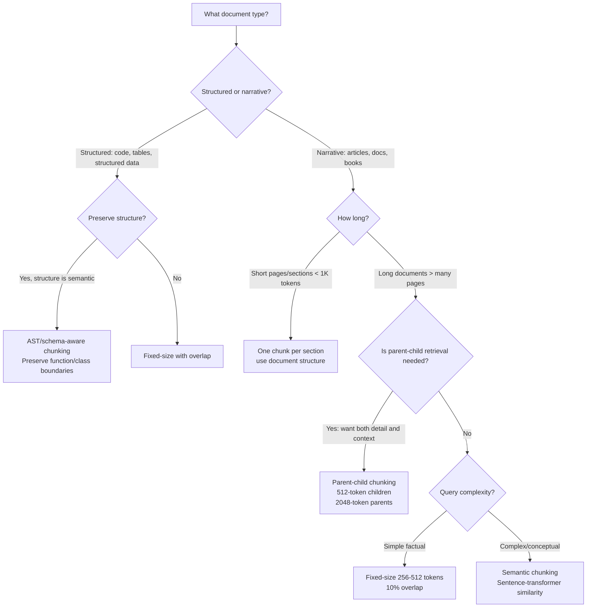
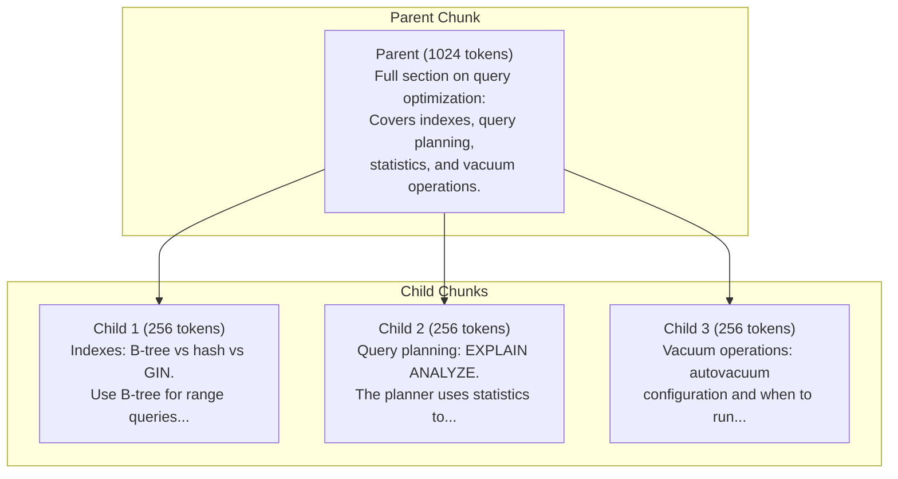

# Chunking Strategies

> **TL;DR**: Chunking is the highest-leverage, most-overlooked variable in RAG quality. Start with 512-token chunks, sentence-aware splitting, and 10% overlap. If retrieval quality is bad, fix chunking before touching embedding models or vector databases. The difference between good and bad chunking is often a 20-40% change in retrieval accuracy.

**Prerequisites**: [RAG Fundamentals](01-rag-fundamentals.md), [Embedding Models](02-embedding-models.md)
**Related**: [Vector Indexing](03-vector-indexing.md), [Advanced RAG Patterns](09-advanced-rag-patterns.md), [Hybrid Search](06-hybrid-search.md)

---

## Why Chunking Matters More Than You Think

When I debug a RAG system that's giving bad answers, my first stop is almost always chunking, not the embedding model or the vector search algorithm.

Here's why: an embedding model converts a chunk of text into a vector. If that chunk contains exactly the information the user needs, the embedding captures that signal well. If the chunk is too large and mixes multiple topics, the embedding averages over them and the signal is diluted. If the chunk is too small and cuts off mid-sentence, the embedding represents an incomplete thought.

The LLM can only synthesize what it receives. If the retrieved chunks don't contain the right information, no amount of prompt engineering will fix the answer. Chunking determines what's retrievable.

Chroma ran experiments (documented in their [chunking research](https://www.trychroma.com/blog/)) showing chunk size has one of the largest impacts on retrieval quality of any parameter. In my own testing, switching from 2048-token chunks to 512-token chunks improved context precision by 30% on a technical documentation corpus. That's not a small win.

---

## The Decision: Which Chunking Strategy to Use



| Strategy | Best For | Chunk Size | Complexity | When to Avoid |
|---|---|---|---|---|
| Fixed-size with overlap | Most use cases, fast prototyping | 256-512 tokens | Low | Documents with strict boundaries (contracts, tables) |
| Sentence-based | Prose, articles, conversations | Variable (2-10 sentences) | Low | Technical docs with non-standard sentence structure |
| Semantic | High quality requirement, complex topics | Variable | Medium | Fast pipelines; adds 2-5s per document |
| Parent-child | Need context AND precision | Child: 128-256, Parent: 1024-2048 | Medium-High | Simple Q&A with short documents |
| Document structure | Markdown, HTML, PDFs with structure | One chunk per section | Low-Medium | Unstructured prose |
| AST-based (code) | Codebases, technical docs | One chunk per function/class | High | Non-code content |

**The 80% recommendation:** Start with sentence-aware fixed-size at 512 tokens with 50-token overlap. It's fast to implement, works well across document types, and gives you a solid baseline to measure against.

---

## Fixed-Size Chunking

The simplest approach: split every N tokens, optionally with overlap.

```python
from langchain.text_splitter import RecursiveCharacterTextSplitter

splitter = RecursiveCharacterTextSplitter(
    chunk_size=512,        # tokens (~400 words)
    chunk_overlap=50,      # overlap between chunks
    length_function=len,   # use character count as proxy for tokens
    separators=["\n\n", "\n", ". ", " ", ""]  # try these in order
)

chunks = splitter.split_text(document)
```

The `RecursiveCharacterTextSplitter` from LangChain is smarter than a simple split: it tries to split on paragraph breaks first, then newlines, then sentences, then words. This means you almost never cut mid-sentence, even with a fixed character budget.

**The overlap trick:** With 10% overlap, the end of chunk N appears at the beginning of chunk N+1. This ensures that sentences near a chunk boundary are retrievable from either chunk. Without overlap, a sentence exactly at a boundary might be split in a way that makes it hard to retrieve.

**What overlap doesn't fix:** Two concepts that are in different paragraphs but semantically related. If paragraph 5 provides the context needed to understand paragraph 10, and they end up in different chunks, retrieval might return chunk 10 without the context from chunk 5. Parent-child chunking addresses this.

---

## Semantic Chunking

Instead of splitting at fixed intervals, semantic chunking finds natural topic boundaries by comparing the semantic similarity of adjacent sentences.

```python
from sentence_transformers import SentenceTransformer
import numpy as np

def semantic_chunk(text: str, threshold: float = 0.3) -> list[str]:
    model = SentenceTransformer("all-MiniLM-L6-v2")
    sentences = text.split(". ")
    embeddings = model.encode(sentences)

    chunks, current_chunk = [], [sentences[0]]
    for i in range(1, len(sentences)):
        # cosine similarity between consecutive sentences
        sim = np.dot(embeddings[i], embeddings[i-1]) / (
            np.linalg.norm(embeddings[i]) * np.linalg.norm(embeddings[i-1])
        )
        if sim < threshold:  # topic shift detected
            chunks.append(". ".join(current_chunk))
            current_chunk = [sentences[i]]
        else:
            current_chunk.append(sentences[i])

    if current_chunk:
        chunks.append(". ".join(current_chunk))
    return chunks
```

The threshold (0.3-0.5 typical) controls sensitivity. Lower threshold = more topic shifts detected = more, smaller chunks. Higher threshold = fewer splits = larger chunks.

**When it shines:** Long documents that mix multiple topics. A 50-page technical report covering architecture, security, and deployment in one document benefits enormously from semantic chunking. Each topic becomes its own set of chunks with clean boundaries.

**When it doesn't:** Short documents, documents with consistent topics throughout, or when you need speed. Encoding every sentence is expensive at indexing time. For a 100K-document corpus, this adds hours to your indexing pipeline.

---

## Parent-Child Chunking

This pattern solves a fundamental tension: **small chunks retrieve with precision, but large chunks provide context**. Parent-child has both.



```python
def create_parent_child_chunks(
    document: str,
    parent_size: int = 1024,
    child_size: int = 256
) -> tuple[list[dict], list[dict]]:
    parent_splitter = RecursiveCharacterTextSplitter(chunk_size=parent_size, chunk_overlap=0)
    child_splitter = RecursiveCharacterTextSplitter(chunk_size=child_size, chunk_overlap=20)

    parents = parent_splitter.split_text(document)
    children = []
    for parent_id, parent in enumerate(parents):
        for child in child_splitter.split_text(parent):
            children.append({"text": child, "parent_id": parent_id})

    return parents, children
```

**How to use it at query time:**
1. Index only the child chunks (small = precise retrieval)
2. When a child is retrieved, also fetch its parent chunk
3. Feed the full parent chunk (or both) into the LLM context

The child gets you the right location in the document. The parent gives the LLM the context it needs to answer well.

**Real-world impact:** In a legal document Q&A system I worked on, switching from flat 512-token chunks to parent-child (256 children, 2048 parents) improved answer completeness significantly. Lawyers were asking questions that required understanding both a specific clause AND its surrounding context. Flat chunking retrieved the clause but missed the context.

---

## Document Structure-Aware Chunking

If your documents have structure (headers, sections, tables), use that structure.

```python
import re

def markdown_chunk(text: str) -> list[dict]:
    """Split markdown into chunks at header boundaries."""
    sections = re.split(r'\n(#{1,3} .+)\n', text)
    chunks = []
    current_header = "Introduction"

    for part in sections:
        if part.startswith('#'):
            current_header = part.strip()
        elif part.strip():
            chunks.append({
                "text": part.strip(),
                "metadata": {"section": current_header}
            })
    return chunks
```

This is better than arbitrary splitting because:
1. Chunks align with human-readable sections
2. The section title becomes metadata you can use in prompts
3. Retrieval results tell you which section was relevant

For PDFs: use a library like [Unstructured.io](https://unstructured.io/) which identifies headers, paragraphs, tables, and lists. For HTML: parse the DOM and chunk by semantic tags. For code: use an AST parser and chunk by function or class definition.

---

## Code Chunking: A Special Case

Code has different semantics than prose. A function is a unit of meaning. Splitting it at line 20 of 40 produces a chunk that can't compile and doesn't embed well.

```python
import ast

def chunk_python_by_function(code: str) -> list[dict]:
    """Extract individual functions and classes as chunks."""
    tree = ast.parse(code)
    chunks = []
    for node in ast.walk(tree):
        if isinstance(node, (ast.FunctionDef, ast.AsyncFunctionDef, ast.ClassDef)):
            start = node.lineno - 1
            end = node.end_lineno
            chunk_text = "\n".join(code.split("\n")[start:end])
            chunks.append({
                "text": chunk_text,
                "metadata": {"type": type(node).__name__, "name": node.name}
            })
    return chunks
```

For JavaScript/TypeScript, use tree-sitter. For Java/Go/Rust, most major languages have AST parsers. The overhead is worth it: code embedding quality improves substantially when chunks are semantically complete.

---

## Chunk Size Experiments: What the Research Shows

| Chunk Size | Retrieval Precision | Answer Quality | Latency | Best For |
|---|---|---|---|---|
| 128 tokens | High | Low (missing context) | Fast | Factual lookup, short answers |
| 256 tokens | High | Medium | Fast | Fact-based Q&A |
| 512 tokens | Medium-High | High | Medium | Most use cases |
| 1024 tokens | Medium | High | Slower (more tokens) | Complex questions needing full sections |
| 2048+ tokens | Low | Variable | Slow | Only as parent in parent-child |

The [LlamaIndex research](https://www.llamaindex.ai/blog/evaluating-the-ideal-chunk-size-for-a-rag-system-using-llamaindex-6207e5d3fec5) on this is worth reading. Their experiments on a technical documentation corpus showed 512-1024 tokens as the sweet spot for most question types. Below 256, chunks frequently lack enough context for the LLM to answer well. Above 1024, embedding quality degrades because the vector has to represent too many concepts.

My rule of thumb: **a chunk should answer one question**. If you can't write a single-sentence question that a chunk would correctly answer, the chunk is too broad.

---

## Overlap: How Much Is Right?

Overlap ensures information near chunk boundaries is retrievable. The cost is index size and redundant retrieval.

| Overlap | Effect | When to Use |
|---|---|---|
| 0% | Clean boundaries, boundary info can be lost | Document structure chunking where boundaries are meaningful |
| 10-15% | Minimal redundancy, good boundary coverage | Standard recommendation |
| 20-25% | Strong boundary coverage, some redundancy | Documents with many cross-references |
| 50%+ | Heavy redundancy, near-doubles index size | Only if precision is critical and cost doesn't matter |

For most use cases, 50-100 tokens of overlap on 512-token chunks works well. The overlap should be measured in tokens (or characters as a proxy), not sentences, because sentence length varies too much.

---

## Metadata: The Underused Lever

Every chunk should carry metadata. Metadata enables filtering, sourcing, and improved prompts.

```python
chunk = {
    "text": "The company's revenue grew 23% YoY to $1.2B...",
    "metadata": {
        "document_id": "annual-report-2024",
        "section": "Financial Results",
        "page": 15,
        "date": "2024-03-01",
        "document_type": "annual_report",
        "access_level": "public"
    }
}
```

Use cases for metadata:
- **Filtering:** "Only retrieve from documents created after 2023"
- **Access control:** "Don't retrieve documents the user isn't authorized to see"
- **Sourcing:** "Tell the LLM which document each chunk came from"
- **Freshness:** "Downrank older documents in retrieval"
- **Debugging:** "When this chunk is retrieved, log document_id and section for analysis"

All major vector databases (Pinecone, Weaviate, Chroma, Qdrant) support metadata filtering. It's one of the most impactful and underutilized features.

---

## Late Chunking: The Newer Approach

Traditional chunking happens before embedding. Late chunking, introduced in [this paper from Jina AI](https://arxiv.org/abs/2409.04701), embeds the full document first (or large sections), then pools the token-level embeddings into chunk-level representations.

The key advantage: each chunk's embedding is informed by the full document context, not just the chunk text. A pronoun like "it" in a chunk gets an embedding that reflects what "it" refers to in the broader document.

In practice (as of early 2025), late chunking is available in Jina's embedding API. It shows meaningful improvements on documents with strong cross-references. For most standard document types, traditional chunking with good overlap is still competitive. Worth experimenting with if you're pushing retrieval quality to the limit.

---

## Gotchas and Real-World Lessons

**The character vs token mismatch.** LangChain's `RecursiveCharacterTextSplitter` splits by characters, but embedding models and LLMs count in tokens. 512 characters is roughly 128-200 tokens depending on content. When someone says "512-token chunks," they usually mean approximately 2048 characters. Use `tiktoken` to count tokens accurately if precision matters.

**Tables and structured data break everything.** A table row extracted as a string loses its column context. "Q4 2024 | $1.2B | 23%" doesn't embed well without knowing the columns are "Quarter | Revenue | Growth." Serialize tables into natural language or use a specialized table extractor.

**PDFs are not plain text.** A PDF with multi-column layout, headers, footers, and embedded images will give you garbage if you extract it naively. Invest in proper PDF parsing ([pdfminer](https://github.com/pdfminer/pdfminer.six), PyMuPDF, or Unstructured) before chunking. The extraction quality bottleneck is before chunking.

**Chunking affects context precision AND recall differently.** Smaller chunks improve precision (each retrieved chunk is more relevant). Larger chunks improve recall (less likely to miss important information). Parent-child chunking is the engineering solution to having both.

**Your test corpus isn't your production corpus.** Teams build chunking pipelines on a handful of representative documents and test them manually. Then production has PDFs with scanned text, HTML emails with nested tables, and code files with non-standard formatting. Test your chunking pipeline on a random sample of actual production documents before launching.

**Re-chunking is expensive but necessary.** When you change your chunking strategy, you have to re-embed and re-index the entire corpus. For a large corpus, this takes hours. Build your indexing pipeline to be idempotent and testable from day one, so you can A/B test chunking strategies without full re-indexing on each attempt.

**Don't ignore short chunks.** After chunking, filter out chunks under 50 tokens. These are usually artifacts: page numbers, section dividers, blank sections. They embed poorly and pollute your index with noise that reduces retrieval precision.

---

> **Key Takeaways:**
> 1. Start with 512-token sentence-aware chunks and 10% overlap. This beats most elaborate strategies on standard document types.
> 2. Parent-child chunking is the highest-leverage improvement: retrieve with precision (small children) but feed context (large parents) to the LLM.
> 3. Metadata on every chunk enables filtering, sourcing, and debugging. It costs almost nothing and enables features you'll want later.
>
> *"Chunking is the foundation retrieval is built on. Getting it wrong means no amount of embedding model tuning will save your retrieval quality."*

---

## Interview Questions

**Q: How would you approach chunking for a RAG system over a large codebase?**

Code is fundamentally different from prose, and the answer starts there. In prose, a "sentence" or "paragraph" is the natural unit. In code, it's a function, class, or module. Splitting a Python function at line 25 of 40 gives you a chunk that's syntactically invalid and embeddings poorly.

I'd use AST-based chunking. Parse the codebase into a syntax tree and extract each function and class definition as its own chunk. This gives you units that are semantically complete: they can compile, they have a clear purpose, and their embeddings capture the function's intent.

The tricky cases are large classes (5,000+ line classes need to be sub-chunked), closely related functions that need context from each other (I'd use parent-child: method as child, class as parent), and files with lots of imports and configuration that don't have clean AST boundaries.

I'd also include the function signature and docstring in each chunk as a separate embedding. Users often query by what a function does ("how do I parse a CSV"), not its implementation. The docstring embeds better for that query than the implementation does. Two embeddings per chunk, queried together.

For retrieval, I'd add metadata: file path, function name, language, last modified date. File path filtering lets users scope searches to a specific module. Last modified enables recency bias for "how is X currently implemented" queries.

*Follow-up: "How do you handle documentation that references code and vice versa?"*

I'd add cross-references in the metadata. Each code chunk gets a `related_docs` field pointing to documentation that explains it. Each documentation chunk gets a `related_code` field. During retrieval, when a code chunk is retrieved, I'd also retrieve the most relevant documentation chunk. The LLM gets both: the implementation and the explanation. This requires building a cross-reference index at indexing time, but the retrieval quality improvement for documentation-heavy codebases is worth it.

---

**Q: Your RAG system has good embedding quality but poor retrieval accuracy. Where do you look?**

If embedding quality is verified (MTEB scores are good, the model is appropriate for the domain) but retrieval is still poor, the first place I look is the chunks themselves.

The symptom often is that the right information is in the corpus but not in the retrieved chunks. I'd do a manual audit: take 20 queries that fail, find the correct source passage by manual search, and check whether that passage is intact as a chunk or split across multiple chunks. If it's split, chunking is the problem.

I'd also look at chunk size distribution. If 30% of chunks are under 100 tokens, you have a lot of noise chunks from page numbers, headers, and short sections. These pollute the retrieval with near-meaningless results. Filter them out.

Then I'd check for context confusion in large chunks. If chunks are 1500+ tokens covering multiple sub-topics, the embedding averages the signal and retrieval is imprecise. Smaller, more focused chunks would help.

The other culprit for good embedding + poor retrieval is vocabulary mismatch. The user asks "how do I authenticate?" and the relevant chunk says "how to configure OAuth2 flows." The semantic overlap isn't captured well. That's a hybrid search problem (add BM25 for keyword matching), not a chunking problem. I'd distinguish between these by checking what terms the query and the correct chunk share.

---

**Quick-fire Questions**

| Question | Answer |
|---|---|
| What is the recommended starting chunk size for most RAG use cases? | 512 tokens with 50-token overlap |
| What problem does parent-child chunking solve? | Balancing precision (small chunks) with context (large chunks) by retrieving small children but feeding parent context to the LLM |
| What is semantic chunking? | Splitting at topic boundaries detected by embedding similarity rather than at fixed intervals |
| Why should very short chunks (< 50 tokens) be filtered out? | They're usually artifacts (page numbers, headers) that embed poorly and pollute the index |
| What metadata should every chunk include? | At minimum: document ID, section/source, creation date |
| How does overlap help? | It ensures content near chunk boundaries is retrievable from either adjacent chunk |
| What chunking strategy works best for code? | AST-based chunking at function/class boundaries |
| Why does PDF extraction need special handling before chunking? | PDF text extraction loses column order, table structure, and can merge/split text incorrectly |
