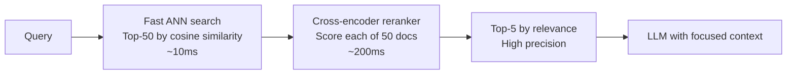

# Reranking

> **TL;DR**: Reranking is a second-pass filter that improves the precision of retrieved documents. Retrieve top-50 with fast ANN search, rerank to top-5 with a cross-encoder. This two-stage approach gets you the recall of a broad retrieval with the precision of a careful one. Cohere Rerank is the fastest path; a local cross-encoder gives full control. Add reranking when top-K retrieval returns too much noise.

**Prerequisites**: [RAG Fundamentals](01-rag-fundamentals.md), [Vector Indexing](03-vector-indexing.md), [Hybrid Search](06-hybrid-search.md)
**Related**: [Advanced RAG Patterns](09-advanced-rag-patterns.md), [Query Transformation](08-query-transformation.md)

---

## The Problem Reranking Solves

Vector search optimizes for recall: retrieve a large set of potentially relevant documents. The top-50 by cosine similarity will contain most of the truly relevant documents (hopefully), but also many that are tangentially related.

When you inject top-50 chunks into an LLM prompt, you're paying for tokens and adding noise. The LLM has to read through 50 chunks to find the 5 that actually answer the question.

Reranking optimizes for precision: given a candidate set, select the truly relevant ones. It's a computationally expensive operation run on a small set of candidates.

Two-stage retrieval:



---

## Bi-Encoders vs Cross-Encoders

This distinction explains why reranking is a separate step:

**Bi-encoder (embedding model):** Encodes query and document independently, then compares vectors. Fast because you precompute document embeddings. Limited because query-document interaction isn't modeled.

**Cross-encoder (reranker):** Encodes the query-document pair jointly. The model sees both at once and scores relevance directly. More accurate because it models the interaction. Slow because every candidate requires a separate forward pass.

| Property | Bi-encoder | Cross-encoder |
|---|---|---|
| Encoding | Query and document separately | Query + document together |
| Speed | Fast (precomputed doc embeddings) | Slow (one pass per candidate) |
| Accuracy | Good for recall | Better for precision |
| Scalable to | Millions of documents | Tens to hundreds of candidates |
| Use for | First-stage retrieval | Second-stage reranking |

---

## Cohere Rerank: The Fastest Path

Cohere's Rerank API is the quickest way to add reranking to an existing retrieval pipeline:

```python
import cohere

co = cohere.Client("your-api-key")

def rerank_cohere(query: str, candidates: list[str], top_n: int = 5) -> list[str]:
    results = co.rerank(
        query=query,
        documents=candidates,
        model="rerank-english-v3.0",
        top_n=top_n,
        return_documents=True
    )
    return [r.document.text for r in results.results]

# Usage in RAG pipeline
initial_candidates = vector_search(query, top_k=20)  # broad retrieval
top_chunks = rerank_cohere(query, initial_candidates, top_n=5)  # precise reranking
context = "\n\n".join(top_chunks)
```

Cohere also has `rerank-multilingual-v3.0` for multilingual corpora.

**Cost:** ~$1 per 1000 documents reranked (as of early 2025). For a 20-document candidate set, that's $0.02 per query. At 10K queries/day, ~$200/month. Significant but often worth it for the quality improvement.

---

## Local Cross-Encoder with sentence-transformers

For full control and no API dependency:

```python
from sentence_transformers import CrossEncoder

# BGE reranker is one of the best open-source options
model = CrossEncoder("BAAI/bge-reranker-large")

def rerank_local(query: str, candidates: list[str], top_n: int = 5) -> list[str]:
    pairs = [[query, doc] for doc in candidates]
    scores = model.predict(pairs)

    ranked = sorted(zip(candidates, scores), key=lambda x: x[1], reverse=True)
    return [doc for doc, _ in ranked[:top_n]]
```

Good open-source cross-encoders:
- `BAAI/bge-reranker-large`: Best quality, requires GPU for fast inference
- `BAAI/bge-reranker-base`: Good quality, runs on CPU
- `cross-encoder/ms-marco-MiniLM-L-6-v2`: Fast, decent quality
- `mixedbread-ai/mxbai-rerank-large-v1`: Strong multilingual

**GPU vs CPU:** On CPU, reranking 20 documents with `bge-reranker-large` takes 500ms-2s. On GPU (A100), under 50ms. For production, budget GPU time if using local models at scale.

---

## LLM-as-Reranker

For highest quality and specialized domains, use the production LLM itself to score relevance:

```python
def llm_rerank(query: str, candidates: list[str], top_n: int = 5) -> list[str]:
    scored = []
    for doc in candidates:
        response = client.messages.create(
            model="claude-haiku-4-5-20251001",  # cheap model for scoring
            max_tokens=20,
            messages=[{"role": "user", "content":
                f"Rate 1-10 how relevant this document is to the query.\n"
                f"Query: {query}\nDocument: {doc[:500]}\nReturn only a number."}]
        )
        try:
            score = float(response.content[0].text.strip())
            scored.append((doc, score))
        except ValueError:
            scored.append((doc, 0))

    scored.sort(key=lambda x: x[1], reverse=True)
    return [doc for doc, _ in scored[:top_n]]
```

**When to use LLM reranking:** Domain-specific content where general cross-encoders underperform, when you need reranking to understand context beyond the document text, or when quality matters more than cost.

**Cost warning:** Even with a cheap model, LLM reranking 20 candidates costs ~$0.002 per query. At 10K queries/day that's $20/day vs $2/day for Cohere. Parallelization reduces latency but not cost.

---

## The Two-Stage Pipeline in Practice

```python
def rag_with_reranking(query: str, collection, llm_client, top_k: int = 20, top_n: int = 5) -> str:
    # Stage 1: broad retrieval (high recall)
    initial = collection.query(
        query_embeddings=[embed(query)],
        n_results=top_k
    )
    candidates = initial["documents"][0]

    # Stage 2: rerank (high precision)
    top_chunks = rerank_local(query, candidates, top_n=top_n)

    # Stage 3: generate
    context = "\n\n".join(top_chunks)
    response = llm_client.messages.create(
        model="claude-opus-4-6",
        max_tokens=1024,
        messages=[{"role": "user", "content":
            f"Answer based on this context:\n\n{context}\n\nQuestion: {query}"}]
    )
    return response.content[0].text
```

---

## Retrieval Depth Tuning

How many candidates should you retrieve in stage 1?

| Stage 1 (top_k) | Stage 2 (top_n) | Recall | Cost | Notes |
|---|---|---|---|---|
| 10 → 3 | 3 | Lower | Low | When corpus is small and relevant |
| 20 → 5 | 5 | Good | Medium | **Recommended default** |
| 50 → 5 | 5 | Higher | Higher | For difficult queries |
| 100 → 10 | 10 | Highest | High | Only if recall is measured as insufficient |

The diminishing returns curve: going from top-20 to top-50 in stage 1 improves recall by ~3-5% but doubles reranking cost. Usually not worth it unless you've measured the recall gap.

---

## Gotchas

**Reranker context length limits.** Most cross-encoders have a 512-token limit. If your chunks are 1024 tokens, they get truncated during reranking. Either use a cross-encoder with a longer context (BGE-reranker-large supports 512, some newer models support 4K+) or truncate chunks before reranking.

**Latency budget.** Reranking 20 candidates with Cohere takes 200-400ms. This doubles your typical pipeline latency. Budget for it and consider streaming the LLM response while the user waits.

**Reranker score distribution shifts with domain.** A cross-encoder trained on MS-MARCO (web search) may give systematically lower scores to medical or legal content even when it's relevant. Calibrate against your domain by checking if high-scoring documents are actually high quality.

**Cohere rate limits.** The Rerank endpoint has rate limits that can surprise you under load. Implement async reranking with a queue if your application has bursty query patterns.

**You still need good first-stage retrieval.** Reranking can only select from what stage 1 retrieved. If the truly relevant document isn't in your top-50, reranking can't surface it. Measure first-stage recall separately from reranking precision.

---

> **Key Takeaways:**
> 1. Two-stage retrieval: broad first-stage (top-50 for recall) + precise reranking (top-5 for precision). This combines the best of both approaches.
> 2. Cohere Rerank is the fastest path to adding reranking. Local cross-encoders (bge-reranker) are the cost-efficient alternative for self-hosted systems.
> 3. Measure first-stage recall and reranking precision separately. Poor quality after reranking could be a first-stage problem (wrong documents in candidates) or a reranker problem (wrong selection from candidates).
>
> *"Retrieval finds the haystack. Reranking finds the needle."*

---

## Interview Questions

**Q: Add reranking to an existing RAG system. What are the tradeoffs and how do you decide if it's worth the added latency?**

The question I'd answer first: what's the current context precision? If the LLM is receiving 10 chunks and 8 of them are relevant, reranking won't help much. If it's receiving 10 chunks and only 3 are relevant, reranking has high ROI.

I'd measure context precision using RAGAS before adding reranking. If it's below 0.7, reranking is probably worth the latency. If it's above 0.85, other optimizations (chunking, hybrid search) would have more impact.

For implementation: add Cohere Rerank as the fastest path. It's one function call after the existing vector search and adds 200-400ms. I'd A/B test: 10% of traffic uses the reranker, 90% uses the existing system. Compare final answer quality via LLM-as-judge. If the quality improvement is meaningful (>5% on my eval set), roll it out fully.

The latency tradeoff: for a UI that shows results in real-time, 400ms added latency is noticeable. For a background research agent where the task takes minutes anyway, it's irrelevant. Know your latency budget before deciding.

---

**Quick-fire Questions**

| Question | Answer |
|---|---|
| What is the difference between a bi-encoder and cross-encoder? | Bi-encoder encodes query and document separately (fast, for retrieval); cross-encoder encodes them together (slow, for reranking) |
| What is the typical two-stage retrieval setup? | Retrieve top-20 to top-50 with ANN, rerank to top-5 with cross-encoder |
| What is the cost of Cohere Rerank? | ~$1 per 1000 documents reranked (~$0.02 for a 20-doc candidate set) |
| What is a good open-source reranker? | `BAAI/bge-reranker-large` for highest quality; `bge-reranker-base` for CPU-friendly |
| What is the context length limit to watch for with rerankers? | Most cross-encoders support 512 tokens; longer chunks get truncated |
| When should you skip reranking? | When context precision is already high (>0.85) or when pipeline latency is critical |
