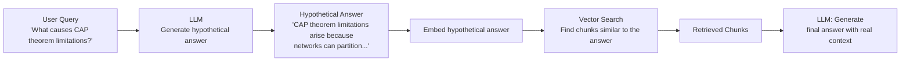
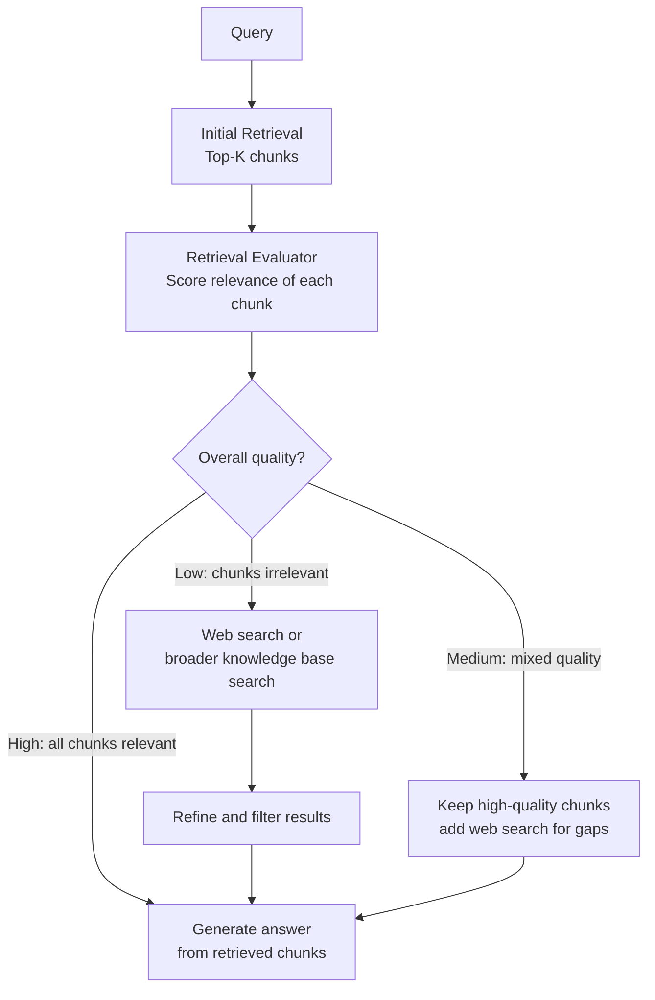
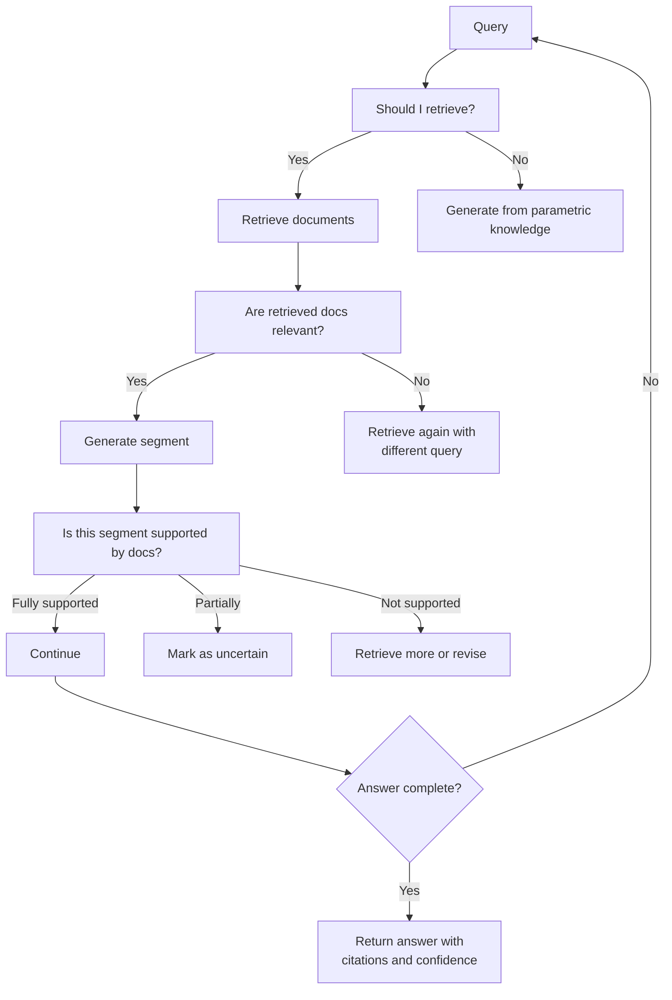
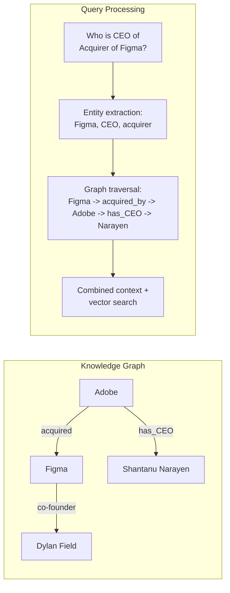
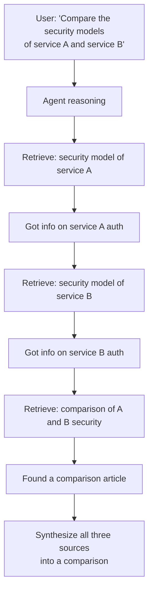
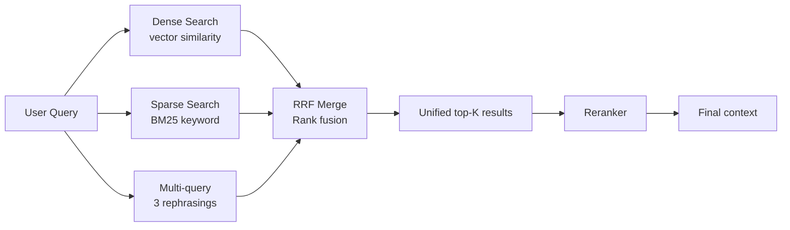
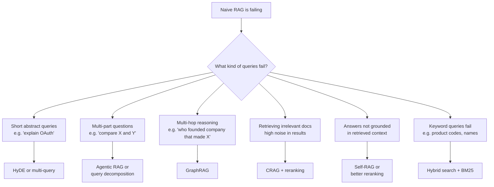
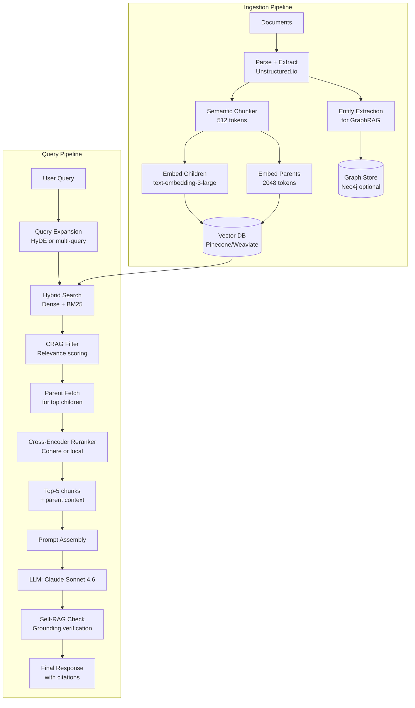

# Advanced RAG Patterns

> **TL;DR**: Naive RAG fails on multi-hop questions, vocabulary mismatch, and poor-quality documents. Advanced patterns fix specific failure modes: HyDE for vocabulary gaps, CRAG for noisy retrieval, Self-RAG for quality verification, GraphRAG for multi-hop reasoning, and Agentic RAG for open-ended research. Add complexity only after measuring that naive RAG is actually failing on your production queries.

**Prerequisites**: [RAG Fundamentals](01-rag-fundamentals.md), [Chunking Strategies](05-chunking-strategies.md), [Hybrid Search](06-hybrid-search.md), [Reranking](07-reranking.md), [Query Transformation](08-query-transformation.md)
**Related**: [Agent Fundamentals](../04-agents-and-orchestration/01-agent-fundamentals.md), [Vector Indexing](03-vector-indexing.md), [RAG Evaluation](11-rag-evaluation.md)

---

## When Naive RAG Breaks

Before reaching for advanced patterns, understand exactly which failure mode you're solving. Advanced patterns add latency, cost, and complexity. The right time to add them is when you have measured evidence that naive RAG isn't working, not before.

| Failure Mode | Symptom | Advanced Pattern That Fixes It |
|---|---|---|
| Vocabulary mismatch | User asks about "revenue" but docs say "sales" | HyDE, hybrid search with BM25 |
| Multi-hop reasoning | Correct answer requires connecting 2+ separate documents | GraphRAG, Agentic RAG |
| Noisy retrieval | Retrieved chunks are tangentially related, not directly relevant | CRAG, reranking |
| Self-contradicting docs | Multiple documents have conflicting information | Self-RAG, CRAG |
| Complex query decomposition | User question is compound, needs sub-questions | Query decomposition, multi-query |
| Large document with structure | 500-page report, answers span sections | Parent-child, hierarchical indexing |
| Open-ended research tasks | Query requires finding and synthesizing unknown sources | Agentic RAG |

The pattern I follow in production: instrument naive RAG with logging, run it for 2-4 weeks, then analyze failure patterns. The failure distribution tells you which advanced pattern to add first. Don't add all of them at once.

---

## HyDE: Hypothetical Document Embeddings



**The problem it solves:** Short, abstract queries embed differently than long document passages. "CAP theorem" as a query vector doesn't match well against a 500-token explanation paragraph, even if that paragraph is exactly what the user needs. The vector spaces are different because the length and specificity differ.

**How HyDE works:** Instead of embedding the query, ask an LLM to generate a hypothetical answer to the query. Embed that hypothetical answer. The hypothetical answer is long and specific, which means it embeds more similarly to the document passages you're trying to retrieve.

```python
from anthropic import Anthropic
from sentence_transformers import SentenceTransformer

client = Anthropic()
embed_model = SentenceTransformer("all-MiniLM-L6-v2")

def hyde_embed(query: str) -> list[float]:
    """Generate a hypothetical answer and embed it instead of the raw query."""
    response = client.messages.create(
        model="claude-opus-4-6",
        max_tokens=200,
        messages=[{
            "role": "user",
            "content": f"Write a brief, factual paragraph that would answer this question: {query}\nWrite only the answer, no preamble."
        }]
    )
    hypothetical_answer = response.content[0].text
    return embed_model.encode([hypothetical_answer])[0].tolist()
```

**When it helps:** Technical queries where the user's terminology is abstract ("explain X") but the document uses specific technical language. Academic and research retrieval where queries are short but documents are detailed.

**When it doesn't help:** Simple factual lookups ("what is the refund policy?"), short document collections where the embedding space is already well-calibrated, or when query-document vocabulary overlap is already good.

**Latency overhead:** One extra LLM call before retrieval. At ~500ms per call, this adds 0.5-1s to query latency. For background research tasks, acceptable. For real-time chat, consider only applying HyDE when initial retrieval fails.

---

## Multi-Query Expansion

Instead of one query, generate multiple rephrasings and merge the results.

```python
def multi_query_retrieve(query: str, collection, n_queries: int = 3) -> list[str]:
    """Retrieve using multiple query rephrasings, deduplicate results."""
    response = client.messages.create(
        model="claude-opus-4-6",
        max_tokens=300,
        messages=[{
            "role": "user",
            "content": f"""Generate {n_queries} different phrasings of this question for document retrieval.
Question: {query}
Return only the questions, one per line."""
        }]
    )

    queries = [query] + response.content[0].text.strip().split("\n")[:n_queries]
    seen_ids, all_docs = set(), []

    for q in queries:
        results = collection.query(
            query_embeddings=[embed_model.encode([q])[0].tolist()],
            n_results=3
        )
        for doc, doc_id in zip(results["documents"][0], results["ids"][0]):
            if doc_id not in seen_ids:
                seen_ids.add(doc_id)
                all_docs.append(doc)

    return all_docs[:10]  # cap total results
```

**The gain:** Different phrasings retrieve different relevant chunks. A query about "database connection pooling" might miss chunks that use "connection management" unless you also search that term. Multi-query improves recall.

**The cost:** N LLM calls to generate rephrasings + N retrieval calls. Parallelization helps with latency (run all queries concurrently), but cost scales linearly.

---

## CRAG: Corrective RAG

CRAG addresses a specific failure: what happens when the retrieved documents are irrelevant or contradictory? Naive RAG trusts whatever it retrieves. CRAG evaluates retrieval quality and takes corrective action.



The key component is the relevance evaluator: a classifier (or another LLM call) that scores whether each retrieved chunk is actually relevant to the query. CRAG uses this score to decide whether to trust the retrieval or fall back to broader search.

**Implementation (simplified):**

```python
def crag_retrieve(query: str, collection, relevance_threshold: float = 0.7) -> list[str]:
    # Initial retrieval
    results = collection.query(
        query_embeddings=[embed_model.encode([query])[0].tolist()],
        n_results=5
    )
    chunks = results["documents"][0]

    # Evaluate relevance
    relevant_chunks = []
    for chunk in chunks:
        score_response = client.messages.create(
            model="claude-haiku-4-5-20251001",  # cheap model for scoring
            max_tokens=50,
            messages=[{"role": "user", "content":
                f"Rate 0-10 how relevant this is to the query.\nQuery: {query}\nChunk: {chunk[:300]}\nReturn only a number."}]
        )
        score = float(score_response.content[0].text.strip())
        if score / 10 >= relevance_threshold:
            relevant_chunks.append(chunk)

    if not relevant_chunks:
        # Fall back to web search or broader retrieval
        return web_search_fallback(query)

    return relevant_chunks
```

**When CRAG shines:** Systems where the knowledge base has coverage gaps, where users frequently ask about things the KB doesn't know, or where retrieved noise causes confident wrong answers.

**The tradeoff:** Adding a relevance evaluation step (even with a cheap model) adds 100-300ms per query. For the cases where CRAG prevents a bad answer, this is worth it.

The [CRAG paper by Yan et al.](https://arxiv.org/abs/2401.15884) showed 15-20% improvement on knowledge-intensive tasks compared to naive RAG.

---

## Self-RAG: Retrieval with Self-Reflection

Self-RAG adds a self-evaluation loop where the LLM critiques its own outputs and decides whether to retrieve more information.



The original [Self-RAG paper by Asai et al.](https://arxiv.org/abs/2310.11511) trains a special model with built-in reflection tokens. In practice, you can approximate Self-RAG with prompting by asking the LLM to explicitly assess whether its answer is supported by the retrieved context:

```python
def self_rag_generate(query: str, chunks: list[str]) -> dict:
    context = "\n\n".join(chunks)
    response = client.messages.create(
        model="claude-opus-4-6",
        max_tokens=800,
        messages=[{"role": "user", "content": f"""Answer this question using the provided context.
After your answer, add a line: SUPPORTED: [fully/partially/not] - brief reason.
If not fully supported, list what additional information would help.

Context: {context}
Question: {query}"""}]
    )
    text = response.content[0].text
    # Parse the SUPPORTED: line and flag answers that aren't fully supported
    return {"answer": text, "needs_more_retrieval": "not" in text.lower().split("supported:")[-1]}
```

**When Self-RAG helps:** Open-domain Q&A where some questions need retrieval and others don't, long-form answers that require verifying each claim separately, high-stakes domains where every claim needs to be grounded.

**The overhead:** At minimum one additional LLM call for self-evaluation. For long answers, potentially one per paragraph. This 2-3x multiplies your LLM cost.

---

## GraphRAG: Knowledge Graphs for Multi-Hop Reasoning

GraphRAG (from Microsoft Research, [detailed in their blog](https://microsoft.github.io/graphrag/)) uses a knowledge graph alongside the vector index to enable multi-hop reasoning.

**The problem it solves:** "Who is the CEO of the company that acquired Figma?" requires:
1. Find: Adobe acquired Figma
2. Find: Adobe's CEO is Shantanu Narayen
3. Combine: The answer is Shantanu Narayen

Naive RAG retrieves based on vector similarity to the query. If no single document contains both facts together, it can fail or hallucinate the connection.



**Building a GraphRAG system:**

1. Extract entities and relationships from documents during indexing
2. Build a graph (Neo4j, or a simple dict for small corpora)
3. At query time, extract entities from the query and traverse the graph for related entities
4. Combine graph-retrieved context with vector-retrieved context

Microsoft's open-source [GraphRAG library](https://github.com/microsoft/graphrag) implements this end-to-end, though it's expensive to run (multiple LLM calls per document during indexing).

**When GraphRAG is worth the cost:**

| Use Case | GraphRAG Benefit | Alternative |
|---|---|---|
| Organizational charts ("who reports to X?") | High | Structured DB query |
| Research literature ("papers that build on X") | High | Citation graph |
| Product catalogs with relationships | Medium | Structured DB query |
| General document Q&A | Low | Naive RAG + reranking |
| Simple factual lookup | None | Naive RAG |

The honest assessment: GraphRAG is impressive for knowledge graph use cases but expensive and complex to maintain. For most enterprise document Q&A, a good reranker and hybrid search gets you 80% of the way there at 10% of the complexity.

---

## Agentic RAG: Retrieval as a Tool

Instead of a fixed retrieve-then-generate pipeline, Agentic RAG gives the LLM control over the retrieval process as a tool it can call multiple times.



```python
def build_rag_agent_tools(collection) -> list[dict]:
    return [{
        "name": "retrieve_documents",
        "description": "Search the knowledge base for documents relevant to a specific question or topic. Use multiple focused queries rather than one broad query for better results.",
        "input_schema": {
            "type": "object",
            "properties": {
                "query": {"type": "string", "description": "Specific search query"},
                "n_results": {"type": "integer", "default": 3, "description": "Number of documents to retrieve"}
            },
            "required": ["query"]
        }
    }]

# Then use this tool in a standard agent loop (see Agent Fundamentals)
```

**When Agentic RAG outperforms fixed-pipeline RAG:**
- Multi-faceted questions requiring 3+ separate retrievals
- Research tasks where the relevant queries aren't known upfront
- Comparative analysis across multiple sources
- Questions where initial retrieval reveals you need to look up something else

**The cost reality:** Each retrieval call involves an embedding + vector search (~50ms) plus the LLM overhead for tool use decisions. A 5-retrieval agentic query costs 5x a single-retrieval query in both latency and LLM tokens.

**My honest take:** For 80% of enterprise document Q&A, a well-tuned fixed pipeline with hybrid search and reranking outperforms Agentic RAG on both quality and cost. Agentic RAG shines for research assistants, investigative workflows, and open-ended analysis tasks.

---

## Fusion RAG: Combining Multiple Retrieval Strategies

Run multiple retrieval strategies in parallel and merge results using Reciprocal Rank Fusion (RRF).



```python
def reciprocal_rank_fusion(result_lists: list[list[str]], k: int = 60) -> list[str]:
    """Merge multiple ranked result lists using RRF."""
    scores = {}
    for results in result_lists:
        for rank, doc_id in enumerate(results):
            scores[doc_id] = scores.get(doc_id, 0) + 1 / (k + rank + 1)
    return sorted(scores.keys(), key=lambda x: scores[x], reverse=True)
```

RRF doesn't require calibrating scores across different retrieval systems. It only uses ranks. This makes it robust when combining systems with very different score scales.

**Results:** Hybrid search consistently outperforms pure dense search by 5-15% on recall@10 across most document types. See [06-hybrid-search.md](06-hybrid-search.md) for detailed numbers.

---

## Choosing the Right Advanced Pattern



| Pattern | Complexity | Latency Overhead | Cost Overhead | ROI |
|---|---|---|---|---|
| Multi-query expansion | Low | +1-2s (parallelizable) | +1 LLM call | High for abstract queries |
| HyDE | Low | +0.5-1s | +1 LLM call | High for vocabulary gaps |
| CRAG | Medium | +0.3-0.5s | +cheap LLM calls | High when retrieval is noisy |
| Self-RAG (prompted) | Medium | +0.5-1s per segment | +1-2 LLM calls | High for grounding issues |
| Fusion/Hybrid RAG | Low | Minimal (parallel) | Minimal | High for keyword-sensitive queries |
| GraphRAG | Very high | +2-5s | +expensive indexing | High only for knowledge graph problems |
| Agentic RAG | High | +2-10s | +3-10 LLM calls | High for open research tasks |

---

## Production Stack: What a Real Advanced RAG System Looks Like



This is a full production stack. Building all of this at once is over-engineering. The sequence I recommend:
1. Naive RAG (baseline)
2. Add hybrid search (high ROI, low complexity)
3. Add reranking (high ROI, medium complexity)
4. Add parent-child chunking (high ROI, medium complexity)
5. Add query expansion or HyDE if vocabulary gap is measured
6. Add CRAG if retrieval noise is measured
7. Add GraphRAG or Agentic RAG only for specific use cases that need them

---

## Gotchas and Real-World Lessons

**The complexity tax is real.** Each advanced pattern you add is another component to monitor, debug, and maintain. I've seen teams add GraphRAG, Agentic RAG, Self-RAG, and HyDE all at once, then spend months debugging which component caused a quality regression. Add one pattern at a time, measure the impact, then decide whether to keep it.

**Latency compounds.** HyDE adds 0.5s, multi-query adds 1s, CRAG adds 0.3s, reranking adds 0.2s. Combined, you're at 2+ seconds before the LLM generates the first token. For chat interfaces, this feels very slow. Streaming helps with perceived latency but not actual latency. Know your latency budget before adding patterns.

**GraphRAG indexing cost is shocking.** Building a knowledge graph with entity extraction and relationship detection requires dozens of LLM calls per document. For a 10,000-document corpus, this can cost hundreds of dollars in API calls and takes hours. It's also brittle: entity extraction quality varies significantly across document types.

**CRAG's web search fallback needs careful design.** When CRAG determines local retrieval is insufficient and falls back to web search, you lose the privacy and access control guarantees of your local knowledge base. In enterprise settings, this can be a compliance issue. CRAG can fall back to "broader local search" instead of web search, but this reduces the quality improvement.

**Self-RAG quality depends on the judge model.** Using Claude Haiku to evaluate whether an answer is grounded is much weaker than using Claude Opus. Don't use a weak model for the grounding check if quality matters. But using Opus for every Self-RAG evaluation step is expensive.

**Fusion search requires careful deduplication.** When you run 3 queries and retrieve 5 results each, you might have the same document appearing in multiple result sets. RRF handles this well, but you need to deduplicate on document ID (or chunk ID), not on text similarity, which is slower.

---

> **Key Takeaways:**
> 1. Add advanced patterns only after measuring which specific failure mode they fix. Naive RAG with good chunking and hybrid search beats complex pipelines that were added without evidence.
> 2. The highest ROI improvements in order: hybrid search, reranking, parent-child chunking. These work for most use cases. Reach for HyDE, CRAG, GraphRAG only for specific measured failures.
> 3. Latency and complexity compound. Every added pattern adds latency, cost, and debugging surface area. Only add what you can measure the benefit of.
>
> *"Naive RAG with good chunking beats complex RAG with bad chunking. Fix the foundation before adding floors."*

---

## Interview Questions

**Q: Design a RAG system for a legal research tool where accuracy is critical and multi-hop reasoning is required. What advanced patterns would you use?**

Legal research is exactly the use case where you need to think carefully before adding complexity, because the failure modes are severe (a lawyer relying on a wrong answer has real consequences) but also because legal documents are dense and highly structured.

I'd start with a strong foundation: good PDF parsing (legal PDFs are notoriously messy with headers, footnotes, and multi-column layouts), parent-child chunking to preserve context within sections, and hybrid search because legal queries often include exact statutory citations and case names that benefit from BM25 keyword matching.

For multi-hop reasoning, I'd add Agentic RAG rather than GraphRAG, for this reason: the multi-hop questions in legal research are typically of the form "what cases cite X, and how did they interpret the holding in Y?" This is a research workflow, not a knowledge graph traversal. An agent with a well-designed retrieval tool can handle this by making multiple targeted searches, reading the results, and deciding what to look up next. GraphRAG would require building a citation graph, which is complex to maintain and would need to be rebuilt whenever new cases are added.

I'd also add Self-RAG with a strong grounding check, using a powerful model (Claude Opus or GPT-4o for the judge). For legal content, I want the system to explicitly say "I cannot find a direct precedent for this in the retrieved documents" rather than synthesizing an answer from vague parallels. False confidence is worse than admitted uncertainty in legal contexts.

For citations, every claim in the final answer should cite the specific document and section. I'd build this into the prompt structure, not as an afterthought.

*Follow-up: "How would you handle the situation where a user's query requires knowledge that spans multiple jurisdictions or legal domains?"*

That's the multi-corpus problem. I'd maintain separate indexes for different jurisdictions (federal, state, international) and document types (case law, statutes, regulations). When a query comes in, first classify its jurisdiction and document type, then route to the appropriate index or query multiple indexes in parallel. The agent would then synthesize across jurisdictions and explicitly flag when different jurisdictions have conflicting rules. Cross-jurisdiction synthesis is exactly where you'd want to return multiple answers with clear sourcing rather than collapsing to a single confident answer.

---

**Quick-fire Questions**

| Question | Answer |
|---|---|
| What failure mode does HyDE address? | Vocabulary mismatch between short queries and long document passages |
| What is CRAG? | Corrective RAG: evaluates retrieval quality and triggers fallback search when retrieval is poor |
| When should you use GraphRAG? | Multi-hop reasoning where answers require traversing relationships between entities |
| What is RRF? | Reciprocal Rank Fusion: merges multiple ranked lists by position without requiring score calibration |
| What is the main downside of Agentic RAG? | Multiple LLM calls per query, significantly increasing latency and cost |
| What does Self-RAG do differently than standard RAG? | The LLM evaluates whether retrieved documents are relevant and whether its own answer is grounded |
| When is multi-query expansion most useful? | When queries are abstract or could be phrased multiple ways that would retrieve different relevant documents |
| What is the recommended order for adding advanced patterns? | Hybrid search, then reranking, then parent-child chunking, then domain-specific patterns based on measured failures |
