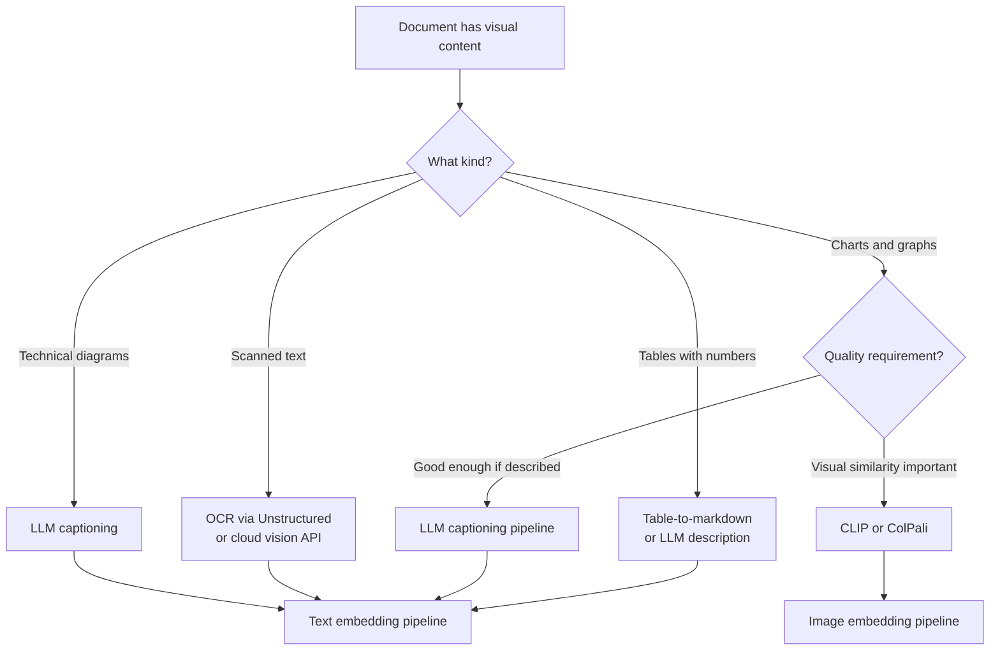

# Multimodal RAG

> **TL;DR**: Most production documents aren't pure text: PDFs have tables, charts, and figures; presentations have slides; technical docs have diagrams. Multimodal RAG handles this by either extracting visual content to text, or embedding images directly and retrieving by visual similarity. ColPali (late interaction over document page images) is the state of the art. For most teams, invest in better PDF parsing before building image embeddings.

**Prerequisites**: [RAG Fundamentals](01-rag-fundamentals.md), [Chunking Strategies](05-chunking-strategies.md), [Embedding Models](02-embedding-models.md)
**Related**: [Advanced RAG Patterns](09-advanced-rag-patterns.md), [Agent Fundamentals](../04-agents-and-orchestration/01-agent-fundamentals.md)

---

## The Problem

A standard RAG pipeline treats documents as text. This breaks when documents contain:
- **Tables:** Extracted as flat text, losing column relationships
- **Charts and graphs:** Become meaningless alt-text or empty space
- **Figures with labels:** The figure is lost; only the caption survives
- **Scanned documents:** Image-only PDFs produce empty text extraction
- **Multi-column layouts:** Text extraction merges columns incorrectly

For financial reports, research papers, technical documentation, and slide decks, these aren't edge cases. They're the majority of the content.

---

## Approach 1: Better Text Extraction (Start Here)

Before building image embeddings, invest in better text extraction. A good extraction pipeline captures tables, handles multi-column layouts, and extracts structured data.

```python
from unstructured.partition.pdf import partition_pdf

def extract_pdf_structured(pdf_path: str) -> list[dict]:
    """Extract PDF elements with type classification."""
    elements = partition_pdf(
        filename=pdf_path,
        strategy="hi_res",      # Use OCR for scanned pages
        infer_table_structure=True,  # Extract tables
        include_page_breaks=True
    )

    structured = []
    for element in elements:
        if element.category == "Table":
            # Convert table to natural language or Markdown
            structured.append({
                "type": "table",
                "content": element.metadata.text_as_html,  # HTML table
                "page": element.metadata.page_number
            })
        elif element.category in ["Title", "NarrativeText", "ListItem"]:
            structured.append({
                "type": "text",
                "content": str(element),
                "page": element.metadata.page_number
            })
        elif element.category == "Image":
            structured.append({
                "type": "image",
                "content": element.metadata.image_base64,  # for vision models
                "page": element.metadata.page_number
            })

    return structured
```

[Unstructured.io](https://unstructured.io/) is the best open-source library for this. It handles PDFs, HTML, DOCX, PowerPoint, Excel, and more. Their hosted API handles the complex cases (scanned documents, complex layouts) without managing OCR infrastructure.

### Table-to-Text Conversion

Tables need special handling before embedding. Two approaches:

**Serialize to Markdown:**
```python
def table_to_markdown(html_table: str) -> str:
    """Convert HTML table to markdown for embedding."""
    from bs4 import BeautifulSoup
    soup = BeautifulSoup(html_table, "html.parser")
    rows = []
    for i, row in enumerate(soup.find_all("tr")):
        cells = [td.get_text().strip() for td in row.find_all(["td", "th"])]
        rows.append("| " + " | ".join(cells) + " |")
        if i == 0:
            rows.append("| " + " | ".join(["---"] * len(cells)) + " |")
    return "\n".join(rows)
```

**Describe with LLM:** For complex tables with headers spanning multiple columns or merged cells, have a vision model describe the table in natural language:

```python
def describe_table_with_llm(table_image: bytes) -> str:
    import base64
    response = client.messages.create(
        model="claude-opus-4-6",
        max_tokens=512,
        messages=[{
            "role": "user",
            "content": [
                {"type": "image", "source": {"type": "base64", "media_type": "image/png",
                                              "data": base64.b64encode(table_image).decode()}},
                {"type": "text", "text": "Describe this table in plain English. Include the column headers, what the table measures, and the key values."}
            ]
        }]
    )
    return response.content[0].text
```

---

## Approach 2: Vision-Based Retrieval

For charts and figures that can't be converted to text meaningfully, embed the images directly and retrieve by visual similarity.

### CLIP Embeddings

CLIP (Contrastive Language-Image Pre-training) creates a shared embedding space for both text and images. You can embed an image and a text query in the same space and find similar items.

```python
from PIL import Image
import torch
from transformers import CLIPProcessor, CLIPModel

model = CLIPModel.from_pretrained("openai/clip-vit-large-patch14")
processor = CLIPProcessor.from_pretrained("openai/clip-vit-large-patch14")

def embed_image(image: Image.Image) -> list[float]:
    inputs = processor(images=image, return_tensors="pt")
    with torch.no_grad():
        features = model.get_image_features(**inputs)
    return features.squeeze().tolist()

def embed_text_for_image_search(text: str) -> list[float]:
    inputs = processor(text=[text], return_tensors="pt", padding=True)
    with torch.no_grad():
        features = model.get_text_features(**inputs)
    return features.squeeze().tolist()

# Index: embed each chart/figure image
chart_embeddings = [(chart_id, embed_image(chart_img)) for chart_id, chart_img in charts]

# Query: "show me charts about quarterly revenue"
query_embedding = embed_text_for_image_search("quarterly revenue chart")
# Find most similar chart embeddings
```

CLIP works reasonably well for matching text descriptions to images but has limitations: the 512-token CLIP text encoder is too short for complex descriptions, and the visual features it captures favor natural photos over technical diagrams.

### ColPali: State of the Art for Document Retrieval

ColPali ([paper](https://arxiv.org/abs/2407.01449)) takes a different approach: treat each document page as an image, apply a vision language model (PaliGemma) to extract token-level embeddings, and use late interaction (like ColBERT) for retrieval.

The key insight: instead of one embedding per page, ColPali produces a grid of patch-level embeddings. At query time, each query token interacts with each patch embedding and the maximum similarity is aggregated. This captures fine-grained visual details.

```python
from colpali_engine.models import ColPali, ColPaliProcessor

model = ColPali.from_pretrained("vidore/colpali-v1.2", torch_dtype=torch.bfloat16)
processor = ColPaliProcessor.from_pretrained("vidore/colpali-v1.2")

def embed_page_colpali(page_image: Image.Image) -> torch.Tensor:
    batch = processor.process_images([page_image]).to(model.device)
    with torch.no_grad():
        embeddings = model(**batch)
    return embeddings[0]  # shape: (num_patches, embedding_dim)

def search_colpali(query: str, page_embeddings: list[torch.Tensor]) -> list[int]:
    query_batch = processor.process_queries([query]).to(model.device)
    with torch.no_grad():
        query_embedding = model(**query_batch)[0]

    scores = [
        processor.score_multi_vector([query_embedding], [page_emb]).item()
        for page_emb in page_embeddings
    ]
    return sorted(range(len(scores)), key=lambda i: scores[i], reverse=True)
```

ColPali performance on the [ViDoRe benchmark](https://huggingface.co/vidore) is substantially better than CLIP or text-only approaches for document retrieval, especially for tables and figures.

**The downside:** ColPali embeddings are larger (one tensor per page, not one vector), and similarity computation is more expensive (MaxSim instead of dot product). Most vector databases don't natively support multi-vector retrieval.

---

## Approach 3: Vision LLM Captioning

A pragmatic middle ground: use a vision LLM to generate detailed captions for every image, chart, and figure, then embed those captions as text.

```python
def caption_document_page(page_image: bytes) -> str:
    """Generate a detailed text description of a document page using a vision LLM."""
    import base64
    response = client.messages.create(
        model="claude-opus-4-6",
        max_tokens=1024,
        messages=[{
            "role": "user",
            "content": [
                {"type": "image", "source": {"type": "base64", "media_type": "image/png",
                                              "data": base64.b64encode(page_image).decode()}},
                {"type": "text", "text":
                    "Describe this document page in detail. Include:\n"
                    "- All text visible on the page\n"
                    "- Any tables: describe the structure and key values\n"
                    "- Any charts or graphs: describe what they show, axes, trends\n"
                    "- Any figures or diagrams: describe what they illustrate\n"
                    "Be specific and include all numbers and labels visible."}
            ]
        }]
    )
    return response.content[0].text
```

This caption is then embedded and indexed like regular text. At query time, text retrieval finds the relevant page, and the LLM uses the caption (or the original page image) to answer the question.

**Cost reality:** Captioning every page of a 100-page document = 100 LLM calls with image input. At ~1000 tokens per call with vision pricing, this adds significant indexing cost. Selective captioning (only pages detected as having significant visual content) reduces this.

---

## When to Use Which Approach



| Use Case | Recommended Approach |
|---|---|
| Financial reports with tables | Unstructured extraction + table-to-markdown |
| Technical docs with diagrams | LLM captioning (Claude Vision) |
| Slide decks | Page-level LLM captioning |
| Scanned PDFs | OCR (Tesseract, AWS Textract, Azure Form Recognizer) |
| Image-first search | ColPali or CLIP |
| Medical imaging | Domain-specific vision models |

---

## Concrete Numbers

As of early 2025:

| Operation | Cost per page | Latency |
|---|---|---|
| Unstructured (self-hosted) | ~$0 compute | 200ms-2s |
| Unstructured API | ~$0.005 | 1-3s |
| LLM captioning (Claude Sonnet) | ~$0.01-0.05 | 2-5s |
| CLIP embedding | ~$0 (local) | 50-200ms |
| AWS Textract (OCR) | $0.001-0.015 | 1-5s |
| Azure Form Recognizer | $0.01-0.05 | 2-10s |

For a 1,000-document corpus averaging 20 pages each (20,000 pages total):
- Unstructured extraction: ~$100 (API) or free (self-hosted)
- LLM captioning all visual pages: ~$200-500 (if 50% of pages have visuals)
- Total indexing cost for multimodal: $300-600 vs ~$10 for text-only

The additional cost is significant but one-time. Amortized over millions of queries, it's negligible.

---

## Gotchas

**OCR quality varies dramatically.** A clean, born-digital PDF extracts perfectly. A scanned PDF from a fax 20 years ago extracts garbage. Always inspect extraction quality on a sample before indexing at scale.

**LLM captions can hallucinate.** A vision LLM describing a bar chart might misread axis values or invent labels that aren't there. For retrieval purposes this is usually fine (the description still captures the general content). For generating answers from captions, validate against the original image.

**Table serialization loses structure.** Markdown tables work well for simple 2D tables. For pivot tables, nested headers, or merged cells, the serialized version is confusing. Use LLM description for complex tables.

**ColPali memory requirements are substantial.** Storing multi-vector embeddings for 100K pages requires significantly more memory than standard single-vector embeddings. Budget accordingly.

**PDF page rendering quality matters.** All vision-based approaches start from rendered page images. Low-resolution rendering (72 DPI) makes text in images unreadable. Render at 150-300 DPI for reliable OCR and vision model results.

---

> **Key Takeaways:**
> 1. Start with better text extraction (Unstructured.io) before building vision pipelines. It solves 70% of the problem at low cost.
> 2. LLM captioning (describe each page with a vision model) is the pragmatic path for most enterprise documents. It keeps retrieval in the text domain while capturing visual content.
> 3. ColPali is state of the art for visual document retrieval but has significant memory and infrastructure requirements. Evaluate against your scale and quality needs.
>
> *"Most 'multimodal RAG' problems are actually bad PDF parsing problems. Fix extraction first."*

---

## Interview Questions

**Q: Design a RAG system for a company's quarterly earnings reports, which contain a mix of text, tables, and charts. How do you handle the visual content?**

The first decision is how much visual content actually matters for the use cases. If users mostly ask about executive commentary and strategic highlights (text-heavy), improving PDF text extraction is probably sufficient. If they ask "what was the revenue trend over the last 4 quarters?" they need the charts.

I'd start with Unstructured.io for structured extraction: it handles tables, identifies page sections, and flags images. Tables get serialized to Markdown and indexed as text. Plain text sections are chunked normally. Images (charts, figures) get flagged for secondary processing.

For the charts, I'd use LLM captioning: render each flagged image and send it to Claude Vision to generate a detailed description including axes, values, and trends. "Bar chart showing quarterly revenue for 2023: Q1 $1.2B, Q2 $1.35B, Q3 $1.4B, Q4 $1.6B, showing consistent growth of ~12-15% per quarter." That description is embedded and indexed.

At query time: "what was the revenue trend?" retrieves the chart caption describing the revenue trend, and the LLM can answer accurately. For "show me the chart," I'd retrieve the original page image and pass it directly to the generation LLM as visual context.

The architecture stores both the text description (for retrieval) and the original image path (for generation with vision LLMs). The retrieval uses text embeddings; the generation uses the original visual when needed.

---

**Quick-fire Questions**

| Question | Answer |
|---|---|
| What is Unstructured.io? | Open-source library for extracting structured content from PDFs, HTML, DOCX; identifies tables, figures, headers |
| What is ColPali? | A visual document retrieval model that embeds document pages as grids of patch embeddings for late interaction retrieval |
| What is CLIP? | OpenAI's model that embeds text and images in a shared space, enabling text-to-image retrieval |
| What is LLM captioning in multimodal RAG? | Using a vision LLM to generate detailed text descriptions of images for text-based retrieval |
| What PDF rendering resolution is recommended for OCR? | 150-300 DPI for reliable OCR and vision model accuracy |
| What is the first step for multimodal RAG? | Better text/table extraction (Unstructured.io), not image embeddings; solves 70% of cases cheaper |
