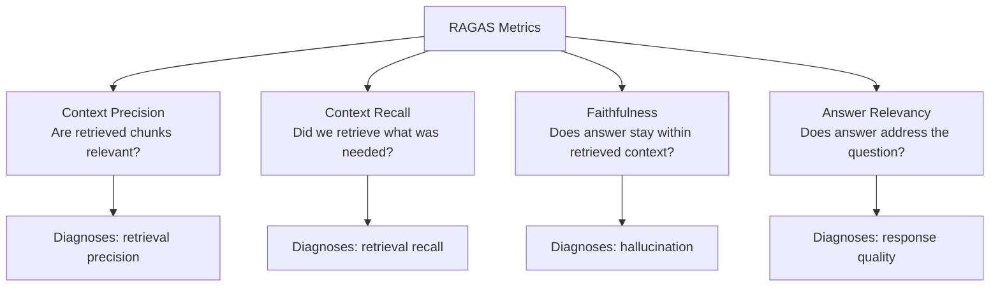
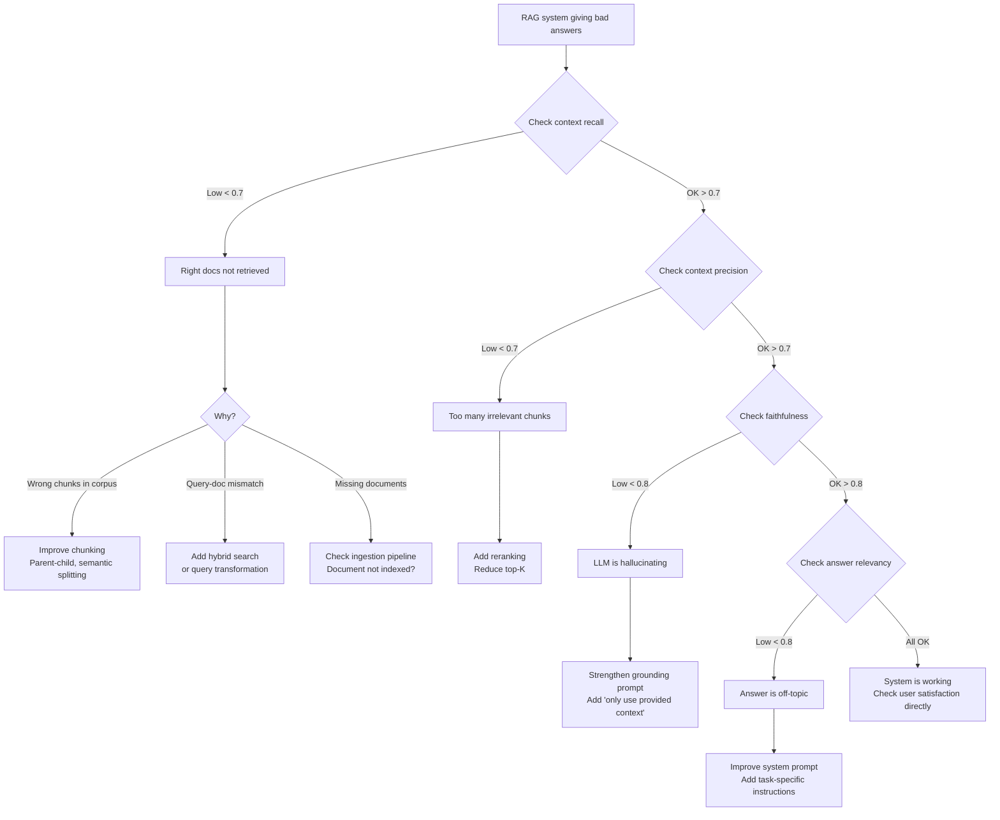

# RAG Evaluation

> **TL;DR**: RAGAS is the standard framework for evaluating RAG systems. It measures four things: context precision (are retrieved chunks relevant?), context recall (did we retrieve everything needed?), faithfulness (does the answer stick to retrieved content?), and answer relevancy (does the answer address the question?). Build your eval pipeline before optimizing anything. You can't tell if a change helped without a baseline.

**Prerequisites**: [RAG Fundamentals](01-rag-fundamentals.md), [Eval Fundamentals](../05-evaluation/01-eval-fundamentals.md), [Chunking Strategies](05-chunking-strategies.md)
**Related**: [LLM as Judge](../05-evaluation/03-llm-as-judge.md), [Advanced RAG Patterns](09-advanced-rag-patterns.md)

---

## The Two-Part Problem

RAG evaluation is harder than it looks because there are two failure modes with completely different fixes:

1. **Retrieval failure:** The right documents aren't in the retrieved set. Fix: chunking, embedding model, hybrid search, query transformation.
2. **Generation failure:** The retrieved documents are correct but the LLM doesn't synthesize a good answer. Fix: prompt engineering, context ordering, LLM choice.

Diagnosing which problem you have requires measuring them separately. Many teams spend weeks optimizing their embedding model when the actual problem is chunking. RAGAS metrics let you separate these.

---

## RAGAS: The Standard Framework

[RAGAS](https://docs.ragas.io/) (Retrieval Augmented Generation Assessment) provides four component metrics:



| Metric | What It Measures | Requires Ground Truth? | Low Score Means |
|---|---|---|---|
| Context Precision | Fraction of retrieved chunks that are actually relevant | Yes (ground truth answers) | Noisy retrieval, bad chunks in context |
| Context Recall | Fraction of relevant chunks that were actually retrieved | Yes (ground truth answers) | Missing relevant documents |
| Faithfulness | Does the answer only contain claims supported by retrieved context? | No | LLM is hallucinating |
| Answer Relevancy | How well does the answer address the original question? | No | LLM is going off-topic |

---

## Running RAGAS

```python
from ragas import evaluate
from ragas.metrics import (
    context_precision,
    context_recall,
    faithfulness,
    answer_relevancy,
)
from datasets import Dataset

# Your eval dataset: questions with ground truth answers
eval_data = {
    "question": [
        "What is the company's refund policy for digital products?",
        "How long does standard shipping take?",
    ],
    "answer": [
        "Digital products are non-refundable within 30 days...",  # your system's answer
        "Standard shipping takes 5-7 business days...",
    ],
    "contexts": [
        ["Our refund policy states that digital goods...", "Section 4: Returns and Refunds..."],
        ["Shipping times vary by region. Standard delivery is 5-7 business days..."],
    ],
    "ground_truth": [
        "Digital products purchased through the platform are eligible for refund within 30 days...",
        "Standard shipping takes 5-7 business days for domestic orders.",
    ]
}

dataset = Dataset.from_dict(eval_data)
results = evaluate(dataset, metrics=[context_precision, context_recall, faithfulness, answer_relevancy])
print(results)
# {'context_precision': 0.82, 'context_recall': 0.74, 'faithfulness': 0.91, 'answer_relevancy': 0.88}
```

The four numbers give you a dashboard for your RAG system's health.

---

## Building Your Eval Dataset

The golden dataset is the hardest part to build. Here's how I approach it:

**Step 1: Collect real queries.** The first 100 queries real users asked is worth more than 500 synthetic queries. Enable logging on day one.

**Step 2: Write ground truth answers.** For each query, have a domain expert write the ideal answer. This is the reference you measure against.

**Step 3: Add hard cases.** For every known failure mode (a query you've seen fail), add it to the eval set. These prevent regressions.

**Step 4: Add adversarial cases.** Queries that are out-of-scope, ambiguous, or designed to produce hallucinations. These test robustness.

**Synthetic generation for bootstrapping:** If you don't have real queries yet, use an LLM to generate questions from your documents:

```python
def generate_eval_questions(chunk: str, n: int = 3) -> list[dict]:
    response = client.messages.create(
        model="claude-opus-4-6",
        max_tokens=500,
        messages=[{"role": "user", "content":
            f"Generate {n} specific questions that this document chunk can answer. "
            "For each question, also write the ideal one-sentence answer.\n\n"
            "Format: Q: [question]\nA: [answer]\n\n"
            f"Chunk:\n{chunk}"}]
    )
    # Parse Q/A pairs from response
    return parse_qa_pairs(response.content[0].text)
```

Synthetic questions are better than nothing but skew toward questions the documents "want" to answer. They miss the adversarial and out-of-scope cases real users bring. Use synthetic to bootstrap, replace with real queries over time.

---

## The RAG Debug Flowchart

When RAGAS scores are low, this decision tree identifies the root cause:



---

## Metric Deep Dives

### Context Precision

Measures: are the retrieved chunks actually useful?

Score = (fraction of retrieved chunks that are relevant to the query)

Low context precision means you're retrieving noise. Fix:
- Reduce top-K (retrieve fewer but better chunks)
- Add a reranker to filter irrelevant candidates
- Improve chunking to avoid mixing multiple topics per chunk

### Context Recall

Measures: did you retrieve all the information needed to answer?

Score = (fraction of sentences in ground truth that are supported by retrieved context)

Low context recall means relevant information exists in your corpus but wasn't retrieved. Fix:
- Increase top-K to cast a wider net
- Add hybrid search (BM25 catches what dense misses)
- Add query transformation (HyDE or multi-query) for vocabulary mismatches
- Verify the relevant documents are actually in your index

### Faithfulness

Measures: does the answer only claim things supported by the retrieved context?

Score = (fraction of answer claims that are directly supported by context)

Low faithfulness means hallucination. The LLM is generating content not in the retrieved documents. Fix:
- Strengthen the grounding instruction: "Answer ONLY from the provided context. If the context doesn't contain the answer, say so."
- Use a stronger model (smaller models hallucinate more when context is insufficient)
- Reduce context size (more context = more confusion, counterintuitively)

### Answer Relevancy

Measures: does the answer address what was asked?

Score = (how well the answer covers the user's question)

Low answer relevancy means the answer is correct but not responsive to the question. Fix:
- Improve the prompt to focus on the specific question
- Add few-shot examples of question-then-focused-answer pairs
- Check if context retrieval is returning off-topic documents that pull the answer sideways

---

## Beyond RAGAS: Additional Metrics

RAGAS covers retrieval and faithfulness. For a complete eval suite, add:

**End-to-end quality (LLM-as-judge):**
```python
def judge_response(question: str, response: str) -> float:
    result = client.messages.create(
        model="claude-opus-4-6",
        max_tokens=100,
        messages=[{"role": "user", "content":
            f"Rate 1-10 how well this response answers the question. Return only a number.\n\n"
            f"Question: {question}\nResponse: {response}"}]
    ).content[0].text
    return float(result.strip()) / 10
```

**Latency tracking:**
```python
import time

def timed_rag_query(question: str, pipeline) -> dict:
    start = time.time()
    result = pipeline.query(question)
    return {
        "answer": result["answer"],
        "latency_ms": (time.time() - start) * 1000,
        "context_count": len(result["contexts"])
    }
```

**No-answer rate:** How often does the system say "I don't know" when it should have an answer?

---

## Eval in CI: Making It Automatic

Run your RAGAS eval on every deployment. If metrics drop, fail the build.

```python
# eval_ci.py - run in CI pipeline
import sys
from ragas import evaluate
from ragas.metrics import faithfulness, answer_relevancy, context_precision

THRESHOLDS = {
    "faithfulness": 0.80,
    "answer_relevancy": 0.75,
    "context_precision": 0.70,
}

results = evaluate(eval_dataset, metrics=[faithfulness, answer_relevancy, context_precision])

failed = []
for metric, threshold in THRESHOLDS.items():
    score = results[metric]
    if score < threshold:
        failed.append(f"{metric}: {score:.2f} < {threshold}")
        print(f"FAIL: {metric} = {score:.2f} (threshold: {threshold})")
    else:
        print(f"PASS: {metric} = {score:.2f}")

if failed:
    print(f"\n{len(failed)} metric(s) below threshold. Deployment blocked.")
    sys.exit(1)

print("\nAll metrics pass. Deployment approved.")
```

---

## Gotchas

**RAGAS requires an LLM for some metrics.** Faithfulness and answer relevancy use an LLM to score. This means eval costs money and has its own model dependency. If your judge model is different from your production model, scoring may be biased.

**Context recall requires ground truth answers.** You need to know the ideal answer to measure whether the context contains it. This requires building a labeled dataset. Start without context recall if you don't have ground truth, and add it once you do.

**RAGAS scores don't always correlate with user satisfaction.** A system can have high faithfulness (never hallucinates) but low user satisfaction (answers are technically correct but confusing). Add behavioral metrics from production (thumbs down rate, follow-up questions) alongside RAGAS.

**Synthetic eval datasets inflate scores.** If you generate eval questions from the same documents you're indexing, the questions are "easy" for your retrieval system. Use real user queries or at least diverse, challenging synthetic questions.

**Don't eval on your best documents.** The eval set should include the hard cases: ambiguous queries, out-of-corpus questions, questions that span multiple documents. If your eval set only has easy cases, you'll ship with confidence and break in production.

---

> **Key Takeaways:**
> 1. RAGAS gives you four independent signals: context precision (retrieval noise), context recall (retrieval coverage), faithfulness (hallucination), and answer relevancy (response quality). Low scores point to specific fixes.
> 2. Build your eval pipeline before optimizing. Without a baseline, you don't know if a change helped or hurt.
> 3. Run RAGAS in CI on every deployment with minimum score thresholds. Quality regressions should fail the build.
>
> *"If you haven't measured context precision, you don't know if your RAG system is retrieving good documents or garbage. Measure first, optimize second."*

---

## Interview Questions

**Q: Your RAG system's answers are accurate when relevant information exists but confident and wrong when it doesn't. How do you diagnose and fix this?**

This is a faithfulness problem: the model is generating content not in the retrieved context. RAGAS faithfulness score would show this clearly. A faithfulness score below 0.80 tells me the LLM is hallucinating when context is insufficient.

The diagnosis: log the retrieved contexts for queries that got wrong answers. If the right information is absent from the retrieved context but the LLM answered anyway, that's hallucination. If the right information is there but the LLM ignored it, that's a different problem (probably prompt or context ordering).

For the fix: strengthen the grounding instruction. The prompt should say "Answer ONLY from the provided context. If the context does not contain enough information to answer the question, say 'I don't have enough information to answer this.' Do not use your general knowledge." This instruction has to be explicit and prominent in the system prompt.

The second fix: add a no-answer detection pattern. Before returning the LLM's response, check if the retrieved context actually contains relevant information. If context precision is below a threshold, return "I don't have information about this" preemptively rather than asking the LLM to generate an answer from nothing.

*Follow-up: "How do you prevent this from making the system too conservative (refusing to answer things it knows)?"*

The test is in the RAGAS metrics. If faithfulness improves but context recall drops significantly (the system is now refusing to answer things it has context for), the grounding instruction is too strict. I'd tune the prompt and run the eval set to find the tradeoff point: faithfulness above 0.85 with context recall above 0.75 is the target.

---

**Quick-fire Questions**

| Question | Answer |
|---|---|
| What does RAGAS stand for? | Retrieval Augmented Generation Assessment |
| What are the four RAGAS metrics? | Context precision, context recall, faithfulness, answer relevancy |
| Which RAGAS metric diagnoses hallucination? | Faithfulness |
| Which metric requires a ground truth answer set? | Context precision and context recall |
| What does low context recall indicate? | Relevant documents exist in the corpus but weren't retrieved |
| What does low context precision indicate? | Too many irrelevant chunks are being retrieved and included in the context |
| How do you run RAGAS in CI? | Evaluate against a fixed golden dataset on every deployment; fail the build if metrics drop below thresholds |
