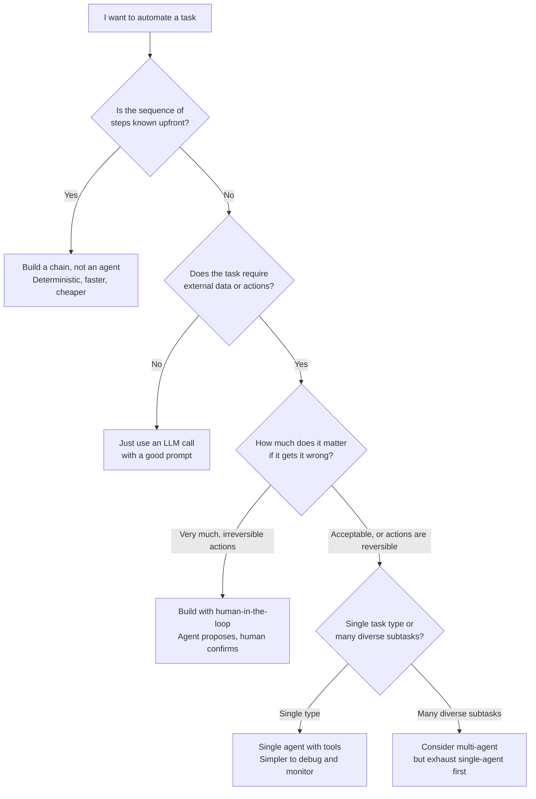
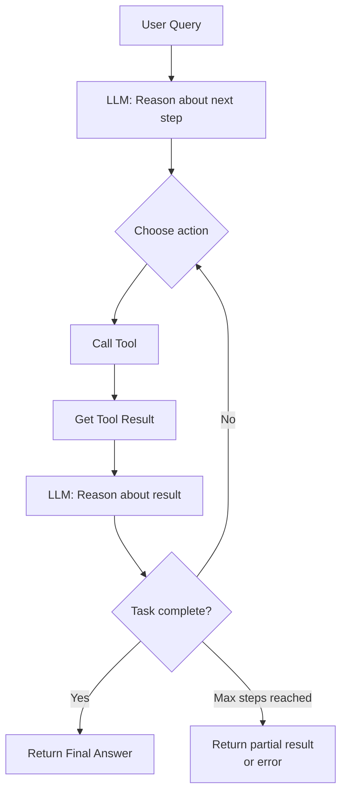
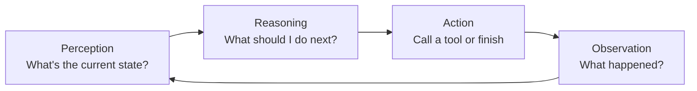

# Agent Fundamentals

> **TL;DR**: An agent is an LLM that can take actions: call tools, read results, and loop until it solves the problem. The ReAct pattern (Reason + Act) is the foundation of almost every agent architecture. The hard parts aren't the LLM call, they're failure recovery, tool error handling, and knowing when to stop. Start with a single-agent, single-tool system before building anything more complex.

**Prerequisites**: [RAG Fundamentals](../03-retrieval-and-rag/01-rag-fundamentals.md), [Training Pipeline](../01-llm-foundations/05-training-pipeline.md)
**Related**: [Tool Use and Function Calling](02-tool-use-and-function-calling.md), [LangGraph Deep Dive](05-langgraph-deep-dive.md), [Agentic Patterns](11-agentic-patterns.md), [Agent Evaluation](../05-evaluation/04-agent-and-e2e-eval.md)

---

## What Is an Agent, Actually?

Agents are one of the most over-marketed concepts in AI right now. Let me cut through it.

An LLM call is a function: `output = llm(prompt)`. It runs once and returns. A chain is a sequence of these functions: `output_3 = llm(llm(llm(prompt)))`. Chains are deterministic, the flow is hardcoded.

An agent is different in one specific way: **the LLM decides what to do next**. Instead of a hardcoded sequence, the LLM examines the current state and chooses an action, sees the result, and decides the next action. This loop continues until the task is done.

That's it. Not magic, not general intelligence. A loop where the LLM controls the flow rather than the programmer.

This is powerful because it handles tasks where you can't predict the sequence of steps needed upfront. "Research this company and write a competitive analysis" requires a dynamic sequence of search queries, reading, summarizing, and synthesizing. You can't hardcode that. But an agent can figure it out.

It's also the source of every agent failure mode. When the LLM controls flow, you get LLM failure modes: wrong tool choices, misreading results, infinite loops, and confident wrong answers.

---

## Should I Build an Agent?




| Use Case                             | Pattern                                                                                          | Why                                       |
| ------------------------------------ | ------------------------------------------------------------------------------------------------ | ----------------------------------------- |
| Answer a FAQ question                | LLM call                                                                                         | No tools needed, no loop                  |
| Retrieve and summarize docs          | RAG chain                                                                                        | Steps are known: retrieve, then summarize |
| Research report with unknown sources | Agent with search tool                                                                           | LLM decides what to search                |
| File expense reports automatically   | Agent with human-in-loop                                                                         | Irreversible financial action             |
| Debug production incidents           | Agent with log/metric tools                                                                      | Unknown sequence of investigation steps   |
| Generate a formatted email           | Prompt with template                                                                             | Deterministic, no external actions        |
| **When to avoid agents**             | Avoid when steps are fixed, latency is critical, or actions can't be undone without confirmation |                                           |


The most common mistake I see is building an agent for a problem that's better solved by a well-crafted chain. Every agent adds latency (multiple LLM calls), cost (more tokens), and debugging complexity. Reserve agents for tasks where the sequence genuinely can't be predetermined.

---

## The ReAct Pattern: How Agents Think

ReAct (Reasoning + Acting) is the foundational pattern. The [original ReAct paper by Yao et al.](https://arxiv.org/abs/2210.03629) from 2022 is worth reading. The idea is simple: interleave reasoning (Thought) with actions (Act) and observations (Observe) in a loop.

```
Thought: I need to find the current stock price of Apple
Act: search("AAPL stock price today")
Observe: Apple (AAPL) is trading at $185.50, up 1.2% today
Thought: I have the price. Now I need to compare it to the 52-week high
Act: search("AAPL 52-week high 2024")
Observe: AAPL 52-week high was $199.62
Thought: I have both numbers. The current price is $14.12 below the 52-week high.
Act: finish("Apple is trading at $185.50, which is 7% below its 52-week high of $199.62")
```

The LLM isn't just answering. It's planning, acting, reading results, and adjusting. This is what makes agents capable of multi-step tasks.




---

## A Minimal ReAct Implementation

Here's a working agent with tool use using the Anthropic SDK. This is the pattern that everything else builds on.

```python
import anthropic
import json

client = anthropic.Anthropic()

def search_web(query: str) -> str:
    # In production, call a real search API
    return f"Search results for '{query}': [placeholder results]"

def calculate(expression: str) -> str:
    try:
        return str(eval(expression))  # noqa: S307 - toy example only
    except Exception as e:
        return f"Error: {e}"

tools = [
    {"name": "search_web", "description": "Search the web for information",
     "input_schema": {"type": "object", "properties": {"query": {"type": "string"}}, "required": ["query"]}},
    {"name": "calculate", "description": "Evaluate a math expression",
     "input_schema": {"type": "object", "properties": {"expression": {"type": "string"}}, "required": ["expression"]}},
]

def run_agent(user_message: str, max_steps: int = 10) -> str:
    messages = [{"role": "user", "content": user_message}]

    for step in range(max_steps):
        response = client.messages.create(
            model="claude-opus-4-6", max_tokens=1024, tools=tools, messages=messages
        )

        if response.stop_reason == "end_turn":
            return response.content[0].text

        tool_results = []
        for block in response.content:
            if block.type == "tool_use":
                fn = {"search_web": search_web, "calculate": calculate}.get(block.name)
                result = fn(**block.input) if fn else f"Unknown tool: {block.name}"
                tool_results.append({"type": "tool_result", "tool_use_id": block.id, "content": result})

        messages.append({"role": "assistant", "content": response.content})
        messages.append({"role": "user", "content": tool_results})

    return "Max steps reached without completing the task."
```

This is under 30 lines of meaningful logic (not counting setup). Notice: the agent loop is just a `for` loop. The LLM decides when to stop (`end_turn`). Tool calls are just function dispatch. The complexity comes from what happens when things go wrong.

---

## The Perception-Action Loop

Every agent follows this cycle regardless of framework or implementation:




**Perception:** The LLM sees the conversation history (previous thoughts, actions, and observations) plus the current user request. This is the entire "state" of the agent. It's just text in the context window.

**Reasoning:** The LLM decides what to do next based on everything in context. This is where the "intelligence" lives. The quality of reasoning is bounded by the model quality and the quality of tool descriptions.

**Action:** Either call a tool or produce a final answer. Tool calls are structured (function name + arguments). The agent waits for the result before continuing.

**Observation:** The tool result goes back into the context. The LLM sees it in the next iteration. Poor results (errors, empty responses, truncated data) directly degrade the next reasoning step.

---

## Tool Design: This Is Where Most Agents Fail

The LLM can only work with what your tools return. Tool design is 50% of agent design.

```python
# Bad: ambiguous, no error handling, wrong return type for the LLM
def get_user(user_id):
    return db.query(f"SELECT * FROM users WHERE id = {user_id}")

# Good: clear return, handles errors, returns LLM-friendly text
def get_user_info(user_id: str) -> str:
    """Get name, email, and plan for a user. Returns 'User not found' if ID is invalid."""
    try:
        user = db.get_user(user_id)
        if not user:
            return f"User not found: {user_id}"
        return f"Name: {user.name}, Email: {user.email}, Plan: {user.plan}"
    except Exception as e:
        return f"Error looking up user {user_id}: {str(e)}"
```

Rules for good tool design:

1. Return strings that read like natural language, not raw JSON blobs
2. Handle errors gracefully and return descriptive error messages (not stack traces)
3. Be specific in the description about what the tool does and doesn't do
4. Include examples in the description when the input format is non-obvious
5. Never return more data than the LLM needs for the task

---

## Failure Modes Table


| Failure Mode          | Description                                                            | Prevention                                                       |
| --------------------- | ---------------------------------------------------------------------- | ---------------------------------------------------------------- |
| Infinite loop         | Agent keeps calling tools without making progress                      | Max steps limit, detect repeated tool calls                      |
| Tool hallucination    | Agent calls a tool with invalid arguments or a tool that doesn't exist | Strict tool schemas with validation, log all tool calls          |
| Observation poisoning | Tool returns misleading data, agent accepts it uncritically            | Validate tool outputs, include confidence/source in returns      |
| Context overflow      | Long conversations exceed context window, agent loses early context    | Summarize history, use external memory for long sessions         |
| Premature stopping    | Agent returns an incomplete answer because it looks done               | Strong system prompt about completion criteria                   |
| Over-tooling          | Agent calls 10 tools when 1 would do                                   | Limit available tools per task, use focused tool sets            |
| Error cascade         | Tool error leads to wrong reasoning leads to wrong next action         | Tools must return explicit errors, prompt LLM to retry on errors |


The most dangerous failure mode in production is the agent taking a confident wrong action. An agent that emails the wrong person, deletes the wrong file, or submits the wrong order is worse than an agent that fails and asks for help.

Design for graceful degradation: when uncertain, the agent should surface its uncertainty rather than guess. Add to your system prompt: "If you're unsure whether you have enough information to complete a step, ask for clarification rather than guessing."

---

## Concrete Numbers

As of early 2025, on Claude Sonnet 4.6:


| Metric                        | Value             | Notes                                      |
| ----------------------------- | ----------------- | ------------------------------------------ |
| Latency per agent step        | 500ms-2s          | One LLM call + tool call roundtrip         |
| Cost per agent step           | $0.003-0.015      | ~2K tokens in/out per step                 |
| Typical task length           | 3-10 steps        | For well-scoped single-domain tasks        |
| Max practical steps           | 15-20             | Quality degrades, context fills up         |
| Context window usage          | 1K-5K tokens/step | Grows with each step (history accumulates) |
| Cost for a 10-step agent task | $0.03-0.15        | Plus tool execution costs                  |


The growing context is a core challenge. A 10-step agent with 2K tokens per step fills 20K tokens of context. A 50-step agent (for complex tasks) needs 100K tokens. You need active context management for long-running agents.

---

## Agents vs Chains vs RAG: When to Use What


| Approach                  | Latency                                   | Cost                                    | Reliability                                           | Best For                                  |
| ------------------------- | ----------------------------------------- | --------------------------------------- | ----------------------------------------------------- | ----------------------------------------- |
| Single LLM call           | 500ms-2s                                  | Low                                     | High                                                  | Q&A, generation, classification           |
| RAG chain                 | 1-3s                                      | Low-medium                              | High                                                  | Knowledge retrieval + generation          |
| Simple agent (3-5 steps)  | 3-10s                                     | Medium                                  | Medium                                                | Multi-step tasks with known tool set      |
| Complex agent (10+ steps) | 30s-5min                                  | High                                    | Low-medium                                            | Open-ended research, complex automation   |
| Multi-agent               | 1-10min                                   | Very high                               | Lower                                                 | Tasks requiring parallel specialized work |
| **When to avoid**         | Avoid chains when steps are truly dynamic | Avoid agents for simple retrieval tasks | Avoid multi-agent unless single agent can't handle it |                                           |


The reliability numbers are important. Each LLM call in an agent loop has some probability of making a suboptimal choice. For a 10-step agent where each step has 90% reliability, the probability of a perfect run is 0.9^10 = 35%. This compounds quickly. Short agents with narrow tool sets are much more reliable than long agents with many tools.

---

## Gotchas and Real-World Lessons

**Agents are harder to debug than functions.** When an agent produces a wrong answer, the problem could be in step 2 of 8. Without logging every step, you have no idea where it went wrong. Log every tool call, every tool result, every intermediate reasoning step. This is not optional for production.

**The system prompt is load-bearing.** The agent's personality, decision-making style, and error handling behavior all live in the system prompt. "If a tool returns an error, describe what you tried and why it failed, then try an alternative approach" is the kind of instruction that makes agents recoverable. Without it, the agent often either loops or gives up silently.

**Tool descriptions are more important than you think.** The LLM decides which tool to call based on the description. An ambiguous description leads to wrong tool selection. A description like "search the knowledge base" when you have both a general search and a specialized product search tool will cause the wrong one to be called 30% of the time. Be specific.

**Parallel tool calls change the game.** Claude and GPT-4 support calling multiple tools in a single step. For agents that need to look up 5 things independently, parallel tool calls reduce latency by 5x. Most agent frameworks support this. Use it.

**Human-in-the-loop is a feature, not a limitation.** For irreversible actions (send email, charge card, delete file), build a confirmation step into the loop. The agent proposes the action, a human approves, then the agent executes. This dramatically reduces the blast radius of agent errors and builds user trust. [LangGraph](05-langgraph-deep-dive.md) has first-class support for this pattern.

**Max steps is not just a safety rail.** When an agent hits max steps, it usually means the task was too complex or the tools weren't sufficient. Log when this happens. If 20% of tasks hit max steps, you have a design problem, not a limit problem.

**Context accumulates silently.** After 10+ agent steps, the context window is full of tool results, most of which are no longer relevant. The LLM starts "forgetting" early instructions and making worse decisions. Implement context summarization for long-running agents.

---

> **Key Takeaways:**
>
> 1. An agent is an LLM in a loop that chooses its own next action. The ReAct pattern (Reason, Act, Observe) is the foundation.
> 2. Tool design is 50% of agent quality. Tools must return clear, useful text and handle errors gracefully.
> 3. Each agent step adds latency and cost. A 10-step agent costs 10x a single LLM call. Start simple.
>
> *"An agent is only as reliable as its worst tool call. Design tools like APIs: predictable input, clear output, explicit errors."*

---

## Interview Questions

**Q: Design an agent for automated code review. What are the key components?**

I'd start by scoping what "automated code review" means. There's a big difference between "flag potential issues in a diff" (probably better as a chain) and "investigate the full context of a change across multiple files, suggest specific fixes, and post a comment" (needs an agent). Let me design the latter.

The core agent loop would have these tools: read a specific file, list files in a directory, search for function/class definitions, run static analysis (pylint/ESLint), look up similar patterns in the codebase, and post a review comment. The agent would receive a PR diff and iterate: read changed files, understand what they do, look at how they're used elsewhere, run static analysis, and formulate specific review comments.

The tricky design decisions are scope and termination. Code review can spiral: you read one file, find an import, want to understand that module, then its tests, then related files. You need to bound this with a max depth (don't go more than 2 files removed from the original diff) and a max steps limit. I'd also want the agent to distinguish between "blocking issues" (security vulnerabilities, obvious bugs) and "suggestions" (style, optimization). The output format matters: GitHub review comments at specific line numbers, not a wall of text.

For reliability, every file read and static analysis result should be logged. The agent should cite which file and line it's referencing for each comment. If the static analysis tool fails or returns garbage, the agent should note that rather than silently skipping it.

*Follow-up: "How do you prevent false positives from annoying developers?"*

Two mechanisms. First, confidence calibration: the agent should rate each comment's confidence (high/medium/low) and only auto-post high-confidence comments; medium and low confidence go to a human reviewer queue. Second, feedback loop: when developers dismiss a comment as incorrect, that gets logged and eventually fed back into the system prompt or as few-shot examples. The pattern "our LLM flags X as an issue but it's always wrong" gets codified as "don't flag X."

---

**Q: Your agent is working correctly in testing but making mistakes in production. How do you debug it?**

The first thing I'd check is whether the production inputs look like the test inputs. Distribution shift is the most common cause of this pattern. I'd pull a sample of failing production queries and compare their structure, length, and vocabulary to the test cases. If production users ask longer questions, use more jargon, or include context the test suite didn't cover, that's the root cause.

Second, I'd look at tool output quality in production. Test environments often have mocked or simplified tools. Production tools return real data with all its messiness: truncated results, rate limits, ambiguous responses. I'd add structured logging to capture every tool call and result for the failing queries and look for patterns. Is a specific tool returning degraded data? Is a certain query pattern causing a tool to time out?

Third, I'd check context length. If production conversations are longer (more turns, more history), the agent might be hitting context limits that don't appear in short test sessions. The symptom is the agent "forgetting" things it was told early in the conversation.

The fix for all of these starts with visibility. If I don't have per-step logging in production, I add it immediately. You can't debug what you can't observe. Once I can see what the agent is "thinking" at each step, the failure mode is usually obvious.

---

**Quick-fire Questions**


| Question                                       | Answer                                                                                                                    |
| ---------------------------------------------- | ------------------------------------------------------------------------------------------------------------------------- |
| What is ReAct?                                 | Reasoning + Acting: interleave reasoning steps with tool calls in a loop; foundational agent pattern                      |
| What makes an agent different from a chain?    | The LLM decides the next action dynamically; chains have hardcoded sequences                                              |
| How do you prevent agent infinite loops?       | Max steps limit, detect repeated tool calls, strong system prompt about completion criteria                               |
| What is the main cost driver in agent systems? | Multiple LLM calls per task; a 10-step agent costs roughly 10x a single LLM call                                          |
| What is human-in-the-loop in an agent context? | Adding a human confirmation step before irreversible actions like sending emails or deleting files                        |
| Why is tool description quality important?     | The LLM selects tools based on descriptions; ambiguous descriptions cause wrong tool selection                            |
| What is context accumulation in agents?        | Each agent step adds to the context window; long-running agents can overflow or degrade due to irrelevant history         |
| When should you not use an agent?              | When steps are known upfront (use a chain), when latency is critical, or when actions are irreversible without safeguards |


