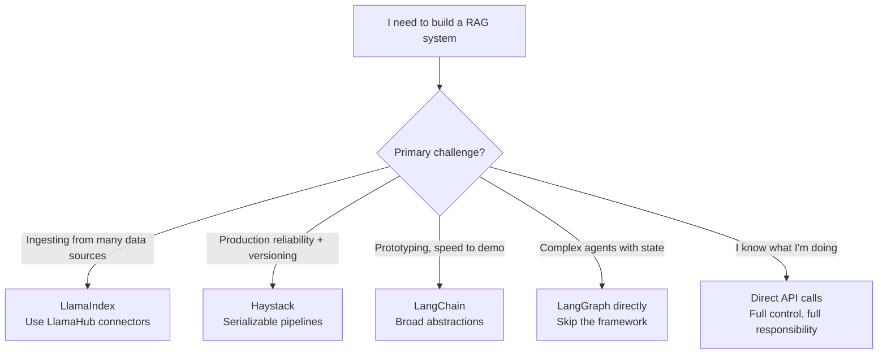

# LlamaIndex and Haystack

> **TL;DR**: LlamaIndex specializes in data ingestion and indexing for RAG: great connectors, flexible index types, and solid retrieval abstractions. Haystack is a pipeline framework with strong production tooling and a clean component model. Both are alternatives to LangChain for building RAG systems. LlamaIndex if your main challenge is data; Haystack if your main challenge is production reliability.

**Prerequisites**: [RAG Fundamentals](../03-retrieval-and-rag/01-rag-fundamentals.md), [Agent Fundamentals](01-agent-fundamentals.md)
**Related**: [LangChain Overview](04-langchain-overview.md), [Vector Databases](../03-retrieval-and-rag/04-vector-databases.md), [Advanced RAG Patterns](../03-retrieval-and-rag/09-advanced-rag-patterns.md)

---

## LlamaIndex: The Data Framework

LlamaIndex (formerly GPT Index) positions itself as the data framework for LLMs. Its strength is in the richness of its data connectors and indexing strategies, not in agent orchestration.

### What Makes LlamaIndex Different

The core abstraction is the `Index`: a data structure over your documents that enables efficient retrieval. LlamaIndex has multiple index types, each optimized for different query patterns.

```python
from llama_index.core import VectorStoreIndex, SimpleDirectoryReader
from llama_index.core.node_parser import SemanticSplitterNodeParser
from llama_index.embeddings.openai import OpenAIEmbedding

# Load documents (supports 50+ data sources)
documents = SimpleDirectoryReader("./data").load_data()

# Parse into nodes with semantic splitting
embed_model = OpenAIEmbedding()
splitter = SemanticSplitterNodeParser(embed_model=embed_model)
nodes = splitter.get_nodes_from_documents(documents)

# Build index
index = VectorStoreIndex(nodes)
query_engine = index.as_query_engine(similarity_top_k=3)

result = query_engine.query("What is the refund policy for software products?")
print(result.response)
print(result.source_nodes)  # which nodes were retrieved
```

### Index Types

| Index Type | How It Retrieves | Best For |
|---|---|---|
| `VectorStoreIndex` | Semantic similarity | General Q&A |
| `SummaryIndex` | Summarizes all nodes | Summarization tasks |
| `KeywordTableIndex` | Keyword matching | Keyword-sensitive queries |
| `KnowledgeGraphIndex` | Graph traversal | Multi-hop reasoning |
| `SubQuestionQueryEngine` | Decomposes into sub-questions | Complex multi-part queries |

### The LlamaHub Ecosystem

LlamaHub (hub.llamaindex.ai) has 300+ data connectors maintained by the community. Confluence, Notion, Slack, Google Drive, Salesforce, web scraping, database readers. If you need to ingest from an unusual data source, there's likely a LlamaHub reader for it.

```python
from llama_index.readers.confluence import ConfluenceReader
from llama_index.readers.notion import NotionPageReader

# Load from Confluence
confluence_reader = ConfluenceReader(base_url="https://company.atlassian.net")
documents = confluence_reader.load_data(space_key="DOCS")

# Load from Notion
notion_reader = NotionPageReader(integration_token="secret_...")
documents = notion_reader.load_data(page_ids=["page-id-1", "page-id-2"])
```

### LlamaIndex Agents

LlamaIndex has agent capabilities, but this is not its strongest suit. The `ReActAgent` works but has the same debuggability issues as LangChain's agent. Use LangGraph for complex agents, LlamaIndex for data infrastructure.

```python
from llama_index.core.agent import ReActAgent
from llama_index.core.tools import QueryEngineTool

# Turn your index into a tool for an agent
query_tool = QueryEngineTool.from_defaults(
    query_engine=index.as_query_engine(),
    name="knowledge_base",
    description="Search the company knowledge base for policies and procedures"
)

agent = ReActAgent.from_tools([query_tool], verbose=True)
response = agent.chat("What are the vacation policies for contractors?")
```

---

## Haystack: The Pipeline Framework

Haystack (from deepset) takes a different approach. Instead of a data-first framework, Haystack is built around composable, type-safe pipelines. Every component has defined input/output types. Pipelines validate that connections are type-compatible at build time.

### Pipeline Architecture

```python
from haystack import Pipeline
from haystack.components.retrievers.in_memory import InMemoryBM25Retriever
from haystack.components.generators import OpenAIGenerator
from haystack.components.builders import PromptBuilder

prompt_template = """
Answer the question based on the given context.
Context: {{ doc.content }}
Question: {{ question }}
Answer:
"""

pipeline = Pipeline()
pipeline.add_component("retriever", InMemoryBM25Retriever(document_store=document_store))
pipeline.add_component("prompt_builder", PromptBuilder(template=prompt_template))
pipeline.add_component("generator", OpenAIGenerator(model="gpt-4o"))

# Connect components with explicit typing
pipeline.connect("retriever.documents", "prompt_builder.documents")
pipeline.connect("prompt_builder.prompt", "generator.prompt")

result = pipeline.run({"retriever": {"query": "What is the refund policy?"}, "prompt_builder": {"question": "What is the refund policy?"}})
```

The explicit component connections and type-checking catch configuration errors at pipeline build time, not at runtime.

### What Haystack Does Well

**Production robustness:** Haystack's components are well-tested and have consistent interfaces. The framework has been in production at enterprise customers since 2020.

**Serialization:** Pipelines can be serialized to YAML for version control:

```yaml
# pipeline.yaml
components:
  retriever:
    type: haystack.components.retrievers.in_memory.InMemoryBM25Retriever
  generator:
    type: haystack.components.generators.OpenAIGenerator
    init_parameters:
      model: gpt-4o
connections:
  - sender: retriever.documents
    receiver: prompt_builder.documents
```

This makes pipeline versioning natural. Changes to a pipeline are visible in git diff.

**Evaluation integration:** Haystack integrates with evaluation metrics natively and has a straightforward path to running evals on pipelines.

---

## LlamaIndex vs Haystack vs LangChain

| Dimension | LlamaIndex | Haystack | LangChain |
|---|---|---|---|
| Primary strength | Data ingestion, indexing | Production pipelines | Broad ecosystem |
| Debugging | Medium | Good (type-safe connections) | Hard |
| Data connectors | Excellent (300+) | Good (100+) | Good (200+) |
| Agent support | Basic | Basic | Mature (with LangGraph) |
| Serialization | Limited | Excellent (YAML) | Limited |
| Learning curve | Medium | Medium | High |
| Production maturity | Medium | High | Medium |
| Best for | RAG over many data sources | Reliable, versioned pipelines | Prototyping |

### The Decision Flow



---

## When to Choose LlamaIndex

- Your data lives in 5+ different sources (Confluence, Notion, SQL, S3, etc.)
- You need to experiment with different index types (vector, knowledge graph, summary)
- The main problem is "getting data in" rather than "controlling the pipeline"
- You want a high-level query engine and don't need fine-grained control

## When to Choose Haystack

- You need serializable, version-controlled pipelines
- You have a team that needs to maintain pipelines without deep Python knowledge (YAML config)
- Production reliability matters more than rapid iteration
- You're building enterprise applications with compliance requirements (Haystack has audit logging)

## When to Skip Both

If your RAG system is straightforward (one or two data sources, standard retrieval), writing it directly with the provider SDK and a vector database client is simpler than learning either framework's abstractions.

---

## Gotchas

**LlamaIndex version fragmentation.** LlamaIndex went through a major architecture change in v0.10 (monorepo to separate packages). Code from tutorials before 2024 may use the old API. Check which version the tutorial targets.

**Haystack's learning curve is the component model.** Once you understand that every component has typed inputs and outputs and connections are explicit, Haystack clicks. Before that, the pipeline construction feels verbose.

**Neither handles complex agents well.** Both have agent implementations but neither has the explicit state management and branching control of LangGraph. If agents are central to your system, use LangGraph and use LlamaIndex or Haystack for the retrieval components only.

---

> **Key Takeaways:**
> 1. LlamaIndex excels at data ingestion (300+ connectors) and RAG-specific indexing strategies. Use it when the hard problem is getting data in.
> 2. Haystack's type-safe, serializable pipelines are better suited for production reliability and team-based maintenance. Use it when the hard problem is running reliably.
> 3. For complex agents, neither replaces LangGraph. They're retrieval frameworks, not agent orchestration frameworks.
>
> *"Pick your framework based on where your actual pain is: data access (LlamaIndex), pipeline reliability (Haystack), or agent complexity (LangGraph)."*

---

## Interview Questions

**Q: How would you choose between LlamaIndex and Haystack for an enterprise document Q&A system that needs to pull from Confluence, SharePoint, and a SQL database?**

The data ingestion requirement points toward LlamaIndex. It has pre-built connectors for all three sources in LlamaHub. Writing custom loaders for Confluence and SharePoint from scratch would take a week. LlamaIndex's readers handle pagination, authentication, and incremental updates.

That said, if the enterprise has compliance requirements (audit logging, reproducible pipelines, version-controlled configurations), I'd evaluate Haystack for the pipeline layer while using LlamaIndex's connectors for ingestion only. The combination works: use LlamaIndex to load and chunk documents, write them to a shared document store, then use Haystack's pipeline for the retrieval and generation.

The thing I'd validate: does LlamaIndex's SharePoint connector handle the company's auth configuration (modern auth vs legacy, permission scoping)? These connectors are community-maintained and quality varies. For production, I'd test each connector against actual data before committing to the architecture.

---

**Quick-fire Questions**

| Question | Answer |
|---|---|
| What is LlamaHub? | LlamaIndex's registry of 300+ community data connectors for loading from external sources |
| What makes Haystack's pipeline model distinctive? | Type-safe connections between components; pipelines serialize to YAML for version control |
| Which framework is better for complex stateful agents? | LangGraph; neither LlamaIndex nor Haystack have comparable agent state management |
| What is LlamaIndex's `SubQuestionQueryEngine`? | An index type that decomposes complex queries into sub-questions and merges the results |
| What changed in LlamaIndex v0.10? | Monorepo split into separate packages (llama-index-core, llama-index-readers-*, etc.) |
| When would you skip both frameworks entirely? | Simple single-source RAG systems where direct API calls with a vector DB client are cleaner |
