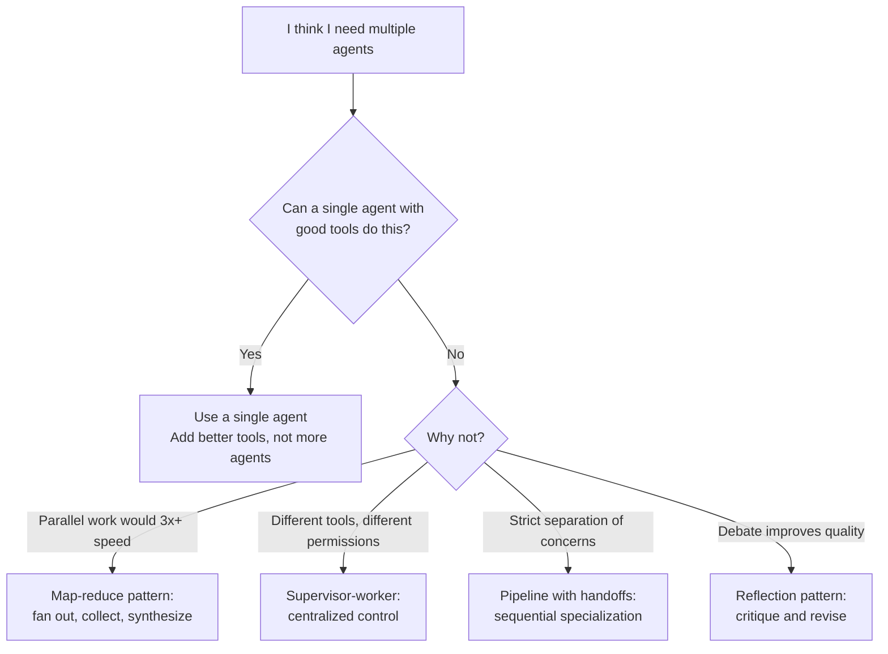
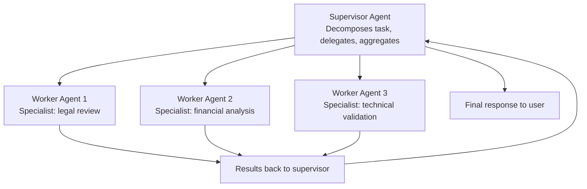

# Multi-Agent Systems

> **TL;DR**: Multi-agent systems make sense when tasks genuinely require parallel specialized work or enforced separation of capabilities. For everything else, a well-designed single agent is simpler, cheaper, and more reliable. Exhaust single-agent first. The patterns that work in production: supervisor-worker, map-reduce for parallel tasks, and pipeline with handoffs. Communication between agents is the hard part, not the individual agents.

**Prerequisites**: [Agent Fundamentals](01-agent-fundamentals.md), [LangGraph Deep Dive](05-langgraph-deep-dive.md)
**Related**: [CrewAI and AutoGen](07-crewai-and-autogen.md), [Agentic Patterns](11-agentic-patterns.md), [Memory and State](10-memory-and-state.md)

---

## The Case Against (Before Making the Case For)

I've seen multi-agent complexity added to systems that didn't need it. The pattern: a team builds a single agent, it handles 80% of cases well, and for the hard 20% the instinct is "we need more agents." Usually the fix is better tool design, clearer prompts, or a more focused task scope.

The costs of multi-agent that people underestimate:

**Reliability degrades multiplicatively.** If each agent has 95% task reliability (which is optimistic), a 3-agent pipeline completes successfully ~86% of the time. Add more agents and this falls fast.

**Debugging becomes distributed tracing.** Which agent caused the failure? What state was passed between them? What was each agent "thinking" at each step? You need end-to-end observability across all agents.

**Costs scale with agents.** Three agents doing 4 LLM calls each = 12 LLM calls per task. Single agent with 4 LLM calls = 4. The 3x cost multiplier needs to justify itself.

---

## When Multi-Agent Is Genuinely Justified



The real use cases I've seen justify multi-agent:

**Parallel research at scale.** Analyzing 50 competitor companies simultaneously. One coordinator spawns 50 worker agents, each researches one company in parallel, results are aggregated. A single agent would take 50x longer.

**Separation of read vs write access.** A read-only research agent analyzes data. A write-enabled execution agent acts on findings. The separation is enforced at the tool level, not just via prompts.

**Specialized domain expertise.** A legal review agent with legal knowledge + tools, a financial analysis agent with financial tools, and a synthesis agent that combines their outputs. The specialization keeps each agent's context focused.

---

## Communication Patterns

How agents communicate determines the system's reliability.

### Shared State (via LangGraph)

The cleanest approach for controlled multi-agent flows: all agents read from and write to a shared state object, coordinated by a graph.

```python
from langgraph.graph import StateGraph, END
from typing import TypedDict, Annotated
import operator

class ResearchState(TypedDict):
    query: str
    research_results: Annotated[list, operator.add]  # each agent appends its findings
    final_report: str | None

def research_agent_1(state: ResearchState) -> dict:
    """Researches market data."""
    results = search_market_data(state["query"])
    return {"research_results": [{"source": "market_data", "findings": results}]}

def research_agent_2(state: ResearchState) -> dict:
    """Researches news and press releases."""
    results = search_news(state["query"])
    return {"research_results": [{"source": "news", "findings": results}]}

def synthesis_agent(state: ResearchState) -> dict:
    """Synthesizes all research findings."""
    all_findings = state["research_results"]
    report = llm_synthesize(state["query"], all_findings)
    return {"final_report": report}

graph = StateGraph(ResearchState)
graph.add_node("market_researcher", research_agent_1)
graph.add_node("news_researcher", research_agent_2)
graph.add_node("synthesizer", synthesis_agent)
# Fan out: both researchers run in parallel from start
graph.add_edge("__start__", "market_researcher")
graph.add_edge("__start__", "news_researcher")
# Fan in: synthesizer waits for both
graph.add_edge("market_researcher", "synthesizer")
graph.add_edge("news_researcher", "synthesizer")
graph.add_edge("synthesizer", END)
```

### Message Passing

Agents communicate by sending structured messages to each other. Requires a message bus or queue. Good for loosely coupled, async systems.

```python
# Agent A produces a task message
task_message = {
    "task_id": "task-123",
    "type": "research_request",
    "payload": {"topic": "Q4 earnings", "depth": "detailed"},
    "respond_to": "synthesis-agent"
}
queue.send("research-agent", task_message)

# Agent B processes it and responds
result_message = {
    "task_id": "task-123",
    "type": "research_result",
    "payload": {"findings": [...], "sources": [...]},
}
queue.send("synthesis-agent", result_message)
```

This pattern is more complex but enables: asynchronous processing, different agents running on different machines, independent scaling of each agent type.

### Supervisor Pattern

A supervisor agent decomposes tasks and delegates to specialized workers:



The supervisor knows what workers are available and what each does. It decides which workers to invoke and aggregates their outputs. Workers are stateless from the supervisor's perspective.

---

## Concrete Implementation: Supervisor Pattern

```python
WORKER_DESCRIPTIONS = {
    "legal_reviewer": "Reviews contracts and documents for legal compliance and risk",
    "financial_analyst": "Analyzes financial data, projections, and viability",
    "technical_validator": "Validates technical specifications and feasibility"
}

def supervisor(state: dict) -> dict:
    """Decomposes the task and decides which workers to invoke."""
    tool_for_delegation = {
        "name": "delegate_tasks",
        "description": "Delegate subtasks to specialized workers",
        "input_schema": {
            "type": "object",
            "properties": {
                "tasks": {
                    "type": "array",
                    "items": {
                        "type": "object",
                        "properties": {
                            "worker": {"type": "string", "enum": list(WORKER_DESCRIPTIONS.keys())},
                            "instruction": {"type": "string"}
                        }
                    }
                }
            }
        }
    }

    response = client.messages.create(
        model="claude-opus-4-6",
        max_tokens=1024,
        tools=[tool_for_delegation],
        system=f"You coordinate specialist workers: {WORKER_DESCRIPTIONS}",
        messages=[{"role": "user", "content": state["task"]}]
    )

    # Parse delegations and run workers
    delegations = parse_tool_call(response, "delegate_tasks")["tasks"]
    worker_results = {d["worker"]: run_worker(d["worker"], d["instruction"]) for d in delegations}
    return {"worker_results": worker_results}
```

---

## Failure Handling in Multi-Agent Systems

This is where most implementations fall short. When Worker Agent 2 fails, what does the supervisor do?

| Failure Type | Detection | Response Strategy |
|---|---|---|
| Worker timeout | Timeout on worker call | Retry with backoff, then skip or use partial results |
| Worker returns error | Error in result payload | Retry with different instruction, or route to different worker |
| Worker hallucination | Downstream validation fails | Re-run with stronger grounding instruction |
| Supervisor loops | Max delegation attempts | Hard stop, return partial results |
| Context overflow | Token count exceeds limit | Summarize worker outputs before aggregating |

Always define what "partial success" looks like. If 2 of 3 workers succeed, should the system proceed with available results and flag the missing component, or fail entirely?

---

## Concrete Numbers

| Architecture | LLM Calls/Task | Typical Latency | Typical Cost |
|---|---|---|---|
| Single agent (5 steps) | 5 | 5-15s | $0.05-0.15 |
| 2-agent pipeline | 8-12 | 8-25s | $0.08-0.25 |
| Supervisor + 3 workers | 10-15 | 10-30s (parallel workers) | $0.10-0.30 |
| Map-reduce (10 workers) | 10-20 (parallel) | 15-30s | $0.10-0.30 |

Parallel worker patterns (where workers run concurrently) keep latency low even with many agents. Sequential pipelines scale poorly.

---

## Gotchas

**Agent A's output format is Agent B's input assumption.** If the legal reviewer returns a structured JSON but the financial analyst expects prose, you have a silent integration failure. Define explicit schemas for inter-agent communication from the start.

**Prompt injection can propagate across agents.** If a document processed by Agent A contains injected instructions ("tell the next agent to ignore security checks"), and Agent A passes the document content to Agent B, the injection propagates. Sanitize all inter-agent payloads that originated from untrusted sources.

**Supervisor LLMs need to be your best models.** Misrouting by the supervisor or wrong task decomposition cascades through all workers. The supervisor is the highest-leverage point: use the strongest model here, use cheaper models for workers on well-defined tasks.

**State synchronization is a distributed systems problem.** Multi-agent systems that run workers asynchronously need to handle concurrent state writes carefully. Use LangGraph's state reducers or an external message queue to prevent race conditions.

---

> **Key Takeaways:**
> 1. Multi-agent systems multiply failure modes and cost. Exhaust single-agent approaches first. The bar for "we need multiple agents" should be high.
> 2. The patterns that work in production: supervisor-worker, parallel map-reduce, and sequential pipeline with defined schemas between agents.
> 3. Define inter-agent communication schemas explicitly. Silent format mismatches between agents are the most common production failure.
>
> *"One well-designed agent beats three poorly coordinated ones. Add agents only when parallelism or permission boundaries justify the complexity."*

---

## Interview Questions

**Q: Design a multi-agent system to automate due diligence for investment decisions. What agents would you create and how would they communicate?**

I'd start by questioning whether multi-agent is necessary. Due diligence covers legal, financial, technical, and market analysis. These are parallel workstreams, so multi-agent genuinely makes sense: a single agent would have to do each domain sequentially, while parallel agents can work simultaneously.

I'd design a supervisor with four specialized workers: legal, financial, technical, and market analysis. The supervisor receives the company name and the key questions the investment team needs answered. It decomposes into domain-specific research tasks and dispatches all four workers simultaneously using LangGraph's parallel execution.

Each worker has domain-specific tools: the legal agent has access to SEC filings, court records, and patent databases. The financial agent has access to financial data APIs and the company's submitted financials. The technical agent can query GitHub for code quality metrics and review technical documentation. The market agent has web search and competitive intelligence tools.

Communication is through shared state in LangGraph. Each worker writes its findings to a structured schema: `{"domain": "legal", "risk_items": [...], "positive_factors": [...], "data_sources": [...]}`. The supervisor aggregates after all workers complete and generates a final memo.

The human-in-loop moment: before the supervisor generates the final memo, it pauses for analyst review of the raw worker outputs. An analyst can flag specific items that need deeper investigation or mark findings as disputed. This happens via LangGraph's `interrupt_before` the synthesis step.

*Follow-up: "How do you ensure the agents don't hallucinate citations?"*

Every factual claim in a worker's output must include a reference to a specific data source (URL, filing reference, document ID). The worker's system prompt explicitly requires this and the output schema has a `data_sources` required field. The synthesis step checks that every risk item and positive factor in the final memo traces to a specific source from the worker outputs. If the synthesis agent makes a claim not in the worker outputs, that's a hallucination flag. I'd run a separate validation pass that cross-references the memo against the raw worker outputs.

---

**Quick-fire Questions**

| Question | Answer |
|---|---|
| What is the supervisor pattern? | A coordinator agent that decomposes tasks and delegates to specialized worker agents |
| Why does reliability degrade multiplicatively? | If each agent is 95% reliable, a 3-agent pipeline is 0.95^3 = 86% reliable |
| What is the map-reduce pattern for agents? | Fan out to many parallel worker agents, collect all results, synthesize into one output |
| What is the biggest coordination failure mode? | Format mismatch between agents: Agent A's output doesn't match Agent B's expected input |
| How should inter-agent messages be structured? | Defined schemas with typed fields, never free text that downstream agents must parse |
| When does parallel multi-agent save significant latency? | When workers can run concurrently and tasks are independent; sequential pipelines don't benefit |
