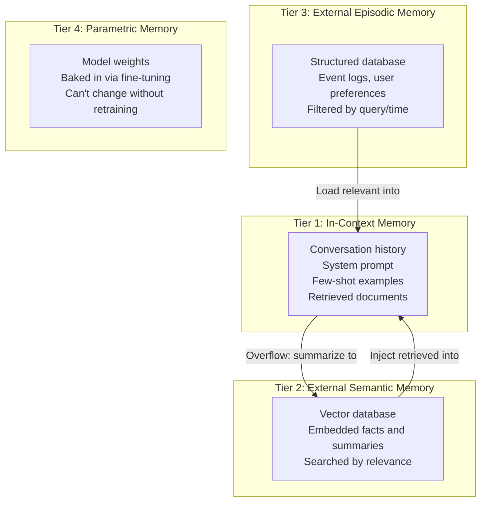

# Memory and State Management

> **TL;DR**: LLMs are stateless functions. Every "memory" feature you see in AI products is an engineering decision about what to serialize and deserialize around that function call. The four memory tiers are: in-context (fast, limited), external semantic (vector search), external episodic (structured logs), and parametric (baked into weights). Most applications need tiers 1-3. Design memory before you need it.

**Prerequisites**: [Agent Fundamentals](01-agent-fundamentals.md), [LangGraph Deep Dive](05-langgraph-deep-dive.md)
**Related**: [RAG Fundamentals](../03-retrieval-and-rag/01-rag-fundamentals.md), [Agentic Patterns](11-agentic-patterns.md), [Context Windows](../01-llm-foundations/04-context-windows.md)

---

## The Core Insight

`output = LLM(prompt)`. No state between calls. When you call the API again, the model has zero memory of the previous call. Every user interaction starting with "remember when we talked about X?" only works if X is in the current context window.

This is not a bug, it's a design choice. It makes LLMs stateless, scalable, and cheap to serve. Your job as an application engineer is to decide what state to maintain, where to store it, and when to load it back into context.

---

## The Four Memory Tiers



| Tier | Storage | Access | Capacity | Cost | Freshness |
|---|---|---|---|---|---|
| In-context | Context window | Instant | 1K-200K tokens | High per token | Real-time |
| Semantic | Vector DB | ~10ms | Unlimited | Low per query | Minutes (index latency) |
| Episodic | SQL/NoSQL | ~5ms | Unlimited | Low | Real-time |
| Parametric | Model weights | Instant | Bounded by training | Very high (retraining) | Static |

**When to use each:**
- In-context: current conversation, critical instructions, recent context
- Semantic: facts, summaries of past conversations, user knowledge
- Episodic: structured events (purchases, preferences, past queries)
- Parametric: style, domain vocabulary, behavior patterns that never change

---

## Conversation Memory: The Basic Case

The simplest memory pattern: keep the full conversation history.

```python
from anthropic import Anthropic

client = Anthropic()

class ConversationMemory:
    def __init__(self, system_prompt: str, max_tokens: int = 50000):
        self.system = system_prompt
        self.messages = []
        self.max_tokens = max_tokens

    def chat(self, user_message: str) -> str:
        self.messages.append({"role": "user", "content": user_message})

        # Prune if too long (rough token estimate)
        while sum(len(m["content"].split()) * 1.3 for m in self.messages) > self.max_tokens:
            self.messages = self.messages[2:]  # remove oldest user+assistant pair

        response = client.messages.create(
            model="claude-opus-4-6",
            max_tokens=1024,
            system=self.system,
            messages=self.messages
        )
        assistant_reply = response.content[0].text
        self.messages.append({"role": "assistant", "content": assistant_reply})
        return assistant_reply
```

This works for short conversations. The problem: as conversations grow, token costs grow linearly and at some point you hit the context limit.

---

## Summarization: The Sliding Window Solution

Instead of dropping messages, summarize them:

```python
def summarize_conversation(messages: list[dict]) -> str:
    summary_prompt = f"""Summarize this conversation concisely. Preserve:
- Key facts stated by the user (name, preferences, specific requirements)
- Decisions made
- Open questions

Conversation:
{format_messages(messages)}"""

    response = client.messages.create(
        model="claude-opus-4-6",
        max_tokens=512,
        messages=[{"role": "user", "content": summary_prompt}]
    )
    return response.content[0].text

class SummarizingMemory:
    def __init__(self, system_prompt: str, summary_threshold: int = 20):
        self.system = system_prompt
        self.messages = []
        self.summary = ""
        self.summary_threshold = summary_threshold

    def chat(self, user_message: str) -> str:
        if len(self.messages) > self.summary_threshold:
            self.summary = summarize_conversation(self.messages[:-4])
            self.messages = self.messages[-4:]  # keep last 2 exchanges

        self.messages.append({"role": "user", "content": user_message})

        system_with_summary = self.system
        if self.summary:
            system_with_summary += f"\n\nConversation summary so far:\n{self.summary}"

        response = client.messages.create(
            model="claude-opus-4-6",
            max_tokens=1024,
            system=system_with_summary,
            messages=self.messages
        )
        assistant_reply = response.content[0].text
        self.messages.append({"role": "assistant", "content": assistant_reply})
        return assistant_reply
```

---

## Persistent Memory: Cross-Session State

For agents that need to remember across sessions (user preferences, past interactions, learned context):

```python
import json
from datetime import datetime

class PersistentUserMemory:
    def __init__(self, user_id: str, db):
        self.user_id = user_id
        self.db = db

    def remember(self, key: str, value: str):
        """Store a fact about the user."""
        self.db.upsert("user_memory", {
            "user_id": self.user_id,
            "key": key,
            "value": value,
            "updated_at": datetime.utcnow().isoformat()
        })

    def recall(self) -> str:
        """Load all known facts about the user for context injection."""
        facts = self.db.query("user_memory", user_id=self.user_id)
        if not facts:
            return ""
        lines = [f"- {f['key']}: {f['value']}" for f in facts]
        return "Known facts about this user:\n" + "\n".join(lines)
```

The `recall()` output gets injected into the system prompt at the start of each session. The agent can update memories by calling `remember()` when it learns something new.

---

## Semantic Memory: Searching Past Conversations

For long-running agents with many past interactions, vector search retrieves relevant memories:

```python
from sentence_transformers import SentenceTransformer
import chromadb

class SemanticMemory:
    def __init__(self, user_id: str):
        self.user_id = user_id
        self.model = SentenceTransformer("all-MiniLM-L6-v2")
        self.db = chromadb.Client()
        self.collection = self.db.get_or_create_collection(f"memory_{user_id}")

    def store(self, text: str, metadata: dict = None):
        embedding = self.model.encode([text])[0].tolist()
        self.collection.add(
            documents=[text],
            embeddings=[embedding],
            metadatas=[metadata or {}],
            ids=[f"{self.user_id}_{len(self.collection.get()['ids'])}"]
        )

    def retrieve(self, query: str, top_k: int = 3) -> list[str]:
        q_embedding = self.model.encode([query])[0].tolist()
        results = self.collection.query(query_embeddings=[q_embedding], n_results=top_k)
        return results["documents"][0]
```

Use this for: past conversation highlights, user-stated preferences, learned facts about the user's domain.

---

## Mem0 and Zep: Managed Memory

Building memory infrastructure from scratch is non-trivial. Two libraries worth evaluating:

**[Mem0](https://mem0.ai/)** provides automatic memory extraction and retrieval. The agent calls `mem0.add(messages)` after each conversation, Mem0 extracts key facts automatically using an LLM, and stores them. Retrieval is semantic. Good for: automating "what did we learn about this user?" without manual memory curation.

```python
from mem0 import Memory

m = Memory()
# Mem0 automatically extracts and stores memories from the conversation
m.add("The user prefers Python over JavaScript and works on ML projects.", user_id="alice")
results = m.search("What does the user prefer?", user_id="alice")
# Returns: [{"memory": "Prefers Python over JavaScript...", "score": 0.95}]
```

**[Zep](https://www.getzep.com/)** focuses on long-term memory for conversational agents. It automatically summarizes conversations, extracts entities and facts, and handles memory retrieval. More opinionated than Mem0 but more turnkey for conversation-first applications.

| Tool | Best For | Self-hostable | Cost |
|---|---|---|---|
| Mem0 | Auto memory extraction, multi-user | Yes | Free OSS / paid cloud |
| Zep | Conversation-first long-term memory | Yes | Free OSS / paid cloud |
| LangGraph checkpointer | Stateful graph persistence | Yes | Free |
| Custom vector DB | Full control | Yes | Infra costs only |

---

## LangGraph State as Memory

For agents built with LangGraph, the graph state IS the memory. The checkpointer persists it automatically:

```python
from langgraph.checkpoint.postgres import PostgresSaver

class AgentState(TypedDict):
    messages: Annotated[list, operator.add]
    user_preferences: dict
    task_history: list[str]
    session_summary: str | None

# The checkpointer saves state after every node
app = graph.compile(checkpointer=PostgresSaver.from_conn_string(DB_URL))

# Same thread_id = same persistent session
config = {"configurable": {"thread_id": f"user-{user_id}"}}
result = app.invoke(user_input, config=config)
# State is automatically persisted; next call with same thread_id continues where we left off
```

This is the cleanest memory pattern for LangGraph agents. No separate memory library needed.

---

## Concrete Numbers

| Memory Operation | Latency | Notes |
|---|---|---|
| In-context (no retrieval) | 0ms | Already in the prompt |
| Vector semantic search | 5-20ms | Against indexed memories |
| SQL structured query | 1-10ms | User preferences, event logs |
| LangGraph checkpoint read | 10-50ms | PostgreSQL, depends on state size |
| Summarization call | 500ms-2s | One LLM call |
| Memory extraction (Mem0) | 1-3s | LLM-based extraction |

Context window costs: 1000 tokens of conversation history = ~$0.003 per query at Claude Sonnet 4.6 pricing. For a 100-turn conversation that's $0.30 just in context costs. Summarization reduces this 10-20x.

---

## Gotchas

**Memory hallucination.** If you give an agent a "summary" of past interactions and the summary contains an error, the agent will build on that error confidently. Validate memories before injecting them as facts. Don't treat LLM-generated summaries as ground truth.

**Memory pollution.** If an agent stores every detail it processes, after 1000 sessions the memory is full of noise. Implement memory decay: facts that haven't been referenced in 90 days get demoted or removed.

**Privacy and retention.** Storing user conversation history comes with GDPR and CCPA implications. You need: user deletion requests that actually delete all memories, data retention policies, and encryption at rest. Design this before shipping.

**The "ghost memory" problem.** A user says "I prefer X" in session 1. In session 100 they say "I changed my mind, I prefer Y." If your memory system upserts rather than appending, old preference is overwritten. If it appends, both X and Y are in memory and the agent sees a contradiction. Most systems handle this poorly. Implement explicit "update preference" memory operations.

**Cross-session context isn't always helpful.** Sometimes users want a fresh start. Surfacing something from 6 months ago can feel creepy rather than helpful. Give users control over what the agent remembers.

---

> **Key Takeaways:**
> 1. LLMs are stateless; all memory is an engineering choice. The four tiers cover different needs: in-context for current session, semantic for past knowledge, episodic for structured events, parametric for permanent behavior.
> 2. Conversation history grows expensive fast. Implement summarization before you need it, not after users hit context limits.
> 3. LangGraph's checkpointer handles persistence for graph-based agents cleanly. Use Mem0 or Zep for managing extracted memories across many sessions.
>
> *"Memory is not a feature you add later. Design how state flows through your agent before the first line of code."*

---

## Interview Questions

**Q: Design the memory architecture for an AI coding assistant that needs to remember user preferences, past code context, and project-specific knowledge across sessions.**

I'd structure this around three memory tiers with different freshness and retrieval characteristics.

For user preferences (preferred language, coding style, common patterns they use), I'd use a structured key-value store, updated whenever the user states a preference explicitly or when the assistant infers one reliably. These are loaded into the system prompt at the start of every session. It's a small amount of data (500-1000 tokens) so injecting it all is cheaper than selective retrieval.

For project-specific knowledge (architecture decisions, naming conventions, known bugs and their status), I'd build a semantic memory over project documentation and past conversations. When the user asks about a component, retrieve relevant past context from the vector store. This doesn't need to be in every session's system prompt; retrieve it as needed.

For recent conversation context (what we were working on in the last session), I'd use LangGraph's PostgreSQL checkpointer with a summary of the last session injected into the system prompt. "Last session: you were debugging a race condition in the authentication service, specifically around the token refresh flow."

The most important design decision: what gets written to permanent memory vs what's ephemeral. I'd only write to permanent memory when: (1) the user explicitly states a preference, (2) a decision is made about the project (architecture, naming convention), or (3) a significant bug is discovered and fixed. Daily coding conversations don't go to permanent memory; they get summarized and discarded after 30 days.

*Follow-up: "How do you handle sensitive code that shouldn't leave the user's machine?"*

The semantic memory for code context runs locally. The vector embeddings are computed locally (using a local embedding model like bge-small), stored in a local SQLite/Chroma database, and never sent to any cloud service. Only the retrieved relevant snippets get sent to the LLM API as context. The user gets a configuration option to mark certain files or directories as never-embed.

---

**Quick-fire Questions**

| Question | Answer |
|---|---|
| Why are LLMs stateless? | Each API call is independent; no context carries over unless explicitly included in the prompt |
| What are the four memory tiers? | In-context (current window), semantic (vector search), episodic (structured DB), parametric (model weights) |
| What is the summarization pattern for memory? | When conversation exceeds a threshold, summarize old messages and inject summary into system prompt |
| What does Mem0 do? | Automatically extracts and stores user facts from conversations using LLM extraction; enables semantic retrieval |
| How does LangGraph handle persistence? | Checkpointer serializes state after every node; same thread_id resumes from last checkpoint |
| What is the "ghost memory" problem? | Conflicting memories (old preference vs. new preference) both in memory; system sees contradiction |
| What is the main cost driver for in-context memory? | Token cost scales linearly with conversation history length; 1000 tokens ≈ $0.003 per query at Sonnet pricing |
