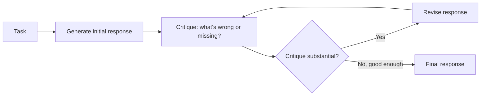
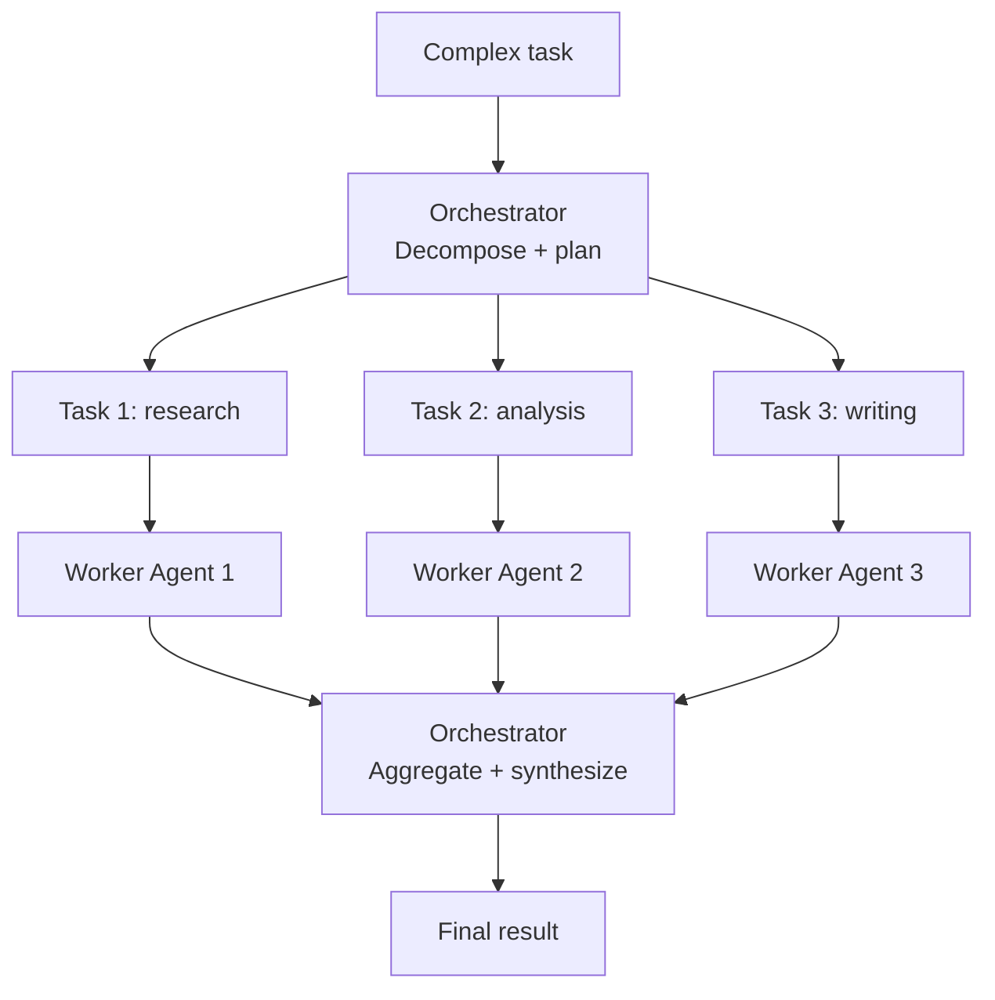
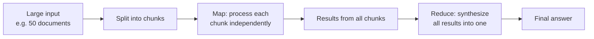
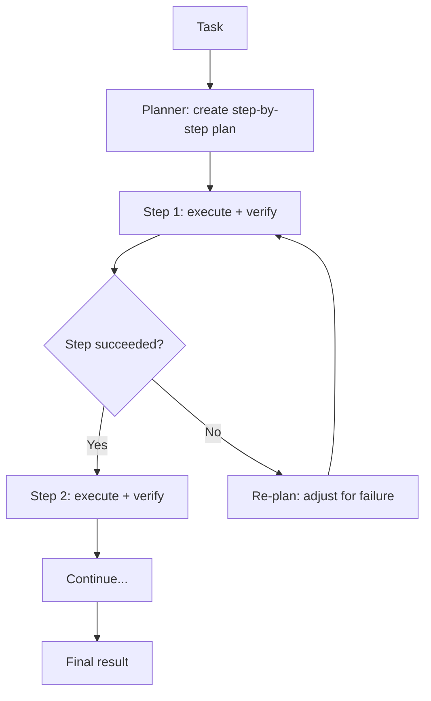
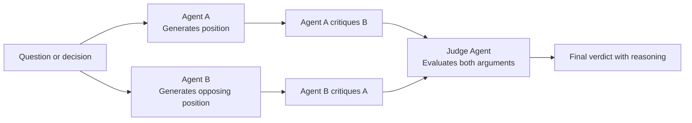
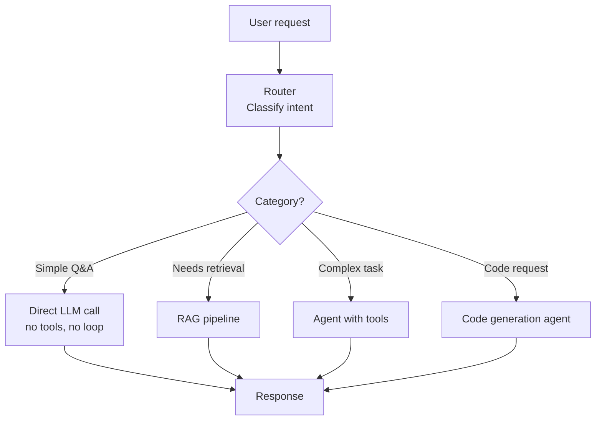

# Agentic Patterns

> **TL;DR**: Most agent complexity can be reduced to a handful of patterns: reflection (self-critique), map-reduce (parallel subproblems), orchestrator-worker (delegation), and flow engineering (structured steps). Know these patterns and you can design agents for 90% of use cases. The hardest part isn't implementing the pattern, it's knowing when to apply it vs when a simpler chain is enough.

**Prerequisites**: [Agent Fundamentals](01-agent-fundamentals.md), [LangGraph Deep Dive](05-langgraph-deep-dive.md), [Multi-Agent Systems](09-multi-agent-systems.md)
**Related**: [Agentic RAG](../03-retrieval-and-rag/09-advanced-rag-patterns.md), [Tool Use](02-tool-use-and-function-calling.md)

---

## Pattern 1: Reflection

The agent generates an output, then critiques it, then revises based on the critique. This is the simplest quality improvement pattern.



```python
def reflection_loop(task: str, max_rounds: int = 3) -> str:
    response = generate(task)

    for _ in range(max_rounds):
        critique = client.messages.create(
            model="claude-opus-4-6", max_tokens=512,
            messages=[{"role": "user", "content":
                f"Critique this response to the task: '{task}'\n\nResponse: {response}\n\n"
                "List specific issues: factual errors, missing important points, logical flaws. "
                "If the response is good enough, say 'ACCEPT'."}]
        ).content[0].text

        if "ACCEPT" in critique.upper():
            break

        response = client.messages.create(
            model="claude-opus-4-6", max_tokens=1024,
            messages=[{"role": "user", "content":
                f"Revise this response based on the critique.\n\n"
                f"Task: {task}\nResponse: {response}\nCritique: {critique}"}]
        ).content[0].text

    return response
```

**When reflection helps:** Writing tasks (drafts improve with critique), complex analysis (catches logical gaps), code generation (catches bugs before execution).

**When it doesn't help:** Simple factual lookup (not a quality improvement problem), tasks with clear right/wrong answers (use verification instead), when you're latency constrained (each round adds 1-2s).

**The diminishing returns curve.** The first revision round gives the biggest improvement. Second round: smaller improvement. Third round: often makes it longer without making it better. Limit to 2-3 rounds max.

---

## Pattern 2: Orchestrator-Worker

A planner agent decomposes the task into subtasks and delegates to specialized workers.



```python
def orchestrator_worker(task: str, worker_capabilities: dict) -> str:
    # Plan: decompose into subtasks
    plan_response = client.messages.create(
        model="claude-opus-4-6", max_tokens=512,
        tools=[{
            "name": "create_plan",
            "description": "Decompose task into subtasks for workers",
            "input_schema": {"type": "object", "properties": {
                "subtasks": {"type": "array", "items": {
                    "type": "object",
                    "properties": {"worker": {"type": "string"}, "instruction": {"type": "string"}}
                }}
            }}
        }],
        tool_choice={"type": "tool", "name": "create_plan"},
        messages=[{"role": "user", "content":
            f"Decompose this task for these workers: {list(worker_capabilities.keys())}\nTask: {task}"}]
    )
    plan = parse_tool_result(plan_response, "create_plan")

    # Execute in parallel
    import concurrent.futures
    with concurrent.futures.ThreadPoolExecutor() as executor:
        futures = {st["worker"]: executor.submit(worker_capabilities[st["worker"]], st["instruction"])
                   for st in plan["subtasks"] if st["worker"] in worker_capabilities}
        results = {worker: future.result() for worker, future in futures.items()}

    # Synthesize
    synthesis = client.messages.create(
        model="claude-opus-4-6", max_tokens=1024,
        messages=[{"role": "user", "content":
            f"Synthesize these worker outputs into a final response for: {task}\n\nOutputs: {results}"}]
    ).content[0].text

    return synthesis
```

**Key design decision:** Should the orchestrator re-plan after seeing worker results? Static plans are simpler and more predictable. Dynamic re-planning is more flexible but can spiral. Start with static; add re-planning only if tasks regularly require mid-course correction.

---

## Pattern 3: Map-Reduce

Apply the same operation to many items in parallel, then reduce to a single result.



```python
def map_reduce(items: list[str], map_prompt: str, reduce_prompt: str) -> str:
    import concurrent.futures

    def map_fn(item: str) -> str:
        return client.messages.create(
            model="claude-opus-4-6", max_tokens=512,
            messages=[{"role": "user", "content": f"{map_prompt}\n\nContent: {item}"}]
        ).content[0].text

    # Map: all items processed in parallel
    with concurrent.futures.ThreadPoolExecutor(max_workers=10) as executor:
        mapped_results = list(executor.map(map_fn, items))

    # Reduce: synthesize all mapped results
    combined = "\n\n---\n\n".join(f"Item {i+1}:\n{r}" for i, r in enumerate(mapped_results))
    return client.messages.create(
        model="claude-opus-4-6", max_tokens=2048,
        messages=[{"role": "user", "content": f"{reduce_prompt}\n\n{combined}"}]
    ).content[0].text

# Example: summarize 20 earnings call transcripts into one market analysis
result = map_reduce(
    items=transcript_list,
    map_prompt="Extract the 3 most important financial metrics and forward guidance from this transcript.",
    reduce_prompt="Synthesize these per-transcript summaries into an overall market analysis."
)
```

**When map-reduce wins:**
- Summarizing many documents (news articles, reports, reviews)
- Extracting data from a large corpus
- Running evaluations across many test cases

**The context limit on reduce.** If you have 100 map results and each is 500 tokens, the reduce step receives 50K tokens of input. Either summarize more aggressively in the map step, or do hierarchical reduce (batch the mapped results first).

---

## Pattern 4: Plan-and-Execute

Generate an explicit plan before executing, then execute each step.



The advantage over pure ReAct: you can review and edit the plan before execution. This is critical for tasks with irreversible actions (sending emails, modifying databases). Show the user the plan, get approval, then execute.

```python
def plan_and_execute(task: str, executor) -> str:
    # Generate plan
    plan_response = client.messages.create(
        model="claude-opus-4-6", max_tokens=512,
        messages=[{"role": "user", "content":
            f"Create a step-by-step plan to complete: {task}\n"
            "List steps as numbered items. Be specific about what each step does."}]
    ).content[0].text

    # Optional: human review of plan here
    print(f"Proposed plan:\n{plan_response}")

    # Execute each step
    results = []
    for step in parse_plan_steps(plan_response):
        result = executor(step)
        results.append({"step": step, "result": result})

    return synthesize_results(task, results)
```

---

## Pattern 5: Debate and Critique

Multiple agents take opposing positions, argue, and converge on a better answer.



```python
def debate(question: str) -> str:
    # Both sides argue simultaneously (independent, so run in parallel)
    position_a = client.messages.create(
        model="claude-opus-4-6", max_tokens=400,
        system="Argue FOR the following position. Be rigorous and factual.",
        messages=[{"role": "user", "content": question}]
    ).content[0].text

    position_b = client.messages.create(
        model="claude-opus-4-6", max_tokens=400,
        system="Argue AGAINST the following position. Be rigorous and factual.",
        messages=[{"role": "user", "content": question}]
    ).content[0].text

    # Judge evaluates
    verdict = client.messages.create(
        model="claude-opus-4-6", max_tokens=600,
        messages=[{"role": "user", "content":
            f"Question: {question}\n\nFor: {position_a}\n\nAgainst: {position_b}\n\n"
            "Evaluate both arguments and give the most defensible answer."}]
    ).content[0].text

    return verdict
```

**Best for:** Investment decisions, risk assessments, strategy choices where you want to stress-test a conclusion. Not worth the 3x LLM calls for simple factual questions.

---

## Pattern 6: Routing

A classifier routes requests to different processing pipelines based on content.



```python
def route_request(user_message: str) -> str:
    classification = client.messages.create(
        model="claude-haiku-4-5-20251001",  # cheap model for routing
        max_tokens=50,
        messages=[{"role": "user", "content":
            f"Classify this request: '{user_message}'\n"
            "Reply with one word: simple_qa, retrieval, agent_task, or code"}]
    ).content[0].text.strip().lower()

    if classification == "simple_qa":
        return simple_llm_call(user_message)
    elif classification == "retrieval":
        return rag_pipeline(user_message)
    elif classification == "agent_task":
        return run_agent(user_message)
    elif classification == "code":
        return code_agent(user_message)
    else:
        return rag_pipeline(user_message)  # safe default
```

**The cost savings from routing are significant.** A fast classifier (Haiku at $0.00025 per 1K tokens) costs 100x less than running every request through an agent. If 40% of requests are simple Q&A that don't need tools, routing saves real money.

---

## Pattern Comparison

| Pattern | When to Use | LLM Calls | Latency | Complexity |
|---|---|---|---|---|
| Reflection | Writing, analysis quality | 2-6 | High | Low |
| Orchestrator-worker | Complex parallel tasks | 5-20 | Medium (parallel) | High |
| Map-reduce | Process many items | N+1 (N parallel) | Medium (parallel) | Medium |
| Plan-and-execute | Multi-step with review | 2-5 | Medium | Medium |
| Debate | High-stakes decisions | 3+ | High | Medium |
| Routing | Mixed request types | 1-5 | Low-High | Low |

---

## Flow Engineering: The Underrated Pattern

This is Anthropic's term for designing the LLM call sequence to be deterministic and reliable rather than emergent. Instead of letting the LLM figure out the steps, you hardcode the steps and use the LLM only for the parts that genuinely require intelligence.

Most "agent" tasks can be decomposed into:
- Deterministic steps (validate input, format output, call specific API)
- LLM steps (understand intent, generate text, extract information)

Flow engineering means making the deterministic steps explicit in your code rather than hoping the LLM handles them.

```python
# Emergent (agent decides all steps) - unpredictable
def support_agent_emergent(ticket: str) -> str:
    return run_agent(ticket)  # agent decides what to do

# Flow-engineered (deterministic skeleton + targeted LLM calls) - predictable
def support_agent_flow(ticket: str) -> dict:
    category = classify_ticket(ticket)          # LLM: classify
    urgency = extract_urgency(ticket)           # LLM: extract
    customer_id = extract_customer_id(ticket)   # regex, not LLM
    customer_data = db.get_customer(customer_id) # deterministic DB call
    similar_cases = search_similar(ticket)      # vector search
    response = generate_response(               # LLM: generate
        ticket, category, customer_data, similar_cases
    )
    escalate = urgency == "high" or category == "billing_dispute"  # deterministic rule
    return {"response": response, "escalate": escalate}
```

The flow-engineered version is faster (fewer LLM calls), more debuggable (you know exactly which step produced what), and more reliable (deterministic steps don't hallucinate).

---

## Gotchas

**Reflection doesn't always improve quality.** Sometimes the model critiques perfectly good responses and introduces changes that make them worse. Add an "ACCEPT" path and limit revisions. Track whether revision improved or hurt quality on your eval set.

**Map-reduce's reduce step is the bottleneck.** If 50 map results total 20K tokens, your reduce step is expensive and may exceed context. Design map outputs to be compact summaries, not full content.

**Routing classification errors cascade.** A misclassified complex task routed to simple Q&A will give a poor answer. Log routing decisions and monitor the distribution. If 5% of agent tasks are being routed to simple Q&A, your classifier needs work.

**Plan-and-execute plans become stale.** If step 3 discovers that step 4 is no longer needed or impossible, a static plan executor will try step 4 anyway. Add a plan revision check after each step.

**Debate pattern is expensive and slow.** Three LLM calls (both positions + judge) takes 2-6 seconds. Only use for decisions where quality genuinely justifies the cost.

---

> **Key Takeaways:**
> 1. Most agent complexity fits into six patterns: reflection, orchestrator-worker, map-reduce, plan-and-execute, debate, and routing. Know them and apply them deliberately.
> 2. Flow engineering beats emergent agents for most production tasks. Deterministic steps don't hallucinate; save LLM calls for the parts that actually need intelligence.
> 3. Routing is the highest-ROI pattern: a cheap classifier that routes requests to the appropriate pipeline saves 40-80% of LLM costs for mixed-intent applications.
>
> *"The best agent architecture is the simplest one that meets the quality requirement. Patterns are tools, not goals."*

---

## Interview Questions

**Q: Design an AI customer service system using agentic patterns. How would you handle different request types efficiently?**

The first thing I'd add is a routing layer. Customer support has highly variable request complexity: "What are your store hours?" is simple Q&A. "I was charged twice and need a refund" requires account lookup, policy verification, and potentially writing to a CRM. Running every request through a full agent wastes money and adds unnecessary latency.

My routing classifier would distinguish: simple FAQ (answer from knowledge base, no tools), account inquiries (need customer data lookup, one tool call), complex issues (needs multiple tools, maybe human escalation), and technical problems (needs diagnostic agent with log access).

For the agent handling complex issues, I'd use plan-and-execute with a human escalation gate. The agent generates a resolution plan, the system checks if the plan includes any actions requiring manager approval (refunds over $500, account termination), and those get queued for human review. This is the human-in-loop pattern: the agent proposes, a human approves specific high-stakes actions.

For the knowledge base responses, I'd use RAG over the support documentation and policy documents. No agent needed for pure FAQ.

The routing alone would reduce average LLM costs by 40-50% because most customer service queries are simple FAQ that don't need tools. The agent handles the 20-30% that genuinely need it.

*Follow-up: "How would you improve quality over time?"*

Every resolved ticket becomes a training signal. I'd log the initial routing decision, the agent's plan, any human corrections, and the final resolution. Monthly, I'd run the eval pipeline on a sample of resolved tickets to check whether the agent's proposed resolutions matched what humans approved. If routing is misclassifying a category, that shows up as elevated human correction rates. This closes the improvement loop without requiring manual prompt engineering.

---

**Quick-fire Questions**

| Question | Answer |
|---|---|
| What is the reflection pattern? | Generate a response, critique it, revise it; repeat until quality threshold is met |
| What is map-reduce for LLMs? | Apply the same LLM operation to many items in parallel (map), then synthesize results into one output (reduce) |
| What is flow engineering? | Designing the LLM call sequence to be deterministic: hardcode structure, use LLMs only for the intelligence steps |
| When is the routing pattern highest ROI? | Mixed-intent applications where many requests are simple and don't need expensive agent loops |
| What is the key tradeoff in orchestrator-worker? | Static plan (predictable) vs dynamic re-planning (flexible but can spiral) |
| How many reflection rounds are typically useful? | 2-3; diminishing returns after the first revision |
| What is the debate pattern good for? | High-stakes decisions where stress-testing a conclusion is worth the 3x LLM cost |
