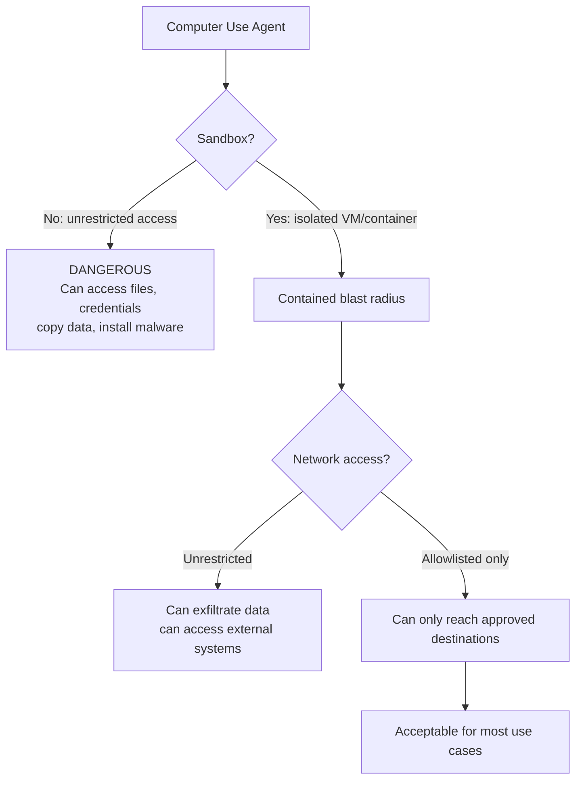

# Browser and Computer Use

> **TL;DR**: Browser automation with Playwright is production-ready for specific, defined tasks like form filling and data extraction. Claude's Computer Use API can operate GUIs by seeing screenshots and clicking, but is slow (10-30s per action), expensive, and unreliable for complex workflows. Use Playwright for automation you control. Use Computer Use only for tasks that have no API or structured interface.

**Prerequisites**: [Agent Fundamentals](01-agent-fundamentals.md), [Tool Use and Function Calling](02-tool-use-and-function-calling.md)
**Related**: [Agentic Patterns](11-agentic-patterns.md), [Guardrails and Safety](../06-production-and-ops/02-guardrails-and-safety.md)

---

## Two Approaches to Browser Automation

### Playwright-Based Automation

Playwright gives your agent explicit browser control through a Python API. The agent calls specific actions: navigate to URL, click element, fill form, extract text. You write the control logic; the browser executes it.

```python
from playwright.sync_api import sync_playwright

def scrape_job_listings(company_url: str) -> list[dict]:
    with sync_playwright() as p:
        browser = p.chromium.launch(headless=True)
        page = browser.new_page()
        page.goto(company_url)

        # Wait for dynamic content to load
        page.wait_for_selector(".job-listing", timeout=10000)

        jobs = []
        for listing in page.query_selector_all(".job-listing"):
            jobs.append({
                "title": listing.query_selector(".job-title").inner_text(),
                "location": listing.query_selector(".job-location").inner_text(),
                "url": listing.query_selector("a").get_attribute("href")
            })

        browser.close()
        return jobs
```

This is fast (200ms-2s per page), reliable, and cheap. No LLM involved until you need to interpret or act on the extracted data.

### Claude Computer Use API

Claude Computer Use lets Claude operate any interface by seeing screenshots and issuing mouse/keyboard actions. It doesn't need an API or selectors; it sees what a human would see and interacts the same way.

```python
import anthropic
import base64
from PIL import ImageGrab  # takes screenshots

client = anthropic.Anthropic()

def computer_use_action(instruction: str) -> str:
    # Capture current screen
    screenshot = ImageGrab.grab()
    screenshot_bytes = screenshot_to_bytes(screenshot)

    response = client.messages.create(
        model="claude-opus-4-6",
        max_tokens=1024,
        tools=[{
            "type": "computer_20241022",
            "name": "computer",
            "display_width_px": 1280,
            "display_height_px": 800,
        }],
        messages=[{
            "role": "user",
            "content": [
                {"type": "image", "source": {"type": "base64", "media_type": "image/png",
                                              "data": base64.b64encode(screenshot_bytes).decode()}},
                {"type": "text", "text": instruction}
            ]
        }]
    )
    # Parse and execute the mouse/keyboard actions from response
    return execute_computer_actions(response)
```

---

## When to Use What

| Task | Playwright | Computer Use | Notes |
|---|---|---|---|
| Scraping structured data | Best | Overkill | Playwright is 100x faster |
| Form filling on known site | Best | Works | Playwright is more reliable |
| Testing web UI | Best | Alternative | Playwright is the standard |
| Operating legacy desktop apps | No | Only option | No API, no web interface |
| Navigating unknown/dynamic UI | Harder | Natural | Computer Use handles any UI |
| Operating complex Excel workflows | No | Works, slow | Computer Use + Excel |
| SaaS tools with no API | Possible (fragile) | More robust | Computer Use handles UI changes |
| When to avoid Playwright | If UI changes frequently and you can't maintain selectors | | |
| When to avoid Computer Use | Anything with an API; latency-sensitive tasks | | |

---

## Playwright as an Agent Tool

The pattern that works: wrap Playwright actions as tools that an LLM agent can call.

```python
from playwright.sync_api import Page

def create_browser_tools(page: Page) -> list[dict]:
    return [
        {
            "name": "navigate_to",
            "description": "Navigate the browser to a URL",
            "input_schema": {"type": "object",
                "properties": {"url": {"type": "string"}}, "required": ["url"]}
        },
        {
            "name": "click_element",
            "description": "Click an element on the page by CSS selector or text content",
            "input_schema": {"type": "object",
                "properties": {"selector": {"type": "string", "description": "CSS selector or visible text"}},
                "required": ["selector"]}
        },
        {
            "name": "fill_form_field",
            "description": "Fill a form input field",
            "input_schema": {"type": "object",
                "properties": {
                    "selector": {"type": "string"},
                    "value": {"type": "string"}
                }, "required": ["selector", "value"]}
        },
        {
            "name": "extract_text",
            "description": "Extract visible text from an element or the whole page",
            "input_schema": {"type": "object",
                "properties": {"selector": {"type": "string", "description": "Optional CSS selector, or empty for full page"}}}
        }
    ]

def execute_browser_tool(page: Page, name: str, args: dict) -> str:
    try:
        if name == "navigate_to":
            page.goto(args["url"])
            return f"Navigated to {args['url']}"
        elif name == "click_element":
            element = page.locator(args["selector"]).first
            element.click()
            return f"Clicked {args['selector']}"
        elif name == "fill_form_field":
            page.fill(args["selector"], args["value"])
            return f"Filled {args['selector']} with '{args['value']}'"
        elif name == "extract_text":
            selector = args.get("selector", "body")
            return page.locator(selector).inner_text()[:2000]  # limit output size
    except Exception as e:
        return f"Browser action failed: {e}"
```

---

## Computer Use: The Reality

Computer Use is genuinely impressive technology. The model sees a screenshot, identifies UI elements by their visual appearance, and generates precise mouse coordinates and keyboard inputs. It can operate any interface a human can.

**The hard limits:**
- **Latency:** Each screenshot-action-screenshot loop is 5-15 seconds. A 10-step task takes 1-2 minutes. This is not suitable for user-facing real-time applications.
- **Cost:** Each action involves sending a screenshot (~500KB) as input tokens plus generating actions. At 1000 screenshots per session at 2000 tokens each = 2M input tokens. At Claude Opus pricing, that's $30 per complex session.
- **Reliability on complex tasks:** For well-defined 5-step tasks, reliability is decent (~80%). For complex 20-step workflows, it degrades significantly. UI changes between runs can cause complete failure.
- **Security:** An agent with unrestricted computer access is a significant security risk. Sandbox it.

**When Computer Use is worth it despite these limits:**
- Operating legacy enterprise software with no API (SAP, older CRM systems)
- One-off migration tasks that justify the higher cost and latency
- Research and exploration tasks where exact replication isn't critical
- Internal tooling where the user can watch and correct if needed

---

## Safety: Non-Negotiable for Computer Use

An agent with mouse and keyboard control can do anything a human can do, including things you didn't intend. Security is not optional.



**Minimum safety requirements for production Computer Use:**

1. **Sandboxed environment.** Run in a VM or container, not on the host machine. Anthropic's [reference implementation](https://github.com/anthropics/anthropic-quickstarts/tree/main/computer-use-demo) uses Docker.

2. **Screenshot-only monitoring.** Log every screenshot the agent sees. This is your audit trail. If the agent did something unexpected, you can replay exactly what it saw.

3. **Action allowlist.** If the task is "fill out this form on site X," allowlist only site X. Block navigation to other domains.

4. **Credential isolation.** Never give the agent access to credentials beyond what the specific task requires. If it needs to log into an expense system, give it a temporary session token, not the account password.

5. **Human confirmation for irreversible actions.** Any action that can't be undone (submitting a form, sending an email, making a payment) should require human confirmation.

---

## Concrete Numbers

As of early 2025:

| Metric | Playwright | Computer Use |
|---|---|---|
| Latency per action | 50-500ms | 5-15s |
| Cost per action | ~$0 (compute only) | $0.01-0.05 (API tokens + screenshot) |
| Reliability on simple task | >99% | ~85% |
| Reliability on complex task (20+ steps) | 90%+ | 40-70% |
| Setup complexity | Medium | High |
| Maintenance burden | High (UI changes break selectors) | Medium (more robust to UI changes) |

---

## Gotchas

**Playwright selectors break on UI changes.** If the site you're automating updates its HTML structure, your selectors stop working. Use visual selectors (`page.get_by_text("Submit")`) over class-based ones (`.submit-btn`). They're more robust to UI changes.

**Dynamic content needs explicit waits.** Single-page apps load content asynchronously. `page.wait_for_selector(".results")` is essential. Without it you extract empty content.

**Computer Use hallucinates coordinates.** The model estimates pixel coordinates from the screenshot. On high-DPI displays or unusual resolutions, coordinates can be off. Always validate that the element the model is trying to click actually got clicked.

**Screenshot size = token cost.** A 1280x800 screenshot at full quality is ~500KB. Compressed to reasonable quality, 50-100KB. Scale screenshots down to the minimum size that preserves readability. This directly reduces Computer Use costs.

**Don't use Computer Use for tasks that have APIs.** If a SaaS tool has an API, use the API. Computer Use for a service with a good API is 100x slower, 100x more expensive, and far less reliable than a direct API call.

---

> **Key Takeaways:**
> 1. Playwright is production-ready for browser automation of defined tasks. It's fast, reliable, and cheap. Use it for any task you can express as specific browser actions.
> 2. Computer Use handles any interface but is slow (5-15s/action), expensive, and unreliable for complex workflows. Reserve it for tasks with no API and no structured interface.
> 3. Any computer control agent requires sandboxing, action logging, and human confirmation for irreversible actions. No exceptions.
>
> *"If there's an API, use the API. Computer Use is the last resort, not the first tool."*

---

## Interview Questions

**Q: Design an agent that automates expense report submission for a company using legacy software with no API. What are your safety considerations?**

The legacy software with no API points to Computer Use. Playwright would need CSS selectors that don't exist (it's not a web app or the selectors are dynamic).

I'd design the agent as a multi-step flow: the user uploads expense receipts and fills out a simple form (amount, date, category, project code). The agent handles the tedious part: logging into the expense system, navigating to "new report," entering each line item, uploading the receipt images, and submitting.

Safety is the critical design decision here. Financial actions are irreversible. My safety architecture: (1) run in an isolated Docker container with access only to the expense management URL and nothing else, (2) screenshot every step and log to an audit trail, (3) generate a preview of what the agent is about to submit and require human confirmation before hitting submit, (4) use a temporary session token rotated daily rather than storing the password anywhere the agent can access.

The human confirmation step is non-negotiable: the agent shows a rendered preview of the expense report before final submission. The user confirms or corrects. This covers the case where OCR extracted an amount wrong or the agent put something in the wrong field.

For the expense software login, I'd use a dedicated service account rather than employee credentials. The service account has view + submit permissions on the expense module only, not admin access.

*Follow-up: "What do you do when the software updates its UI and the agent starts failing?"*

The agent will see the new UI in the screenshots and may navigate it correctly since Computer Use is visual rather than selector-based. But for anything it can't figure out, I'd want alerting: if the agent tries an action 3 times without success, it stops and sends an alert to the user to review. Manual backup: the user can always do the submission themselves. This is an automation tool, not a replacement that people depend on without a fallback.

---

**Quick-fire Questions**

| Question | Answer |
|---|---|
| When should you use Playwright over Computer Use? | When the target is a web interface you control and can write specific selectors for; Playwright is 100x faster |
| What makes Computer Use expensive? | Sending screenshots as input tokens on every action; ~2000 tokens per screenshot |
| What is the minimum safety requirement for Computer Use in production? | Sandboxed environment (VM/container) + action logging + human confirmation for irreversible actions |
| What is the latency of a single Computer Use action? | 5-15 seconds per action (screenshot + LLM call + action execution) |
| When does Computer Use justify its overhead? | Legacy desktop apps with no API, SaaS tools with no API, one-off migration tasks |
| What Playwright selector is most robust to UI changes? | `get_by_text()` or `get_by_role()` over CSS class selectors |
