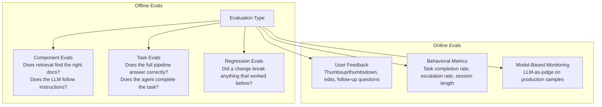
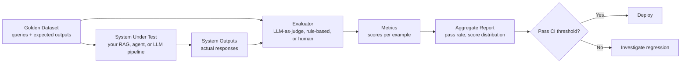

# Evaluation Fundamentals

> **TL;DR**: You can't improve what you can't measure, and measuring LLM quality is genuinely hard. Build an eval pipeline before you build your AI product, not after. Start with a 50-100 example golden dataset and a simple LLM-as-judge setup. Vibes-based evaluation is how products ship regressions silently.

**Prerequisites**: [RAG Fundamentals](../03-retrieval-and-rag/01-rag-fundamentals.md), [Agent Fundamentals](../04-agents-and-orchestration/01-agent-fundamentals.md)
**Related**: [RAG Evaluation](02-retrieval-and-rag-eval.md), [LLM as Judge](03-llm-as-judge.md), [Agent and E2E Eval](04-agent-and-e2e-eval.md), [Drift and Monitoring](../06-production-and-ops/05-drift-and-monitoring.md)

---

## Why Evaluation Is Hard (And Why People Skip It)

Traditional software testing has a property that makes it tractable: you know the correct output. `assert add(2, 3) == 5`. The test is right or wrong.

LLM outputs are rarely right or wrong in that clean sense. "Is this answer helpful?" involves subjectivity, context, and often requires domain expertise to judge. "Is this code correct?" is closer to deterministic but still requires execution and edge case analysis.

Three reasons teams skip eval and regret it:

1. **The vibes-based iteration trap.** You make a change to your prompt or retrieval pipeline. You manually test 5 queries and it seems better. You deploy. Three weeks later users are complaining about something that regressed. You have no data on when it broke or what caused it.

2. **The eval feels like more work than the product.** Building a proper eval dataset takes time. This is true. But a team without eval will spend 3x more time debugging production regressions than a team that invested in eval upfront.

3. **Nobody tells you how to do it.** Most tutorials show you how to build the thing but not how to measure if it works. This file is trying to fix that.

---

## The Eval Landscape: What You're Actually Measuring

Not all evals are created equal. Here's how to think about the different types.



| Eval Type | When to Run | What It Catches | Cost | Speed |
|---|---|---|---|---|
| Component (retrieval) | Every code change | Retrieval regressions | Low | Fast |
| Component (generation) | Every code/prompt change | Prompt regressions | Medium | Medium |
| Task (e2e) | Every deployment | System-level failures | High | Slow |
| Regression (golden set) | Every deployment | "Did we break X?" | Medium | Medium |
| User feedback (online) | Continuously | Real-world failures | Low | Real-time |
| LLM-as-judge (online) | On production samples | Quality trends | Medium | Near real-time |

My recommendation: start with offline component evals and a small golden dataset. Add online monitoring once you have production traffic. Don't try to build everything at once.

---

## The Golden Dataset: Your Most Valuable Asset

A golden dataset is a curated collection of (input, expected_output) pairs where you're confident the expected output is correct. This is your eval foundation.

**How to build one:**

1. **Start with real user queries.** The first 50-100 things real users asked your system are more valuable than any synthetic dataset.

2. **Add adversarial examples.** Edge cases, ambiguous queries, things that broke in the past.

3. **Include failure modes you've seen.** If the system once incorrectly said "I don't have information about X" when it did, add that query with the correct answer.

4. **Have domain experts validate.** For specialized domains (legal, medical, financial), the correctness judgment requires domain knowledge. Don't have an LLM judge validate medical accuracy.

**Golden dataset size guidelines:**

| Use Case | Minimum | Good | Excellent |
|---|---|---|---|
| Simple Q&A | 50 | 200 | 500+ |
| RAG over docs | 100 | 500 | 1000+ |
| Agent tasks | 30 | 100 | 300+ |
| Classification | 100 per class | 500 per class | 1000+ per class |

Quality beats quantity. A 50-example golden dataset where every example is verified correct beats a 500-example dataset where 30% of the expected answers are wrong.

---

## The Eval Pipeline

Every eval pipeline has the same structure. The complexity is in what you put at each stage.



```python
from anthropic import Anthropic
from dataclasses import dataclass

client = Anthropic()

@dataclass
class EvalExample:
    query: str
    expected: str
    context: str = ""

def llm_judge(query: str, expected: str, actual: str) -> dict:
    """Simple LLM-as-judge for answer quality."""
    prompt = f"""Rate whether the actual answer adequately addresses the question and aligns with the expected answer.

Question: {query}
Expected answer: {expected}
Actual answer: {actual}

Respond with JSON: {{"score": 0-10, "reasoning": "brief explanation", "pass": true/false}}
Only respond with the JSON, no other text."""

    response = client.messages.create(
        model="claude-opus-4-6",
        max_tokens=200,
        messages=[{"role": "user", "content": prompt}]
    )
    import json
    return json.loads(response.content[0].text)

def run_eval(examples: list[EvalExample], system_fn) -> dict:
    results = []
    for ex in examples:
        actual = system_fn(ex.query)
        result = llm_judge(ex.query, ex.expected, actual)
        results.append(result)

    scores = [r["score"] for r in results]
    pass_rate = sum(r["pass"] for r in results) / len(results)
    return {"mean_score": sum(scores) / len(scores), "pass_rate": pass_rate, "n": len(results)}
```

This is a minimal but real eval pipeline. Run it before every deployment. If `pass_rate` drops below your threshold (I typically use 0.80), the deploy fails.

---

## Metric Types

### Automated Metrics

**BLEU / ROUGE:** Match n-grams between generated and reference text. Fast and cheap. The problem: they measure surface similarity, not semantic correctness. "The building is large" and "The structure is massive" score poorly despite being equivalent. Use these only as sanity checks, not primary metrics.

**Exact match:** Did the output exactly match the expected output? Works well for structured outputs (JSON, classification labels, code that must be syntactically exact). Useless for free-text generation.

**Semantic similarity:** Embed both the generated and expected outputs and compute cosine similarity. Better than BLEU for capturing semantic equivalence. Still doesn't capture factual correctness well.

**Task-specific metrics:** Does the code execute? Does the SQL return the right rows? Does the classification match the label? These are the best automated metrics because they test the thing that actually matters.

### LLM-as-Judge

Use a powerful LLM to evaluate the output of your production LLM. This is discussed in depth in [03-llm-as-judge.md](03-llm-as-judge.md). In brief: it's the most scalable way to get quality judgments for free-text outputs. The risk is judge bias and cascade failure (if the production LLM and judge LLM are the same family, they share failure modes).

### Human Evaluation

The ground truth, but expensive and slow. Reserved for:
- Building the initial golden dataset
- Spot-checking LLM-as-judge calibration
- High-stakes decisions (should we launch? should we roll back?)

Aim to use human eval to calibrate your automated evals, not as the primary signal for day-to-day iteration.

---

## Build vs Buy: Eval Tooling

| Tool | Best For | Cost | Complexity | When to Avoid |
|---|---|---|---|---|
| Custom Python (as above) | Full control, simple pipelines | Free | Low | When you need collaboration or visualization |
| [RAGAS](https://docs.ragas.io/) | RAG-specific metrics (faithfulness, context recall) | Free | Low | Non-RAG pipelines |
| [LangSmith](https://smith.langchain.com/) | LangChain teams, dataset management, tracing | $39+/mo | Low-Medium | If you're not on LangChain |
| [Langfuse](https://langfuse.com/) | Open-source LangSmith alternative, self-hostable | Free/paid | Medium | If you need Salesforce/enterprise integrations |
| [Braintrust](https://www.braintrust.dev/) | Teams that need sophisticated scoring and collaboration | $150+/mo | Medium | Small teams with simple needs |
| [DeepEval](https://docs.confident-ai.com/) | Unit-test style eval framework | Free | Low | When you need production monitoring |

My default: start with RAGAS + a custom Python script for any non-RAGAS metrics. Add Langfuse for tracing and production monitoring. Graduate to Braintrust if you have a team doing eval at scale.

---

## The "What Does Good Look Like?" Problem

The hardest part of eval isn't the technical implementation, it's defining what "good" means.

For a customer support bot: is "good" that the bot answers accurately, or that the customer doesn't escalate, or that they don't call back with the same problem? These are all different metrics. Optimize for the wrong one and you get a bot that answers accurately but leaves customers confused.

My process for defining "good":
1. Write down what a perfect answer would look like for 10 sample queries
2. Write down what a bad answer would look like for the same queries
3. Figure out what dimensions separate good from bad (accuracy, conciseness, tone, format, completeness)
4. Write rubrics for each dimension with examples of 1, 3, 5, 7, 10 scores
5. Test the rubric: have two people score the same examples, check inter-rater agreement

If you can't achieve >80% agreement between two human raters on your rubric, your rubric is ambiguous. Clarify it before using an LLM to apply it.

---

## Online vs Offline Eval

Both matter. They measure different things.

**Offline eval:** You run a fixed set of test cases. You know exactly what's being measured. Good for: pre-deployment testing, regression detection, A/B comparisons.

**Online eval:** You measure on real production traffic. You know what real users are actually asking. Good for: catching distribution shift, measuring business metrics, detecting degradation after model updates you didn't control (API providers change their models).

The combination is: offline eval gates deployments (nothing ships if the eval drops), online eval detects things that slip through (novel failure modes, model drift from provider updates).

```python
# Online eval: sample 5% of production traffic and judge it
import random

def maybe_eval_query(query: str, response: str, sample_rate: float = 0.05):
    """Asynchronously evaluate a fraction of production queries."""
    if random.random() > sample_rate:
        return
    # Run in background, don't block the response
    asyncio.create_task(
        log_llm_eval(query=query, response=response)
    )
```

---

## Concrete Numbers

As of early 2025:

| Activity | Time Investment | Notes |
|---|---|---|
| Building initial golden dataset (50 examples) | 4-8 hours | Including expert review |
| Setting up RAGAS eval pipeline | 2-4 hours | For a standard RAG system |
| Running eval on 100 examples (LLM-as-judge) | 5-15 minutes | Parallelized API calls |
| LLM-as-judge cost (Claude Sonnet 4.6, 100 examples) | ~$0.50-2.00 | Depends on eval complexity |
| Human eval for 100 examples | 2-4 hours | At expert reviewer pace |
| Eval in CI per deployment | 3-10 minutes | For a 50-100 example golden set |

The ROI: a team that invests 10 hours in eval upfront will save 20+ hours per month in debugging production regressions. The break-even is usually within 2-3 production incidents.

---

## Gotchas and Real-World Lessons

**Eval set contamination.** If any of your training data or examples you've used to tune prompts appear in your eval set, your metrics are inflated. Create your eval set before you start tuning. Keep it locked. Add new examples to a separate "development eval" set for iteration, and only add to the golden set after confirming you haven't used it for tuning.

**The eval-production gap.** Your eval set will never perfectly represent production traffic. The longer your system is in production, the more novel queries appear that your eval doesn't cover. Review production logs monthly and add representative examples to your eval set. This is ongoing work, not a one-time task.

**LLM judges have their own biases.** Claude tends to prefer longer, more detailed answers. GPT-4 judges favor formatting conventions from OpenAI's training data. When using LLM-as-judge, calibrate against human judgments on a sample to understand the systematic biases and correct for them.

**Pass/fail thresholds hide distribution shifts.** If you only track whether each example passes (binary), you miss slow quality degradation. Track score distributions, not just pass rates. A mean score dropping from 8.2 to 7.8 over two months is a real signal even if the pass rate (threshold at 7.0) hasn't changed.

**Eval metrics become targets.** Goodhart's Law applies to AI evals. If your team optimizes heavily for RAGAS faithfulness score, you'll eventually write prompts that score well on faithfulness but fail on user satisfaction. Use multiple metrics and rotate eval examples regularly to prevent gaming.

**Different failure modes matter differently.** A customer support bot that fails to answer 10% of questions is very different from one that answers 10% of questions incorrectly. Track the breakdown: no-answer rate, wrong-answer rate, and partial-answer rate separately. Users tolerate "I don't know" much better than wrong confident answers.

**Eval for safety separately from quality.** Quality evals check if the system answers correctly. Safety evals check if the system refuses or responds appropriately to adversarial inputs. These need different test sets. Don't conflate them.

---

> **Key Takeaways:**
> 1. Build eval before you build the product. A 50-example golden dataset + LLM-as-judge pipeline takes a day to set up and gates every deployment.
> 2. Combine offline eval (for deployment gating) and online eval (for production monitoring). Each catches different failure modes.
> 3. Defining "good" is the hardest part of eval. Write explicit rubrics with examples, validate with human raters, then scale with automation.
>
> *"Your AI system is only as trustworthy as your eval pipeline. If you're shipping on vibes, you're one model update away from a silent regression."*

---

## Interview Questions

**Q: How would you build an evaluation system for a production RAG application?**

I'd structure this in two layers: offline eval that gates deployments, and online monitoring that catches production drift.

For offline eval, I'd start by building a golden dataset. The first 100 examples would come from real user queries that we manually verified answers for, plus some adversarial cases (questions the system historically got wrong, boundary cases for access control, queries in multiple languages if the system is multilingual). For a RAG system specifically, each golden example needs: the query, the expected answer, and ideally the source document that contains the answer. That last piece lets me evaluate retrieval separately from generation.

For the metrics, I'd use RAGAS which has components for context precision (are the retrieved chunks actually relevant?), context recall (did we retrieve everything needed?), faithfulness (does the answer stick to the retrieved content?), and answer relevancy (does the answer address the question?). These give me four independent signals. If context precision is high but faithfulness is low, that tells me the retrieval is good but the LLM is hallucinating. Very different fix than if context recall is low.

I'd run this eval in CI on every deployment. If any metric drops more than 5% from the previous deploy, the build fails and requires investigation. I'd also set hard minimums: context precision below 0.7 is an automatic failure.

For online monitoring, I'd sample 5-10% of production traffic and run a lightweight LLM-as-judge to assess overall answer quality. I'd also track indirect signals: user follow-up questions (suggesting incomplete answers), explicit thumbs-down feedback, and escalation to human support. These behavioral signals often catch quality issues that automated metrics miss.

*Follow-up: "How would you handle a situation where production query distribution shifts significantly from your golden set?"*

I'd treat it as a scheduled maintenance task. Monthly, I'd pull a random sample of 500 production queries, cluster them by topic or type, and compare the cluster distribution to my golden set. If there's a significant new cluster (say, 20% of queries are now about a new product feature), I'd add examples from that cluster to the golden set. This is ongoing work. Eval datasets decay in value over time as the world changes and user behavior evolves.

---

**Q: A model provider just updated their API model. How do you know if your system regressed?**

This is a real scenario that hits every team using managed APIs. Model providers update models without bumping API version names, and quality can shift in either direction.

The first step is having eval infrastructure before this happens, not after. If you have a golden dataset and eval pipeline already running, you detect the regression on the first deploy after the model update. If you don't, you find out from user complaints.

The day I hear "model X has been updated," I immediately run my full eval pipeline on the new model versus the previous behavior (which I've logged, including model version IDs). The diff shows exactly which categories of queries changed. If the model update improved general quality but degraded performance on a specific query type we care about, that's actionable: I can either add few-shot examples to compensate, or file feedback with the provider.

For the emergency response if quality has already dropped in production: A/B test the model version if the provider offers it, or fall back to an older model version if available. Communicate to stakeholders what we know (quality dropped, in specific ways, we're investigating), what we've done (monitoring, rollback plan), and the ETA to resolution.

The lesson I've internalized: model version logging is non-negotiable. Every LLM API call should log the model version in your observability system. Without it, you can't correlate a quality drop to a specific provider change.

---

**Quick-fire Questions**

| Question | Answer |
|---|---|
| What is a golden dataset? | A curated set of (input, expected_output) pairs used to measure and track system quality |
| What are the 4 RAGAS metrics? | Context precision, context recall, faithfulness, answer relevancy |
| What is the minimum golden dataset size for a RAG system? | 100 examples; 50 is workable as a starting point |
| What is LLM-as-judge? | Using a powerful LLM to evaluate the outputs of your production LLM |
| What is the difference between offline and online eval? | Offline runs on fixed test sets pre-deployment; online monitors real production traffic |
| Why is BLEU/ROUGE insufficient for LLM evaluation? | It measures surface similarity, not semantic correctness; misses paraphrases and factual accuracy |
| What is eval set contamination? | When training or prompt-tuning examples appear in the eval set, inflating metrics |
| How do you detect model drift from API provider updates? | Log model version on every call; run golden set eval when updates are announced |
