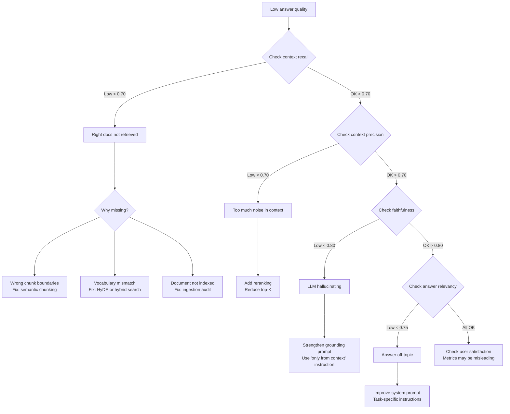

# Retrieval and RAG Evaluation

> **TL;DR**: RAG evaluation has two independent problems: did you retrieve the right documents (retrieval quality), and did you generate a good answer from them (generation quality). RAGAS measures both with four metrics. The one most teams skip is context precision, which tells you whether you're retrieving noise. Build your retrieval eval first, before optimizing anything.

**Prerequisites**: [RAG Fundamentals](../03-retrieval-and-rag/01-rag-fundamentals.md), [Eval Fundamentals](01-eval-fundamentals.md), [RAG Evaluation](../03-retrieval-and-rag/11-rag-evaluation.md)
**Related**: [LLM-as-Judge](03-llm-as-judge.md), [Chunking Strategies](../03-retrieval-and-rag/05-chunking-strategies.md), [Hybrid Search](../03-retrieval-and-rag/06-hybrid-search.md)

---

## Why Retrieval Eval is Different

Standard ML evaluation is: run the model, compare output to label, compute accuracy. RAG evaluation is harder because you have two models in series (the retriever and the generator), and failures in either look the same to the end user: a bad answer.

The retriever can fail while the generator succeeds (the answer was in the retrieved docs, barely), making you think retrieval is fine. The retriever can succeed while the generator fails (all the right docs were retrieved, but the LLM ignored them or hallucinated anyway). Without separate metrics for each stage, you're guessing.

---

## Retrieval Metrics

### Precision@K

Of the K documents you retrieved, how many were actually relevant?

```
Precision@K = (relevant docs in top-K) / K

Example:
Retrieved top-5: [relevant, irrelevant, relevant, irrelevant, irrelevant]
Precision@5 = 2/5 = 0.40
```

High precision = few irrelevant chunks reaching the LLM. Target: >0.70 for production systems.

### Recall@K

Of all relevant documents in the corpus, how many made it into your top-K?

```
Recall@K = (relevant docs in top-K) / (total relevant docs in corpus)

Example:
Corpus has 5 relevant docs. Top-5 contains 3 of them.
Recall@5 = 3/5 = 0.60
```

High recall = you're not missing relevant information. Target: >0.75 for production systems.

### MRR (Mean Reciprocal Rank)

Average of (1/rank of first relevant document) across all queries. If the first relevant document is rank 1, MRR contribution is 1.0. If it's rank 3, contribution is 1/3.

```python
def mrr(results: list[list[bool]]) -> float:
    """Compute MRR. results[i][j] = True if j-th result for query i is relevant."""
    reciprocal_ranks = []
    for query_results in results:
        rr = 0.0
        for rank, is_relevant in enumerate(query_results, start=1):
            if is_relevant:
                rr = 1.0 / rank
                break
        reciprocal_ranks.append(rr)
    return sum(reciprocal_ranks) / len(reciprocal_ranks)
```

MRR measures whether the first result is good. Use it when users only read the top result (position matters more than total recall).

### NDCG (Normalized Discounted Cumulative Gain)

NDCG accounts for graded relevance (highly relevant, partially relevant, not relevant) and penalizes good documents appearing lower in the ranking.

```python
import math

def dcg(relevances: list[float]) -> float:
    """Discounted Cumulative Gain."""
    return sum(rel / math.log2(rank + 2) for rank, rel in enumerate(relevances))

def ndcg(retrieved_relevances: list[float], ideal_relevances: list[float]) -> float:
    """Normalized DCG. Both lists should be the same length."""
    ideal = dcg(sorted(ideal_relevances, reverse=True))
    if ideal == 0:
        return 0.0
    return dcg(retrieved_relevances) / ideal

# Usage
retrieved = [3, 1, 2, 0, 1]   # relevance scores of retrieved docs
ideal = [3, 3, 2, 1, 1]       # best possible ranking
print(f"NDCG: {ndcg(retrieved, ideal):.3f}")
```

NDCG is the most comprehensive retrieval metric but requires graded relevance labels (not just binary relevant/not-relevant), which takes more annotation effort.

---

## When to Use Which Metric

| Metric | Best For | Requires | Target |
|---|---|---|---|
| Precision@K | Reducing noise in LLM context | Binary relevance labels | >0.70 |
| Recall@K | Ensuring nothing important is missed | Binary relevance labels + total relevant count | >0.75 |
| MRR | Top-1 quality (ranked list, user reads first) | Binary relevance labels | >0.60 |
| NDCG | Graded relevance (nuanced comparison) | Graded labels (0-3) | >0.70 |
| RAGAS context precision | RAG-specific: is retrieved context useful? | Ground truth answers | >0.75 |
| RAGAS context recall | RAG-specific: did we retrieve enough? | Ground truth answers | >0.70 |

For most RAG systems: start with Precision@5 and Recall@10. Add RAGAS context metrics once you have ground truth answers.

---

## Building the Retrieval Eval Pipeline

```python
from anthropic import Anthropic
from ragas import evaluate
from ragas.metrics import context_precision, context_recall
from datasets import Dataset
import chromadb

client = Anthropic()
chroma = chromadb.Client()

def evaluate_retrieval(
    queries: list[str],
    ground_truths: list[str],
    collection,
    embed_fn,
    top_k: int = 5
) -> dict:
    """Full retrieval evaluation pipeline."""
    results = {
        "question": queries,
        "ground_truth": ground_truths,
        "contexts": [],
        "answer": []
    }

    for query, gt in zip(queries, ground_truths):
        # Retrieve
        q_emb = embed_fn(query)
        retrieved = collection.query(query_embeddings=[q_emb], n_results=top_k)
        contexts = retrieved["documents"][0]

        # Generate answer
        context_text = "\n\n".join(contexts)
        response = client.messages.create(
            model="claude-opus-4-6",
            max_tokens=512,
            messages=[{"role": "user", "content":
                f"Answer based on context:\n{context_text}\n\nQuestion: {query}"}]
        )

        results["contexts"].append(contexts)
        results["answer"].append(response.content[0].text)

    dataset = Dataset.from_dict(results)
    scores = evaluate(dataset, metrics=[context_precision, context_recall])
    return scores
```

---

## The Retrieval Debug Flowchart

When RAGAS scores are low, this determines which problem you have:



Use this flowchart when you get a report that "the RAG bot is giving bad answers." It forces you to measure each stage rather than randomly tweaking things.

---

## Annotating Relevance at Scale

The bottleneck for retrieval eval is labeling. You need human judgments about what's relevant.

**Approach 1: Manual labeling (gold standard)**

For each query in your eval set, show an expert the top-10 retrieved documents and have them label 0/1 relevance. Time-consuming but highest quality.

**Approach 2: LLM-assisted labeling**

```python
def llm_relevance_label(query: str, document: str) -> int:
    """0 = not relevant, 1 = relevant, 2 = highly relevant."""
    response = client.messages.create(
        model="claude-haiku-4-5-20251001",
        max_tokens=10,
        messages=[{"role": "user", "content":
            f"Rate document relevance for the query. Return 0, 1, or 2 only.\n\n"
            f"Query: {query}\n\nDocument: {document[:500]}\n\nRelevance (0/1/2):"}]
    )
    try:
        return int(response.content[0].text.strip())
    except ValueError:
        return 0

# Sample: label top-20 for 100 queries = 2000 LLM calls (cheap with Haiku)
```

Validate LLM labels against a small human-labeled set. If agreement is >80%, LLM labels are reliable enough for retrieval eval.

**Approach 3: Click-through as implicit signal**

If you have a production RAG system with UI, track which retrieved documents users click on or cite in follow-up questions. This is weak signal but free and scales automatically.

---

## Offline vs Online Retrieval Eval

| Eval Type | What It Measures | Cadence | Cost |
|---|---|---|---|
| Offline (eval set) | Quality on known queries | Before every deployment | Low |
| Shadow mode | Live queries, evaluated offline | Continuous | Medium |
| A/B test | Impact on real user outcomes | Per significant change | High |
| Prod logging | Implicit quality (follow-ups, thumbs) | Continuous | Low |

The offline eval set is not enough. Real user queries have a different distribution than what you'd create synthetically. Add shadow mode eval (process live queries offline through a parallel pipeline) to catch distribution shifts.

---

## Chunk-Level vs Document-Level Precision

Many implementations compute precision at the document level (was this document relevant?), but what matters for RAG is chunk-level precision (was this specific chunk useful?).

```python
def chunk_precision(
    query: str,
    retrieved_chunks: list[str],
    ground_truth_answer: str
) -> float:
    """Estimate what fraction of retrieved chunks contributed to the answer."""
    useful_chunks = 0
    for chunk in retrieved_chunks:
        response = client.messages.create(
            model="claude-haiku-4-5-20251001",
            max_tokens=10,
            messages=[{"role": "user", "content":
                f"Does this chunk contain information useful for answering the question?\n"
                f"Question: {query}\nGround truth answer: {ground_truth_answer}\n"
                f"Chunk: {chunk[:300]}\n\nUseful (yes/no):"}]
        )
        if "yes" in response.content[0].text.lower():
            useful_chunks += 1

    return useful_chunks / len(retrieved_chunks)
```

Chunk-level precision is more actionable than document-level because it directly tells you whether your chunking and retrieval parameters are right.

---

## Gotchas

**Your eval set has distribution shift.** The queries you manually crafted tend to be "good" queries that your system handles well. Real users ask messy, ambiguous, short queries. Enrich your eval set with production queries once you have them.

**Context recall requires knowing all relevant docs.** To compute recall, you need to know how many relevant documents exist in your corpus for each query. This is impossible to measure exhaustively for large corpora. RAGAS context recall approximates this using ground truth answers, which is practical but imperfect.

**High retrieval scores don't guarantee good answers.** I've seen systems with context precision 0.85 and answer relevancy 0.60. The retrieval was fine; the problem was the generation prompt. Track all four RAGAS metrics, not just the retrieval ones.

**Evaluation is model-version sensitive.** RAGAS uses an LLM to score faithfulness and answer relevancy. If the judge model changes between runs, your scores shift. Pin the judge model version and note it in your eval logs.

**The eval corpus should match production.** Don't evaluate against a clean, well-formatted corpus if production has messy PDFs, scanned documents, and inconsistent formatting. Your eval tells you how good the system is on the eval corpus, not on production.

---

> **Key Takeaways:**
> 1. Measure retrieval and generation separately. Low answer quality could be a retrieval problem (wrong docs) or a generation problem (LLM not using docs). The RAGAS debug flowchart finds which one.
> 2. Context precision is the metric most teams skip, but it's the one that tells you if you're injecting noise. Low context precision is often the culprit for poor answer quality.
> 3. Your eval set needs production queries, not just synthetic ones. Synthetic queries are too easy; real queries reveal edge cases your synthetic set missed.
>
> *"A RAG system with no retrieval eval is a system you can't improve systematically. You'll be guessing at which lever to pull."*

---

## Interview Questions

**Q: Your RAG system's answers are getting worse after you doubled the number of documents in the corpus. How do you diagnose this?**

Adding documents to the corpus can degrade quality in two ways: recall stays the same but precision drops (more irrelevant documents compete with the relevant ones), or the distribution of the new documents shifts what the embeddings match.

I'd start by running the RAGAS evaluation on the same eval set I had before adding documents. If context precision dropped (below 0.70), the problem is that the new documents are being retrieved instead of the right ones. If context recall also dropped, the new documents are semantically similar to the old ones and are splitting the relevance signal.

The diagnostic: sample 20 queries, look at the actual retrieved chunks before and after the corpus expansion. Are the new documents showing up inappropriately? Do they use different vocabulary for the same concepts?

Fixes by diagnosis: if precision dropped due to new irrelevant documents, add a metadata filter (e.g., only retrieve from documents tagged with the relevant product line). If it's vocabulary mismatch between old and new documents, add hybrid search (BM25 to catch exact terms) or re-embed everything with a better model. If specific new document types are the problem, improve the chunking for those types.

---

**Quick-fire Questions**

| Question | Answer |
|---|---|
| What is Precision@K? | Fraction of retrieved top-K documents that are relevant |
| What is Recall@K? | Fraction of all relevant documents in the corpus that appear in top-K |
| What does MRR measure? | Average reciprocal rank of the first relevant result across queries |
| What does NDCG add over MRR? | Accounts for graded relevance and position, not just first-relevant-result rank |
| Which RAGAS metric most teams skip? | Context precision (are retrieved chunks actually useful?) |
| What is shadow mode retrieval eval? | Processing live queries offline through a parallel pipeline to evaluate production quality |
