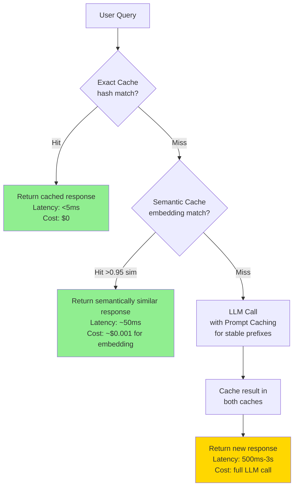

# Caching Strategies

> **TL;DR**: LLM caching has three layers: exact cache (identical prompts return cached responses, milliseconds, free), semantic cache (similar prompts get similar cached responses, ~50ms, ~$0), and prompt caching (stable prefixes skip recomputation, 90% cost reduction). Use all three. The exact cache alone is worth implementing on day one.

**Prerequisites**: [Context Engineering](../02-prompt-engineering/02-context-engineering.md), [Observability and Tracing](01-observability-and-tracing.md)
**Related**: [Cost Optimization](07-cost-optimization.md), [Inference Infrastructure](04-inference-infrastructure.md)

---

## The Three Cache Layers



Each layer handles a different case:
- **Exact cache:** Same user asking the same question again (FAQ bots, search queries)
- **Semantic cache:** Different phrasing of the same question ("What's your refund policy?" vs "How do I get a refund?")
- **Prompt caching (Anthropic API):** Same system prompt/documents used across many requests

---

## Layer 1: Exact Cache

Hash the full prompt, store the response. Millisecond lookups, zero LLM cost on hits.

```python
import hashlib
import json
import redis

cache = redis.Redis(host="localhost", port=6379, decode_responses=True)

def get_cache_key(messages: list[dict], system: str, model: str) -> str:
    """Deterministic cache key from prompt components."""
    payload = json.dumps({
        "messages": messages,
        "system": system,
        "model": model
    }, sort_keys=True)
    return f"llm:exact:{hashlib.sha256(payload.encode()).hexdigest()}"

def cached_llm_call(messages: list[dict], system: str = "",
                    model: str = "claude-opus-4-6", ttl: int = 3600) -> str:
    key = get_cache_key(messages, system, model)

    # Check cache
    cached = cache.get(key)
    if cached:
        return json.loads(cached)

    # Cache miss: call LLM
    response = client.messages.create(
        model=model, system=system, messages=messages, max_tokens=1024
    )
    result = response.content[0].text

    # Store in cache
    cache.setex(key, ttl, json.dumps(result))
    return result
```

**TTL guidelines:**
- FAQ-style queries: 24 hours (answers don't change often)
- News/current events: 15 minutes
- User-specific queries: no caching (privacy, relevance)
- System prompts + static documents: 1 hour

**What not to cache:** Personalized responses, real-time data queries, anything with user-specific context that changes. The exact cache is for stateless, reproducible prompts.

---

## Layer 2: Semantic Cache

Instead of exact hash matching, embed the query and return a cached response if a similar query exists. Handles paraphrasing and minor variations.

```python
import numpy as np
from sentence_transformers import SentenceTransformer

embed_model = SentenceTransformer("BAAI/bge-small-en-v1.5")  # Fast, small

class SemanticCache:
    def __init__(self, similarity_threshold: float = 0.95):
        self.threshold = similarity_threshold
        self.cache: list[tuple[np.ndarray, str, str]] = []  # (embedding, query, response)

    def get(self, query: str) -> str | None:
        if not self.cache:
            return None

        query_embedding = embed_model.encode(query)
        embeddings = np.array([e for e, _, _ in self.cache])

        similarities = np.dot(embeddings, query_embedding) / (
            np.linalg.norm(embeddings, axis=1) * np.linalg.norm(query_embedding)
        )

        best_idx = np.argmax(similarities)
        if similarities[best_idx] >= self.threshold:
            return self.cache[best_idx][2]  # Return cached response
        return None

    def set(self, query: str, response: str):
        embedding = embed_model.encode(query)
        self.cache.append((embedding, query, response))
        # In production: use Redis + pgvector or Qdrant instead of in-memory

semantic_cache = SemanticCache(similarity_threshold=0.95)
```

**Production semantic cache with Redis + vector store:**

```python
import qdrant_client
from qdrant_client.models import Distance, VectorParams, PointStruct

qdrant = qdrant_client.QdrantClient(host="localhost", port=6333)
qdrant.recreate_collection(
    collection_name="query_cache",
    vectors_config=VectorParams(size=384, distance=Distance.COSINE)
)

def semantic_cache_get(query: str, threshold: float = 0.95) -> str | None:
    query_embedding = embed_model.encode(query).tolist()
    results = qdrant.search("query_cache", query_vector=query_embedding, limit=1)

    if results and results[0].score >= threshold:
        return results[0].payload["response"]
    return None

def semantic_cache_set(query: str, response: str):
    query_embedding = embed_model.encode(query).tolist()
    qdrant.upsert(
        collection_name="query_cache",
        points=[PointStruct(
            id=hash(query) % (2**63),
            vector=query_embedding,
            payload={"query": query, "response": response}
        )]
    )
```

**Semantic cache hit rate by threshold:**

| Threshold | Typical Hit Rate | Risk of Wrong Response |
|---|---|---|
| 0.80 | 40-60% | High (semantically similar ≠ same answer) |
| 0.90 | 25-40% | Medium |
| 0.95 | 10-25% | Low |
| 0.98 | 5-15% | Very low |

Start at 0.95. Measure cache hit rate and look at a sample of hits. If you see wrong answers being served (semantic match wasn't close enough), raise to 0.97.

---

## Layer 3: Prompt Caching (Anthropic Native)

Covered in depth in [Context Engineering](../02-prompt-engineering/02-context-engineering.md), but the production setup:

```python
from anthropic import Anthropic

client = Anthropic()

# SYSTEM prompt with cache_control on stable expensive prefix
def production_rag_call(
    static_context: str,     # Same for all users: policy docs, few-shot examples
    user_query: str
) -> str:
    response = client.messages.create(
        model="claude-opus-4-6",
        max_tokens=1024,
        system=[
            {
                "type": "text",
                "text": "You are a helpful assistant for Acme Corp. Answer based on provided context.",
            },
            {
                "type": "text",
                "text": static_context,              # The expensive part
                "cache_control": {"type": "ephemeral"}  # Cache this prefix
            }
        ],
        messages=[{"role": "user", "content": user_query}]
    )

    # Log cache performance
    print(f"Cache read: {response.usage.cache_read_input_tokens}")
    print(f"Cache write: {response.usage.cache_creation_input_tokens}")
    print(f"Normal input: {response.usage.input_tokens}")

    return response.content[0].text
```

Prompt caching is most effective when:
- The cached prefix is large (>1024 tokens)
- The same prefix is used by many requests (>10 per hour)
- The prefix is stable (doesn't change per request)

---

## Cache Invalidation Strategies

The hardest problem in caching:

```python
class CacheInvalidator:
    def __init__(self, exact_cache: redis.Redis, semantic_cache):
        self.exact = exact_cache
        self.semantic = semantic_cache

    def invalidate_on_data_change(self, changed_document: str):
        """When a knowledge base document changes, invalidate related cache entries."""
        # Exact cache: delete all keys containing the document hash
        # (need to tag cache entries with source documents)
        doc_hash = hashlib.sha256(changed_document.encode()).hexdigest()[:8]
        pattern = f"llm:exact:*{doc_hash}*"
        for key in self.exact.scan_iter(pattern):
            self.exact.delete(key)

        # Semantic cache: more expensive, re-embed affected queries
        # In practice: time-based TTL is often simpler than content-based invalidation

    def invalidate_on_ttl(self, ttl_seconds: int):
        """Let TTL handle invalidation. Simple and reliable."""
        # Just set appropriate TTLs when caching:
        # - Knowledge base answers: 1 hour
        # - Product catalog: 6 hours
        # - FAQ: 24 hours
        pass
```

**Recommendation:** For most systems, time-based TTL is the right invalidation strategy. Content-based invalidation (invalidate when source documents change) is correct but complex to implement reliably. Use TTL for correctness; if freshness matters, reduce the TTL.

---

## Measuring Cache Effectiveness

```python
from dataclasses import dataclass, field
from collections import defaultdict

@dataclass
class CacheMetrics:
    exact_hits: int = 0
    exact_misses: int = 0
    semantic_hits: int = 0
    semantic_misses: int = 0
    llm_calls: int = 0
    prompt_cache_read_tokens: int = 0
    prompt_cache_write_tokens: int = 0
    total_cost_saved: float = 0.0

    def hit_rate(self) -> dict:
        total = self.exact_hits + self.exact_misses
        if total == 0:
            return {}
        return {
            "exact_hit_rate": self.exact_hits / total,
            "semantic_hit_rate": self.semantic_hits / (self.semantic_misses + self.semantic_hits)
                                 if (self.semantic_hits + self.semantic_misses) > 0 else 0,
            "total_cache_savings": self.total_cost_saved
        }

metrics = CacheMetrics()

# Wrap your cached_llm_call to track metrics
```

**Target metrics:**
- Exact cache hit rate: 15-40% for typical Q&A applications
- Semantic cache hit rate (of exact misses): 10-25% at 0.95 threshold
- Combined cache hit rate: 20-50% for FAQ-heavy applications
- Prompt caching savings: 60-90% of input token costs for stable prefixes

---

## Multi-Region Cache Considerations

If you're serving users in multiple regions, your cache needs to be regional to avoid cross-region latency:

```python
import os

REGION = os.environ.get("AWS_REGION", "us-east-1")

# Connect to regional Redis
cache = redis.Redis(
    host=f"redis.{REGION}.internal",
    port=6379
)

# Cache writes happen locally; reads from the local cache
# If local cache miss, optionally query the global cache (adds latency)
# For most applications, local-only is fine
```

The cache hierarchy: local memory (< 1ms) → regional Redis (< 5ms) → global Redis or CDN (20-50ms) → LLM API (500ms-3s).

---

## Gotchas

**Caching non-deterministic responses creates stale content.** If you cache an LLM response for "What's the weather today?" at 9am, users at 3pm get the wrong answer. Don't cache time-sensitive or dynamic responses.

**Semantic cache can serve wrong answers.** If "How do I cancel my subscription?" and "How do I pause my subscription?" are above your similarity threshold, you might serve the cancellation answer to someone who wants to pause. Monitor semantic cache false positives by sampling hits and checking correctness.

**Prompt caching breaks when the prefix changes.** Adding a timestamp, user ID, or any dynamic content to the cached prefix breaks the cache. Keep cached prefixes completely static and separate from dynamic content.

**Cache invalidation bugs cause stale responses.** An invalidation bug that fails silently means users see stale data without knowing it. Test invalidation explicitly; add a "cache-busting" parameter for debugging.

**Cache bypasses from bad actors.** If users can query with slight variations to bypass the cache (costing you money), add rate limiting in addition to caching. They're complementary, not substitutes.

---

> **Key Takeaways:**
> 1. Three-layer cache: exact (hash match, free), semantic (embedding similarity, ~$0), prompt caching (stable prefix, 90% cost reduction). All three serve different use cases.
> 2. Start with exact cache and prompt caching on day one. Add semantic cache if exact cache hit rate is below 15% for your workload.
> 3. Use TTL for cache invalidation rather than trying to invalidate on content changes. Simpler, more reliable, good enough for most systems.
>
> *"The best LLM call is the one you don't have to make. Cache aggressively."*

---

## Interview Questions

**Q: Your RAG application serves 100K queries/day. About 20% are variations of the same 50 FAQ questions. How do you reduce costs with caching?**

The FAQ pattern is exactly what caching is built for. I'd implement a two-layer approach.

First, exact cache for truly identical queries. This is trivial to implement with Redis and handles users who copy-paste the same question or use a search widget. My guess is 5-10% of traffic is truly identical.

Second, semantic cache for the variations. Those 50 FAQ questions might arrive as "What's your return policy?", "How do I return something?", "Can I return an item?". These are semantically the same. I'd embed each incoming query, check against a Qdrant collection of cached queries at 0.95 cosine similarity threshold. If it's above threshold, return the cached response.

For the FAQ corpus specifically: I'd pre-populate the semantic cache by embedding all 50 FAQ questions at startup and storing them with their ideal answers. Then the semantic cache has a hot start instead of building up over time.

On the Anthropic side: prompt caching for the knowledge base documents. If the same policy documents are injected into every RAG call, that's ~2000 tokens I can cache. At 100K queries/day, that's 200M tokens/day → 90% cached = 180M cache-read tokens at $0.003/1K vs 200M full-price tokens at $0.03/1K. Savings: $5,100/day → $459/day. The caching alone justifies itself in the first hour.

Combined, I'd expect 30-40% of queries to be served from exact or semantic cache, and the remaining 60-70% to have 90% of their context served from prompt cache.

---

**Quick-fire Questions**

| Question | Answer |
|---|---|
| What is an exact cache for LLMs? | Cache keyed on a hash of the full prompt; identical prompts return cached responses |
| What is a semantic cache? | Cache using embedding similarity; similar queries above a threshold return cached responses |
| What similarity threshold for semantic caching? | Start at 0.95; lower means more hits but higher risk of wrong answers |
| How does Anthropic prompt caching work? | Marks stable prompt prefixes with cache_control; API caches KV attention states, charges 10% for cache reads |
| What is the prompt caching savings rate? | ~90% cost reduction on input tokens for the cached prefix portion |
| Why use TTL for cache invalidation? | Content-based invalidation is complex and error-prone; TTL is simpler and reliable for most use cases |
