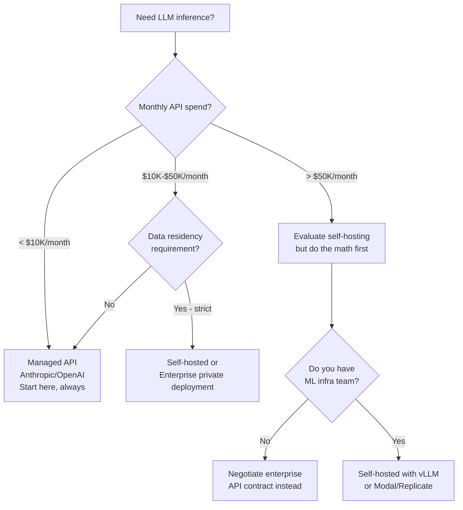

# Inference Infrastructure

> **TL;DR**: For most teams, managed APIs (Anthropic, OpenAI) are the right answer. Self-hosted inference makes sense only when you have >$50K/month API spend, strong data residency requirements, or need models not available via API. If you do self-host, vLLM is the standard inference server. GPU costs are 90% of your LLM infrastructure spend.

**Prerequisites**: [LLM Foundations Training Pipeline](../01-llm-foundations/05-training-pipeline.md)
**Related**: [Cost Optimization](07-cost-optimization.md), [Quantization](../01-llm-foundations/08-quantization.md), [Caching Strategies](03-caching-strategies.md)

---

## Managed API vs Self-Hosted

The most consequential infrastructure decision:



The economics of self-hosting only work at scale. An A100 80GB costs ~$3/hour on demand. A single GPU handles roughly 200 tokens/second for a 70B model. At 100K queries/day averaging 500 tokens, you need 4-5 GPUs = $12-15/hour = $9,000-11,000/month. Anthropic Sonnet at the same scale costs ~$7,000/month. Self-hosting is barely cheaper at this scale, and you haven't counted engineering time.

---

## GPU Reference Table (2025)

| GPU | VRAM | FP16 TFLOPS | On-Demand $/hr | Use Case |
|---|---|---|---|---|
| A100 80GB | 80GB | 312 | ~$3.00 | 70B models, production inference |
| A100 40GB | 40GB | 312 | ~$2.00 | 13B-34B models |
| H100 80GB | 80GB | 1,979 | ~$5.00 | High-throughput, training |
| L40S | 48GB | 733 | ~$2.50 | Good cost/performance |
| A10G | 24GB | 125 | ~$0.90 | 7B-13B models, dev/test |
| T4 | 16GB | 65 | ~$0.50 | 7B models quantized, low-traffic |
| L4 | 24GB | 242 | ~$0.80 | 7B-13B, better T4 replacement |

**Model-to-GPU fit (FP16, unquantized):**

| Model | VRAM Required | Minimum GPU |
|---|---|---|
| 7B parameter | ~14GB | A10G or L4 |
| 13B parameter | ~26GB | A100 40GB or L40S |
| 34B parameter | ~68GB | A100 80GB |
| 70B parameter | ~140GB | 2x A100 80GB |
| 180B parameter | ~360GB | 4-5x A100 80GB |

Add ~20% VRAM overhead for KV cache. Quantization (INT4) roughly halves the VRAM requirement.

---

## vLLM: The Standard Inference Server

[vLLM](https://github.com/vllm-project/vllm) is the production standard for self-hosted LLM inference. Its key innovation is PagedAttention, which manages KV cache memory like virtual memory, dramatically increasing throughput by batching requests efficiently.

```bash
# Install and start vLLM server
pip install vllm

python -m vllm.entrypoints.openai.api_server \
  --model meta-llama/Llama-3.1-70B-Instruct \
  --tensor-parallel-size 2 \        # Spread across 2 GPUs
  --max-model-len 32768 \           # Context window
  --gpu-memory-utilization 0.90 \   # Use 90% of GPU VRAM for KV cache
  --port 8000
```

vLLM exposes an OpenAI-compatible API, so you can use the OpenAI client:

```python
from openai import OpenAI

client = OpenAI(
    base_url="http://your-vllm-server:8000/v1",
    api_key="not-needed"
)

response = client.chat.completions.create(
    model="meta-llama/Llama-3.1-70B-Instruct",
    messages=[{"role": "user", "content": "Hello"}],
    max_tokens=512
)
```

**vLLM throughput benchmarks (rough, A100 80GB):**

| Model | Batch Size | Tokens/second |
|---|---|---|
| Llama 3.1 8B | 32 | ~1,800 |
| Llama 3.1 70B | 16 | ~400 |
| Llama 3.1 70B (2x A100) | 32 | ~750 |
| Llama 3.1 8B (INT4) | 32 | ~3,200 |

---

## vLLM vs Text Generation Inference (TGI)

Both are production-grade; choose based on your model source:

| Feature | vLLM | TGI (HuggingFace) |
|---|---|---|
| Primary focus | OpenAI API compatibility | HuggingFace model ecosystem |
| Throughput | Excellent (PagedAttention) | Very good |
| Model support | Most popular LLMs | Widest HF model coverage |
| Quantization support | AWQ, GPTQ, bitsandbytes | All HF quantization methods |
| Streaming | Yes | Yes |
| Docker image | Available | Official HF image |
| Community | Large, active | Large, active |

If you're using models from HuggingFace and want the easiest setup, use TGI. If you want maximum throughput and OpenAI API compatibility, use vLLM.

---

## Auto-Scaling for Variable Traffic

LLM inference has spiky traffic patterns (business hours, product launches). Auto-scaling is essential for cost control.

**On AWS ECS with GPU instances:**

```yaml
# ecs-service.yaml
Resources:
  LLMService:
    Type: AWS::ECS::Service
    Properties:
      LaunchType: EC2  # GPU instances require EC2 launch type
      TaskDefinition: !Ref LLMTask
      DesiredCount: 1

  LLMScalingPolicy:
    Type: AWS::ApplicationAutoScaling::ScalingPolicy
    Properties:
      PolicyType: TargetTrackingScaling
      TargetTrackingScalingPolicyConfiguration:
        TargetValue: 70.0  # Scale at 70% CPU utilization
        PredefinedMetricSpecification:
          PredefinedMetricType: ECSServiceAverageCPUUtilization
      ScaleInCooldown: 300   # 5 min before scaling in (GPU startup is slow)
      ScaleOutCooldown: 60   # Scale out quickly
```

GPU instance startup time is 2-5 minutes (downloading the model). This means:
1. Keep minimum instances at 1 (avoid cold starts affecting users)
2. Scale out proactively based on request queue depth, not just CPU
3. Scale in conservatively (long cooldown) to avoid thrashing

**Request queue depth as the scaling signal:**

```python
import boto3

cloudwatch = boto3.client("cloudwatch")

def publish_queue_depth(queue_depth: int):
    cloudwatch.put_metric_data(
        Namespace="LLMInference",
        MetricData=[{
            "MetricName": "QueueDepth",
            "Value": queue_depth,
            "Unit": "Count"
        }]
    )

# Scale out when queue depth > 10 for 2 minutes
# Scale in when queue depth < 2 for 10 minutes
```

---

## Load Balancing Multiple Instances

When running multiple vLLM instances, load balance at the request level:

```python
import random
from dataclasses import dataclass

@dataclass
class InferenceInstance:
    url: str
    current_load: int = 0
    healthy: bool = True

class LLMLoadBalancer:
    def __init__(self, instances: list[InferenceInstance]):
        self.instances = instances

    def get_instance(self) -> InferenceInstance | None:
        """Least connections routing."""
        healthy = [i for i in self.instances if i.healthy]
        if not healthy:
            return None
        return min(healthy, key=lambda i: i.current_load)

    def health_check(self):
        """Periodically check instance health."""
        for instance in self.instances:
            try:
                response = requests.get(f"{instance.url}/health", timeout=2)
                instance.healthy = response.status_code == 200
            except Exception:
                instance.healthy = False
```

For production, use a proper load balancer (nginx, Envoy, AWS ALB) rather than Python-level routing. The key is using least-connections routing, not round-robin, because LLM requests have highly variable duration.

---

## Serverless Inference for Burst Traffic

For variable, bursty workloads, serverless inference (Modal, Replicate, RunPod) avoids the fixed cost of always-on GPU instances:

```python
import modal

app = modal.App("llm-inference")

@app.function(
    gpu="A100",
    memory=40960,
    timeout=120,
    container_idle_timeout=300,  # Keep warm for 5 minutes
    image=modal.Image.debian_slim().pip_install("vllm")
)
def generate(prompt: str) -> str:
    from vllm import LLM, SamplingParams

    llm = LLM(model="meta-llama/Llama-3.1-8B-Instruct")
    outputs = llm.generate([prompt], SamplingParams(max_tokens=512))
    return outputs[0].outputs[0].text
```

Modal pricing (approximate): ~$0.00165/second for A100, ~$0.00055/second for A10G. A 2-second generation call on A100 costs $0.0033, similar to Anthropic's pricing per call for a similar model.

Serverless is great for dev/test and burst traffic. For sustained high-volume traffic, dedicated instances are cheaper.

---

## The "Managed API vs Self-Host" Math

Let me work through the actual numbers for a 70B model at 100K requests/day, 500 tokens average:

**Managed API (Claude Sonnet):**
- Input: 300 tokens × 100K × $0.003/1K = $90/day
- Output: 200 tokens × 100K × $0.015/1K = $300/day
- Total: $390/day = $11,700/month

**Self-hosted (Llama 70B, 2x A100):**
- 2x A100 on AWS: 2 × $3/hr × 24h = $144/day
- Storage, networking: ~$10/day
- Engineering allocation: $300/day (0.5 FTE ML engineer at $600K TC)
- Total: $454/day = $13,600/month

At 100K queries/day, managed API is cheaper, and you get better quality. Self-hosting makes economic sense at:
- >10x this volume (1M+ queries/day)
- Negotiated API discounts still don't beat self-hosted
- You already have the ML infra team for other reasons

---

## Gotchas

**Model loading time dominates cold starts.** Loading a 70B model from S3 to GPU VRAM takes 5-10 minutes. You can't have zero cold starts. Use pre-warmed instances for latency-sensitive applications and accept cold start latency for batch jobs.

**KV cache size limits effective batch size.** If each request uses a large context window, the KV cache fills up quickly and vLLM can't batch as many requests simultaneously. Monitor `gpu_cache_usage` in vLLM metrics; if it's above 90%, your batch size will be limited.

**Network I/O between GPUs in tensor parallelism.** For 70B models across 2 GPUs, the GPUs need high-bandwidth interconnect (NVLink). On cloud, only specific instance types have NVLink (p4d, p4de on AWS). Without NVLink, tensor parallelism is slower than expected.

**Quantized models need specific GPU formats.** AWQ and GPTQ quantized models need specific GPU compute capabilities (sm_80+ for A100, sm_86+ for A10). If you're using older GPUs, bitsandbytes INT8 is the more compatible option.

**Self-hosted requires 24/7 on-call.** When the inference server crashes at 2am, you need someone to restart it. Managed APIs handle this for you. Add the on-call burden to your total cost of ownership calculation.

---

> **Key Takeaways:**
> 1. Managed APIs are right for most teams. Self-hosting makes sense above ~$50K/month API spend with an ML infrastructure team already in place.
> 2. vLLM is the standard for self-hosted inference. Its PagedAttention enables 3-5x higher throughput than naive inference by efficient KV cache management.
> 3. GPU instance startup is 2-5 minutes (model loading). Plan accordingly: keep a minimum of 1 instance running for latency-sensitive applications; use pre-scaling for predictable load spikes.
>
> *"Self-hosting an LLM is not a cost optimization; it's an infrastructure commitment. Do the actual math before deciding."*

---

## Interview Questions

**Q: Your startup is spending $80K/month on Anthropic API. The CTO wants to self-host an open-source model. How do you evaluate this?**

I'd start with an actual cost analysis before any technical work. At $80K/month on Anthropic, I need to calculate what self-hosting costs at the same quality and throughput.

First, establish the actual throughput: how many queries/day, average tokens per query, peak vs average load. $80K/month with Claude Sonnet implies roughly 200-250K queries/day at typical usage.

For self-hosting a Llama 70B model at that scale: you need 6-8 A100 instances for the compute (2x A100 per instance for 70B), plus storage, networking, load balancers. Hardware costs: ~$18-24K/month. Add 1 ML engineer dedicated to infrastructure: ~$20-30K/month fully loaded. You're at $38-54K/month, saving $26-42K/month. That might be worth it.

But wait: what's the quality gap between Llama 70B and Claude Sonnet for your specific task? If you're doing complex reasoning or nuanced text generation, Llama 70B may need significantly more prompt engineering or fine-tuning to match quality. That's additional engineering cost.

My recommendation: run a 2-week quality evaluation. Run 1,000 production queries through both models, have LLM-as-judge score both, and measure the quality gap. If quality is within 5%, proceed with self-hosting. If the gap is >10%, factor in the engineering cost to close it.

Also check: are there Anthropic enterprise pricing tiers that bring down the per-token cost significantly? Often at $80K/month you can negotiate 30-40% discounts, bringing it to $48-56K/month — much closer to self-hosted cost without the operational burden.

---

**Quick-fire Questions**

| Question | Answer |
|---|---|
| What is vLLM's key advantage? | PagedAttention manages KV cache like virtual memory, enabling 3-5x higher throughput through efficient batching |
| What VRAM does a 70B model need (FP16)? | ~140GB, requiring 2x A100 80GB |
| What is TGI? | HuggingFace's Text Generation Inference server; best for HF model ecosystem |
| At what monthly spend does self-hosting become worth evaluating? | ~$50K/month, with an ML infra team already in place |
| How long does GPU cold start take? | 2-5 minutes (loading model weights from storage to VRAM) |
| What routing strategy for LLM load balancing? | Least-connections (not round-robin); LLM requests have highly variable duration |
