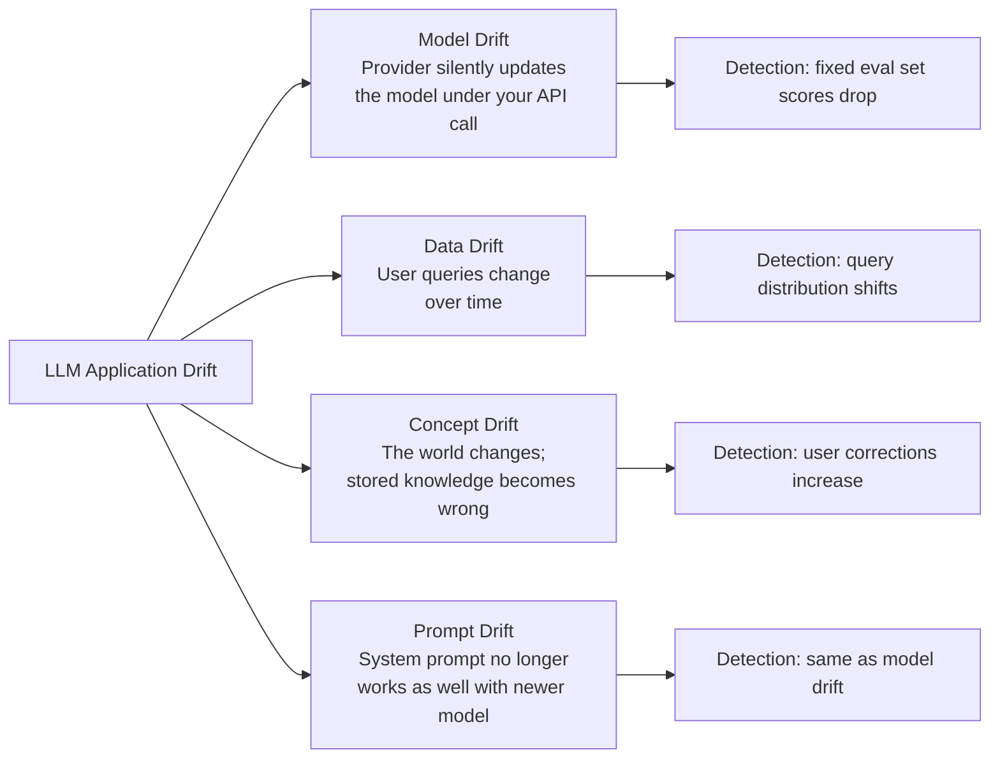

# Drift and Monitoring

> **TL;DR**: LLM applications degrade in three ways: model drift (provider updates the model), data drift (user queries change), and concept drift (the world changes and answers become stale). The only way to catch these is continuous monitoring against a fixed eval set. Weekly automated eval runs are the minimum; daily for high-stakes applications.

**Prerequisites**: [Eval Fundamentals](../05-evaluation/01-eval-fundamentals.md), [Observability and Tracing](01-observability-and-tracing.md)
**Related**: [MLOps for LLMs](06-mlops-for-llms.md), [LLM-as-Judge](../05-evaluation/03-llm-as-judge.md)

---

## Types of Drift



**Model drift** is surprisingly common. Anthropic, OpenAI, and Google regularly update models behind the same API endpoint without announcing it. A prompt that worked perfectly for six months can start behaving differently after a silent model update.

**Data drift** happens as your user base evolves. A customer service bot launched for technical users sees different queries once the product goes mainstream. The query distribution shifts; your eval set (built from early queries) no longer represents what you're serving.

---

## Setting Up Continuous Monitoring

The core monitoring loop:

```python
import schedule
import time
from anthropic import Anthropic

client = Anthropic()

def run_weekly_eval():
    """Run eval on fixed golden set. Alert if score drops."""
    # Fixed golden set — never modify this after initial creation
    golden_set = load_golden_set("golden_set_v1.json")

    scores = []
    for example in golden_set:
        response = client.messages.create(
            model="claude-opus-4-6",
            max_tokens=512,
            system=load_production_prompt(),
            messages=[{"role": "user", "content": example["query"]}]
        )
        score = judge_response(example["query"], response.content[0].text, example["reference"])
        scores.append(score)

    current_score = sum(scores) / len(scores)
    baseline_score = load_baseline("weekly_eval_baseline")

    metrics = {
        "week": time.strftime("%Y-W%V"),
        "score": current_score,
        "baseline": baseline_score,
        "delta": current_score - baseline_score,
        "passed": current_score >= baseline_score - 0.05  # Allow 5% variance
    }

    save_metrics(metrics)

    if not metrics["passed"]:
        send_alert(f"Quality drop detected: {baseline_score:.3f} → {current_score:.3f}")

    return metrics

# Run every Monday at 9am
schedule.every().monday.at("09:00").do(run_weekly_eval)
```

---

## Detecting Query Distribution Shift

Monitor whether production queries are drifting from your eval set:

```python
from sentence_transformers import SentenceTransformer
import numpy as np
from scipy.stats import ks_2samp

embed_model = SentenceTransformer("BAAI/bge-small-en-v1.5")

def detect_query_drift(
    baseline_queries: list[str],
    current_queries: list[str],
    p_threshold: float = 0.05
) -> dict:
    """Use KS test on embedding distributions to detect drift."""
    baseline_embeddings = embed_model.encode(baseline_queries)
    current_embeddings = embed_model.encode(current_queries)

    # Compare distributions along first principal component
    from sklearn.decomposition import PCA
    pca = PCA(n_components=1)
    baseline_proj = pca.fit_transform(baseline_embeddings).flatten()
    current_proj = pca.transform(current_embeddings).flatten()

    statistic, p_value = ks_2samp(baseline_proj, current_proj)

    return {
        "drift_detected": p_value < p_threshold,
        "ks_statistic": statistic,
        "p_value": p_value,
        "message": "Query distribution has shifted" if p_value < p_threshold else "No significant drift"
    }

# Run weekly: compare last 1000 production queries against baseline sample
drift_report = detect_query_drift(
    baseline_queries=load_baseline_queries(n=1000),
    current_queries=load_recent_queries(days=7, n=1000)
)
```

When drift is detected, it means your eval set may not represent what you're actually serving. Action: add recent production queries to the eval set.

---

## Production Quality Signals

Beyond automated eval, behavioral signals from production are the most reliable indicators of quality:

| Signal | What It Indicates | Collection Method |
|---|---|---|
| Thumbs down rate | Direct user dissatisfaction | UI feedback button |
| Conversation reruns | User didn't get what they needed | Session analysis |
| Escalation rate | Bot failed, user went to human | Support ticket source |
| Repeat question rate | Answer was incomplete or wrong | Session analysis |
| Response copy rate | User found response useful (positive) | UI instrumentation |
| Follow-up question rate | Ambiguous: could be good or bad | Session analysis |

```python
def calculate_behavioral_metrics(sessions: list[dict]) -> dict:
    total = len(sessions)
    return {
        "thumbs_down_rate": sum(s.get("thumbs_down", 0) for s in sessions) / total,
        "escalation_rate": sum(1 for s in sessions if s.get("escalated")) / total,
        "avg_turns_to_resolution": sum(s.get("turns", 1) for s in sessions) / total,
    }
```

Thumbs down rate above 5% is a red flag. Escalation rate above 10% for a bot claiming to handle 80% of queries means the bot isn't working.

---

## Alerting Thresholds

| Metric | Warning | Critical | Action |
|---|---|---|---|
| Eval score drop | >3% from baseline | >7% drop | Investigate; Critical: rollback |
| Error rate | >0.5% | >2% | Check API status; Critical: failover |
| P95 latency | >3s | >8s | Check cache; Critical: scale out |
| Thumbs down rate | >5% | >10% | Manual review; Critical: suspend |
| Token count spike | >130% of 7-day avg | >200% | Check for context stuffing |
| Query drift detected | Any | N/A | Update eval set with new queries |

---

## Rollback Strategy

When quality drops significantly, you need to be able to roll back:

```python
class PromptVersionManager:
    def __init__(self):
        self.versions = {}  # version_id -> prompt
        self.production_version = "v1.0"

    def deploy(self, version_id: str, prompt: str, eval_score: float):
        """Deploy a new prompt version. Requires eval score to be above baseline."""
        if eval_score < self.get_baseline_score() - 0.02:
            raise ValueError(f"Eval score {eval_score:.3f} below required threshold")
        self.versions[version_id] = {"prompt": prompt, "score": eval_score}
        self.production_version = version_id

    def rollback(self, target_version: str):
        """Roll back to a previous version."""
        if target_version not in self.versions:
            raise ValueError(f"Version {target_version} not found")
        self.production_version = target_version

    def get_production_prompt(self) -> str:
        return self.versions[self.production_version]["prompt"]
```

Always keep the previous 3 production versions deployable. When a silent model update breaks your system, you can roll back the prompt while you investigate (and often, re-tuning the prompt for the new model version is the fix).

---

## The Model Update Problem

Provider model updates are the most insidious form of drift because they're invisible. Anthropic may update `claude-opus-4-6` without changing the model name in ways that subtly affect behavior.

**Mitigation strategies:**

1. **Pin to specific model versions** when the provider offers them: Use `claude-opus-4-6-20251101` instead of `claude-opus-4-6` if the API supports version pinning.

2. **Weekly automated eval** catches silent updates within a week. If quality drops after no changes on your end, suspect a model update.

3. **Monitor output statistics:** Track average response length, vocabulary diversity, and format compliance. Model updates often shift these before they show up in quality scores.

```python
def monitor_output_stats(responses: list[str]) -> dict:
    """Track statistical properties of responses to detect silent model changes."""
    lengths = [len(r.split()) for r in responses]
    return {
        "avg_length": sum(lengths) / len(lengths),
        "p95_length": sorted(lengths)[int(0.95 * len(lengths))],
        "json_format_rate": sum(1 for r in responses if r.strip().startswith("{")) / len(responses),
    }
```

---

## Gotchas

**Eval set staleness.** If your eval set never changes, it eventually stops representing production queries. Add 20-30 new examples from production every month. But never modify the original eval set; only append to it, so historical scores remain comparable.

**Monitoring adds cost.** Running LLM-as-judge evaluation on 200 examples weekly costs money. At $0.005/judge call with Haiku, that's $1/week. Not significant. But running it daily at scale adds up. Budget for monitoring costs explicitly.

**False alarms from seasonal patterns.** If your application has weekly or seasonal patterns (more complex queries on Mondays, lighter traffic on weekends), your scoring will vary for legitimate reasons. Build baseline adjustments for seasonal patterns before setting rigid thresholds.

**Behavioral metrics lag quality metrics.** Thumbs down rate changes after multiple users have a bad experience. Automated eval on a fixed golden set catches problems before users do. Don't rely solely on behavioral signals; they're confirmation, not detection.

---

> **Key Takeaways:**
> 1. Model drift is invisible without continuous monitoring. Providers update models silently. Weekly automated eval on a fixed golden set is the minimum to catch this within a week.
> 2. Monitor three types of drift: model drift (eval score drops), data drift (query distribution shifts), and concept drift (behavioral metrics degrade).
> 3. Keep rollback ready. Keep the last 3 prompt versions deployable. When a silent model update breaks quality, rolling back the prompt while investigating is often the fastest fix.
>
> *"LLM applications rot in silence. The model changes, the world changes, the users change. Only monitoring tells you when."*

---

## Interview Questions

**Q: Six months after launch, your AI assistant's user satisfaction drops 15%. How do you diagnose and fix it?**

A 15% satisfaction drop is a significant signal. My first question is: do I have any data that tells me whether this is recent or gradual? If monitoring was set up properly, I'd have weekly eval scores. If scores started dropping 2 months ago and I missed it, that's a process failure. If it's sudden, something specific changed.

Diagnosis path: check if anything changed on our end in the last month (prompt changes, retrieval updates, model versions). Check the provider's changelog for model updates. Run the current system against our golden eval set and compare to the baseline score. If the eval score dropped, we have a measurable quality regression.

If it's gradual: this is likely data drift. Our early users were technical; the user base has grown and now includes non-technical users asking simpler questions in different ways. The fix: pull 500 recent failed conversations (high follow-up rate, escalations), analyze what's failing, update the eval set with these new query types, and tune the prompt for the current user population.

If it's sudden and the eval score dropped: suspect a silent model update. Compare output statistics from before and after the satisfaction drop (response length, format, vocabulary). If something changed in the model's behavior, update the prompt to compensate. If we can pin to a previous model version, do that temporarily.

If the eval score didn't drop but satisfaction did: the eval set is stale and not representative of what's actually being asked. This is the "eval set drift" problem. Build a new eval set from recent production queries.

---

**Quick-fire Questions**

| Question | Answer |
|---|---|
| What is model drift? | Provider silently updates the model, changing behavior without changing the API endpoint |
| What is data drift? | User query distribution changes over time from what was present in the original eval set |
| What is concept drift? | The world changes making stored/retrieved knowledge incorrect |
| How often should automated eval run? | Weekly minimum; daily for high-stakes applications |
| What behavioral signal most reliably indicates quality problems? | Escalation rate (user went to human) and repeat question rate (answer was incomplete) |
| Why keep previous prompt versions deployable? | Model updates can break prompts silently; rollback to last known-good prompt is the fastest first response |
