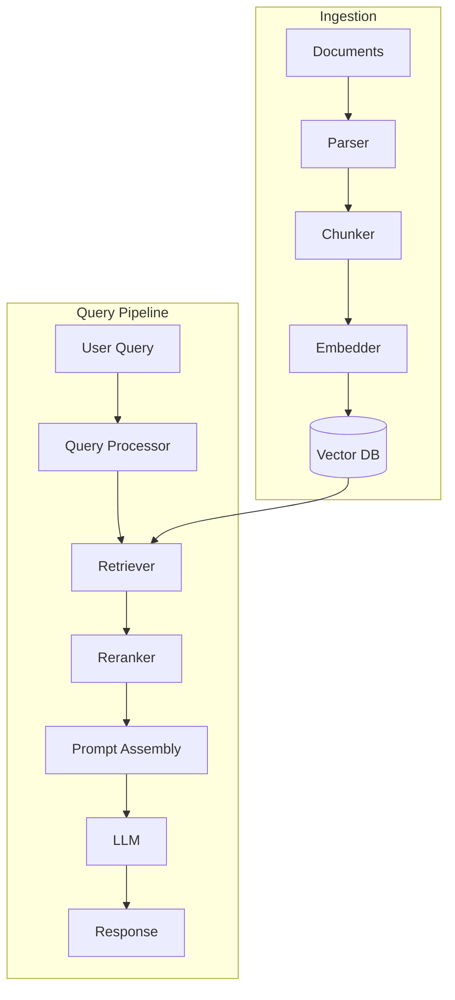

# AI System Design Interview Framework

> **TL;DR**: AI system design interviews test whether you can make principled decisions under uncertainty, not whether you've memorized architectures. Structure your answer with requirements first, high-level design second, deep dives third. The candidates who stand out are the ones who proactively discuss failure modes and tradeoffs, not the ones who draw the most components.

**Prerequisites**: [RAG Fundamentals](../03-retrieval-and-rag/01-rag-fundamentals.md), [Agent Fundamentals](../04-agents-and-orchestration/01-agent-fundamentals.md)
**Related**: [Design Patterns Catalog](02-design-patterns-catalog.md), [Architecture Templates](03-architecture-templates.md), [Case: Enterprise RAG](04-case-enterprise-rag.md)

---

## The Core Insight: AI Interviews Are Different

Traditional system design interviews test scalability thinking. You get "design Twitter" and spend 45 minutes on load balancers, sharding strategies, and caching layers. The interviewer knows the "right" answer and is checking whether you can think through distributed systems under pressure.

AI system design interviews test something different. The interviewer often doesn't have a definitive right answer. The field is moving fast enough that the "best" architecture for an enterprise RAG system was different 18 months ago than it is today. What they're testing is:

1. Can you frame an ambiguous problem into concrete requirements?
2. Do you understand the tradeoffs between AI approaches (RAG vs fine-tuning, agents vs chains)?
3. Can you reason about quality, latency, and cost simultaneously?
4. Do you know where the landmines are in production AI systems?

The mental model shift: in traditional system design, more components and cleverness is often rewarded. In AI system design, **simplicity and knowing when NOT to use complex AI is a green flag**. An interviewer asking you to design a document Q&A system wants to hear you say "I'd start with naive RAG before adding reranking and GraphRAG."

---

## The 45-Minute Structure

```mermaid
gantt
    title 45-Minute AI System Design Interview
    dateFormat mm
    axisFormat %M min

    section Phase 1
    Clarifying Questions     :a1, 00, 5m
    section Phase 2
    Requirements + Constraints :a2, 05, 5m
    section Phase 3
    High-Level Design        :a3, 10, 10m
    section Phase 4
    Deep Dive: Core Components :a4, 20, 15m
    section Phase 5
    Failure Modes + Tradeoffs :a5, 35, 7m
    section Phase 6
    Wrap-up + Questions      :a6, 42, 3m
```



### Phase 1: Clarifying Questions (5 minutes)

Never start drawing. Ask 3-5 targeted questions. The questions signal your experience more than the architecture does.

**The 3 questions that unlock every AI system design:**

1. **What does "success" look like in production?** Is it response accuracy? User satisfaction? Task completion rate? Latency under 2 seconds? The answer shapes everything. A customer support bot that needs 95% user satisfaction is designed differently than one that needs to resolve 60% of tickets without human escalation.

2. **What does the data look like, and how does it change?** Size, structure, update frequency. 500K structured documents that update daily? A live database with 50M rows? Real-time event streams? Each answer suggests a different retrieval architecture.

3. **What are the constraints that aren't obvious?** Compliance requirements (HIPAA, GDPR, SOC2), latency budgets, cost per query, on-premise vs cloud, existing infrastructure. A healthcare company often can't send PHI to OpenAI. A startup often can't afford to run their own GPU infrastructure. Find out early.

Good clarifying questions to have ready:
- "What's the expected query volume? Are we talking 100 queries/day or 100K?"
- "Who are the users and what's their tolerance for errors?"
- "Is there existing infrastructure I should integrate with?"
- "What's the budget sensitivity? Is this cost-optimized or quality-optimized?"
- "Are there any non-negotiable latency requirements?"

### Phase 2: Requirements + Constraints (5 minutes)

After clarifying, write down the requirements you're designing for. Say them out loud. This does two things: confirms you understood the clarifications correctly, and gives you anchor points to reference throughout the interview.

Structure:
```
Functional requirements:
- [What the system must do]

Non-functional requirements:
- Latency: [specific target]
- Scale: [queries/day, data size]
- Quality: [accuracy target]
- Cost: [budget constraint if known]

Out of scope:
- [Things you're explicitly not solving]
```

The "out of scope" list is underused. Being explicit about what you're not solving shows you can prioritize and prevents the interview from sprawling into infinite scope.

### Phase 3: High-Level Design (10 minutes)

Draw the major components and data flows. Keep it at the right level of abstraction: don't go straight to "here's my HNSW index parameters," but also don't stay at "data goes in, answers come out."

A good high-level AI system design diagram has:
- Data sources (where does the knowledge/data come from?)
- Ingestion pipeline (how does it get into the system?)
- Storage layer (vector DB, relational DB, cache)
- Query pipeline (how does a user query flow through the system?)
- LLM layer (what model, what prompt structure?)
- Output layer (how is the response formatted/validated?)



Say what each component does in one sentence. Don't get lost in any single component yet.

### Phase 4: Deep Dives (15 minutes)

The interviewer will guide you here, or you should propose 2-3 areas to go deeper. The areas worth going deep on:

**Retrieval quality:** Chunking strategy, embedding model selection, hybrid search vs pure semantic, reranking. This is where most RAG failures hide.

**Scalability:** How does this handle 10x, 100x the load? Which components are the bottleneck? (Usually the LLM call, not the vector search.)

**Quality and evaluation:** How do you know the system is working? What metrics, what eval dataset, how do you detect when quality degrades?

**Cost optimization:** Token costs at scale, caching strategy, model selection.

Pick the areas most relevant to the problem. For a document Q&A system, retrieval quality is the most important deep dive. For an autonomous agent, failure recovery and safety guardrails matter more.

### Phase 5: Failure Modes + Tradeoffs (7 minutes)

This is where strong candidates separate from the rest. Bring up failure modes proactively. Don't wait to be asked.

For each major component, say: "This fails when X. I'd mitigate it by Y."

Failure modes worth mentioning for any AI system:
- **Data drift:** The document corpus changes, but the index doesn't update. Users get stale answers.
- **Retrieval failure:** The right documents exist but aren't retrieved because the query is worded differently.
- **Hallucination:** The LLM generates plausible-sounding but wrong information when retrieved context is insufficient.
- **Cost explosion:** A chatty user or adversarial input triggers many agent steps or very long outputs.
- **Latency outliers:** p99 latency is 10x p50. A small percentage of queries overwhelm the system.

### Phase 6: Wrap-up (3 minutes)

Briefly summarize the key decisions you made and why. If there were tradeoffs you couldn't resolve in 45 minutes, name them. Ask one specific technical question that shows you thought about implementation details.

---

## What Interviewers Actually Write Down

I've been on both sides of this loop. Here's what ends up in the debrief notes:

**What gets you hired:**
- Clear requirements gathering before drawing anything
- Explicit tradeoffs ("I'm choosing X over Y because of the latency requirement, but it means we lose Z")
- Proactive mention of failure modes without being asked
- Knowing when a simpler approach is better ("before adding reranking, I'd verify the baseline retrieval quality")
- Realistic numbers (latencies, costs, throughput) even if approximate

**What gets you passed:**
- Starting to draw an architecture without asking any questions
- Building the most complex possible system (GraphRAG + multi-agent + semantic cache) when a simple RAG chain would work
- Unable to explain why you chose specific components (random tool name dropping)
- No discussion of how you'd measure if the system is working
- Claiming things like "the LLM will handle that" without explaining how

**What tanks candidates even with good technical knowledge:**
- Being defensive when challenged ("well, you could also...") instead of engaging with the tradeoff
- Changing your answer when the interviewer pushes back, even if your original answer was right
- Spending 40 minutes on one component and running out of time for the rest of the design
- Not thinking aloud, so the interviewer can't follow your reasoning

---

## The Tradeoff Vocabulary

Interviewers want to hear specific tradeoff language. Here's a pattern that works:

> "I'd use [component/approach] here because [benefit]. The tradeoff is [downside]. I'd accept that tradeoff because [reasoning aligned with requirements]. If [alternative requirement], I'd switch to [alternative approach]."

Examples:

> "I'd use a managed vector DB like Pinecone rather than self-hosting Weaviate because it removes operational overhead. The tradeoff is higher cost at scale and vendor lock-in. Given this is a startup with a small infra team, I'd accept that tradeoff. If we were processing 100M+ vectors and cost was a constraint, I'd revisit running Weaviate on Kubernetes."

> "I'd start with naive RAG without reranking to hit our launch timeline. The tradeoff is some retrieval precision loss. I'd measure context precision in production and add a cross-encoder reranker if it drops below 0.7."

> "I'd use Claude Sonnet 4.6 instead of Opus for this use case. The quality difference for document Q&A is small, and Sonnet is 5x cheaper per token. If the questions required complex multi-step reasoning, I'd upgrade."

---

## How AI System Design Differs From Backend System Design

| Dimension | Backend System Design | AI System Design |
|---|---|---|
| Scalability bottleneck | Usually DB or network I/O | Usually the LLM call (high latency, high cost) |
| "Correct" answers | Usually deterministic | Probabilistic; measure quality, not correctness |
| Data modeling | Schema, normalization, indexes | Chunking, embeddings, knowledge representation |
| Caching strategy | Cache frequent reads | Also cache semantically similar queries |
| Failure modes | Service down, data corruption | Hallucination, retrieval failure, quality drift |
| Testing | Unit tests, integration tests, load tests | Eval datasets, LLM-as-judge, human evaluation |
| Versioning | API versions, schema migrations | Model versions, prompt versions, eval baselines |
| Cost model | Compute + storage, predictable | Token costs, variable and usage-dependent |

The mental model shift that helps most: in backend systems, you build infrastructure that data flows through. In AI systems, you build prompts + retrieval that shape what the LLM sees. "If the LLM saw perfect context, would it answer correctly?" is the question that drives most design decisions.

---

## Red Flags: What Tanks Candidates

**Jumping straight to architecture.** The interviewer gives a problem and the candidate immediately says "I'd use LangChain with a Pinecone vector database and GPT-4." No requirements, no constraints discussed. This signals shallow thinking.

**Technology name-dropping without depth.** "I'd use GraphRAG for the retrieval layer, Self-RAG for quality, and DSPy for prompt optimization." If you can't explain how GraphRAG works and when it's better than naive RAG, saying the name is worse than not saying it.

**"The LLM will handle that."** LLMs handle a lot, but "the LLM will figure out the retrieval strategy" or "the LLM will know when to stop" are not engineering answers. What specifically will the prompt do? What are the failure modes?

**No numbers.** Designing a system without discussing latency budgets, scale requirements, or cost estimates signals you haven't built production systems. Use approximate numbers. "Vector search on 1M documents typically returns in under 10ms on HNSW" is better than no numbers at all.

**Ignoring evaluation.** A strong AI system design includes how you'd know the system is working. "I'd set up a RAGAS eval pipeline with a golden dataset of 100 Q&A pairs run on every deployment" shows you understand production AI.

---

## Green Flags: What Makes Interviewers Want to Hire You

**"I'd start simple and measure first."** Proposing a simple baseline with clear metrics, then discussing how you'd add complexity based on measured need. This is exactly how good engineers think.

**Honest uncertainty with reasoned recommendations.** "I haven't used LlamaIndex's graph index in production, but based on the paper, I'd expect X. I'd validate with a small prototype." Honesty about what you know vs don't know, combined with how you'd figure it out.

**Proactive tradeoff discussion.** Before the interviewer asks, you say "the main tradeoff here is X vs Y. Given the requirements, I'd choose X. If the latency requirement was stricter, I'd revisit."

**Concrete failure modes.** "This design would fail if the document update pipeline lags behind the source system. I'd address this with event-driven reindexing and a freshness timestamp in the metadata."

**Asking smart follow-up questions.** "If query volume is expected to hit 100K/day within 6 months, I'd add a semantic cache layer. Is that a realistic growth expectation?" This shows systems thinking and attention to requirements.

---

## The Scoring Rubric

| Dimension | Good | Great | Exceptional |
|---|---|---|---|
| Requirements | Asks clarifying questions | Identifies hidden constraints | Flags contradictions in requirements |
| High-level design | Correct components and flows | Explains why each component | Discusses alternatives considered |
| Deep dive | Knows the tech | Knows the tradeoffs | Knows where it fails in production |
| Evaluation | Mentions eval | Describes specific metrics | Has a CI/CD eval pipeline in mind |
| Failure modes | Can answer when asked | Brings them up proactively | Quantifies probability and impact |
| Communication | Clear | Thinks aloud | Builds shared understanding with interviewer |

---

## Concrete Numbers to Have Ready

Interviewers notice when you know rough numbers. These are worth memorizing as of early 2025.

| Component | Typical Number |
|---|---|
| Claude Sonnet 4.6 latency (p50) | 1-3s for a typical response |
| Claude Opus 4.6 input cost | ~$15 per 1M tokens |
| Claude Sonnet 4.6 input cost | ~$3 per 1M tokens |
| OpenAI text-embedding-3-small | $0.02 per 1M tokens |
| Pinecone managed vector search (1M vectors) | ~$70/month |
| HNSW vector search latency | 1-10ms for 1M vectors |
| Typical RAG pipeline p50 latency | 1-3s (embedding + search + LLM) |
| Fine-tuning Llama 3.2 7B with LoRA | $10-40 on rented GPU |
| Semantic cache hit rate (typical) | 20-40% depending on query distribution |
| LLM output tokens per query | 200-500 for most Q&A tasks |

You don't need exact numbers, but "vector search returns in single-digit milliseconds" vs "I think it's fast?" signals very different levels of experience.

---

## Practice Approach

The fastest way to improve at AI system design interviews is to draw out the architecture for 1-2 systems per week, then write up the tradeoffs.

Work through the case studies in this section:
1. [Enterprise RAG](04-case-enterprise-rag.md) - the most common interview scenario
2. [Code Assistant](05-case-code-assistant.md) - tests your agent and context engineering knowledge
3. [Customer Support](06-case-customer-support.md) - tests cost optimization and human-in-loop design
4. [Document Intelligence](07-case-doc-intelligence.md) - tests multimodal and structured extraction
5. [AI Search Engine](08-case-search-engine.md) - tests hybrid retrieval and ranking

For each case study, practice saying your answer out loud before reading the solution. The ability to articulate your design verbally is a separate skill from being able to think through it on paper.

---

> **Key Takeaways:**
> 1. Structure your answer: requirements first (5 min), high-level design (10 min), deep dives (15 min), failure modes (7 min). Never skip requirements gathering.
> 2. Tradeoff discussion separates good from great. For every component choice, say what you're trading away and why that tradeoff is acceptable given the requirements.
> 3. Proactively discuss failure modes and evaluation. Interviewers notice when you bring these up before being asked.
>
> *"The candidates who get hired are the ones who make the interviewer feel like they're designing the system together, not watching a presentation."*

---

## Interview Questions

**Q: How do you approach AI system design differently from traditional backend system design?**

The biggest shift is where complexity lives. In backend design, the hard problems are consistency, availability, and partition tolerance. The "system" is the infrastructure, and you're designing the data flows and infrastructure that make it reliable.

In AI system design, the hard problems are quality, observability, and iteration. The "system" includes the LLM, which is a probabilistic black box. You can't write a test that says "this component always returns the correct answer." You write eval pipelines that measure the probability of correctness on a distribution of inputs.

This changes how I approach the interview. For a backend system, I'm drawing infrastructure diagrams. For an AI system, I'm thinking about: what information does the LLM see, how do I know if it's the right information, and how do I measure when the system degrades? The architecture emerges from those answers.

The other big difference is cost structure. Backend systems have mostly fixed infrastructure costs with variable data transfer costs. AI systems have variable token costs that grow linearly with usage. A query that triggers 5 LLM calls in an agent loop is 5x the cost of a simple Q&A query. You design around this: caching, cheaper models for simple subtasks, streaming to reduce perceived latency.

*Follow-up: "How would you handle a situation where the interviewer asks you about a technology you haven't used?"*

I'd be honest: "I haven't used X in production, but I'm familiar with the concepts. Based on what I know, I'd expect it to work by Y, with tradeoffs Z." Then I'd pivot to the comparison with something I have used: "In practice, I've solved this with A, which has similar properties but different operational characteristics." The goal is to show reasoning ability even when I don't have direct experience. Pretending to know something I don't is worse than admitting the gap and reasoning through it.

---

**Quick-fire Questions**

| Question | Answer |
|---|---|
| How long should requirements gathering take in a 45-min interview? | 5 minutes; ask 3-5 targeted questions, then move on |
| What are the 3 questions that unlock any AI system design? | (1) What does success look like? (2) What does the data look like? (3) What are the hidden constraints? |
| What do interviewers want to hear when you explain a component choice? | The tradeoff: why you chose it AND what you gave up |
| How is the LLM call different from other service calls in system design? | High latency (1-3s), high cost (per token), non-deterministic output |
| What should you proactively discuss without being asked? | Failure modes and how you'd evaluate the system |
| What is the biggest green flag in an AI system design interview? | "I'd start simple and measure before adding complexity" |
| What is the biggest red flag? | Starting to draw architecture before asking any clarifying questions |
