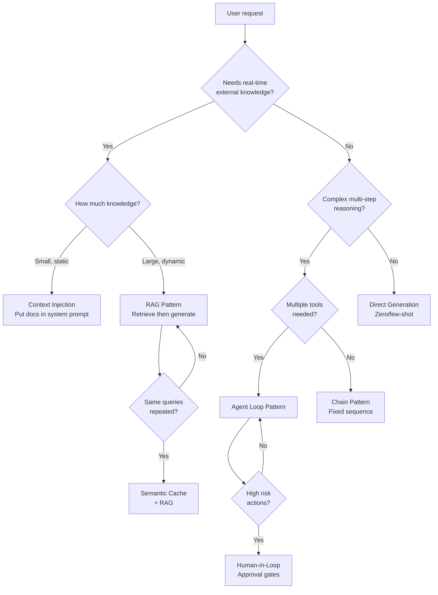

# AI System Design Patterns Catalog

> **TL;DR**: Every AI system is built from a small set of recurring patterns. Know these 12 patterns cold: RAG, Semantic Cache, Agent Loop, Human-in-Loop, Fanout-Aggregation, Routing, Fallback Chain, Eval-in-CI, Context Management, Streaming, Batch, and Rate Limiting. Most interview questions are asking you to compose 2-4 of these patterns.

**Prerequisites**: [Interview Framework](01-interview-framework.md), [RAG Fundamentals](../03-retrieval-and-rag/01-rag-fundamentals.md), [Agent Fundamentals](../04-agents-and-orchestration/01-agent-fundamentals.md)
**Related**: [Architecture Templates](03-architecture-templates.md), [Case Studies](04-case-enterprise-rag.md)

---

## Pattern Decision Tree



---

## Pattern 1: RAG (Retrieval-Augmented Generation)

**Use when:** The task needs real-time or large-scale knowledge that doesn't fit in the context window.

```
Query → Embed Query → Vector Search → Retrieve Chunks → Inject into Prompt → Generate
```

**Variants:**
- Naive RAG: single retrieval, inject, generate
- Advanced RAG: reranking, query transformation, hybrid search
- Agentic RAG: agent decides when and what to retrieve

**When to avoid:** Knowledge fits in the context window (just include it), knowledge is static and small (use fine-tuning or system prompt), no corpus exists (model's parametric knowledge is sufficient).

**Key parameters to tune:** chunk size, overlap, top-K, embedding model, reranker.

---

## Pattern 2: Semantic Cache

**Use when:** The same or similar queries are made repeatedly. FAQ bots, search interfaces, knowledge bases.

```
Query → Embed → Check Cache (cosine sim > 0.95) → Cache Hit: return → Cache Miss: LLM + cache result
```

**Variants:**
- Exact cache: hash match, fastest
- Semantic cache: embedding similarity, handles paraphrasing
- Prompt cache (Anthropic): caches stable prefixes at the API level

**When to avoid:** Every query is unique (personalized responses, real-time data), correctness matters more than speed (stale cache responses possible).

**Key parameters:** similarity threshold (0.95 is the default), TTL by query type.

---

## Pattern 3: Agent Loop (ReAct)

**Use when:** The task requires multiple steps, tool use, or decision-making based on intermediate results.

```
Observe → Think → Act (call tool) → Observe result → Repeat until done
```

**Variants:**
- Single-agent: one model, multiple tools
- Multi-agent: specialized agents with an orchestrator
- Plan-and-execute: plan all steps first, then execute

**When to avoid:** The task has a fixed, known sequence of steps (use a Chain instead), the task is a single LLM call (don't add agent overhead), latency budget is tight (agents add multiple LLM call latencies).

**Key parameters:** max_iterations (prevent infinite loops), tool set (minimal set for task), temperature (lower for tool calls).

---

## Pattern 4: Human-in-Loop

**Use when:** The agent has access to irreversible or high-risk actions (send email, modify data, make purchases).

```
Agent generates action → Check if action is high-risk → If yes: request human approval → Execute on approval
```

```python
def should_request_approval(tool_name: str, tool_input: dict) -> bool:
    """Determine if this tool call needs human approval."""
    high_risk_tools = {"send_email", "delete_record", "make_payment", "deploy_code"}
    return tool_name in high_risk_tools

# In LangGraph: interrupt_before=["high_risk_node"]
```

**When to avoid:** Real-time applications where the user is already in the loop (chatbot), the action is easily reversible (read operations, draft creation).

---

## Pattern 5: Fanout-Aggregation

**Use when:** The answer requires information from multiple sources that can be queried in parallel.

```
Query → Decompose into sub-queries → Parallel retrieval/calls → Aggregate results → Synthesize answer
```

```python
import asyncio

async def fanout_retrieve(sub_queries: list[str], retriever) -> list[str]:
    """Query multiple sources in parallel."""
    results = await asyncio.gather(*[retriever.query(q) for q in sub_queries])
    return [chunk for chunks in results for chunk in chunks]  # Flatten
```

**When to avoid:** Sub-queries are sequential (each depends on the previous), network fan-out creates rate limit issues, aggregation is the hard part (synthesizing conflicting sources).

**Key parameter:** concurrency limit (don't flood downstream APIs).

---

## Pattern 6: Routing

**Use when:** Different query types need different pipelines (different models, different retrieval, different prompts).

```
Query → Classifier (cheap model) → Route to specialized pipeline → Execute
```

| Query Type | Route To |
|---|---|
| Simple FAQ | Semantic cache + Haiku |
| Technical question | Full RAG + Sonnet |
| Complex analysis | Multi-step agent + Opus |
| Out-of-scope | Polite rejection |

**When to avoid:** All queries are similar enough that one pipeline handles them well, the classifier adds more latency than it saves.

**Key parameter:** classifier model (use Haiku, add ~50ms not 500ms).

---

## Pattern 7: Fallback Chain

**Use when:** You need high availability or want to try progressively more expensive options.

```
Primary (fast/cheap) → If fails or low confidence → Secondary (better) → If fails → Fallback (most reliable)
```

```python
def with_fallback(query: str, confidence_threshold: float = 0.7) -> str:
    # Try fast path first
    response, confidence = fast_path(query)
    if confidence >= confidence_threshold:
        return response

    # Fall back to full pipeline
    return full_pipeline(query)
```

**When to avoid:** Every request needs the best quality regardless of cost, latency budget can't accommodate multiple attempts.

---

## Pattern 8: Eval-in-CI

**Use when:** Prompts or pipelines change frequently (weekly or more). Catches regressions before production.

```
PR with prompt change → Run eval on golden set → Compare to baseline → Pass/fail gate → Merge or reject
```

**Key rule:** The golden eval set never changes (only appended to). The baseline score updates when a new version is promoted.

**When to avoid:** Eval is too expensive to run on every PR (use nightly instead), the task is too subjective for automated eval (use human review).

---

## Pattern 9: Context Management

**Use when:** Conversations are multi-turn and context grows beyond what fits efficiently in the window.

```
Check context size → If approaching limit: compress old turns → Keep recent turns verbatim → Proceed
```

**Variants:**
- Sliding window: keep last N turns
- Summarization: compress old turns to summary
- Semantic compression: extract key facts, discard filler

**When to avoid:** Single-turn applications, context fits easily in window, compression quality is too lossy for the task.

---

## Pattern 10: Streaming

**Use when:** Response latency matters more than total generation time, responses are long, users want immediate feedback.

```
Start generation → Stream tokens to client as generated → Client shows progressive output
```

```python
with client.messages.stream(...) as stream:
    for text in stream.text_stream:
        yield text  # Send to client immediately
```

**When to avoid:** You need to validate the full response before displaying (safety checks, format validation), structured output (you need the complete JSON before parsing).

---

## Pattern 11: Batch Processing

**Use when:** Tasks are non-real-time, volume is high, cost matters more than latency.

```
Collect batch (100-10000 items) → Submit to batch API → Poll/webhook for completion → Process results
```

**Cost:** 50% cheaper than real-time via Anthropic Batch API. **Latency:** minutes to hours.

**When to avoid:** User is waiting for the response, SLA requires sub-second responses.

---

## Pattern 12: Rate Limiting and Circuit Breaker

**Use when:** Protecting against abuse, managing costs, handling upstream API failures gracefully.

```
Request → Check rate limit → Check circuit breaker (upstream healthy?) → Execute → Record result
```

```python
class CircuitBreaker:
    def __init__(self, failure_threshold: int = 5, reset_timeout: int = 60):
        self.failures = 0
        self.threshold = failure_threshold
        self.state = "closed"  # closed = working, open = broken

    def call(self, fn, *args, **kwargs):
        if self.state == "open":
            raise Exception("Circuit open: upstream unavailable")
        try:
            result = fn(*args, **kwargs)
            self.failures = 0
            return result
        except Exception:
            self.failures += 1
            if self.failures >= self.threshold:
                self.state = "open"
            raise
```

---

## Pattern Composition Examples

Real systems combine patterns. Here's how they compose for common use cases:

**Customer Support Bot:**
RAG + Semantic Cache + Routing + Streaming + Rate Limiting

**Research Assistant:**
RAG + Fanout-Aggregation + Context Management + Eval-in-CI

**Autonomous Data Pipeline:**
Agent Loop + Human-in-Loop + Batch Processing + Fallback Chain

**Code Assistant:**
Routing (code type) + RAG (codebase) + Streaming + Agent Loop (multi-step edit)

---

## Gotchas

**Patterns add overhead.** Each pattern adds latency, complexity, or cost. Don't use a pattern unless you've identified the problem it solves. The question "why do you need this pattern?" should have a clear answer.

**Agent Loop + Human-in-Loop is the combination most interviewers want to see.** When you describe an agent system, always address: what happens when the agent wants to do something dangerous or irreversible? Human-in-loop is the answer.

**Routing adds a fast model call.** The router should add 50ms, not 500ms. Always route with the cheapest, fastest model (Haiku).

**Semantic cache threshold tuning is context-specific.** 0.95 is a starting point. For exact-answer queries (definitions, facts), use 0.97+. For open-ended queries, 0.90-0.95 may be fine. Always measure false positive rate before tuning threshold.

---

> **Key Takeaways:**
> 1. Twelve core patterns cover most AI system designs. Learn them well enough to recognize which 2-4 patterns any given problem is asking for.
> 2. Most interview questions are asking you to compose patterns. "Design a code assistant" = Routing + RAG (codebase) + Agent Loop + Streaming.
> 3. Every pattern has a "when to avoid." Show that you understand the tradeoffs, not just the benefit.
>
> *"A good AI system design is a small number of well-chosen patterns composed together. Complexity is usually a mistake."*

---

## Interview Questions

**Q: Walk me through how you'd handle a customer asking a complex multi-part question that requires looking up their order, applying the return policy, and drafting a response.**

This is a multi-step task with real-world actions, so I'd use the Agent Loop pattern with Human-in-Loop for the final send.

The agent gets the customer's message and their customer ID. First tool call: look up their order history (get_order). Second tool call: retrieve the relevant return policy (search_policy). The agent now has both pieces of context and synthesizes the response.

Before actually sending the email, I'd add a Human-in-Loop gate: the drafted response is shown to the support agent for approval. The agent can modify or approve. This pattern is important because emails are irreversible and customer-facing quality matters.

The whole flow uses RAG (for the policy lookup), Agent Loop (multi-step reasoning), and Human-in-Loop (approval before send). Semantic cache sits in front of the policy lookup — return policies don't change often, so "what's the return policy for electronics?" has a very high cache hit rate.

---

**Quick-fire Questions**

| Question | Answer |
|---|---|
| When do you use RAG vs context injection? | RAG for large/dynamic knowledge; context injection when knowledge fits in the window |
| What pattern handles "agent tries to delete production data"? | Human-in-Loop with approval gate for high-risk irreversible actions |
| What does the Routing pattern add in terms of latency? | ~50ms (one Haiku classification call) |
| What is the Fanout-Aggregation pattern? | Decompose query into sub-queries, retrieve in parallel, aggregate results |
| When is Batch Processing appropriate? | Non-real-time workloads where 50% cost savings outweighs hours of latency |
| What is a circuit breaker in this context? | Pattern that stops sending requests to a failing upstream service after N failures |
