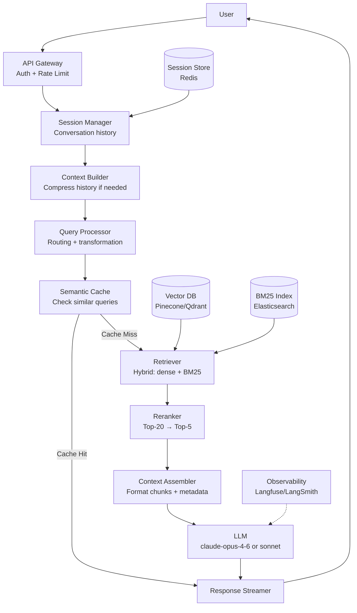
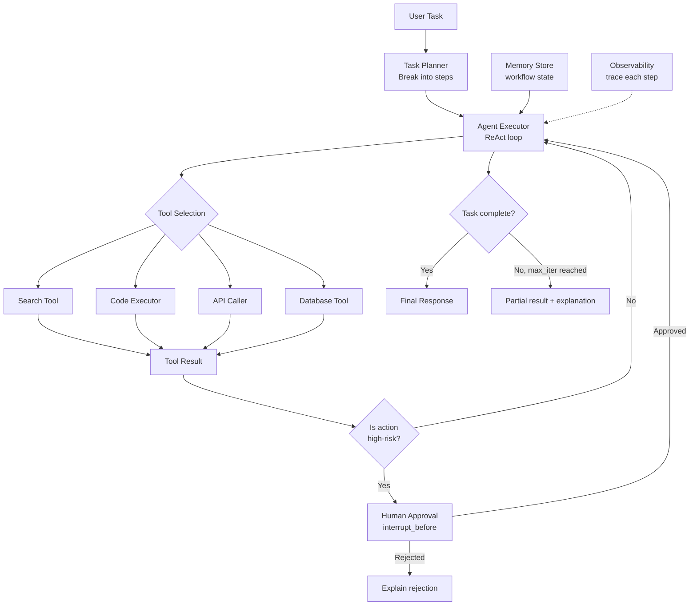
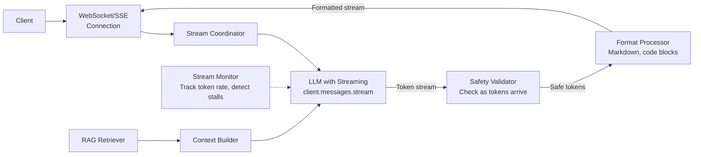
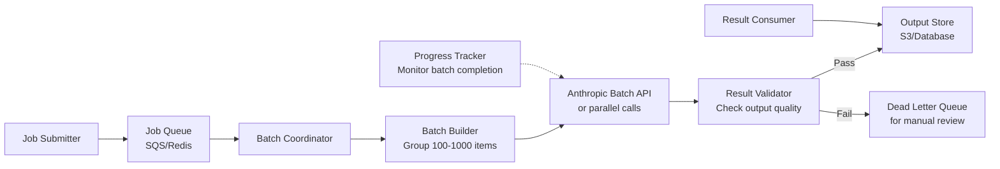
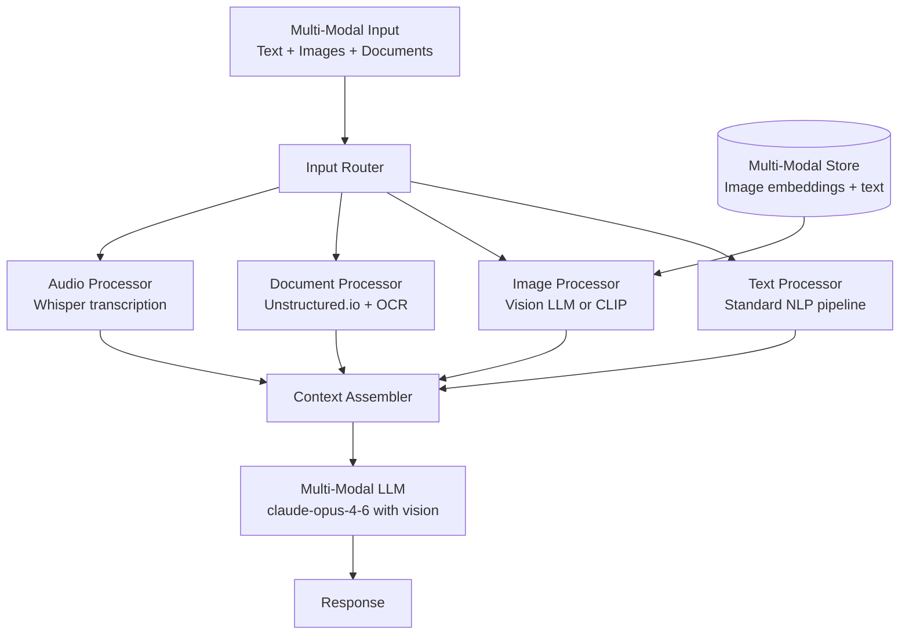
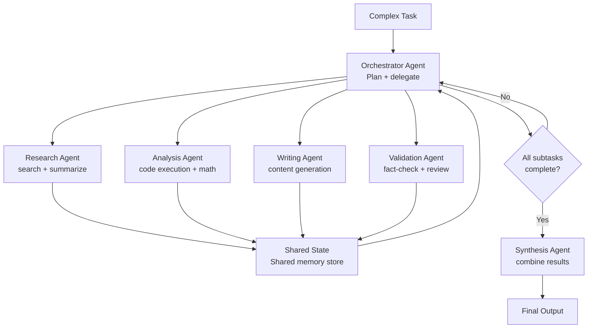
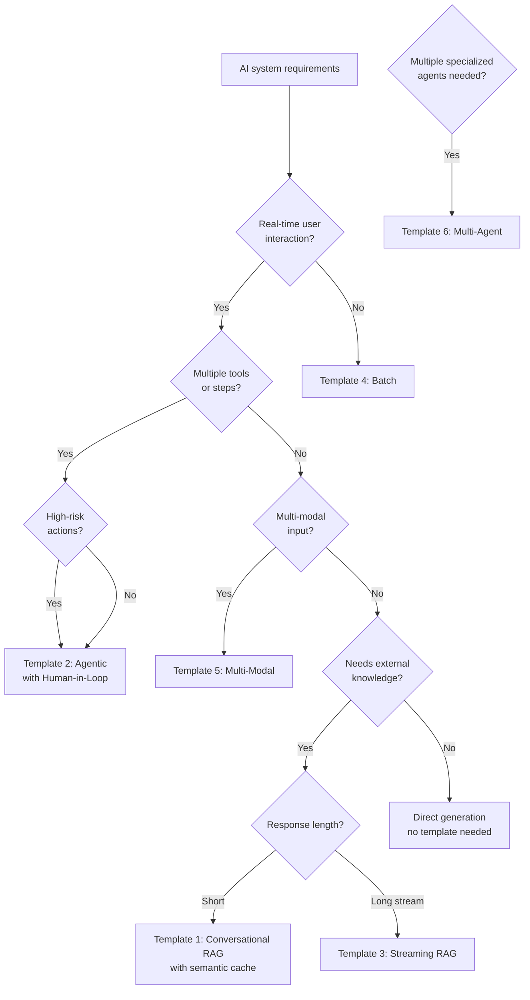

# Architecture Templates

> **TL;DR**: Six reference architectures cover 90% of AI system design interviews: Conversational RAG, Agentic Pipeline, Real-Time Streaming, Batch Processing, Multi-Modal, and Multi-Agent Orchestration. Learn the Mermaid diagram, latency budget, and cost model for each. In an interview, you're adapting one of these templates to the specific constraints.

**Prerequisites**: [Design Patterns Catalog](02-design-patterns-catalog.md), [Interview Framework](01-interview-framework.md)
**Related**: [Case Studies](04-case-enterprise-rag.md), [Production Ops](../06-production-and-ops/01-observability-and-tracing.md)

---

## Template 1: Conversational RAG

The workhorse architecture. Knowledge base + conversational interface. Covers most chatbot and Q&A interview questions.



**Latency budget (P50):**

| Component | Latency |
|---|---|
| API Gateway + Auth | 10ms |
| Cache check | 15ms |
| Hybrid retrieval | 80ms |
| Reranking | 200ms |
| LLM generation (first token) | 400ms |
| Total to first token | ~700ms |

**Cost model (100K queries/day, Sonnet):**
- Retrieval (2 embedding calls): $10/day
- Reranking (Cohere): $20/day
- LLM (2,300 tokens avg): $690/day
- Infrastructure: $50/day
- Total: ~$770/day

**When to use this template:** Customer service bots, internal knowledge bases, technical documentation assistants, HR policy bots.

---

## Template 2: Agentic Pipeline

For tasks requiring multiple tools, decision-making, and potentially irreversible actions.



**Latency budget (P50, 3-step task):**

| Component | Latency |
|---|---|
| Task planning | 800ms |
| Step 1 (tool + LLM) | 1,200ms |
| Step 2 (tool + LLM) | 1,200ms |
| Step 3 (synthesis) | 800ms |
| Total | ~4s |

For user-facing agents, stream progress updates to avoid perceived latency.

**When to use this template:** Autonomous data analysis, code generation agents, customer issue resolution, research assistants.

---

## Template 3: Real-Time Streaming Pipeline

For applications where users expect to see content appear as it's generated, or where results stream continuously.



**Streaming implementation:**

```python
from anthropic import Anthropic
from fastapi import FastAPI
from fastapi.responses import StreamingResponse

app = FastAPI()
client = Anthropic()

@app.post("/stream")
async def stream_response(query: str, context: str):
    async def generate():
        with client.messages.stream(
            model="claude-sonnet-4-6",
            max_tokens=1024,
            messages=[{"role": "user",
                       "content": f"Context:\n{context}\n\nQuestion: {query}"}]
        ) as stream:
            for text in stream.text_stream:
                yield f"data: {text}\n\n"
        yield "data: [DONE]\n\n"

    return StreamingResponse(generate(), media_type="text/event-stream")
```

**When to use this template:** Chat interfaces, code generation (user wants to see code appear), long document generation, voice assistants (text-to-speech as tokens arrive).

---

## Template 4: Batch Processing Pipeline

For high-volume, non-real-time workloads. 50% cheaper, no latency SLA.



**When to use this template:**
- Nightly document processing (index new documents into RAG)
- Bulk data extraction (extract structured data from PDFs)
- Report generation (generate weekly summaries for all accounts)
- Eval runs (evaluate prompt quality on 1000 examples)
- Training data generation

**Cost comparison at 1M items, 500 tokens avg input, 200 output:**
- Real-time Sonnet: 500M × $0.003 + 200M × $0.015 = $4,500
- Batch API: $2,250 (50% discount)

---

## Template 5: Multi-Modal Pipeline

For applications that need to process images, audio, or video alongside text.



**For document-heavy use cases:**

```
PDF Input → Unstructured.io extraction → Tables: serialize to markdown
                                        → Images/charts: LLM captioning
                                        → Text: standard chunking
All outputs → Unified text embedding pipeline → Vector store
```

**When to use this template:** Document intelligence (quarterly reports, contracts), customer support (screenshot-based issues), technical documentation, medical records.

---

## Template 6: Multi-Agent Orchestration

For tasks too complex for a single agent, requiring specialized capabilities.



**Communication patterns:**
- Shared state: all agents read/write a common store (LangGraph state)
- Message passing: agents communicate via messages (AutoGen)
- Return values: orchestrator collects results from each worker

**When to use this template:** Complex research tasks (multiple data sources), software development (spec → code → test → review), content production pipelines.

**When NOT to use it:** Most tasks don't need this. Try hard to make a single agent work first. Multi-agent adds significant complexity and debugging difficulty.

---

## Template Selection Guide



---

## Adapting Templates in Interviews

Templates are starting points, not answers. Every interview question adds constraints that modify the template. Practice identifying the constraint and showing how it changes the architecture.

**Common constraint variations:**

| Constraint | Template Modification |
|---|---|
| Sub-100ms P95 latency | Remove reranking, use exact cache, pre-compute embeddings |
| <$10K/month budget | Model downgrade for routine queries, aggressive caching |
| HIPAA compliance | Self-hosted vector DB, encrypted storage, no external APIs |
| 100M+ documents | Sharded vector store, approximate search, metadata pre-filters |
| Multi-language users | Multilingual embeddings (E5-multilingual), language routing |
| High-security context | Air-gapped deployment, local models, no cloud APIs |

Showing these adaptations is what distinguishes a strong system design answer from a pattern recitation.

---

> **Key Takeaways:**
> 1. Six templates cover 90% of interview questions. Memorize the Mermaid diagram and key numbers (latency, cost) for each.
> 2. Templates are modified by constraints. "How does this change if you need sub-100ms P95?" is the question that tests real understanding.
> 3. Start with the simplest template that could work. Then add complexity only as the requirements demand it.
>
> *"The right architecture is the simplest one that meets the requirements. Start there, not at multi-agent orchestration."*
