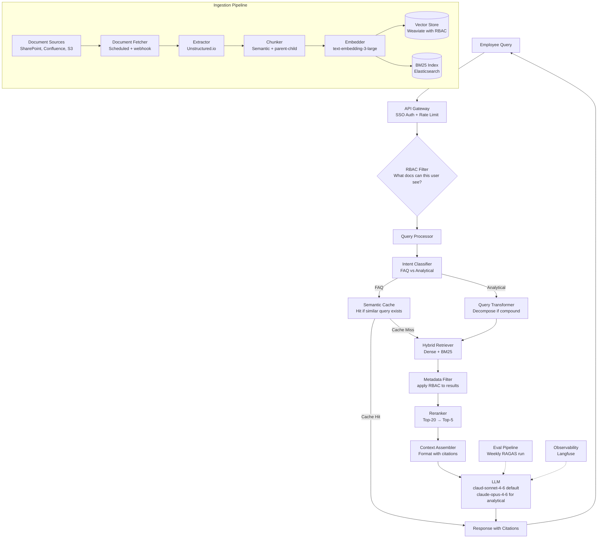

# Case Study: Enterprise RAG System

> **Problem**: Design a RAG system for a Fortune 500 company with 500K internal documents (policies, procedures, technical docs, meeting notes) that 50,000 employees can query in natural language.

**Related**: [RAG Fundamentals](../03-retrieval-and-rag/01-rag-fundamentals.md), [Architecture Templates](03-architecture-templates.md), [Vector Databases](../03-retrieval-and-rag/04-vector-databases.md)

---

## Requirements Clarification

The first 5 minutes of the interview should establish requirements. Here's what to ask and why:

**Query patterns:**
- "What types of questions will employees ask?" → Determines chunking strategy and retrieval complexity
- "Are most questions FAQ-style or analytical?" → Informs model selection
- "How many queries per day?" → Determines infrastructure scale

**Data characteristics:**
- "What's the document update frequency?" → Determines re-indexing strategy
- "Are documents structured (PDFs, DOCX) or unstructured?" → Determines extraction pipeline
- "Is there a document hierarchy (department, classification)?" → Metadata filtering strategy

**Access control:**
- "Can all employees see all documents?" → If no, you need row-level security in the vector DB
- "Are there confidentiality levels?" → Affects which documents are in the same index

**Performance:**
- "What's the acceptable latency for a response?" → Typically 2-3s for enterprise Q&A
- "Is this replacing a search engine or a new capability?" → Quality bar expectations

**Assumed answers for this case:**
- 200K queries/day, mix of FAQ and analytical
- Documents updated weekly (some daily for policies)
- Role-based access control required
- 2-3 second response time acceptable
- Mix of PDFs, DOCX, PowerPoint, and some HTML intranet pages

---

## Architecture



---

## Key Design Decisions

### 1. Vector Database Choice: Weaviate

For enterprise RBAC, Weaviate's native multi-tenancy is the right choice. Each tenant (department or access group) gets isolated data. A "Finance" tenant can't access "Legal" documents even if both are in the same Weaviate cluster.

```python
import weaviate
import weaviate.classes as wvc

client = weaviate.connect_to_local()

# Create collection with multi-tenancy
client.collections.create(
    name="CompanyDocs",
    multi_tenancy_config=wvc.config.Configure.multi_tenancy(enabled=True),
    properties=[
        wvc.config.Property(name="content", data_type=wvc.config.DataType.TEXT),
        wvc.config.Property(name="doc_id", data_type=wvc.config.DataType.TEXT),
        wvc.config.Property(name="access_level", data_type=wvc.config.DataType.TEXT),
    ]
)

# Query for a specific tenant (access group)
collection = client.collections.get("CompanyDocs")
response = collection.with_tenant("finance-team").query.hybrid(
    query=user_query,
    limit=20
)
```

Alternative if you're already on Postgres: pgvector with row-level security. The SQL access control is more familiar for most engineering teams.

### 2. Chunking Strategy: Parent-Child

For a 500K document corpus with varied document types, parent-child chunking gets the best of both worlds:
- Child chunks (256 tokens) for precise retrieval
- Parent chunks (1024 tokens) for coherent context injection

Policy documents: semantic chunking by section (each section is a chunk). Meeting notes: fixed-size with high overlap (ideas often span chunk boundaries). Technical documentation: AST-aware chunking for code sections.

### 3. Hybrid Search: Dense + BM25

Technical documentation has lots of specific terms, model numbers, error codes. BM25 matches these exactly when dense embeddings miss them. The α-weighted combination with α=0.5 (equal weight) is the default starting point.

Tune α per document type after measuring:
- Policy docs: α=0.7 (dense favored, semantic meaning matters)
- Technical docs: α=0.4 (BM25 favored, exact terms matter)

### 4. Model Routing

Not all queries need Claude Opus. Route by detected intent:
- FAQ/factual: Claude Haiku (saves ~80% on cost for 40% of queries)
- Analytical/reasoning: Claude Sonnet (good quality, 5x cheaper than Opus)
- Complex multi-document analysis: Claude Opus (reserved for the hard cases)

---

## Data Ingestion Pipeline

The ingestion pipeline is what makes or breaks an enterprise RAG system. Documents are messy.

```python
from unstructured.partition.auto import partition

def ingest_document(doc_path: str, access_level: str, dept: str) -> list[dict]:
    """Full ingestion pipeline for one document."""

    # Extract structured content
    elements = partition(filename=doc_path, strategy="hi_res")

    chunks = []
    for element in elements:
        if element.category == "Table":
            # Convert table to markdown for embedding
            content = table_to_markdown(element.metadata.text_as_html)
        elif element.category in ["Title", "NarrativeText", "ListItem"]:
            content = str(element)
        else:
            continue  # Skip headers, page numbers, footers

        if len(content.split()) < 20:
            continue  # Skip very short fragments

        chunks.append({
            "content": content,
            "doc_id": doc_path,
            "access_level": access_level,
            "department": dept,
            "element_type": element.category,
            "page": getattr(element.metadata, "page_number", None)
        })

    return chunks
```

**Re-indexing strategy:**
- Changed documents: webhook from SharePoint/Confluence triggers immediate re-index
- New documents: real-time ingestion via webhook
- Deleted documents: tombstone record + nightly cleanup job
- Full re-index: monthly (catches drift in extraction library behavior)

---

## Access Control Design

This is the part most designs get wrong. Access control needs to be enforced at the retrieval layer, not just at the API layer.

**Wrong approach:**
```python
# BAD: retrieve all docs, then filter by access
results = vector_db.query(query, top_k=100)
filtered = [r for r in results if user_has_access(r)]
return filtered[:5]  # Now you only have maybe 2 relevant results
```

**Right approach:**
```python
# GOOD: filter before retrieval using metadata
results = vector_db.query(
    query=query,
    top_k=20,
    filters={"access_level": {"$in": get_user_access_levels(user_id)}}
)
return results  # All results are documents the user can see
```

The user's access levels (from SSO/LDAP) are fetched at request time and passed as metadata filters to the vector query. This ensures that a finance manager never retrieves documents marked "executive-only".

---

## Failure Modes and Mitigations

| Failure | Symptom | Mitigation |
|---|---|---|
| Confidential doc retrieved for wrong user | User sees doc they shouldn't | Test RBAC with dedicated test accounts, audit access logs |
| Stale index | Outdated policy returned | Freshness metadata + recency-weighted ranking |
| Query misrouted | Simple question sent to Opus, wastes money | Monitor routing accuracy, tune classifier |
| Ingestion failure | New doc not indexed | Alert on ingestion errors, daily completeness check |
| Context window exceeded | Long policy + multi-turn history = crash | Context compression + budget-aware context builder |
| RAG hallucination | Model makes up policy details | Faithfulness score < 0.80 triggers review |

---

## Scale Numbers

At 50K employees and 200K queries/day (4 queries per employee per day):

**Peak load:** Assume 80% of queries in 8 business hours = 20K queries/hour = 333 QPS
- Vector search (P95 100ms): ~35 Weaviate nodes at 10 QPS each = manageable
- LLM calls: 333 QPS × 1,500 tokens avg = 500K tokens/minute

**Cost at this scale:**
- Embeddings (ingestion, 500K docs): one-time ~$25
- Embeddings (queries): ~$5/day (10M tokens/day via API)
- LLM generation: 333 QPS × 1,500 tok × $0.003/1K = ~$1,440/day
- Infrastructure (Weaviate + Elasticsearch cluster): ~$2,000/month
- Total: ~$45,000/month

---

## Interview Presentation Tips

When presenting this design in a 45-minute interview:
1. Minutes 0-5: Requirements (establish RBAC is required, get query volume estimate)
2. Minutes 5-15: Core pipeline (query flow, not ingestion)
3. Minutes 15-25: RBAC design and why metadata-filter approach is correct
4. Minutes 25-35: Ingestion pipeline and document types
5. Minutes 35-45: Scale numbers and tradeoff discussion

If asked "what would you change first after launch?" the answer is: add RAGAS monitoring, because you'll discover which document types have poor context recall and can prioritize re-chunking them.

---

> **Key Takeaways:**
> 1. Access control must be enforced at the retrieval layer via metadata filters, not post-retrieval. Post-retrieval filtering leaves you with too few results.
> 2. The ingestion pipeline for enterprise documents is half the work. PDF extraction, table handling, and multi-format support take more engineering than the query pipeline.
> 3. Hybrid search (dense + BM25) is the right default for enterprise documents where technical terms and exact matches matter.
>
> *"Enterprise RAG fails at the ingestion layer more often than the retrieval layer. Garbage in, garbage out."*
