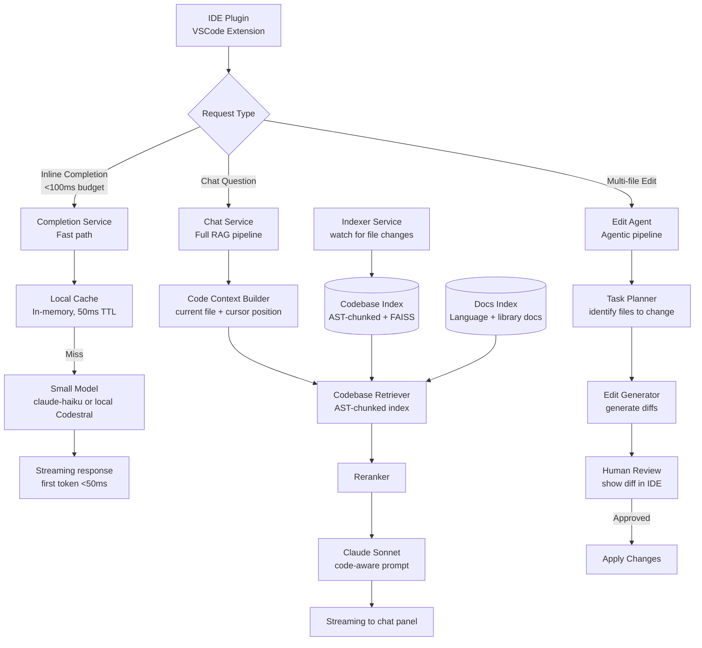

# Case Study: AI Code Assistant

> **Problem**: Design an AI code assistant (like GitHub Copilot or Cursor) that provides inline code completions, answers code questions, and can make multi-file edits for a development team's private codebase.

**Related**: [Architecture Templates](03-architecture-templates.md), [Agent Fundamentals](../04-agents-and-orchestration/01-agent-fundamentals.md), [Chunking Strategies](../03-retrieval-and-rag/05-chunking-strategies.md)

---

## Requirements Clarification

Key questions for this problem:

- "Inline completion or chat-based?" → Completions need sub-100ms; chat allows 2-3s
- "Private codebase only or also public docs/Stack Overflow?" → Affects RAG corpus design
- "What languages?" → Determines tokenization and AST chunking approach
- "How large is the codebase?" → Determines index complexity
- "IDE integration?" → Determines latency requirements
- "Can the assistant make commits or just suggest?" → Determines agent power level

**Assumed answers:**
- Both inline completion and chat-based assistance
- Private codebase + public documentation (language docs, common libraries)
- Primary languages: Python, TypeScript, Go
- Codebase: 2M lines of code, 10K files
- IDE plugin (VSCode extension)
- Can suggest edits, not commit automatically (human in loop for writes)

---

## Architecture



---

## The Hardest Part: Code Indexing

Generic text chunking doesn't work well for code. "Split at 512 tokens" cuts in the middle of functions, losing context about what function the code belongs to.

**AST-based chunking:**

```python
import ast
from typing import Optional

def chunk_python_file(source: str, filepath: str) -> list[dict]:
    """Chunk a Python file at AST boundaries (functions and classes)."""
    chunks = []

    try:
        tree = ast.parse(source)
    except SyntaxError:
        # Fallback to fixed-size chunking for unparseable files
        return chunk_fixed_size(source, filepath)

    for node in ast.walk(tree):
        if isinstance(node, (ast.FunctionDef, ast.AsyncFunctionDef, ast.ClassDef)):
            # Get the source lines for this node
            start_line = node.lineno - 1
            end_line = node.end_lineno

            # Add surrounding context: module docstring + imports
            chunk_content = get_file_header(tree) + "\n" + "\n".join(
                source.split("\n")[start_line:end_line]
            )

            chunks.append({
                "content": chunk_content,
                "filepath": filepath,
                "type": type(node).__name__,
                "name": node.name,
                "start_line": node.lineno,
                "end_line": node.end_lineno,
            })

    return chunks

def get_file_header(tree: ast.Module) -> str:
    """Extract imports and module-level docstring for context."""
    lines = []
    for node in ast.iter_child_nodes(tree):
        if isinstance(node, (ast.Import, ast.ImportFrom)):
            lines.append(ast.unparse(node))
        elif isinstance(node, ast.Expr) and isinstance(node.value, ast.Constant):
            lines.append(f'"""{node.value.value}"""')  # Module docstring
    return "\n".join(lines)
```

For TypeScript and Go, use language-specific parsers (tree-sitter is the cross-language option).

**What to include in each chunk:**
1. The function/class body
2. The file's import statements (gives context about dependencies)
3. The module docstring if it exists
4. Surrounding comment blocks (often explain the purpose)

---

## Context Building for Code Questions

When a developer asks a question about code, you need to include the right context:

```python
def build_code_context(
    query: str,
    current_file: str,
    cursor_position: int,
    codebase_retriever
) -> str:
    """Build context for a code question."""

    # 1. Current file context (highest priority)
    current_file_excerpt = extract_relevant_excerpt(current_file, cursor_position, context_lines=40)

    # 2. Related functions from codebase (retrieved)
    retrieved = codebase_retriever.query(query, top_k=5)

    # 3. Documentation for any mentioned libraries
    mentioned_libs = extract_library_references(current_file_excerpt)
    doc_chunks = docs_retriever.query(" ".join(mentioned_libs), top_k=3)

    context = f"""<current_file>
{current_file_excerpt}
</current_file>

<related_code>
{format_code_chunks(retrieved)}
</related_code>

<library_docs>
{format_doc_chunks(doc_chunks)}
</library_docs>"""

    return context
```

**Key insight:** The current file context is worth more than retrieved context for most code questions. Always include the file the developer is working in, with the surrounding lines around the cursor.

---

## Inline Completion: The Latency Challenge

Inline completions need to feel instant. The user types, and the suggestion appears within 50-100ms. That's your full budget.

**Strategy:**
1. First try local completion (cached completions from recent context)
2. Speculative prefetch (predict what the user will type next and pre-fetch)
3. Small, fast model for uncached requests

```python
import asyncio
from functools import lru_cache

class CompletionService:
    def __init__(self):
        self.pending_prefetch = {}  # context_hash → asyncio.Task

    @lru_cache(maxsize=1000)
    def get_cached_completion(self, context_hash: str) -> str | None:
        return None  # Will be filled by prefetch

    async def get_completion(self, context: str, prefix: str) -> str:
        context_hash = hash(context + prefix)

        # Check cache first (< 1ms)
        cached = self.get_cached_completion(context_hash)
        if cached:
            return cached

        # Fire-and-forget prefetch for next context
        next_hash = self.predict_next_context_hash(context, prefix)
        if next_hash not in self.pending_prefetch:
            self.pending_prefetch[next_hash] = asyncio.create_task(
                self.prefetch_completion(next_hash)
            )

        # Call model with timeout
        try:
            return await asyncio.wait_for(
                self.call_model(context, prefix),
                timeout=0.08  # 80ms timeout
            )
        except asyncio.TimeoutError:
            return ""  # Return empty rather than block the editor
```

For teams with a strong latency requirement, consider running a local model (Codestral-7B, Codegemma) on developer machines or a shared company server. Codestral via Ollama on a MacBook Pro M3 runs at ~40 tokens/second, fast enough for completions.

---

## Multi-File Edit Agent

The most powerful feature: the assistant can identify all files that need to change for a given task.

```python
def multi_file_edit_agent(task: str, codebase_context: dict) -> dict:
    """Agent that plans and generates multi-file edits."""

    # Step 1: Plan which files to change
    plan_response = client.messages.create(
        model="claude-opus-4-6",
        max_tokens=1024,
        tools=[identify_files_to_edit_tool, read_file_tool],
        messages=[{"role": "user", "content":
            f"Task: {task}\n\n"
            f"Codebase structure:\n{codebase_context['file_tree']}\n\n"
            "Identify which files need to be changed to complete this task. "
            "For each file, briefly explain what needs to change."}]
    )

    # Step 2: Generate diffs for each file
    diffs = {}
    for file_plan in extract_file_plans(plan_response):
        file_content = read_file(file_plan["filepath"])
        diff_response = client.messages.create(
            model="claude-opus-4-6",
            max_tokens=2048,
            messages=[{"role": "user", "content":
                f"Generate a unified diff for this file based on the task.\n\n"
                f"Task: {task}\n"
                f"What needs to change: {file_plan['changes']}\n\n"
                f"Current content:\n{file_content}\n\n"
                "Return only the unified diff, no explanation."}]
        )
        diffs[file_plan["filepath"]] = diff_response.content[0].text

    return diffs  # Show to developer for review before applying
```

The diffs are shown in the IDE as a review interface. The developer can accept, reject, or modify individual hunks. This is the human-in-loop pattern: the agent generates, the human validates.

---

## Codebase Freshness

Code changes constantly. The index needs to stay current.

```python
import watchdog
from watchdog.observers import Observer
from watchdog.events import FileSystemEventHandler

class CodebaseIndexer(FileSystemEventHandler):
    def __init__(self, vector_store):
        self.vector_store = vector_store
        self.pending_updates = set()

    def on_modified(self, event):
        if event.src_path.endswith((".py", ".ts", ".go")):
            self.pending_updates.add(event.src_path)

    def flush_updates(self):
        """Process pending file updates in batch."""
        for filepath in self.pending_updates:
            chunks = chunk_python_file(open(filepath).read(), filepath)
            # Delete old chunks for this file
            self.vector_store.delete(filter={"filepath": filepath})
            # Insert new chunks
            self.vector_store.upsert(chunks)
        self.pending_updates.clear()
```

Run the flush every 30 seconds. This keeps the index within 30 seconds of the current state, which is fresh enough for code assistance.

---

## Failure Modes

| Failure | Mitigation |
|---|---|
| Hallucinated API signatures | Retrieve actual function signatures from codebase, not from model knowledge |
| Outdated index for heavily-changed files | Prioritize recent commits in index freshness, flag "stale" context |
| Completion suggestion causes syntax error | Run syntax check on suggestions before showing them |
| Multi-file edit breaks tests | Suggest running tests after applying edits, don't auto-apply |
| Context window overflow on large files | Truncate to relevant functions around cursor, not full file |

---

> **Key Takeaways:**
> 1. Code requires AST-based chunking, not generic text splitting. Functions and classes are the natural chunk boundaries.
> 2. Inline completions have a hard 80-100ms budget. Use local models, aggressive caching, and speculative prefetch to meet it.
> 3. Multi-file editing is an agentic workflow with human-in-loop. The agent generates diffs; the developer reviews and applies. Auto-applying without review is not production-ready.
>
> *"A code assistant that hallucinates function signatures is worse than no assistant. Ground everything in the actual codebase."*
