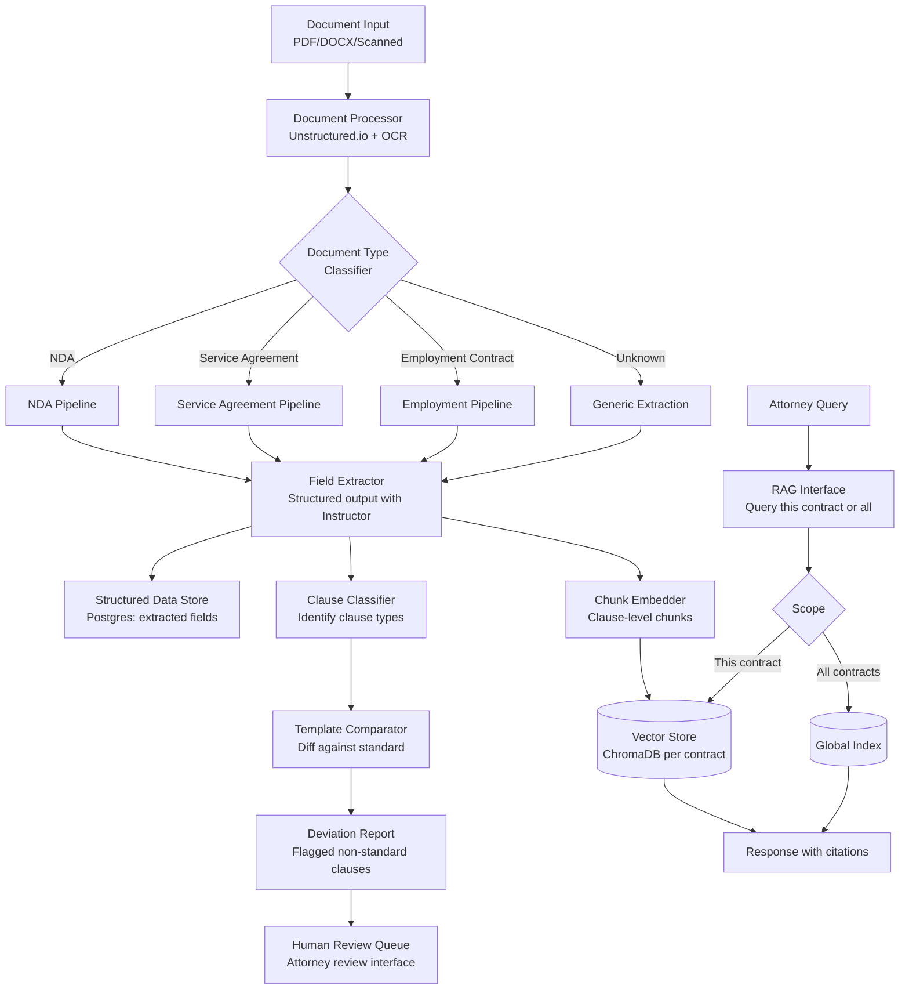

# Case Study: Document Intelligence Pipeline

> **Problem**: Design a document intelligence system for a law firm that needs to extract structured data from thousands of contracts, identify key clauses, flag deviations from standard templates, and answer questions about specific contracts.

**Related**: [Multimodal RAG](../03-retrieval-and-rag/10-multimodal-rag.md), [Structured Generation](../02-prompt-engineering/03-structured-generation.md), [Architecture Templates](03-architecture-templates.md)

---

## Requirements Clarification

Domain context matters enormously here. Ask:

- "What document types?" → Contracts, NDAs, leases, employment agreements (determines template variety)
- "What extraction is needed?" → Parties, dates, amounts, termination clauses, governing law
- "What deviation detection?" → Compare to firm's standard template, flag non-standard clauses
- "Query interface?" → Ad-hoc Q&A, structured search, or both
- "Volume and turnaround?" → Batch overnight vs real-time during contract review
- "Accuracy requirements?" → Legal context means errors have consequences; human review required

**Assumed answers:**
- Primarily NDAs, service agreements, and employment contracts
- Extract: parties, dates, payment terms, termination conditions, liability caps, governing law
- Flag deviations from firm's standard templates
- Both Q&A and structured search
- Batch processing for existing backlog + real-time for new contracts
- Human review required for all flagged deviations (high-stakes domain)

---

## Architecture



---

## Document Extraction: Structured Output

The core extraction task: given a contract, extract a structured data object. This is the use case where Instructor + Pydantic shines.

```python
import instructor
from anthropic import Anthropic
from pydantic import BaseModel
from datetime import date
from typing import Optional

client = instructor.from_anthropic(Anthropic())

class Party(BaseModel):
    name: str
    role: str  # e.g., "Service Provider", "Client", "Disclosing Party"
    jurisdiction: Optional[str] = None
    entity_type: Optional[str] = None  # LLC, Corp, Individual

class ContractExtraction(BaseModel):
    # Core parties
    parties: list[Party]

    # Dates
    effective_date: Optional[date] = None
    expiration_date: Optional[date] = None
    termination_notice_days: Optional[int] = None

    # Financial terms
    total_value: Optional[float] = None
    currency: str = "USD"
    payment_terms_days: Optional[int] = None  # Net 30, Net 60, etc.

    # Key clauses (present/absent + location)
    has_limitation_of_liability: bool = False
    liability_cap_amount: Optional[float] = None
    has_indemnification: bool = False
    has_non_compete: bool = False
    non_compete_duration_months: Optional[int] = None
    governing_law_state: Optional[str] = None

    # Risk flags (the model identifies these)
    risk_flags: list[str]  # e.g., ["unlimited liability", "perpetual term", "one-sided indemnity"]
    confidence_score: float  # Overall extraction confidence

def extract_contract(contract_text: str, doc_type: str) -> ContractExtraction:
    """Extract structured data from a contract."""
    return client.messages.create(
        model="claude-opus-4-6",
        max_tokens=2048,
        response_model=ContractExtraction,
        messages=[{
            "role": "user",
            "content": f"Extract structured data from this {doc_type}. "
                       f"For risk_flags, identify any unusual or unfavorable clauses.\n\n{contract_text}"
        }]
    )
```

**Why Instructor matters here:** A legal extraction with 15+ fields will occasionally fail on edge cases (unusual date formats, multi-party contracts, foreign entities). Instructor's automatic retry with error feedback handles these gracefully.

---

## Clause Detection and Template Comparison

Law firms maintain standard templates. Detecting deviations from standard is the high-value task.

```python
from difflib import SequenceMatcher

def compare_clause_to_template(
    extracted_clause: str,
    template_clause: str,
    clause_type: str,
    client: Anthropic
) -> dict:
    """Compare a contract clause to the firm's standard template."""

    # Quick text similarity check first
    similarity = SequenceMatcher(None, extracted_clause, template_clause).ratio()

    if similarity > 0.90:
        return {"is_standard": True, "deviation_level": "none"}

    # Use LLM to analyze the substantive difference
    response = client.messages.create(
        model="claude-opus-4-6",
        max_tokens=512,
        messages=[{"role": "user", "content":
            f"Compare these two {clause_type} clauses. Identify substantive legal differences.\n\n"
            f"Standard Template:\n{template_clause}\n\n"
            f"Contract Clause:\n{extracted_clause}\n\n"
            "Rate the deviation: none/minor/significant/high-risk. "
            "If deviation is significant or high-risk, explain what changed and why it matters."}]
    )

    # Parse LLM response into structured output
    return parse_deviation_analysis(response.content[0].text)
```

**Template management:** Store standard clause templates per contract type in a structured database. When comparing, retrieve the relevant template for the specific clause type detected.

---

## Multi-Document Q&A

Attorneys often need to search across many contracts: "Show me all contracts where the liability cap is below $1M" or "Which clients have NDAs expiring in the next 90 days?"

Two query types with different approaches:

```python
def answer_contract_query(query: str, scope: str, filters: dict) -> dict:
    """Route to structured query or semantic Q&A."""

    # Detect query type
    is_structured = detect_structured_query(query)

    if is_structured:
        # SQL-like queries: "contracts expiring before 2025"
        sql = natural_language_to_sql(query)
        results = execute_against_extracted_data(sql)
        return {"results": results, "query_type": "structured"}

    else:
        # Semantic: "contracts with unusual indemnification clauses"
        relevant_chunks = vector_search(
            query=query,
            filters=filters,  # e.g., {"contract_type": "NDA", "date_range": {...}}
            top_k=10
        )
        response = synthesize_answer(query, relevant_chunks)
        return {"response": response, "sources": relevant_chunks, "query_type": "semantic"}

def detect_structured_query(query: str) -> bool:
    """Detect if query maps to a structured data lookup."""
    structured_patterns = [
        "expiring", "expiration", "renewal",
        "liability cap", "payment terms",
        "governing law", "jurisdiction",
        "all contracts where", "how many"
    ]
    query_lower = query.lower()
    return any(p in query_lower for p in structured_patterns)
```

The structured query path hits the Postgres database (fast, precise). The semantic path hits the vector store (finds relevant clauses by meaning).

---

## Handling Scanned Documents

Law firms have years of legacy contracts in scanned PDFs. OCR quality varies wildly.

```python
from unstructured.partition.pdf import partition_pdf

def extract_scanned_contract(pdf_path: str) -> str:
    """Extract text from scanned contract using OCR."""
    elements = partition_pdf(
        filename=pdf_path,
        strategy="hi_res",         # Use OCR for scanned pages
        ocr_languages=["eng"],
        include_page_breaks=True
    )

    # Filter low-confidence OCR elements
    text_parts = []
    for element in elements:
        if hasattr(element.metadata, "detection_class_prob"):
            if element.metadata.detection_class_prob < 0.70:
                continue  # Skip very uncertain OCR
        text_parts.append(str(element))

    full_text = "\n".join(text_parts)

    # Quality check: if extraction quality is low, flag for manual review
    if estimate_ocr_quality(full_text) < 0.80:
        flag_for_manual_review(pdf_path, "Low OCR confidence")

    return full_text
```

**OCR quality estimation:** Check for common OCR artifacts (random symbols, broken words, numbers where there shouldn't be). Flag documents with >5% artifact rate for manual review before extraction.

---

## Accuracy Requirements: Human Review

In legal contexts, automated extraction must have human review for high-stakes fields. The right architecture distinguishes confidence levels:

```python
class ExtractionResult(BaseModel):
    extracted_data: ContractExtraction
    requires_review: bool
    review_reasons: list[str]

def decide_review_required(extraction: ContractExtraction) -> tuple[bool, list[str]]:
    reasons = []

    if extraction.confidence_score < 0.85:
        reasons.append(f"Low extraction confidence: {extraction.confidence_score:.2f}")

    if extraction.total_value and extraction.total_value > 1_000_000:
        reasons.append("High-value contract: manual verification recommended")

    if "unlimited liability" in extraction.risk_flags:
        reasons.append("Risk flag: unlimited liability detected")

    if not extraction.effective_date:
        reasons.append("Missing effective date: could not extract")

    return len(reasons) > 0, reasons
```

The attorney review UI shows:
- Extracted fields side-by-side with the original document
- Confidence scores for each field
- Highlighted text showing where each field was extracted from
- Easy one-click accept/correct workflow

---

## Production Metrics

For a law firm deploying this:

| Metric | Target | How Measured |
|---|---|---|
| Extraction accuracy | >95% for required fields | Human spot-check on sample |
| Clause detection recall | >90% (finding deviations) | Manual review of flagged cases |
| False positive rate | <15% (deviation flags) | Attorney feedback on flagged items |
| Processing time | <30 seconds per contract | Automated timing |
| OCR quality threshold | >80% for auto-processing | Automated quality score |

---

> **Key Takeaways:**
> 1. Document intelligence in legal contexts requires human review for high-stakes fields. Design the automation to flag and route to humans, not to replace human judgment.
> 2. Combine structured extraction (Instructor + Pydantic) for named fields with semantic search for clause-level Q&A. These are complementary, not competing approaches.
> 3. Template comparison is the high-value feature for law firms. Detecting that a standard limitation-of-liability clause was removed or weakened is worth more than extracting the parties' names.
>
> *"Legal document intelligence is not about trusting the AI. It's about making human review 10x faster and more thorough."*
