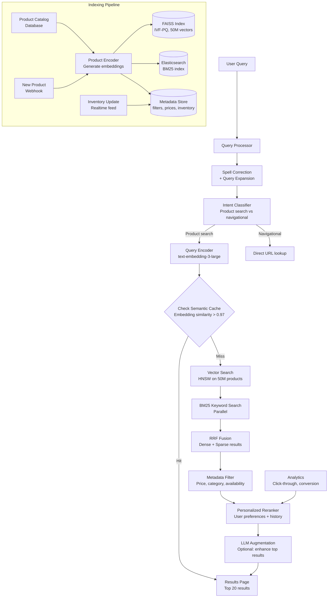

# Case Study: AI-Powered Search Engine

> **Problem**: Design a semantic search engine for a large e-commerce platform with 50M products. Users should be able to search using natural language ("comfortable office chair under $300") and get ranked, relevant results. The system should handle 10K queries per second at peak.

**Related**: [Embedding Models](../03-retrieval-and-rag/02-embedding-models.md), [Vector Indexing](../03-retrieval-and-rag/03-vector-indexing.md), [Hybrid Search](../03-retrieval-and-rag/06-hybrid-search.md)

---

## Requirements Clarification

Key questions:

- "Replace or augment existing search?" → If augmenting, you need a hybrid design
- "Product types?" → Electronics, apparel, furniture → different attribute sets
- "Personalization?" → User history affects ranking
- "Filtering?" → Price, brand, rating, category filters
- "Multiple languages?" → Multilingual embedding model required
- "Update frequency?" → How fast do new products need to be searchable?

**Assumed answers:**
- Replace keyword search with semantic + keyword hybrid
- 50M diverse product catalog
- Personalized ranking based on user behavior
- Full filter support (price, brand, rating, category)
- 10 languages, primarily English
- New products should appear within 5 minutes

---

## Architecture



---

## The Scale Challenge: 50M Vectors

At 50M products × 1536 dimensions (text-embedding-3-large), the raw index is:
- 50M × 1536 × 4 bytes = 307 GB

That's too large for in-memory HNSW. The right choice is IVF-PQ (Inverted File + Product Quantization):

```python
import faiss
import numpy as np

d = 1536  # Dimension
n_vectors = 50_000_000

# IVF-PQ configuration
n_centroids = 65536  # sqrt(n_vectors) is a good starting point
n_subquantizers = 64  # PQ compression
n_bits = 8  # 8-bit quantization

# Build index
quantizer = faiss.IndexFlatL2(d)
index = faiss.IndexIVFPQ(quantizer, d, n_centroids, n_subquantizers, n_bits)

# Train on a representative sample (1M vectors)
training_vectors = load_sample(1_000_000)
index.train(training_vectors)

# Add all vectors in batches
batch_size = 100_000
for i in range(0, n_vectors, batch_size):
    batch = load_vectors(i, i + batch_size)
    index.add(batch)

# After training, the index is ~3GB (vs 307GB for flat)
# With nprobe=128, recall@10 is ~90%

faiss.write_index(index, "product_index.faiss")
```

**Memory and performance (50M vectors, IVF-PQ):**

| Configuration | Index Size | Recall@10 | Query Latency |
|---|---|---|---|
| Flat L2 (exact) | 307 GB | 100% | 5s |
| HNSW (M=32) | ~150 GB | 99% | 5ms |
| IVF-PQ (nprobe=64) | ~3 GB | 88% | 2ms |
| IVF-PQ (nprobe=128) | ~3 GB | 92% | 4ms |

For 10K QPS, IVF-PQ at nprobe=64 with 2ms latency is the choice. You can run it on 12 servers with 32GB RAM each vs 150 servers for HNSW.

---

## Hybrid Search: Why You Need Both

Semantic search handles meaning well but fails on:
- Product model numbers: "Samsung QN90C 65 inch" — dense embedding won't outperform BM25
- Exact brand names: "Patagonia fleece" — user wants this specific brand
- SKU lookups: "B08P2H2DWY" — needs exact match

BM25 handles exact terms but fails on:
- Paraphrasing: "comfortable chair for long work sessions" won't match "ergonomic office seating"
- Conceptual queries: "gift for a runner" won't match "Nike running shoes"
- Typos and variations: "offce chair" won't match "office chair" in basic BM25

The RRF fusion handles both:

```python
def hybrid_product_search(
    query: str,
    filters: dict,
    user_embedding: list[float] | None = None,
    top_k: int = 20
) -> list[dict]:
    query_embedding = embed_query(query)

    # Parallel execution
    dense_results = faiss_index.search(query_embedding, k=100, filters=filters)
    keyword_results = elasticsearch.search(query, filters=filters, size=100)

    # RRF fusion
    fused = reciprocal_rank_fusion([dense_results, keyword_results], k=60)

    # Apply personalization if user history available
    if user_embedding is not None:
        fused = personalized_rerank(fused, user_embedding, user_history)

    return fused[:top_k]
```

---

## Query Understanding

Raw queries need preprocessing before embedding:

```python
def preprocess_query(raw_query: str) -> dict:
    """Extract structured information from a natural language query."""
    response = client.messages.create(
        model="claude-haiku-4-5-20251001",
        max_tokens=200,
        messages=[{"role": "user", "content":
            f"Extract search parameters from this e-commerce query.\n\n"
            f"Query: {raw_query}\n\n"
            f"Return JSON: {{\"clean_query\": str, \"max_price\": float|null, "
            f"\"min_price\": float|null, \"brand\": str|null, \"category\": str|null}}"}]
    )

    import json
    try:
        params = json.loads(response.content[0].text)
        return {
            "clean_query": params.get("clean_query", raw_query),
            "filters": {k: v for k, v in params.items()
                       if k != "clean_query" and v is not None}
        }
    except json.JSONDecodeError:
        return {"clean_query": raw_query, "filters": {}}
```

For "comfortable office chair under $300", this extracts:
- `clean_query`: "comfortable office chair"
- `filters`: `{"max_price": 300}`

The clean query goes to the embedding model; the filters apply to Elasticsearch and the metadata store post-retrieval.

---

## Product Embedding Strategy

How you embed products is as important as how you embed queries:

```python
def embed_product(product: dict) -> list[float]:
    """Create a rich text representation for embedding."""
    # Combine fields in order of semantic importance
    text = f"{product['name']}. "
    text += f"{product['category']} by {product['brand']}. "
    text += f"{product['description'][:500]}. "

    # Add key attributes as natural language
    attrs = product.get("attributes", {})
    attr_parts = []
    for key, value in attrs.items():
        attr_parts.append(f"{key}: {value}")
    if attr_parts:
        text += " ".join(attr_parts)

    return embed(text)
```

**Asymmetric embedding:** The query "comfortable office chair" and the product description have different lengths and structures. Use a model designed for asymmetric retrieval (e5-large-unsupervised, BGE models) where the query and document are embedded with different prefixes.

---

## Handling 10K QPS

At 10K queries/second:
- Each query: ~2ms vector search + ~2ms BM25 + ~1ms fusion = ~5ms per query
- With 10 search server shards: 1,000 QPS per shard = 5ms × 1,000 = 5,000 QPS handled per server

That's the theory. In practice:
- Use 12-15 search servers for redundancy and headroom
- Cache query embeddings (the embedding model call adds 20ms; cache for 1 hour)
- Cache semantic search results for popular queries (20% of queries are top-1000 popular searches)
- Use L1 cache (in-memory) on each search server for top-10K queries

```
Request flow at 10K QPS:
- Cache hit (20% of traffic): <5ms
- Vector + BM25 (76%): 5-8ms
- Full pipeline with LLM augmentation (4%, for complex queries): 800ms

Weighted average latency: 0.20×5 + 0.76×7 + 0.04×800 = 39ms P50
P99 will be higher due to LLM augmentation; limit LLM to <1% of traffic
```

---

## LLM Augmentation (Selective)

For complex queries that the retrieval system struggles with, use an LLM to rewrite or expand the query:

```python
def should_use_llm_augmentation(query: str, top_results: list[dict]) -> bool:
    """Decide if LLM query augmentation would help."""
    # Low result quality: top results have low scores
    if not top_results or top_results[0]["score"] < 0.70:
        return True
    # Abstract query: hard to match directly
    abstract_keywords = ["gift for", "best for", "help with", "something to"]
    return any(kw in query.lower() for kw in abstract_keywords)

def llm_augment_query(query: str) -> str:
    response = client.messages.create(
        model="claude-haiku-4-5-20251001",
        max_tokens=100,
        messages=[{"role": "user", "content":
            f"Rewrite this e-commerce search query to be more specific and findable. "
            f"Add category terms and product attributes.\n\nQuery: {query}\n\nRewritten query:"}]
    )
    return response.content[0].text.strip()
```

Only use LLM augmentation for the 1-5% of queries where retrieval quality is low. At 10K QPS, even 1% = 100 LLM calls/second — budget accordingly.

---

## Gotchas

**IVF-PQ recall varies by cluster assignment.** If a query vector is near a centroid boundary, it might be assigned to a cluster that doesn't contain the best results. Increasing `nprobe` improves recall but adds latency. Tune the nprobe/latency tradeoff on your actual data.

**Product embedding freshness vs query time.** Embeddings are computed at index time. If product descriptions change (price drop, new features), the embedding is stale. Re-embed changed products within 5 minutes for critical fields.

**Cold start for new products.** New products take up to 5 minutes to appear in search results. For high-priority launches, have a fast-path ingestion that skips the batch pipeline.

**The "pink shirt" problem.** Color, size, and style filters are often implicit in the query. "Pink shirt for women" should filter to women's clothing AND pink color. Query understanding + filter extraction handles this, but testing edge cases is critical.

---

> **Key Takeaways:**
> 1. At 50M+ products, HNSW doesn't fit in memory. IVF-PQ reduces the index from 300GB to 3GB with ~10% recall loss at the same latency.
> 2. Hybrid search (semantic + BM25) is required for e-commerce. Brand names, model numbers, and SKUs need exact match; "gift for runner" needs semantic understanding.
> 3. LLM augmentation should be selective (1-5% of queries) not universal. The latency cost at 10K QPS makes universal LLM calls infeasible.
>
> *"E-commerce search is not a chatbot. It's a retrieval problem at web scale. Optimize for the retrieval path, not the generative path."*
